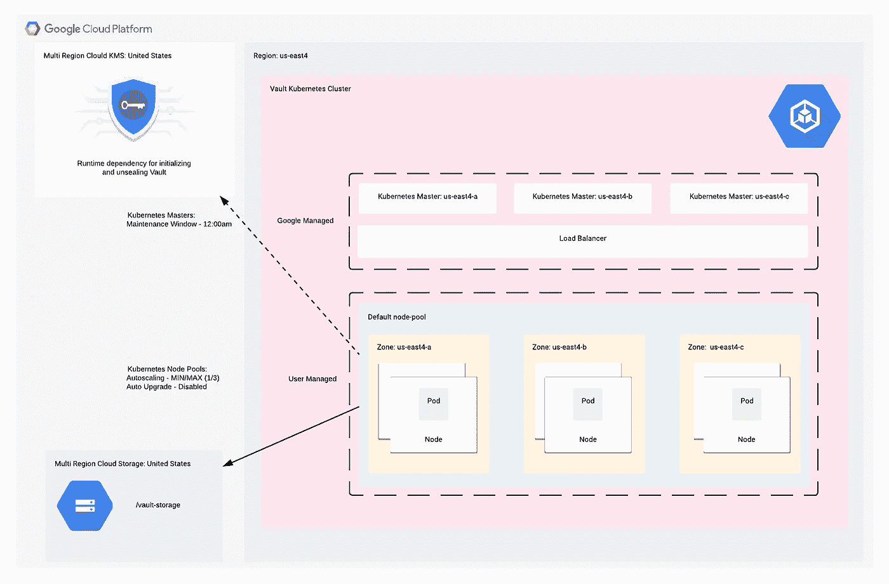
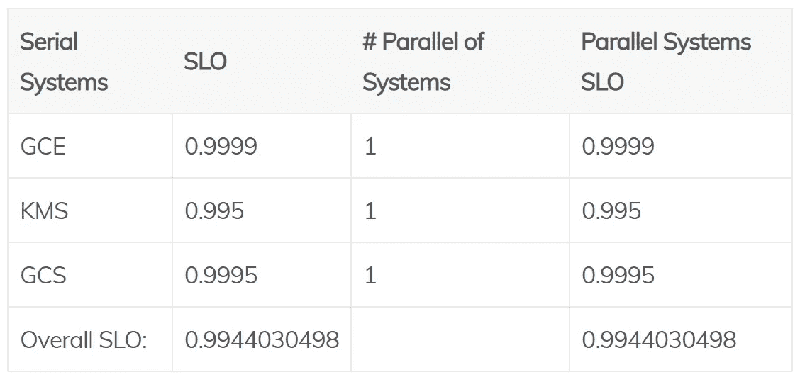

# 在 Google Kubernetes 引擎上持续交付 hashi corp Vault:Google 架构

> 原文：<https://medium.com/google-cloud/continuous-delivery-of-hashicorp-vault-on-google-kubernetes-engine-google-architecture-4fb88900d23d?source=collection_archive---------1----------------------->

**这是一个系列的第二部分:** [**指数**](/@blzysh/continuous-delivery-of-hashicorp-vault-on-google-kubernetes-engine-bcbf4e75f0f6)

# 概述:

这是一个高层次的观点和一些使用的谷歌资源的细节。体系结构中的 SLO 和故障点的信息。

# [谷歌 Kubernetes 引擎](https://cloud.google.com/kubernetes-engine):

> Google Kubernetes 引擎为使用 Google 基础设施部署、管理和扩展您的容器化应用程序提供了一个托管环境。

通过创建区域集群，您可以:

*   *从单个区域故障中恢复—因为您的主节点和应用节点在整个区域内可用，而不是在单个区域内可用，所以即使整个区域出现故障，您的 Kubernetes 集群仍然可以完全正常运行。*
*   *主升级期间无停机时间——Kubernetes 引擎在所有 Kubernetes 主升级期间最大限度地减少停机时间，但对于单个主升级，一些停机时间是不可避免的。通过使用区域集群，控制面板保持在线和可用，即使在升级期间也是如此。*

[Kubernetes SLA](https://cloud.google.com/kubernetes-engine/sla)

*   控制平面:> =99.95%(区域)
*   库伯内特空气污染指数:> =99.5%

节点使用底层虚拟机实例 [GCE SLA](https://cloud.google.com/compute/sla) ，当实例跨同一区域中的 2 个或更多区域部署时，目标 SLO 为 99.99%。

# [谷歌云存储](https://cloud.google.com/storage):

> 云存储允许在全球范围内随时存储和检索任意数量的数据。您可以将云存储用于一系列场景，包括为网站内容提供服务、存储用于归档和灾难恢复的数据，或者通过直接下载向用户分发大型数据对象。

[云存储 SLA](https://cloud.google.com/storage/sla)

*   多区域:> = 99.95%

# [谷歌云 KMS](https://cloud.google.com/kms) :

> 云 KMS 允许您将加密密钥保存在一个中央云服务中，供其他云资源和应用程序直接使用。

[云 KMS SLA](https://cloud.google.com/kms/sla)

*   KMS: >=99.5%

# 谷歌架构图:

# 谷歌 SLO:

*注:这是一个估计，总体 SLO 实际上更高，见下面的 KMS 信息。*

# 故障点:

这不包括已经应用于产品 SLO 的任何底层基础架构。

## 谷歌云 KMS

这只是一个启动运行时依赖项。保险库需要[初始化](https://www.vaultproject.io/docs/commands/operator/init.html)和[解封](https://www.vaultproject.io/docs/concepts/seal.html#unsealing)，以便创建主密钥和解密数据。

*   初始化是保险存储的存储后端准备接收数据的过程。由于 Vault 服务器在 HA 模式下共享相同的存储后端，因此您只需初始化一个 Vault 即可初始化存储后端。
*   解封是构建读取解密密钥以解密数据所必需的主密钥的过程，从而允许访问保险库。

***如果谷歌云 KMS 宕机，我们所有的 Vault 服务器宕机，Vault 将无法初始化或解封，应用程序将无法在实例启动或自动扩展期间从 Vault 中检索任何数据。***

## 谷歌云存储

多区域云存储用于 Vault 后端。

***如果 Google 云存储关闭，Vault 将不可用。***

## 谷歌 Kubernetes 引擎

一开始将使用一个区域性的 Kubernetes 集群，如果需要，以后可以扩展到多个区域。

Vault 只能在具有 [enterprise](https://www.hashicorp.com/go/vault-enterprise) 版本的多区域中运行。

最小节点池大小为每个区域一个/最大 3 个。*豆荚复制品尺寸 3。*

*   只要至少有一个节点和单元处于运行状态，节点和单元的丢失将导致很少甚至没有服务中断。
*   只要至少有一个区域处于运行状态，丢失一个区域几乎不会导致服务中断。

***区域故障期间保险库将不可用。***

# 注意事项:

***如果服务无法连接，依赖于 Vault 的应用程序可能希望服务启动失败。
下面是一个 Spring 的例子:*** [***Config 客户端快速失败***](http://cloud.spring.io/spring-cloud-vault/2.0.x/single/spring-cloud-vault.html#vault.config.fail-fast)

[**第三部分- >**](/@blzysh/continuous-delivery-of-hashicorp-vault-on-google-kubernetes-engine-kubernetes-architecture-c94fb5e513b1)