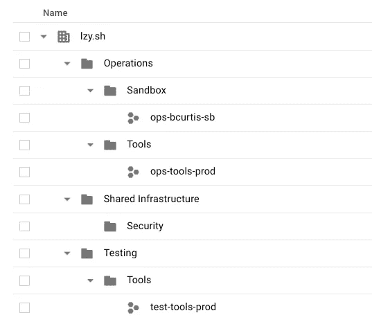

# 在 Google Kubernetes 引擎上连续交付 HashiCorp Vault:初始设置

> 原文：<https://medium.com/google-cloud/continuous-delivery-of-hashicorp-vault-on-google-kubernetes-engine-initial-setup-39bbe04d0bdd?source=collection_archive---------3----------------------->

**这是一个系列的第 4 部分:** [**指数**](/@blzysh/continuous-delivery-of-hashicorp-vault-on-google-kubernetes-engine-bcbf4e75f0f6)

# 概述:

这是实际的“后端”工作和相关信息，用于支持 Vault 的持续交付。与 Vault 本身无关，只是一种设置层级和资源的方式，可以让您继续前进。

# 设置资源层次结构:

创建一个 Google [云平台资源层级](https://cloud.google.com/resource-manager/docs/cloud-platform-resource-hierarchy)，看起来像这样:



不要忘记[项目](https://cloud.google.com/resource-manager/docs/creating-managing-projects)编号和项目 ID 在整个谷歌云平台中是唯一的。您选择的项目名称可以相同，但 ID 不会排成一行，ID 用于所有内容。

在本指南的其余部分，我将使用上面的层次结构，所以如果你正在跟随并决定做一些不同的事情，请注意你的变化并相应地调整。

**Operations 文件夹:**用于将贡献运营代码和运营工具的开发者。

*   **Sanbox 文件夹:**用于沙盒开发项目
*   **ops-bcurtis-sb 项目:**用于[Google Cloud DNS](https://cloud.google.com/dns)&[Google 云存储](https://cloud.google.com/storage)启用个人沙盒开发所需的资源— *每个开发者使用自己的项目*
*   **工具文件夹:**用于包含操作工具资源的项目
*   **ops-tools-prod 项目:**用于 [Google Cloud DNS](https://cloud.google.com/dns) 、 [Google Cloud Storage](https://cloud.google.com/storage) 、[Google Container Registry](https://cloud.google.com/container-registry)&[服务账号](https://cloud.google.com/iam/docs/understanding-service-accounts)资源用于生产

**共享基础结构文件夹:**用于跨团队共享资源

*   **安全文件夹:**用于与安全相关的项目
*   **测试文件夹:**用于测试资源
*   **工具文件夹:**用于包含操作工具资源的项目
*   **test-tools-prod 项目:**用于 [Google Cloud DNS](https://cloud.google.com/dns) 测试资源— *我希望这是一个临时项目。Google 目前不支持低于 project 的资源类型的云 DNS 角色。更多细节见下文。*

# 设置 ops-tools-prod 项目和资源:

更详细地说，这个项目将运行 [Google Cloud DNS](https://cloud.google.com/dns) ，我将使用[外部 dns](https://github.com/kubernetes-incubator/external-dns) 为生产环境同步 Kubernetes 入口资源。它将为 [Terraform 远程状态](https://www.terraform.io/docs/state/remote.html)运行[谷歌云存储](https://cloud.google.com/storage)。它还将运行[谷歌容器注册表](https://cloud.google.com/container-registry)，用于图像的“本地”存储和[容器分析](https://cloud.google.com/container-registry/docs/get-image-vulnerabilities)。

```
export project=ops-tools-prod
gcloud config set project ${project}
```

**创建一个** [**Google Cloud 托管 DNS 区域**](https://cloud.google.com/dns/zones) **:**

```
gcloud dns managed-zones create lzy-sh \
--description="My Default Domain" --dns-name="lzy.sh"
```

**向您的域名注册机构注册该区域:**

```
gcloud dns record-sets list --zone lzy-shNAME          TYPE  TTL    DATA
lzy.sh.                         NS     21600  ns-cloud-c1.googledomains.com.,ns-cloud-c2.googledomains.com.,ns-cloud-c3.googledomains.com.,ns-cloud-c4.googledomains.com.
lzy.sh.                         SOA    21600  ns-cloud-c1.googledomains.com. cloud-dns-hostmaster.google.com.
```

显示您的 NS 记录，获取数据并在您的注册服务商上创建 NS 记录。从现在开始，Google Cloud DNS 将为我管理 lzy.sh。

在其他需要它的项目中(稍后你会看到),我创建了一个子域区域，并将它添加到我的顶级区域 lzy-sh，在这个项目中由 Google Cloud DNS 管理。

**创建两个** [**Google 云存储桶**](https://cloud.google.com/storage/docs/creating-buckets) **用于** [**Terraform 远程状态**](https://www.terraform.io/docs/state/remote.html) **:**

```
gsutil mb -p ${project} -c multi_regional -l US \
gs://${project}_tf_stategsutil mb -p ${project} -c multi_regional -l US \
gs://${project}-pre-prod_tf_state
```

一个用于生产平台状态，另一个用于所有预生产平台状态。用于自动化的生产前服务帐户无权访问生产存储桶。

同时启用[对象版本](https://cloud.google.com/storage/docs/object-versioning):

```
gsutil versioning set on gs://${project}_tf_stategsutil versioning set on gs://${project}-pre-prod_tf_state
```

[**创建两个谷歌云服务账号**](https://cloud.google.com/iam/docs/creating-managing-service-accounts) **进行自动化:**

```
gcloud iam service-accounts create pre-prod-terraform \
--display-name "Pre-production Terraform"gcloud iam service-accounts create terraform \
--display-name "Production Terraform"
```

[创建两个服务账户密钥](https://cloud.google.com/iam/docs/creating-managing-service-account-keys)并保存在安全的地方。它们将在以后用于自动化:

```
gcloud iam service-accounts keys create \
~/pre-prod-terraform-key.json --iam-account \ 
[pre-prod-terraform@](mailto:pre-prod-terraform@ops-tools-prod.iam.gserviceaccount.com)${project}[.iam.gserviceaccount.com](mailto:pre-prod-terraform@ops-tools-prod.iam.gserviceaccount.com)gcloud iam service-accounts keys create \
~/prod-terraform-key.json --iam-account \
[terraform@](mailto:terraform@ops-tools-prod.iam.gserviceaccount.com)${project}[.iam.gserviceaccount.com](mailto:terraform@ops-tools-prod.iam.gserviceaccount.com)
```

[**授予 IAM 角色**](https://cloud.google.com/iam/docs/granting-changing-revoking-access) **用于服务账户:**

```
gcloud projects add-iam-policy-binding ${project} --member \
serviceAccount:[terraform@](mailto:terraform@ops-tools-prod.iam.gserviceaccount.com)${project}[.iam.gserviceaccount.com](mailto:terraform@ops-tools-prod.iam.gserviceaccount.com) \
--role roles/resourcemanager.projectIamAdmingcloud projects add-iam-policy-binding test-tools-prod --member \
serviceAccount:pre-prod-terraform@${project}.iam.gserviceaccount.com \
--role roles/resourcemanager.projectIamAdmin
```

# 设置测试工具产品项目和资源:

就像上面的 ops-tools-prod 项目一样，这个项目将运行 [Google Cloud DNS](https://cloud.google.com/dns) ，我将使用[外部 dns](https://github.com/kubernetes-incubator/external-dns) 为预生产环境同步 Kubernetes 入口资源。我这样做的原因是因为 Kubernetes 的底层默认计算服务帐户需要有 DNS 管理员角色，就像我上面提到的那样，该角色的最低资源类型是项目。我不想授予生产前服务帐户编辑生产 dns 记录的能力。你可能知道那有多糟糕..

```
export project=test-tools-prod
gcloud config set project ${project}
```

**创建一个** [**Google Cloud 托管 DNS 区域**](https://cloud.google.com/dns/zones) **:**

```
gcloud dns managed-zones create test-lzy-sh \
--description="My Test Domain" --dns-name="test.lzy.sh"
```

**在 ops-tools-prod:** 中向托管 dns 区域注册该区域

```
gcloud dns record-sets list --zone test-lzy-shNAME          TYPE  TTL    DATA
test.lzy.sh.  NS    21600  ns-cloud-d1.googledomains.com.,ns-cloud-d2.googledomains.com.,ns-cloud-d3.googledomains.com.,ns-cloud-d4.googledomains.com.
test.lzy.sh.  SOA   21600  ns-cloud-d1.googledomains.com. cloud-dns-hostmaster.google.com. 1 21600 3600 259200 300
```

这将显示您的 NS 记录，获取数据并在 ops-tools-prod project lzy-sh managed cloud DNS zone 中创建 NS 记录。

```
gcloud --project ops-tools-prod dns record-sets transaction \
start -z=lzy-shgcloud --project ops-tools-prod dns record-sets transaction \
add -z=lzy-sh --name="test.lzy.sh." --type=NS --ttl=300 \
"ns-cloud-d1.googledomains.com." "ns-cloud-d2.googledomains.com." \
"ns-cloud-d3.googledomains.com." "ns-cloud-d4.googledomains.com." gcloud --project ops-tools-prod dns record-sets transaction \
execute -z=lzy-sh
```

# 结论:

现在，我们有了一个资源层次结构，其中的项目和资源支持从沙盒环境一直到生产的“安全”开发和自动化。

[**第五部分- >**](/@blzysh/continuous-delivery-of-hashicorp-vault-on-google-kubernetes-engine-sandbox-development-f603e0bceaf1)