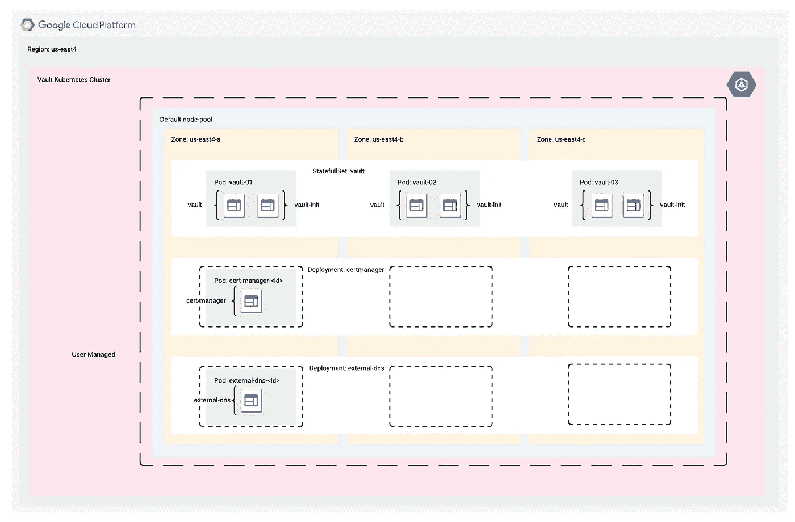

# 在 Google Kubernetes 引擎上持续交付 hashi corp Vault:Kubernetes 架构

> 原文：<https://medium.com/google-cloud/continuous-delivery-of-hashicorp-vault-on-google-kubernetes-engine-kubernetes-architecture-c94fb5e513b1?source=collection_archive---------4----------------------->

**这是一个系列的第三部分:** [**指数**](/@blzysh/continuous-delivery-of-hashicorp-vault-on-google-kubernetes-engine-bcbf4e75f0f6)

# 概述:

[Kubernetes](https://kubernetes.io/) 集群被分解成几个定制的[名称空间](https://kubernetes.io/docs/concepts/overview/working-with-objects/namespaces/)以将操作服务与应用服务分开。Kubernetes 也有几种不同的[资源类型](https://kubernetes.io/docs/reference/kubectl/overview/#resource-types)，我将在服务和应用程序中使用它们。下面是集群中使用的一些值得注意的资源类型。

[stat pulsets](https://kubernetes.io/docs/concepts/workloads/controllers/statefulset):我在应用程序中使用 StatefulSet 的主要原因是为了处理排序问题，因为我们不想让 Vault 为谁先初始化[而争吵。它还为 pod 提供了可预测的名称。](https://github.com/sethvargo/vault-on-gke/blob/master/README.md#faq)

*   *同样值得注意的是反亲缘关系的概念，它将 pod 分布在集群中的所有节点上。在这种情况下，保持 Vault 服务器的一个实例在整个区域的每个分区中运行。*

[部署](https://kubernetes.io/docs/concepts/workloads/controllers/deployment):我将部署用于操作服务。部署在回滚和更易管理的配置方面有一些优势。

[Ingress](https://kubernetes.io/docs/concepts/services-networking/ingress) (v1beta1):具体来说，我使用 [ingress-gce](https://github.com/kubernetes/ingress-gce) 为应用程序创建一个外部 GCP HTTP(S)负载平衡器。

# 容器:

容器([将被](https://github.com/lzysh/ops-gke-vault/issues/1))被“本地”存储在[谷歌容器注册表](https://cloud.google.com/container-registry)中，并由[容器分析](https://cloud.google.com/container-registry/docs/get-image-vulnerabilities)进行安全漏洞分析。

## 应用

[vault](https://hub.docker.com/) : Vault 是用于安全访问机密和配置的应用程序。
[vault-init](https://hub.docker.com/r/sethvargo/vault-init) :用于自动化初始化和启封保险库的过程。

## 运营服务

[external-dns](https://github.com/kubernetes-incubator/external-dns) :用于与 Google Cloud DNS 同步并公开 Kubernetes 入口。
[cert-manager](https://github.com/jetstack/cert-manager) :用于自动管理和发放 TLS 证书。

[**第四部分- >**](/@blzysh/continuous-delivery-of-hashicorp-vault-on-google-kubernetes-engine-initial-setup-39bbe04d0bdd)