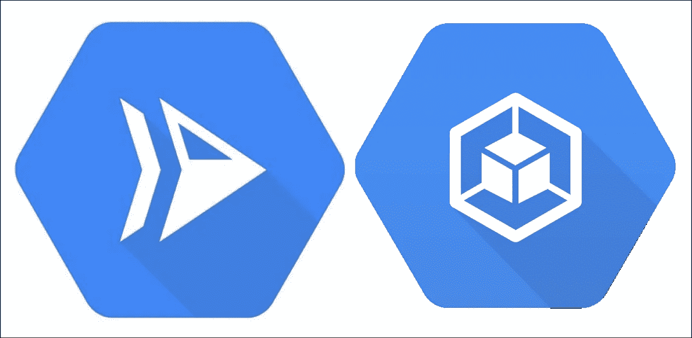
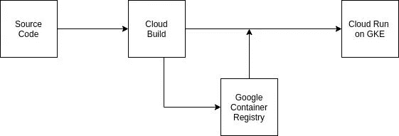
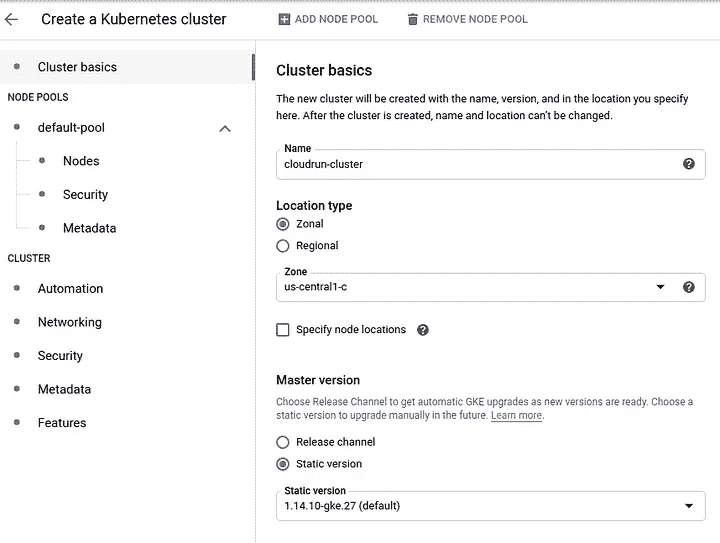
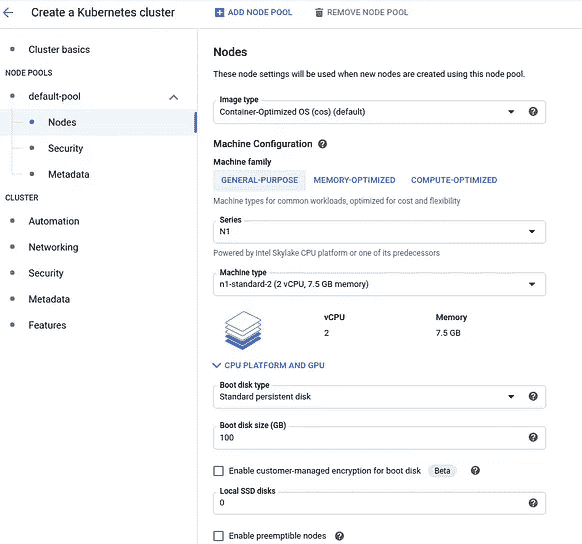
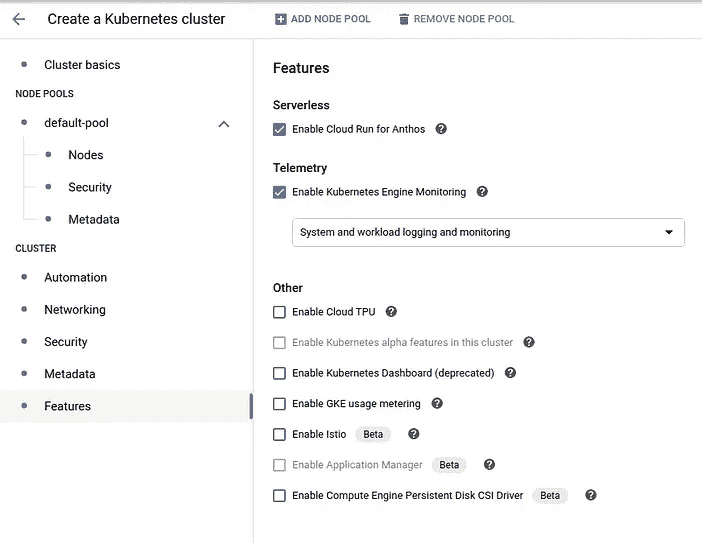
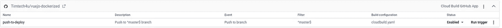

# 持续部署到在 Google Kubernetes 引擎上运行的云

> 原文：<https://medium.com/google-cloud/continuous-deployment-to-cloud-run-on-google-kubernetes-engine-ebe49bd956bf?source=collection_archive---------1----------------------->



> 在本教程中，您将学习如何为运行在 Google Kubernetes 引擎(GKE)上的云应用程序设置持续部署。

> Google Kubernetes Engine (GKE)为使用 Google 基础设施部署、管理和扩展您的容器化应用程序提供了一个托管环境。
> 
> Cloud Run 是 Google Cloud Platform 提供的一项服务，可以运行你的无状态 HTTP 容器，而不用担心配置机器、集群或自动伸缩。

# 先决条件

*   创建一个[谷歌云平台(GCP)项目](https://console.cloud.google.com/project)，或者使用一个现有的项目。
*   启用[云运行 API](https://console.developers.google.com/apis/api/run.googleapis.com/overview) 。
*   启用[集装箱注册 API](https://console.developers.google.com/apis/api/containerregistry.googleapis.com/overview) 。
*   启用 [Kubernetes 引擎 API](https://console.developers.google.com/apis/api/container.googleapis.com/overview) 。
*   克隆[样本代码](https://github.com/Timtech4u/vuejs-dockerized)或使用*docker 文件设置您自己的代码。*

除了易于部署、可伸缩性、无服务器执行以及 Cloud Run 提供的其他优势之外，在 Gooogle Kubernetes 引擎上运行 Cloud Run 还增加了对容器编排的每个方面(如网络、存储、监控)进行完全控制的优势。

工作流程将非常简单，您将集成[云构建](https://cloud.google.com/cloud-build/)，这是谷歌的一个连续交付工具，它在谷歌云平台的基础设施上执行您的构建。

‌



流动

您需要建立一个源代码存储库，其中包含应用程序代码、Dockerfile 和包含云构建说明的构建配置文件。‌
‌You 可以在这里找到我自己在本教程[中使用的源代码。](https://github.com/Timtech4u/vuejs-dockerized)

云构建触发器将与源代码库集成，并配置为在推送代码时进行构建。这将触发构建配置文件中的构建步骤。

构建配置的步骤包括从存储库中克隆源代码，构建映像并将其推送到[Google Container Registry](https://cloud.google.com/container-registry)，然后部署到 Google Kubernetes 引擎上的云上。

# 为云运行设置 Google Kubernetes 引擎集群

要创建集群并启用云运行，请执行以下步骤:

1.  进入云控制台中的 [Google Kubernetes 引擎](https://console.cloud.google.com/kubernetes?_ga=2.238711938.389965162.1587363196-691912164.1581463010)页面:
2.  点击**创建集群**打开*创建 Kubernetes 集群*页面。
3.  在**集群基础**菜单下，设置以下值:

*   输入您想要的群集名称。
*   选择*区域*或*区域*作为位置类型。
*   为集群选择一个区域或地区。

4.在**节点池>默认-池>节点**下，将机器类型设置为**n1-标准-2**

5.在**集群>功能**菜单下，选择复选框**为 Anthos** 启用云运行。

6.接受更改并单击 **Create** 来创建和配置集群。



集群创建页面

# 为持续部署设置云构建触发器

每当您对源代码进行任何更改时，云构建触发器都会自动启动构建。我们将使用以下配置文件进行云构建。

```
# cloudbuild.yamlsteps:
  # build the container image
- name: 'gcr.io/cloud-builders/docker'
  args: [ 'build', '-t', 'gcr.io/$PROJECT_ID/demo', '.' ]
  # push the container image
- name: 'gcr.io/cloud-builders/docker'
  args: [ 'push', 'gcr.io/$PROJECT_ID/demo']
  # deploy to cloud run on GKE
- name: "gcr.io/cloud-builders/gcloud"
  args: ['run', 'deploy', 'demo-ui', '--image', 'gcr.io/$PROJECT_ID/demo', '--cluster', 'cloudrun-cluster', '--cluster-location', 'us-central1-c', '--namespace', 'default', '--platform', 'gke']
```

## ‌Connecting 到源存储库

使用以下步骤配置触发器，以在对源存储库进行任何更改的基础上构建您的代码:

1.  在谷歌云控制台中打开 [**触发器**](https://console.cloud.google.com/cloud-build/triggers?_ga=2.29020222.389965162.1587363196-691912164.1581463010) 页面。
2.  点击**连接储存库**。
3.  选择存储源代码的存储库。
4.  点击**继续**。
5.  向您的源存储库进行身份验证。
6.  从可用存储库列表中，选择所需的存储库，然后点击**连接存储库**。
7.  点击**完成**(跳过创建默认触发器)。

# 创建生成触发器

1.  在谷歌云控制台打开 [**触发器**](https://console.cloud.google.com/cloud-build/triggers?_ga=2.27393214.389965162.1587363196-691912164.1581463010) 页面。
2.  点击**创建触发器**。
3.  输入以下触发设置:

*   设置触发器名称
*   选择连接源存储库
*   配置分支，我们将使用:^master$
*   将**构建配置文件**设置为云构建配置文件: *cloudbuild.yaml*

4.通过提供必要的详细信息进行配置，并点击**创建触发器。**



你点击**运行触发器**或者推送至你的源代码库并监控构建日志。

从今以后，无论何时您推送至您的存储库，Cloud Build 都会自动触发一个构建，并部署到您在 Google Kubernetes 引擎集群上运行的云运行服务。

如果你想在 Google Cloud 上自动化更多的容器工作流，下面的资源会很有帮助。

# 有用的链接

*   [谷歌云构建](https://cloud.google.com/cloud-build/docs/)
*   [谷歌云运行](https://cloud.google.com/run/)
*   [牛逼的库伯内特斯](https://github.com/ramitsurana/awesome-kubernetes)
*   [Kubernetes 文档](https://kubernetes.io/docs/)
*   [谷歌 Kubernetes 引擎文档](https://cloud.google.com/kubernetes-engine/docs)