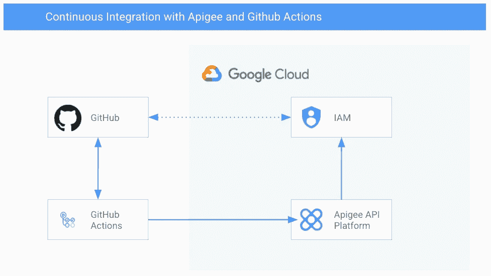
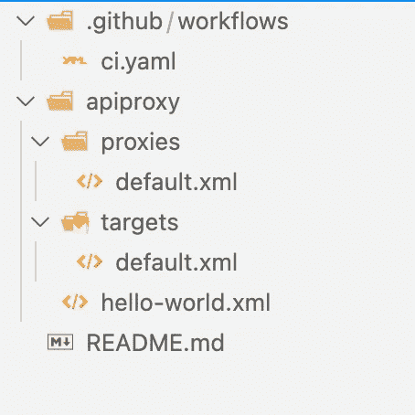
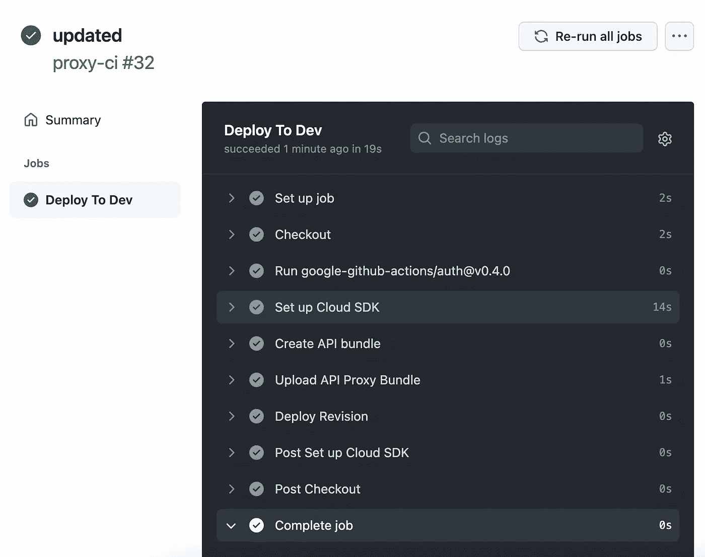

# 与 Apigee 和 Github 操作的持续集成

> 原文：<https://medium.com/google-cloud/continuous-integration-with-apigee-and-github-actions-bcba4178925c?source=collection_archive---------0----------------------->

从 GitHub 部署到 Apigee X

今天，我需要设置一个 CI/CD 管道，将我们的 API 代理从 GitHub 部署到运行在 Google Cloud 上的 Apigee X 组织。我采取了一种相当固执的方法来做这件事，我想与你分享。这篇博文可能需要一些 GCP、Apigee 和 GitHub 操作的常识。

我不喜欢依赖，它们增加了复杂性，你需要时间来管理它们。因此，当从我的 CI/CD 管道部署到 Apigee 时，我尝试了一种极简的方法。有直接来自 [Apigee DevRel 团队](https://github.com/apigee/devrel)的优秀工具，或者像 [apigeecli](https://github.com/srinandan/apigeecli) 这样的优秀工具，你可能会考虑使用。我在这里的方法是使用方便的瑞士军刀工具: [**curl**](https://curl.se/) ，它预装在 GitHub 托管的 Ubuntu 实例中。

存储库结构

所以让我们从存储库结构开始(上图)。在`apiproxy/`下，Apigee 代理的开发正在进行，例如使用伟大的[Google Cloud Code](https://cloud.google.com/code)VS Code extension。在`.github/workflows/`文件夹中，你可以找到 GitHub 动作定义。

这篇博文的重点是 GitHub 动作的定义。因此，我们需要设置 3 样东西(你可以在下面找到完整的 GitHub 动作工作流程):

1.  **第 35–42 行**:我们需要针对 Google APIs 进行认证，以便能够与 Apigee APIs 进行通信，因为 GitHub Actions 令牌符合 OpenID Connect，我们可以使用[工作负载身份联盟](https://cloud.google.com/iam/docs/workload-identity-federation)来集成这两者。更好的是，因为我们不是第一个遇到这个问题的人，我们可以使用一个伟大的 [GitHub Action](https://github.com/google-github-actions/auth) ，它已经为我们完成了繁重的工作。第一次[设置](https://github.com/google-github-actions/auth#setup)有点复杂，但可以很快完成。
2.  **第 45–49 行**:我们需要将组成 API 代理的各种 XML 文件打包成一个. zip 文件，然后上传。压缩到 Apigee 作为新版本。我们将修订号存储在步骤的输出变量中，这样我们就可以在下一步中使用它。我们将 zip 发布到[创建 API 端点](https://cloud.google.com/apigee/docs/reference/apis/apigee/rest/v1/organizations.apis/create)来创建一个新的版本。
3.  **Line 50–51**:接下来我们要将新的版本部署到`dev`环境中。我们再次使用 curl，并发送到[部署端点](https://cloud.google.com/apigee/docs/reference/apis/apigee/rest/v1/organizations.environments.apis.revisions.deployments/deploy)。

从 yaml 定义中可以看出，要让管道工作，应该设置 3 个秘密。
**WORKLOAD _ IDENTITY _ POOL _ ID**采用您为设置工作负载身份联盟而创建的工作负载池的全名，例如`projects/PROJECT_NUMBER/locations/global/workloadIdentityPools/POOL_ID/providers/PROVIDER_ID`
**APIGEE_ORG** 您的 APIGEE 组织的名称，通常与您的 GCP 项目 ID
**SERVICE _ ACCOUNT**管道应使用的服务帐户相同(您在遵循[工作负载身份联盟设置指南](https://github.com/google-github-actions/auth#setup)时设置了此名称)

代理的名字被硬编码到 URL 中，如果你愿意，你可以把它提取到一个变量中。当 GitHub Actions 成功运行时，您在 GitHub Actions UI 中的输出应该如下所示:

GitHub 操作 UI 中的构建

# 结论

就是这样！现在，我们可以轻松地将 Apigee API 代理从 GitHub 捆绑和部署到 GCP，感谢 Workload Identity Federation，我们甚至不必将密钥导出和上传到 GitHub。你可以在这里找到完整的例子:[https://github . com/cgrotz/blog-examples/tree/main/API gee-github-actions](https://github.com/cgrotz/blog-examples/tree/main/apigee-github-actions)