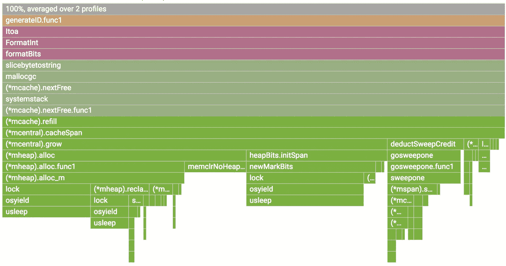

# 围棋程序的连续剖析

> 原文：<https://medium.com/google-cloud/continuous-profiling-of-go-programs-96d4416af77b?source=collection_archive---------0----------------------->

谷歌最有趣的部分之一是我们全舰队范围的持续剖析服务。我们可以看到谁负责 CPU 和内存的使用，我们可以持续监控我们的生产服务的争用和阻塞情况，我们可以生成分析和报告，并可以轻松地判断哪些是我们可以开展的极具影响力的优化项目。

我曾短暂地参与过 [Google Cloud Profiler](https://cloud.google.com/profiler/) 的工作，这是我们的新产品，填补了云用户在云范围内的分析空白。注意，你不需要在谷歌云平台上运行你的代码来使用它。实际上，我现在每天都在开发时使用它。它还支持 Java 和 Node.js。

## 生产中的剖析

pprof 在生产中使用是安全的。我们的目标是额外增加 5%的 CPU 和堆分配分析开销。从单个实例每分钟收集 10 秒钟。如果你有一个 Kubernetes 豆荚的多个副本，我们确保我们做摊销收集。例如，如果您有一个 pod 的 10 个副本，开销将是 0.5%。这使得用户可以始终保持剖析。

我们目前支持 Go 程序的 CPU、堆、互斥和线程配置文件。

## 为什么？

在解释如何在生产环境中使用分析器之前，解释一下为什么要在生产环境中进行分析是有帮助的。一些非常常见的情况是:

*   调试性能问题仅在生产中可见。
*   了解 CPU 使用情况，减少计费。
*   了解竞争累积的位置并进行优化。
*   了解新版本的影响，例如，看到金丝雀和生产之间的差异。
*   通过[将](https://rakyll.org/profiler-labels/)与剖析样本相关联来丰富您的分布式跟踪，以了解延迟的根本原因。

## 使能够

Stackdriver Profiler 不与 *net/http/pprof* 处理程序一起工作，并且要求您在程序中安装和配置一行代理。

```
go get [cloud.google.com/go/profiler](http://cloud.google.com/go/profiler)
```

在主函数中，启动分析器:

```
if err := profiler.Start(profiler.Config{
   Service:        "indexing-service",
   ServiceVersion: "1.0",
   ProjectID:      "bamboo-project-606", // optional on GCP
}); err != nil {
   log.Fatalf("Cannot start the profiler: %v", err) 
}
```

一旦您开始运行您的程序，分析器包将每分钟报告分析器 10 秒钟。

## 形象化

一旦档案被报告到后台，你将开始在[https://console.cloud.google.com/profiler](https://console.cloud.google.com/profiler)看到火焰图。您可以按标签过滤并更改时间跨度，也可以按服务名称和版本细分。该数据将在 30 天左右。


您可以选择一个可用的配置文件；按服务、区域和版本细分。可以在火焰中移动，按标签过滤。

## 解读火焰

Brendan Gregg 非常全面地解释了火焰图可视化。Stackdriver Profiler 添加了一点自己的特色。


我们将检查一个 CPU 配置文件，但所有这些也适用于其他配置文件。

1.  最上面的 x 轴代表整个程序。火焰上的每个方框代表调用路径上的一个帧。方框的宽度与执行该功能所花费的 CPU 时间成比例。
2.  盒子从左到右排序，左边是开销最大的调用路径。
3.  来自同一包装的框架具有相同的颜色。在这种情况下，所有运行时函数都用绿色表示。
4.  您可以单击任何框来进一步展开执行树。



您可以将鼠标悬停在任何框上，以查看任何帧的详细信息。

## 过滤

您可以通过符号名称显示、隐藏和高亮显示。如果你特别想了解某个特定电话或套餐的费用，这些是非常有用的。


1.  选择您的过滤器。您可以组合多个过滤器。在这种情况下，我们突出显示 runtime.memmove。
2.  火焰将使用过滤器过滤帧，并可视化过滤后的框。在本例中，它突出显示了所有的 runtime.memmove 框。