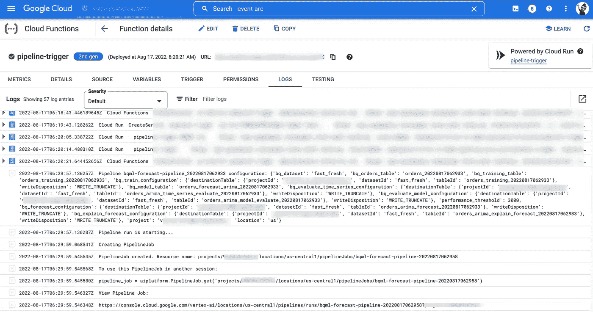

# 用 BigQuery ML 和 Vertex AI 进行持续训练

> 原文：<https://medium.com/google-cloud/continuous-training-with-bigquery-ml-and-vertex-ai-d43330b6f3ed?source=collection_archive---------0----------------------->


BigQuery、Vertex AI、云日志、云发布订阅和云功能 v2

当涉及到训练一个 ML 模型时，ML 管道的一些主要步骤是:

1.  预处理数据
2.  训练模型
3.  评估模型
4.  验证模型

诸如数据更新的频率和数量或业务时间表等因素要求您更快地执行这些管道。这就是为什么你会考虑组织和自动化你的培训工作的原因之一。另一个关键原因是，您不希望您的数据科学家和 ML 工程师将他们的时间花费在重复重新训练相同模型并将其部署到生产的乏味任务上。事实上，[数据和概念漂移，以及各种高度不稳定的信号出现在大多数商业 ML 用例中，它们会影响模型性能](https://towardsdatascience.com/3-facts-about-time-series-forecasting-that-surprise-experienced-machine-learning-practitioners-69c18ee89387)。


图一。预测的时候再培训([来源](https://towardsdatascience.com/3-facts-about-time-series-forecasting-that-surprise-experienced-machine-learning-practitioners-69c18ee89387)

所以团队需要维护他们的模型。相反，你希望他们专注于解决新的挑战，发现新的商业见解，并开发新产品。

在这篇文章中，我提出了一个简单的连续训练系统，它包括新的云函数 v2 和 preview 中的 Vertex AI Pipeline 通知电子邮件操作员。目标是让您了解如何使用 Google Cloud 实现可靠的再培训流程，包括触发器和通知。

# 你想要更多吗？让我知道！

关于如何在 Google Cloud 上使用[数据科学，你有希望在未来看到的话题吗？](https://cloud.google.com/data-science)

请填写这张表格让我知道。这对我以后的博文会有帮助=)

也可以在 Twitter 上联系到 [@IlNardo92](https://twitter.com/IlNardo92) 或 [Linkedin](https://www.linkedin.com/in/ivan-nardini/) 。

# 你需要知道的是

本文是以下内容的后续:

*   [宣布顶点 AI 管道的 BigQuery 和 BigQuery ML 操作符](https://cloud.google.com/blog/topics/developers-practitioners/announcing-bigquery-and-bigquery-ml-operators-vertex-ai-pipelines)
*   【BQML |谷歌云博客的 20 多家新管道运营商

本文假设您熟悉 BigQuery 和 Vertex AI 之间的集成。此外，它还要求您了解最新的云功能 V2，这是提供更多事件、计算和控制的新一代云功能。如果您想了解更多信息，请查看以下资源:

*   [Vertex AI 与 BigQuery 的五次整合|谷歌云博客](https://cloud.google.com/blog/products/ai-machine-learning/five-integrations-between-vertex-ai-and-bigquery)
*   [云功能第二代是 GA，提供更多事件、计算和控制](https://cloud.google.com/blog/products/serverless/cloud-functions-2nd-generation-now-generally-available)

# 你为什么要关心持续训练？

[在我们的场景](https://cloud.google.com/blog/topics/developers-practitioners/new-20-pipeline-operators-bqml)中，你是一家专门销售新鲜易腐食品的零售商的数据科学团队或商品工程团队的成员。该公司希望最大限度地减少食物浪费，优化所有商店的库存水平。由于库存更新的频率(对于一些高销售速度的新鲜食品来说可能是每分钟一次)，**他们希望使用 BQML 每小时重新训练一次需求预测模型。**

如果我们假设您手动训练您的模型，这意味着您需要运行

**3 次查询运行(准备、培训、评估)x 24 次培训运行= 72 次运行/天**

**现在让我们考虑引入顶点人工智能管道的场景。**每个查询成为一个组件，执行可重现的 [Kubeflow 管道](https://www.kubeflow.org/docs/components/pipelines/introduction/#what-is-kubeflow-pipelines)工作流的一部分。这些管道将作为 Vertex AI 上的无服务器运行来执行。那你就有了

**1 次管道运行 x 24 次培训= 24 次运行**

太好了。但现在的问题是:**还能更好吗？**

是的，可以。

事实上，您仍然需要手动运行管道培训。显然，每小时运行一个新的预测任务对于任何合理规模的数据科学或营销团队来说都是不可行的。事实上，您不会只是坐在那里等待一个查询完成，然后手动触发第二个查询(然后在第二个查询完成后触发第三个查询)。但是您将创建一个管道，并在必要时部署它。

> 如果每当新的训练数据被接收到 BigQuery 中时，就自动执行管道，会怎么样？
> 
> 在这种需求预测的情况下，建立一个持续的培训流程有多难？

通过正确的警报，您可以为您的管道创建一个计划的触发器，以便您可以训练您的模型，并让它们始终保持最新的数据。正如你可以想象的那样，频繁地对新数据进行再训练可以让你捕捉到新的趋势和模式，并可能得到更好的模型。

# 设置连续培训

持续培训过程的组成部分之一是再培训触发器。正如在[MLOps 的实践者指南:机器学习的连续交付和自动化的框架](https://services.google.com/fh/files/misc/practitioners_guide_to_mlops_whitepaper.pdf)中提到的，流水线运行可以由预定的作业、事件或手动调用来触发。

**在我们的例子中，当 BigQuery 中有新的库存数据时，我们希望触发新的管道运行。**

根据[顶点 AI 文档](https://cloud.google.com/vertex-ai/docs/pipelines/trigger-pubsub)，

*您可以使用带有云发布/订阅触发器的事件驱动云功能来部署和触发管道运行。*

太好了。但是**触发管道运行的事件怎么办？**

*big query 中的每一次数据交互，比如给定查询作业读写的表，都会自动记录在* [*云日志*](https://cloud.google.com/bigquery/docs/reference/auditlogs) *中，所以我们可以使用这些信息作为事件来触发管道。*

现在，需要注意的是，默认情况下每个数据交互都会被记录。

为什么它很重要？一如既往，细节决定成败。如果不过滤记录的事件，可能会触发意外的管道重新训练运行。这正是我在一个共享项目中实现该系统时遇到的情况，Composer 和 Looker 也在 BigQuery 上读写数据。

*为了更好地控制触发事件，我决定创建一个*[](https://cloud.google.com/logging/docs/export/configure_export_v2)****。****

*有了它，您可以控制云日志如何路由事件日志。特别是，您可以使用包含筛选器来定义一个筛选器表达式，该表达式与您想要用来触发管道重新训练并将它们路由到发布/订阅的数据事件相匹配。一旦您在发布/订阅中收集了这些事件，您也可以很容易地获得用于验证目的的访问。*

*总结*

*   *大查询数据事件记录在云日志中*
*   *数据事件被过滤并路由到发布/订阅*
*   *发布/订阅消息触发运行顶点人工智能再训练流水线的云函数*

***最后但同样重要的是，收到管道运行状态的通知不是很好吗？***

*当然，您可以考虑使用云日志、发布/订阅和云函数记录管道运行事件，就像您对 BigQuery 数据事件[所做的那样。](https://cloud.google.com/architecture/sending-notifications-for-google-cloud-events)*

**但是从管道运行发送通知的另一种方式是使用*[*VertexNotificationEmailOp*](https://google-cloud-pipeline-components.readthedocs.io/en/google-cloud-pipeline-components-1.0.16/google_cloud_pipeline_components.experimental.vertex_notification_email.html?highlight=VertexNotificationEmailOp#google_cloud_pipeline_components.experimental.vertex_notification_email.VertexNotificationEmailOp)*。**

*当 Google Cloud Pipeline 组件的这个组件(目前是试验性的)作为一个 [ExitHandler](https://kubeflow-pipelines.readthedocs.io/en/stable/source/kfp.dsl.html?highlight=exit%20handler#kfp.dsl.ExitHandler) 被包含时，它会向指定的接收者发送一封通知电子邮件，通知上游 DAG 的状态。*

*最后，这是持续培训系统的流程。*

**

*图二。持续培训系统*

*请注意，Vertex AI Pipelines 与 Vertex ML 元数据紧密集成，这允许跟踪所有元数据和工件，以便进行调试、可再现性和沿袭分析。此外，经过训练和验证的模型将存储在 Vertex AI 模型注册表中，如关于如何为 BQML 利用新的 20+管道操作符的[原始博客帖子](https://cloud.google.com/blog/topics/developers-practitioners/new-20-pipeline-operators-bqml)所示。*

*现在我们已经有了系统的全貌，让我们来看看如何构建它的步骤。*

# *分三步构建持续培训体系*

## *步骤 1:编译管道并上传到 Google 云存储上的一个桶中*

*要使用云功能触发重新培训管道运行，您需要将管道上传到 Google 云存储。*

*与最初的博文相比，我稍微修改了管道，以便添加[VertexNotificationEmailOp](https://google-cloud-pipeline-components.readthedocs.io/en/google-cloud-pipeline-components-1.0.16/google_cloud_pipeline_components.experimental.vertex_notification_email.html?highlight=VertexNotificationEmailOp#google_cloud_pipeline_components.experimental.vertex_notification_email.VertexNotificationEmailOp)。下面你可以看到新管道的伪代码。*

*其中*get _ evaluation _ model _ metrics _ op*是一个定制组件，用于获取时间序列和模型性能指标以评估模型。*

*因为模型每小时都要训练和部署，所以我决定将训练和部署实现到一个单独的管道中，该管道将通过 *notify_email_task* 组件发送状态通知。*

## *步骤 2:从云日志创建一个发布/订阅主题和一个接收器，以捕获和过滤 BigQuery 数据事件*

*一旦您创建了一个发布/订阅主题来接收来自云日志接收器的消息*

```
*gcloud pubsub topics create bq_events_trigger*
```

*您可以使用 gcloud 命令创建水槽。*

```
*gcloud logging sinks create bq_to_pubsub_pipeline_trigger \
 pubsub.googleapis.com/projects/<your-project-id>/topics/bq_events_trigger \
 --log-filter=<your-log-filter>*
```

*定义正确的包含过滤器(<your-log-filter>)以便仅在记录了某个事件时触发重新训练流水线作业是非常重要的。</your-log-filter>*

*下面是我实现的过滤器。*

```
*'resource.type="bigquery_dataset" AND protoPayload.@type="type.googleapis.com/google.cloud.audit.AuditLog" AND protoPayload.serviceName="bigquery.googleapis.com"'AND -protoPayload.authenticationInfo.principalEmail:"looker" AND 
-protoPayload.authenticationInfo.principalEmail:"composer" AND protoPayload.metadata.@type="type.googleapis.com/google.cloud.audit.BigQueryAuditMetadata" ANDprotoPayload.methodName="google.cloud.bigquery.v2.JobService.InsertJob" AND protoPayload.resourceName:"projects/<your-project-id>/datasets/<your-dataset>/tables/orders_" AND protoPayload.metadata.tableDataChange.insertedRowsCount>=0 AND -protoPayload.resourceName:"training" AND -protoPayload.resourceName:"arima" AND -protoPayload.resourceName:"evaluate"*
```

*换句话说，使用此过滤器，您将只路由以下事件*

1.  *使用 bigquery_dataset 资源从 BigQuery 服务审计日志中收集*
2.  *不是由 Looker 和 Composer 服务帐户生成*
3.  *由 InsertJob 表示，它以具有特定命名的表为目标并记录新数据*

*在下面的控制台中有日志路由器接收器。*

**

*图三。云日志接收器*

## *步骤 3:在云功能 v2 中创建和部署再训练触发器*

*现在您已经有了云日志记录接收器和 Pub/Sub 来过滤和发送 BigQuery 中的数据事件，您可以创建一个云函数，当路由新的数据事件时，将触发该云函数来执行重新训练管道运行。下面你可以看到代码:*

*其中 *trigger* 函数使用 [Eventarc](https://cloud.google.com/functions/docs/calling#2nd-gen-triggers) 从事件源读取 Cloud PubSub 消息，进行数据质量检查(在这种情况下，它只是验证传入数据的行数)，编译管道参数并最终触发管道作业。*

*定义重新训练管道触发器后，可以使用 gcloud cli 部署它。*

```
*gcloud functions deploy pipeline-trigger \
 --gen2 \
 --region=$REGION \
 --runtime=python38 \
 --source=$TRIGGER_PATH \
 --entry-point=trigger \
 --trigger-topic=$PUBSUB_TOPIC*
```

*请注意，您需要使用 *gen2* 标志从云函数 v1 切换到云函数 v2。下面你在控制台里有云功能。*

**

*图 4。控制台中的云功能 v2*

*这时候，一切都烤好了。让我们看看持续培训系统的运行情况。*

# *持续培训系统正在运行！*

*发布/订阅收集从云日志路由的 BigQuery 事件。该事件触发构建运行时配置的云函数，从云桶读取管道模板并提交重新训练管道运行。*

**

*图五。重新训练触发事件日志*

*下面是 Vertex AI 控制台中的重新训练管道执行流程。*

**

*图六。顶点 AI UI 中的流水线执行*

*这是您将收到的管道通知电子邮件。*

**

*图 7。管道通知电子邮件*

# *摘要*

*在本文中，我展示了一个需求预测场景中可能的持续培训系统。*

*总结一下，你可以建立一个简单的再培训系统*

*   *大查询数据事件记录在云日志中*
*   *数据事件被过滤并路由到发布/订阅*
*   *发布/订阅消息触发运行顶点人工智能再训练流水线的云函数*
*   *Vertex AI Pipeline 使用实验性的 Google Cloud[VertexNotificationEmailOp](https://google-cloud-pipeline-components.readthedocs.io/en/google-cloud-pipeline-components-1.0.16/google_cloud_pipeline_components.experimental.vertex_notification_email.html?highlight=VertexNotificationEmailOp#google_cloud_pipeline_components.experimental.vertex_notification_email.VertexNotificationEmailOp)组件发送通知。*

*可以想象这只是一种可能的情况。*

*在架构设计方面，您也可以使用 [Eventarc](https://cloud.google.com/blog/topics/developers-practitioners/demystifying-event-filters-eventarc) 直接从 BigQuery 或云日志中读取事件，实现我提到的相同过滤逻辑，并将它们路由到云函数。就我个人而言，我更喜欢云日志和 Pub Sub 架构来分离关注点(因为我发现它更直观)。*

*在现实世界中，持续培训系统会根据频率和要处理的数据量而变化。例如，当您拥有大量数据时，每小时训练一个预测模型似乎不现实。*

*此外，预测管道没有完整的事件驱动再培训系统。但是您可能会引入一个编排层，它将协调预测过程，并在触发培训之前执行一些数据验证步骤。*

*我让你以一种你可以处理它们的方式来考虑这些问题。*

# *下一步是什么*

*在 Vertex AI 和 BigQuery 之间还有许多其他可能的集成[有待探索。下面你可以找到一些资源，用它们来弄脏你的手。](https://cloud.google.com/blog/products/ai-machine-learning/five-integrations-between-vertex-ai-and-bigquery)*

***Colab***

*   *[在 BigQuery 数据| Vertex AI | Google Cloud 上训练 TensorFlow 模型](https://cloud.google.com/vertex-ai/docs/tutorials/train-tensorflow-bigquery)*

***文档***

*   *[BigQuery ML 和 Vertex AI 模型注册表|谷歌云](https://cloud.google.com/vertex-ai/docs/model-registry/model-registry-bqml)*

***视频***

*   *[将 BigQuery 数据引入 Vertex AI Workbench](https://www.youtube.com/watch?v=0Ys52DsiNk8&list=PLIivdWyY5sqLVnGp10d9tQacZsvVh2_zM&index=2)*
*   *[如何用顶点 AI 和 BigQuery ML 简化 AI 模型](https://www.youtube.com/watch?v=AVwwkqLOito)*

***GitHub***

*   *[示例笔记本](https://github.com/GoogleCloudPlatform/vertex-ai-samples/tree/main/notebooks/official)*

***培训***

*   *[顶点 AI: Qwik 开始](https://www.qwiklabs.com/focuses/18940?locale=id&parent=catalog)*

*一如既往，如果有问题和反馈，请随时联系我。*

*现在，感谢你阅读这篇文章。我希望你喜欢它，直到下一个帖子…*

**感谢 Polong Lin、Tuba Islam、Steve Walker、Skander Hannachi 和 Valentino Miazzo 的反馈和建议**

# *参考*

*   *[MLOps | Google Cloud 的实践者指南](https://cloud.google.com/resources/mlops-whitepaper)*
*   *[关于时间序列预测的 3 个事实让有经验的机器学习从业者大吃一惊。](https://towardsdatascience.com/3-facts-about-time-series-forecasting-that-surprise-experienced-machine-learning-practitioners-69c18ee89387)*
*   *[云日志文档](https://cloud.google.com/logging/docs)*
*   *[云发布/订阅文档](https://cloud.google.com/pubsub/docs)*
*   *[云函数文档](https://cloud.google.com/functions/docs)*
*   *[如何在 BigQuery 事件上触发云运行操作|谷歌云博客](https://cloud.google.com/blog/topics/developers-practitioners/how-trigger-cloud-run-actions-bigquery-events)*
*   *[揭开 Eventarc | Google Cloud 博客中事件过滤器的神秘面纱](https://cloud.google.com/blog/topics/developers-practitioners/demystifying-event-filters-eventarc)*
*   *[顶点人工智能管道|谷歌云](https://cloud.google.com/vertex-ai/docs/pipelines)*
*   *[BigQuery ML 文档|谷歌云](https://cloud.google.com/bigquery-ml/docs)*