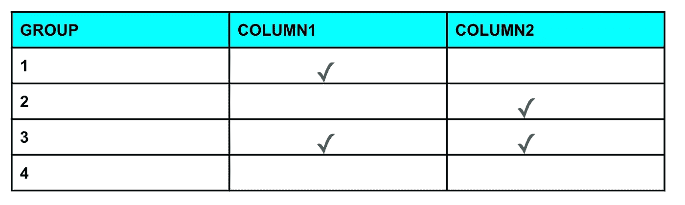
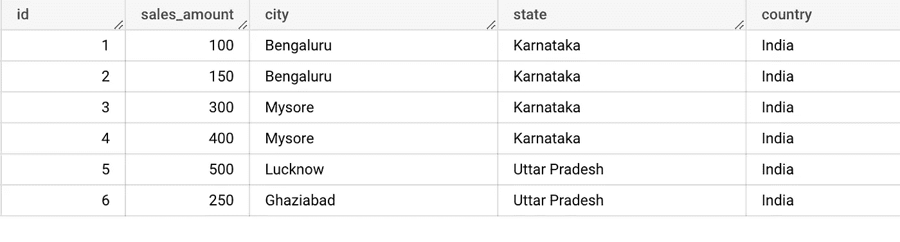
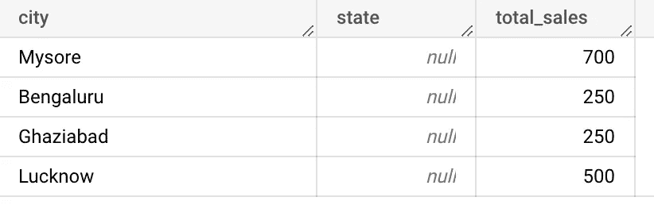
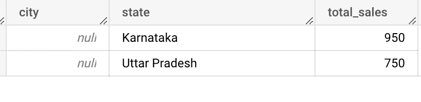
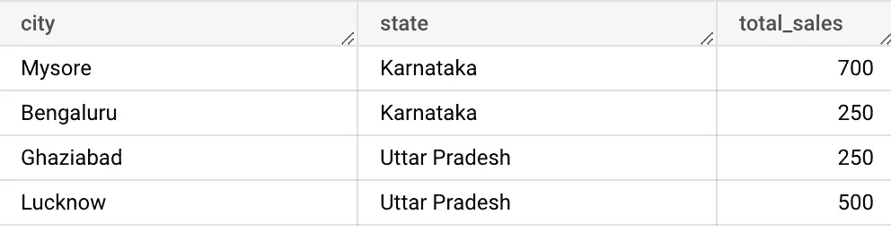
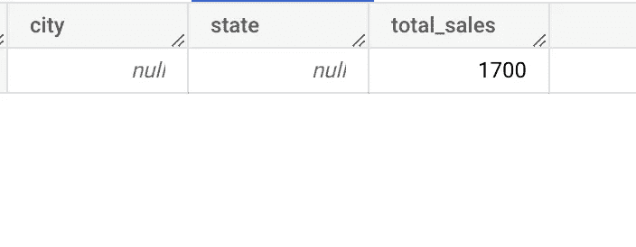
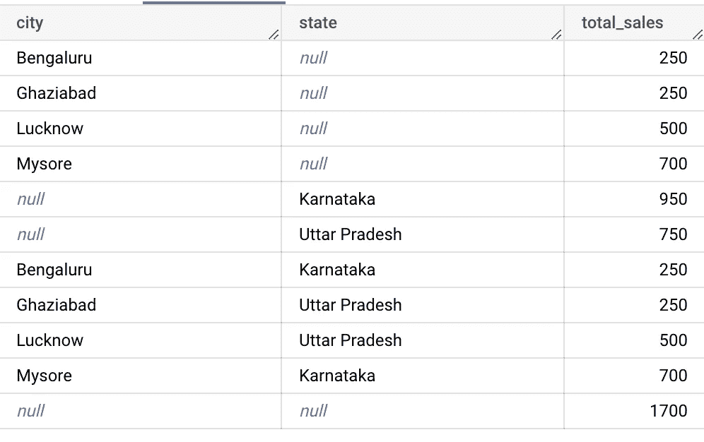

# 将按多维数据集分组(Teradata)转换为 Bigquery

> 原文：<https://medium.com/google-cloud/convert-group-by-cube-teradata-to-bigquery-9650b91b12f4?source=collection_archive---------4----------------------->

# 简介:

Group by CUBE 是 Group by 子句的 teradata 扩展，允许在单个语句中执行多个 group by 子句。

立方体 2n 组

给定 *n* 个维度，CUBE 生成 2 *n* 个不同种类的组。每个组表示为一行。

Teradata 到 Bigquery 的转换

# 先决条件

1.  Teradata 数据仓库及其 SQL 语法的基础知识
2.  对 Bigquery 及其 SQL 语法有很好的理解

# 转换逻辑

## 示例场景:

假设，要求是找出城市和州对销售额的影响

样本数据如下所示

抽样资料

## Teradata SQL:

> SELECT city，state，SUM(sales_amount)作为 total _ sales
> FROM sales _ TBL
> GROUP BY CUBE(city，state)；

## **大查询 SQL:**

> SELECT
> sales_tbl.city 为城市，
> NULL 为州，
> sum(sales _ TBL . sales _ amount)total _ sales
> FROM
> sales _ TBL
> GROUP BY 1
> 
> 联合所有
> 
> SELECT
> NULL 为城市，
> sales_tbl.state 为州，
> sum(sales _ TBL . sales _ amount)total _ sales
> FROM
> sales _ TBL
> GROUP BY 2
> 
> 联合所有
> 
> 从
> sales_tbl
> 组中按 1，2 选择
> sales_tbl.city 为城市，
> sales_tbl.state 为州，
> sum(sales _ TBL . sales _ amount)total _ sales
> 
> 联合所有
> 
> 从
> sales_tbl
> 中选择
> NULL 为城市，
> NULL 为州，
> sum(sales _ TBL . sales _ amount)total _ sales，
> ；

## 翻译解释:

由于 group by cube 中有两个维度，因此创建了(2*2) = 4 个组。

**第一组:城市效应**

第一组

**第 2 组:状态的影响**

第二组

**第三组:城市和州的影响**

第三组

**第四组:没有城市和州的影响**

第四组

因此，最终的查询输出是上述所有 4 个组的并集

按多维数据集输出分组

经过这些更改后，Bigquery SQL 将生成与 Teradata 相同的输出。