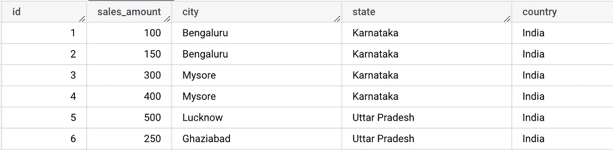
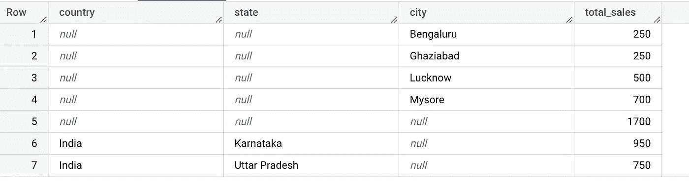

# 将分组集(Teradata)转换为 Bigquery

> 原文：<https://medium.com/google-cloud/convert-group-by-grouping-sets-teradata-to-bigquery-fb43d86663b0?source=collection_archive---------8----------------------->

# 简介:

Group by Grouping Sets 是 Group by 子句的 teradata 扩展，允许在单个语句中执行多个 group by 子句。

GROUP BY 分组集等效于同一结果集中两个或多个 GROUP BY 操作的联合。

空括号()指定对查询中指定的所有组求和的单个总计组。

Teradata SQL 到 Bigquery SQL

# 先决条件

1.  Teradata 数据仓库及其 SQL 语法的基础知识
2.  对 Bigquery 及其 SQL 语法有很好的理解

# 转换逻辑

## 示例场景:

比方说，要求是按国家内的州、城市和总的 sales_summary 来查找 sales _ summary。

样本数据如下所示

## **Teradata SQL:**

> SELECT country，state，city，SUM(sales _ amount)as total _ sales
> FROM sales _ table
> GROUP BY GROUPING SETS((country，state)，(city)，))；

## **查询输出:**

## **大查询 SQL:**

> SELECT
> sales_table.country 为国家，
> sales_table.state 为州，
> NULL 为城市，
> sum(sales _ table . sales _ amount)为 total _ sales
> FROM
> sales _ table
> GROUP BY 1，2
> 
> 联合所有
> 
> 选择
> NULL 为国家，
> NULL 为州，
> sales_table.city 为城市，
> sum(sales _ table . sales _ amount)为总销售额
> 从
> sales_table
> 分组按 3
> 
> 联合所有
> 
> 从
> sales_table
> 中选择
> NULL 为国家，
> NULL 为州，
> NULL 为城市，
> sum(sales _ table . sales _ amount)为总销售额
> ；

## 翻译解释:

*   GROUP BY 分组集((x)，(y)，(z))等效于 GROUP BY x UNION ALL GROUP BY y UNION ALL GROUP BY z
*   因此，分组集((country，state)，(city)，())将有两个 UNION ALL and 组(country and state)(第一个查询)和(city)(第二个查询)
*   空括号()指定对查询中指定的所有组求和的单个总计组。因此，第三个查询中没有 group by 子句

经过这些更改后，Bigquery SQL 将生成与 Teradata 相同的输出。