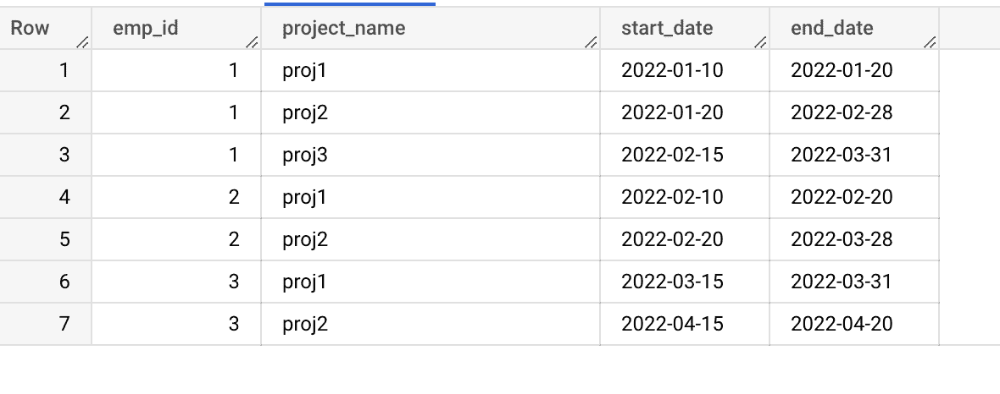
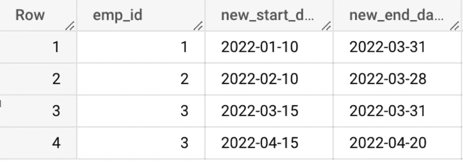
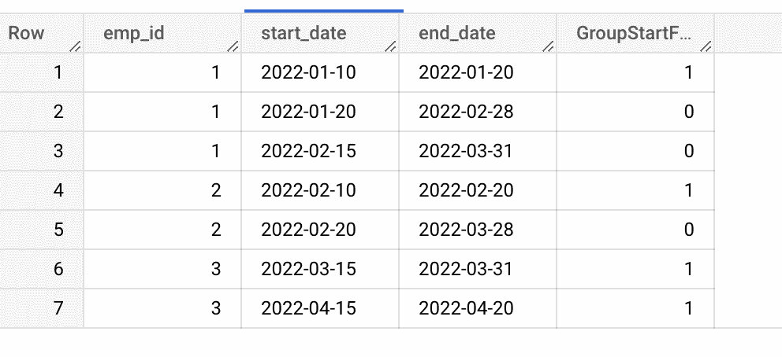
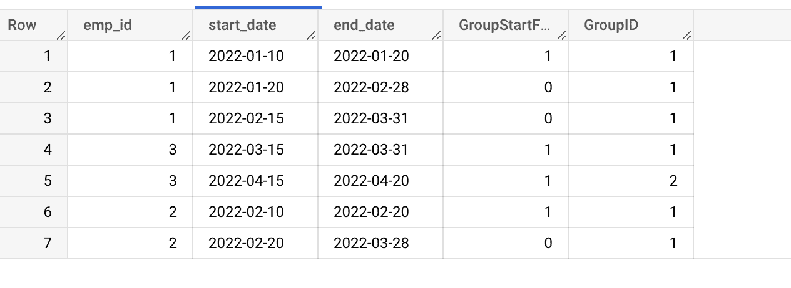

# 将 NORMALIZE (Teradata)转换为 Bigquery

> 原文：<https://medium.com/google-cloud/convert-normalize-teradata-to-bigquery-76deb6af9a40?source=collection_archive---------1----------------------->

# 介绍

NORMALIZE 是 ANSI SQL 标准的 Teradata 扩展。当 SQL 表中包含一个具有 period 数据类型的列时，NORMALIZE 会合并该列中相交或重叠的值，以形成一个合并多个单独的 period 值的 PERIOD。

要使用 NORMALIZE，SQL 选择列表中至少有一列必须是 Teradata 的时态周期数据类型。

Bigquery 目前不支持表中的周期数据类型。相反，我们需要将一个 Teradata 周期数据字段分成两部分:例如 start_date 和 end_date

# 先决条件

1.  Teradata 数据仓库及其 SQL 语法的基础知识
2.  对 Bigquery 及其 SQL 语法有很好的理解

Teradata SQL 到 Bigquery SQL

# 转换逻辑

## 示例场景:

假设在下面的例子中，我们将对 employee_id 进行规范化。此处，期间列分为两部分(开始日期和结束日期)

样本数据如下所示

员工详情表

## Teradata SQL:

> *从 poc_aa_cs 中选择符合或重叠 emp_id，duration
> 时归一化。normalize _ Emp _ Details
> ORDER BY 1，2；*

## **输出:**

标准化输出

## **大查询 SQL:**

> 从
> 中选择 S2.emp_id，MIN(S2.start_date)作为 new_start_date，MAX(S2.end_date)作为 new_end_date
> (选择 S1。*，SUM(group start flag)OVER(PARTITION BY EMP _ id ORDER BY start_date ROWS UNBOUNDED precending)As GroupID
> FROM(SELECT EMP _ id，start_date，end_date，(当 start _ date<= LAG(max _ end_date)OVER(PARTITION BY EMP _ id ORDER BY start _ date，END _ date)tha EN 0 ELSE 1 END)As group start flag
> FROM(SELECT EMP _ id，start _ date，END _ date，max(END _ date)OVER(PARTITION BY EMP _ id ORDER BY startnormalize _ Emp _ details `))S1
> )S2
> 按 S2.emp_id 分组，S2。GroupID
> ORDER BY 1，2；

## 翻译解释:

*   此 LAG 函数返回分区中当前行之上(之前)给定偏移量的行的值。
*   您可以使用 LAG 函数，通过确定某个期间是否与前一个期间重合(如果是，则为 0；如果不是，则为 1)，来确定开始新期间的每一行
*   当这个标志累加起来时，它提供了一个组标识符，可以在外部 Group By 子句中使用该标识符来获得所需的结果。
*   S1 的产量如下

S1 的产量

*   S2 的产量如下

S2 的产量

经过这些更改后，Bigquery SQL 将生成与 Teradata 相同的输出。