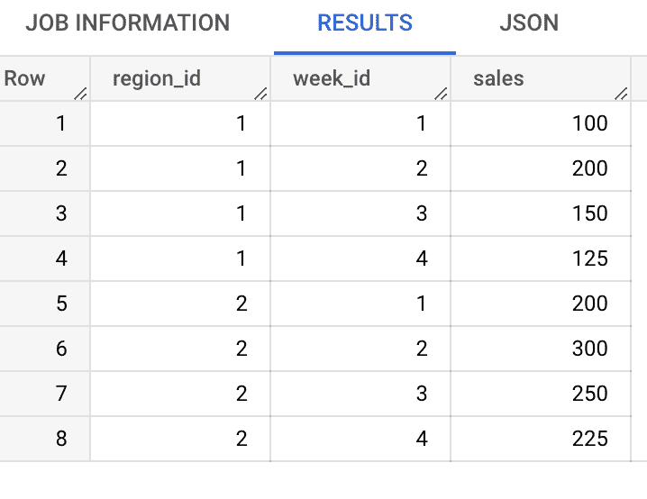
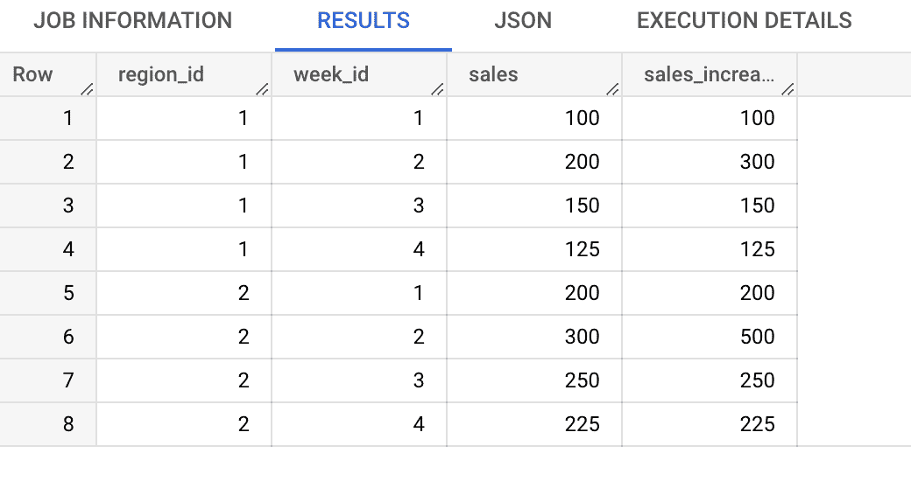

# 将 RESET WHEN (Teradata)转换为 Google BigQuery

> 原文：<https://medium.com/google-cloud/convert-reset-when-teradata-to-google-bigquery-f355ced09872?source=collection_archive---------2----------------------->

# 介绍

当在 SQL 分析窗口函数中使用 Teradata 功能时重置。它是 ANSI SQL 标准的扩展。当根据某些指定条件确定 SQL 窗口函数在哪个分区上运行时重置。如果条件评估为真，则在现有窗口分区内创建新的动态子分区

Bigquery 不支持 RESET WHEN 函数。为了实现这个功能，我们必须将 RESET WHEN 转换为 Bigquery 中的原生 SQL 语法。本文演示了如何使用 Teradata RESET WHEN 特性，以及如何将其转换为 Bigquery SQL 语法。

Teradata 到 Bigquery 的转换

# 先决条件

1.  Teradata 数据仓库及其 SQL 语法的基础知识
2.  对 Bigquery 及其 SQL 语法有很好的理解

# 转换逻辑

## 示例场景:

比方说，对于每个地区，要求是分析连续周销售额的总和。

当一周的销售额小于或等于前一周的销售额时，要求重置合计并重新开始。

样本数据如下所示

每周每个地区的销售额

## Teradata SQL:

> SELECT region_id，week_id，sales，
> (SUM(sales)OVER(PARTITION BY region _ id ORDER BY week _ id
> **RESET WHEN**sales<= SUM(sales)OVER(PARTITION BY region _ id ORDER BY weekly _ id ROWS BETWEEN previous AND 1 previous)
> ROWS BETWEEN unbound previous AND CURRENT ROWS)作为 sales _ increase
> FROM POC _ aa _ cs . week _ sales _ per _ region
> ORDER BY 1，2；

## **查询输出:**

合计 _ 连续 _ 销售 _ 增长

## **大查询 SQL:**

> SELECT region_id，week_id，sales，
> (SUM(sales)OVER(PARTITION BY region _ id，upd _ dynamic _ PARTITION ORDER BY week_id)未绑定的前一行和当前行)作为 sales _ increase
> FROM
> (SELECT region _ id，week_id，sales，
> SUM(dynamic _ part)OVER(PARTITION BY region _ id ORDER BY week _ id 行，位于未绑定的前一行和当前行之间)作为 upd _ dynamic _ PARTITION
> (SELECT region _ id，week _ id

# 翻译解释:

*   在内部子查询(别名 S1)中，创建并填充了一个动态分区指示器(dynamic_part)。如果一周的销售额小于或等于前一周的销售额，则 dynamic_part 设置为 1；否则，它被设置为 0。
*   在下一层(别名 S2)，upd_dynamic_partition 属性是作为求和窗口函数的结果而生成的。
*   最后，将 upd_dynamic_partition 作为新的分区属性(动态分区)添加到现有的分区属性(region_id)中，并应用与 Teradata 中相同的 SUM 函数

经过这些更改后，Bigquery SQL 将生成与 Teradata 相同的输出。