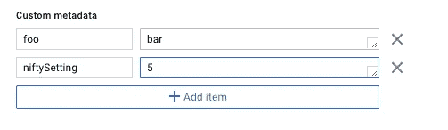

# 协调虚拟机集群与谷歌计算引擎的元数据服务器

> 原文：<https://medium.com/google-cloud/coordinating-vm-clusters-with-google-compute-engines-metadata-server-d13e4a5075d?source=collection_archive---------0----------------------->

如果你是谷歌计算引擎的新手，你可能已经注意到了一个特性，那就是为运行中的图像标记自定义元数据的能力。在编辑单个虚拟机的对话框中，如下所示:



本文涵盖了您可以用它做什么以及它为什么有用。我们将研究其背后的原因，然后介绍一个非常有用的协调用例，您可以通过使用该功能来完成，即让多个虚拟机都参与到同一个集群中，以便在启动时相互识别。

# 元数据服务器的背景

计算引擎的文档包括一个关于[存储和检索实例元数据](https://cloud.google.com/compute/docs/storing-retrieving-metadata)的章节，您可以看到:

> 每个实例都将其元数据存储在元数据服务器上。您可以从实例内部和计算引擎 API 以编程方式查询此元数据服务器，以获取有关实例的信息，如实例的主机名、实例 ID、启动和关闭脚本、自定义元数据和服务帐户信息。(…)当您请求从元数据服务器获取信息时，您的请求和后续元数据响应永远不会离开运行虚拟机实例的物理主机。元数据信息在传输到虚拟机主机的过程中也会被加密，因此您可以确保您的元数据信息始终是安全的。

在上面的截图中，我将 niftySetting 设置为 5。在 VM 中，我们可以使用常规 curl 获取这个值。记住要包括 Metadata-Flavor 头，这是获取值所必需的，并使服务器以 application/text 的形式返回结果。

```
$ curl -s -H "Metadata-Flavor: Google" http://metadata.google.internal/computeMetadata/v1/instance/attributes/niftySetting5
```

除了能够像这样获取自定义元数据之外，重要的是，您想要了解的关于 VM 的一系列事情已经提供给您了。例如:

*   您的外部有效 IP 可通过[http://metadata . Google . internal/computeMetadata/v1/instance/network-interfaces/0/access-configs/0/external-IP](http://metadata.google.internal/computeMetadata/v1/instance/network-interfaces/0/access-configs/0/external-ip)访问
*   您的内部主机名是[http://metadata . Google . internal/computeMetadata/v1/instance/hostname](http://metadata.google.internal/computeMetadata/v1/instance/hostname)(同一网络中的其他虚拟机可以使用此地址，但这不是互联网范围内的有效地址)

除了在虚拟机上点击“编辑”并直接添加键/值之外，您还可以像这样使用 gcloud 工具:

```
gcloud compute instances add-metadata my-instance \
  --metadata niftySetting=5
```

作为第二种选择，也可以定义项目级元数据，它向下传播到项目中的所有实例，如下所示:

```
gcloud config set-project my-project-id
gcloud compute project-info add-metadata --metadata projectSetting=42
```

如果以这种方式完成，所有虚拟机都将看到 projectSetting=42。

# 虚拟机协调

这种元数据的一个常见用例是可以从外部传递给启动的虚拟机的配置参数。在容器世界中，更典型的做法是在启动时将环境变量传递给容器。传递环境变量对虚拟机不起作用，但是您可以通过在虚拟机上设置元数据，然后在虚拟机上放置一个简单的 bash 脚本来完成类似的事情，该脚本在启动时使用 curl 针对元数据服务器获取这些变量的值，并执行您需要的任何配置。

## Neo4j 因果聚类示例

在我的例子中，我致力于部署 [Neo4j 因果集群实例](https://neo4j.com/docs/operations-manual/current/clustering/causal-clustering/)，它们只是 3 个不同的虚拟机，参与一个高可用性和容错的图形数据库集群。然而，当第一次启动 Neo4j 集群时，[发现协议需要被告知](https://neo4j.com/docs/operations-manual/current/clustering/causal-clustering/lifecycle/)彼此，以便它们可以在网络上发现彼此并形成集群。通常，您可以通过配置特定的地址或 DNS 名称来实现这一点。Neo4j 要求将此作为一个恰当命名的设置**causal _ clustering . initial _ discovery _ members**的一部分。

但是在部署新虚拟机的情况下，很难知道地址应该是什么，因为在虚拟机启动之前不会分配地址。

## 通过内部 DNS 进行协调

为了部署集群，我们使用了一个[部署管理器模板](https://cloud.google.com/deployment-manager/docs/)，它允许我们为每个虚拟机指定元数据。因为我们正在部署 3 个实例，所以我们将知道模板中的实例名称。实例名称依次映射到 google compute 内部的本地 DNS 名称，如下所示:

```
$ ping -c 1 node1PING node1.c.my-gcp-project.internal (10.142.0.2) 56(84) bytes of data.64 bytes from node1.c.my-gcp-project.internal (10.142.0.2): icmp_seq=1 ttl=64 time=0.019 ms
```

如果你对这部分是如何工作的或者为什么工作感到好奇，请看[内部 DNS 文档](https://cloud.google.com/compute/docs/internal-dns)。

## 部署管理器模板元数据

然后，在部署管理器模板中，为每个虚拟机设置一个变量，在 jinja 模板中，如下所示:

```
metadata:
    items:
        - key: causal_clustering_initial_discovery_members
          value: {{instanceName}}-1:5000,{{instanceName}}-2:5000,{{instanceName}}-3:5000
```

虚拟机本身是使用 google 提供的[VM _ multiple _ instances . py](https://github.com/GoogleCloudPlatform/deploymentmanager-samples/blob/master/templates/vm_multiple_instances.py)模块作为示例在 jinja 模板中创建的。

在每个虚拟机上，一个 shell 脚本从元数据服务器中选取该变量，并将其插入标准的 [Neo4j 配置文件](https://neo4j.com/docs/operations-manual/current/configuration/)，确保集群成员即使事先不知道其 IP 或主机名也能正常通信。这种知识是由部署管理器模板在部署时提供的。

这也可以通过项目级别的设置来完成，但是请注意，如果我们可能在一个项目中部署多组相互链接的资源，您将更喜欢通过 VM 级别的设置来完成，以免混淆多个资源集。

# 何时不使用实例元数据

最好的用例可能是动态配置(正如我们在上面提到的)，也可能是虚拟机静态描述之类的用例(例如，该虚拟机运行 Neo4j Enterprise 的 3.3.2 版本)

出于各种原因，使用元数据作为虚拟机之间的通信渠道并不是一个好主意。例如，多个虚拟机设置项目元数据并查询它。这种方法将是高复杂性、高延迟的，并且基本上归结为使用一组全局变量来协调状态，这是软件中众所周知的问题来源。

元数据服务器有一个“[等待更新](https://cloud.google.com/compute/docs/storing-retrieving-metadata#waitforchange)”功能，允许在值发生变化时通知虚拟机，但这很容易被滥用。当然，这取决于您的用例，但是如果您发现自己非常需要这种功能，那么您可能更适合使用更好的解决方案，比如消息队列或其他类似的组件，最好避免将它们用作发布/订阅通道。