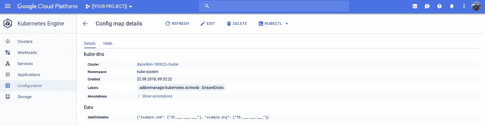

# CoreDNS

> 原文：<https://medium.com/google-cloud/coredns-afaa732aa35e?source=collection_archive---------0----------------------->

## 库伯内特斯历险记

> “因为缺少一颗钉子”

我有一个——让我们不去那里——需要别名一个 Kubernetes 服务到一个完全合格的域名。完成这项工作的技巧让我有了一个学习 CoreDNS 的机会。CoreDNS 是 kube-dns 的替代方案([链接](https://kubernetes.io/blog/2018/07/10/coredns-ga-for-kubernetes-cluster-dns/))。

## 问题

我需要临时将`[release-name]-[chart-name]-orderer`别名为`orderer.example.com`才能前进(解析！？)Kubernetes 上 Hyperledger Fabric 的舵图。

## 一个解决方案？

成功的定义是，当 Pods 调用`orderer.example.com`时，名称被解析为上述服务。可以使用所谓的“[存根域](https://kubernetes.io/docs/tasks/administer-cluster/dns-custom-nameservers/#configure-stub-domain-and-upstream-dns-servers)”(使用 ConfigMap 配置)来配置集群的 kube-dns，以便(在本例中)`*.example.com`的 dns 请求由我控制的 DNS 服务解析。一个基于 CoreDNS。

## CoreDNS

让我们在本地测试一下。

我将保留 CoreDNS 的示例`example.org` (dot-org)作为已知的工作配置，并将添加我自己的`example.com` (dot-com):

> **NB** 神奇的事情发生在第 13 行，这里`orderer`是`[[RELEASE-NAME]]-[[CHART-NAME]]-orderer.`的别名，不要忘记终止。。我用实际值代替`RELEASE-NAME`和`CHART-NAME`。

我们也需要 CoreDNS 的配置文件。默认情况下，这被称为`Corefile`:

> **注意**这定义了 2 个 DNS 域(`example.com`和`example.org`)。两者都包含一系列以`file`开头的插件。`file`后的值是一个参数，引用上述`example.com`等文件。

让我们运行 Docker 图像:

```
docker run \
--interactive \
--tty \
--publish=1053:1053/tcp \
--publish=1053:1053/udp \
--volume=$PWD:/tmp \
coredns/coredns \
  -conf /tmp/Corefile \
  -dns.port 1053
```

> **注意**端口`1053`上的双重发布是因为 DNS 同时使用 TCP 和 UDP。我假设上述文件在当前(`${PWD}`)目录中。这个目录被映射到容器中的`/tmp`。容器将在这个目录中找到`Corefile`，并且它引用了应该在同一个(`/tmp`)目录中的`example.org`和`example.com`。

这应该会输出类似如下的内容:

```
example.com.:1053
example.org.:1053
2018/08/22 16:48:32 [INFO] CoreDNS-1.2.0
2018/08/22 16:48:32 [INFO] linux/amd64, go1.10.3, 2e322f6
CoreDNS-1.2.0
linux/amd64, go1.10.3, 2e322f6
```

从另一个终端尝试:

```
nslookup orderer.example.com -port 1053 localhost
```

这应该会产生:

```
Server:  localhost
Address: ::1#1053orderer.example.com canonical name = x-hyperledger-fabric-orderer.
** server can't find x-hyperledger-fabric-orderer: REFUSED
```

> **NB** 这是正确的错误；-) CoreDNS 已将`orderer.example.com`别名化为`x-hyperledger-fabric-orderer`。没错。该端点上目前没有任何东西，因此我们收到一个“找不到”错误(正确地说)。

CoreDNS 的文档使用 dig 代替 nslookup…您的偏好:

```
dig [@localhost](http://twitter.com/localhost) -p 1053 a orderer.example.com
```

## 容器优化操作系统(COS)

如果你有一个容器，你想在谷歌云平台上运行它，Kubernetes 是一个很好的默认选择。在本例中，我将在与我的 Kubernetes 集群相同的项目中的 COS 实例上运行 CoreDNS。

为了简单起见，在配置 COS 实例之后，我将手动运行 CoreDNS 命令。COS 在`/tmp`上提供了一个可读写的文件系统，这也是我之前选择这个目录的原因。

在运行容器之前，让我们将 CoreDNS 配置文件复制到实例中:

```
PROJECT=[[YOUR-PROJECT]]
INSTANCE=[[YOUR-INSTANCE]]for FILE in Corefile example.org example.com
do
  gcloud compute scp \
  ${FILE} \
  ${INSTANCE}:/tmp \
  --project=${PROJECT}
done
```

> **NB** COS 使用 systemd-resolved，COS 默认为`DNSStubListener=udp`。要运行 CoreDNS，您需要禁用它，您可以使用`sudo systemctl stop systemd-resolved`来(暂时)禁用它。

然后`gcloud compute ssh`像以前一样运行 Docker 命令，但是(1)将本地目录更改为`/tmp`，以及(2)将 DNS 端口更改为其默认值(`53`):

```
docker run \
--interactive \
--tty \
--publish=53:53/tcp \
--publish=53:53/udp \
--volume=**/tmp**:/tmp \
coredns/coredns \
  -conf /tmp/Corefile \
  -dns.port **53**
```

> **问题#1** :我宁愿不打开不必要的防火墙端口。但是，我无法使用内部 IP 从 Kubernetes 集群连接到 CoreDNS 实例。正在调查。CoreDNS 实例的内部 IP 可用:

```
DNS=$(\
  gcloud compute instances describe ${INSTANCE} \
  --project=${PROJECT} \
  --format="value(networkInterfaces[0]**.networkIP**)"\
) && echo ${DNS}
```

公共 IP(有效)可用:

```
DNS=$(\
  gcloud compute instances describe ${INSTANCE} \
  --project=${PROJECT} \
  --format="value(networkInterfaces[0]**.accessConfigs[0].natIP**)"\
) && echo ${DNS}
```

对于公共 IP，你需要在防火墙上打一个洞。我将让你来决定；这将打开*实例的互联网端口*:

```
gcloud compute instances add-tags ${INSTANCE} \
--tags=coredns \
--project=${PROJECT}gcloud compute firewall-rules create temp-test-coredns \
--action=ALLOW \
--rules=tcp:53,udp:53 \
--target-tags=coredns \
--project=${PROJECT}
```

然后，从集群中的另一个实例:

```
nslookup orderer.example.com ${DNS}Server:  10.138.0.5
Address: 10.138.0.5#53orderer.example.com canonical name = x-hyperledger-fabric-orderer.
```

或者，在我的例子中，因为我从另一个 COS 实例运行:

```
docker run \
--net=host \
busybox \
  nslookup orderer.example.com ${DNS}Server:  10.138.0.5
Address: 10.138.0.5:53orderer.example.com canonical name = **x-hyperledger-fabric-orderer***** Can't find orderer.example.com: No answer
```

> **NB** busybox 的 nslookup 行为略有不同。它报告了正确的别名，但确认找不到`orderer.example.com`(而不是`x-hyperledger-fabric-orderer`)。

## 库伯内特斯

到目前为止一切正常，让我们通过应用定义 dns 服务器的配置图来修改 Kubernetes 的 kube-dns 配置:

> **NB** 你必须用它的值替换`${DNS}`。结果必须用引号括起来。清单显式引用了`kube-system`名称空间。

然后:

```
kubectl apply --filename=kube-dns.yaml
Warning: kubectl apply should be used on resource created by either kubectl create --save-config or kubectl apply
**configmap/kube-dns configured**
```

> **NB** 忽略“警告”。



显示系统对象的 Kubernetes 控制台

还有，我们来测试一下！

## 测试

> **问题#2** :我尝试将`orderer.example.com`解析为 Kubernetes 服务名，但是没有成功。我不知道为什么。正在调查。

这个(`CNAME`)不起作用:

相反，我确定了服务的 IP 地址，并将 CoreDNS `example.com`文件重新配置为`A` (lias)文件:

```
ORDERER=$(\
  kubectl get services \
  --selector=component=orderer \
  --namespace=${NAMESPACE} \
  --output=jsonpath="{.items[0].spec.clusterIP}"\
) && echo ${ORDERER}
```

然后:

> **NB** 你必须用它的值替换`${ORDERER}`。

现在，从集群中的一个 Pod，`nslookup`将解析`orderer.example.com`:

```
kubectl run test \
--namespace=${NAMESPACE} \
--image=busybox \
--stdin \
--tty
If you don't see a command prompt, try pressing enter.
/ # **nslookup orderer.example.com**
Name:      orderer.example.com
Address 1: 10.27.253.203 **x-hyperledger-fabric-orderer.ytterbium.svc.cluster.local**
/ #
```

嘭！

## 未决问题

*   为什么我无法使用内部 IPs？
*   怎么(！)我能把 example.com 解析到`CNAME`(或者`SRV`)吗？)?

## 结论

使用 CoreDNS 运行你自己的 DNS 服务(比我想象的要容易得多)。

如果您希望用您控制的 dns 服务来补充 Kubernetes 集群的 kube-dns，这也很容易。

虽然我实现了我的目标，并且现在能够在 Helm 部署上测试我的 Fabric，Pods 能够将`orderer.example.com`解析为 Kubernetes 服务名称(并证明是一个调试点)，但是旅程比我希望的要长:-)

仅此而已！