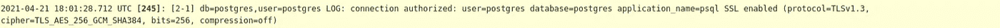

# 将 CloudSQL for Postgres 中的语句日志与连接会话相关联

> 原文：<https://medium.com/google-cloud/correlate-statement-logs-in-cloudsql-for-postgres-with-connection-sessions-5bae4ade38f5?source=collection_archive---------0----------------------->

这篇文章是[云日志如何工作](https://minherz.medium.com/how-cloud-logging-works-series-3aab7e7a1eed)系列的一部分。


CloudSQL for Postgres 的特性是将 PostgreSQL 日志接收到云日志中进行进一步处理。可以使用[数据库标志](https://cloud.google.com/sql/docs/postgres/flags)，具体来说就是 [cloudsql.enable_pgaudit](https://cloud.google.com/sql/docs/postgres/pg-audit#enable-auditing-flag) 来启用。然而，捕获的日志与您可能习惯的离线日志不同。这是因为 CloudSQL 不支持所有日志相关的配置。例如，CloudSQL for Postgres 不支持“log_line_prefix”标志(2022 年 1 月勾选)。在某些情况下，这可以使用 CloudSQL 的其他功能来缓解。例如，CloudSQL 实例标签可以用来替代在每个日志条目前添加应用程序名称。剩下的挑战之一是将日志条目和执行的 SQL 语句与特定的客户端应用程序会话相关联。本地 PostgreSQL 可以[配置](https://www.postgresql.org/docs/current/runtime-config-logging.html#GUC-LOG-LINE-PREFIX)为每个日志条目添加客户端的“远程主机名或 IP 地址”前缀。在 CloudSQL 中，该信息仅在与连接相关的日志条目中可用。要拥有它们，实例必须启用 [log_connections](https://www.postgresql.org/docs/current/static/runtime-config-logging.html#RUNTIME-CONFIG-LOGGING-WHAT) 数据库标志。

有一种方法可以在 SQL 语句日志条目和连接日志条目之间创建关联，并将每个执行的语句链接到特定的客户端。pgAudit 获取的每个 SQL 语句日志条目在请求的有效负载中都包含一个名为`databaseSessionId`的字段:

```
request: {
   [@type](http://twitter.com/type): "type.googleapis.com/google.cloud.sql.audit.v1.PgAuditEntry"    
   auditClass: "READ"    
   auditType: "SESSION"    
   chunkCount: 1    
   chunkIndex: 1    
   command: "SELECT"    
   database: "postgres"    
   **databaseSessionId**: 245    
   object: ""    
   objectType: ""    
   parameter: "<not logged>"    
   statement: "SELECT * FROM TEST;"    
   statementId: 2    
   substatementId: 1    
   user: "postgres"    
}
```

此标识符与连接日志条目的消息有效负载前缀中的值相关联:



使用云日志[查询语言](https://cloud.google.com/logging/docs/view/logging-query-language)应该可以找到所有相关的日志条目。如果相关日志被[导出到 BigQuery](https://cloud.google.com/logging/docs/export/bigquery) ，那么就可以创建一个视图，将会话信息添加到每个语句中。

顺便提一下，如果到 CloudSQL 实例的连接是通过 [Cloud sql-proxy](https://cloud.google.com/sql/docs/mysql/sql-proxy) 完成的，那么可能需要额外的关联步骤，因为代理连接隐藏了客户端细节。如果你对如何做感兴趣，请告诉我。