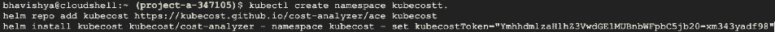
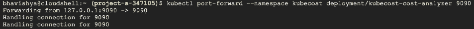
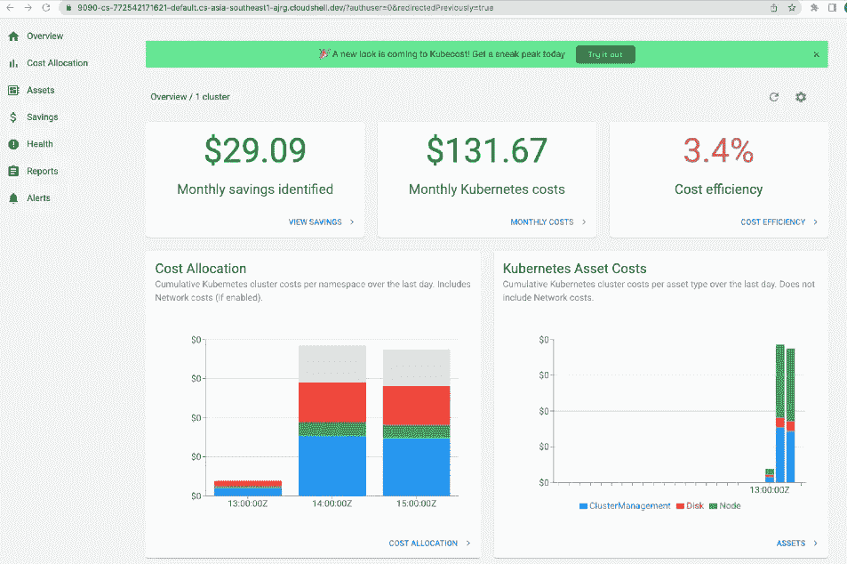
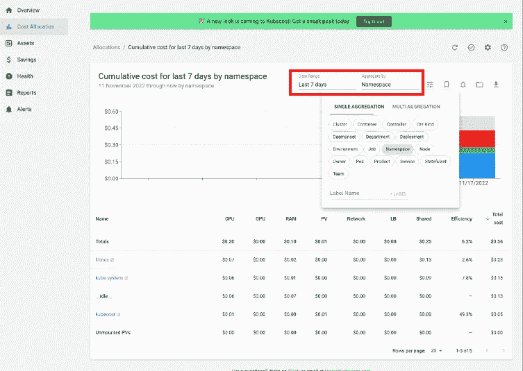
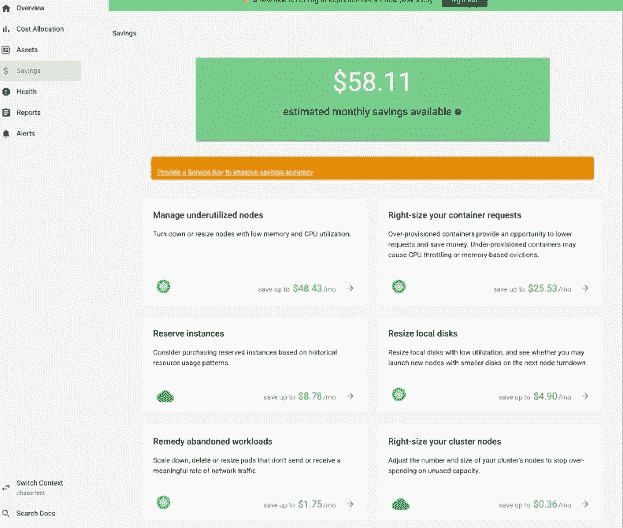
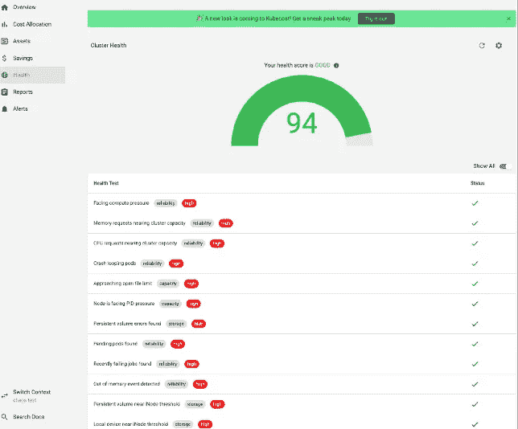
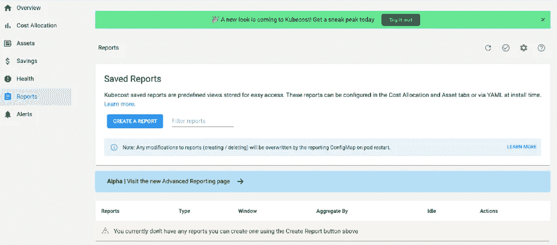
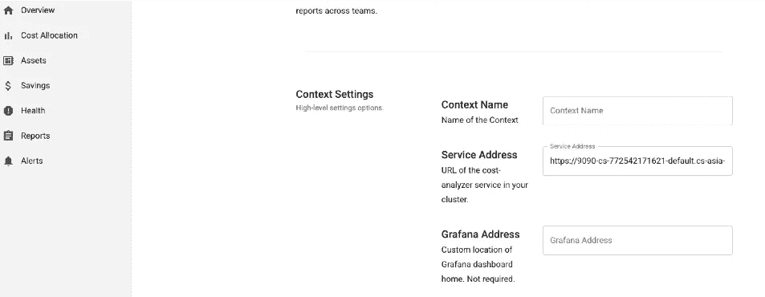

# 基于 Kube 成本的 GKE 集群成本分析

> 原文：<https://medium.com/google-cloud/cost-analysis-of-gke-cluster-using-kube-cost-ea8e9dba9c81?source=collection_archive---------4----------------------->

客户多次要求详细了解 Kubernetes 在多个集群的多个 pod 上托管的所有工作负载的成本。当大型企业涉及多个业务部门时，分析 K'8 成本对于成功实施按存储容量使用计费模型至关重要。

虽然市场上包括云原生成本分析在内的工具很少，但 Kubecost 是提供最全面视图的工具之一。

**期望值设置**

到本博客结束时，你将能够在 GKE 集群上安装 Kubecost，分析与所有 Pod 相关的成本，命名空间，在任何后端存储数据。

**先决条件**

对于此演示，我们将使用托管在 GCP 的 GKE 集群。假设我们拥有在 GCP 集群上执行操作的管理员权限。

**什么是 Kubecost？**

Kubecost 是一个分析本地托管集群或任何云提供商的 K'8 成本的工具。Kubecost 提供了多种集成选项，并提供了成本和集群运行状况的详细视图。Kubecost 功能可以进一步扩展，集成到 Prometheus、Grafana 和其他多种工具中。它还提供了关于成本节约和成本优化的建议。详细的文档可以在[这里](https://guide.kubecost.com/hc/en-us/articles/4407595947799-Getting-Started)找到。

**安装 Kubecost**

Kubecost 可以使用 Kubecost 提供的舵图进行安装。

1.  登录到您的 Kubernetes 集群后，按照以下步骤操作。

*kubectl 创建命名空间 kube cost
helm repo add kube cost*[*https://kubecost.github.io/cost-analyzer/*](https://kubecost.github.io/cost-analyzer/) *helm install kube cost kube cost/cost-analyzer—命名空间 kube cost—set kube cost token = " ymhhdmlzahlz 3 vwdge 1 mubnbwfpbc 5 JB 20 = XM 343 yadf 98 "*

2.启用端口转发(您可以使用入口重定向到控制台)

*kubectl port-forward —名称空间 kube cost deployment/kube cost-cost-analyzer 9090*

3.使用 <ipaddress>:9090 登录控制台并查看数据。在我们的例子中，我们已经转发到 localhost，因此它的 localhost:9090</ipaddress>

# 成本分析

1.  您可以基于窗格、名称空间、标签或您希望创建的任何自定义过滤器来查看成本。下面，我们基于名称空间汇总了过去 7 天的数据。我们可以聚合多达 90 天的数据，并将其存储在任何自定义位置，如 GCS bucket。

2.Kubecost 根据 pod 的利用率数据提出了节约和成本优化的机会。它根据利用率提供有关调整 pod、本地磁盘和集群节点大小的报告。下面是储蓄选项的片段。

3.Kubecost 还提供了 K'8 集群的整体运行状况和范围。

4.Kubecost 还提供了带有高级过滤器的详细报告选项。这些报告可以保存在外部存储桶中，也可以通过电子邮件发送。

5.它还可以与 Prometheus，Grafana 集成，以进一步扩展功能，并具有根据位置设置货币的选项。

# 结论

Kubecost 的一个最好的特性是，它允许分摊一些常见名称空间的成本，如 Kube system、kube public，并平等地添加到所有其他名称空间。Kubecost 还允许根据标签进一步降低成本，以增加粒度。总的来说，这是一个很好的工具，可以可视化企业中多个 Kubernetes 集群的成本。根据不同 Kubecost 计划中涵盖的集群数量，它有一些相关的成本，请参见[此处的](https://www.kubecost.com/pricing)。