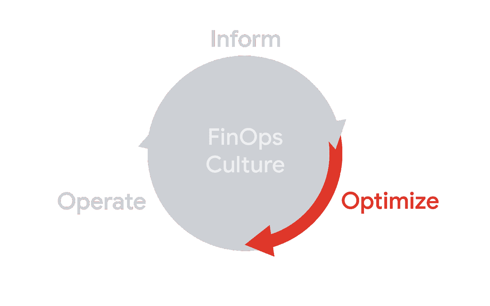
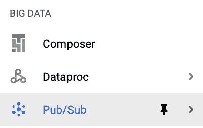
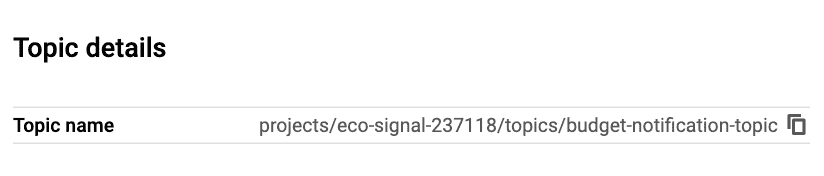
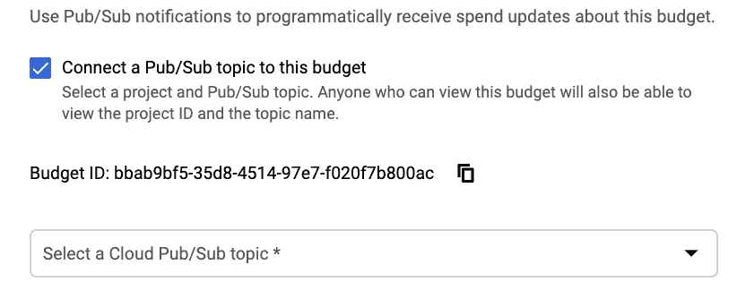
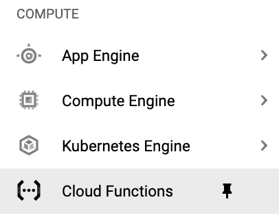
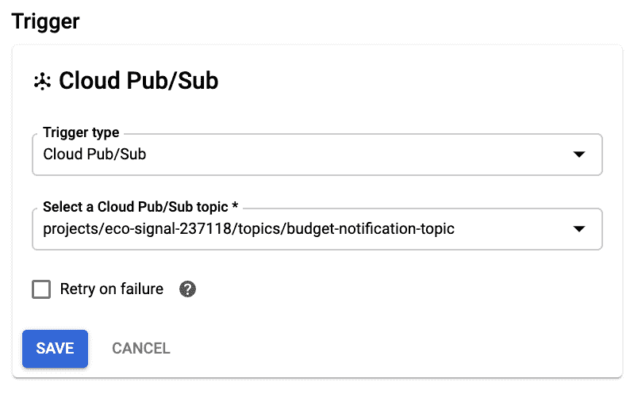
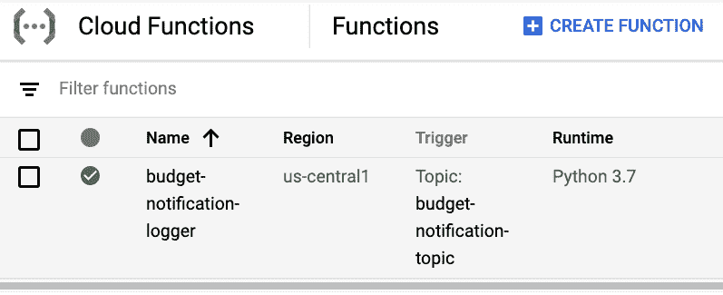
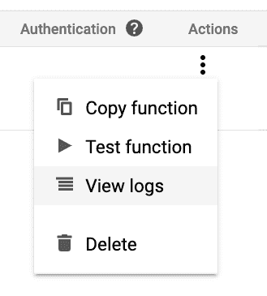
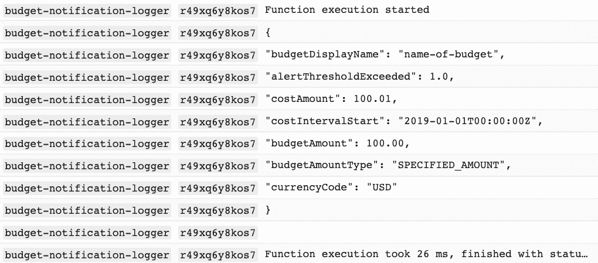

# 成本符合计划预算通知的代码

> 原文：<https://medium.com/google-cloud/costs-meet-code-with-programmatic-budget-notifications-8a38cf7f411d?source=collection_archive---------1----------------------->

TL；DR —除了警报，预算还可以向发布/订阅发送通知。一旦他们进入了 Pub/Sub，你就可以连接各种服务来对他们做出反应。您可以使用关于预算的信息以及一些代码来做任何事情。



*程序化预算通知可以帮助您实现自动化，并且非常适合财务运营生命周期的优化阶段*

所以，我们已经讨论了[如何建立预算](https://cloud.google.com/blog/topics/developers-practitioners/protect-your-google-cloud-spending-budgets)和[如何添加更多的电子邮件到预算提醒](https://cloud.google.com/blog/topics/developers-practitioners/stay-informed-customizing-your-budgets)。这很好，但是到目前为止，它还仅限于根据这些阈值获得警报。如果您想做更多的事情，比如集成另一个服务或实际上对预算警报采取行动，该怎么办？

好消息:您可以使用程序化预算通知来做到这一点！

坏消息:程序化预算通知真的很难说快 5 倍。

让我们看看如何设置它们(这次不止一个复选框)，并开始看看我们可以用它们做什么！

# 酒吧/Sub 拯救世界

在您更新任何预算之前，您应该首先创建一个发布/订阅主题。如果你不熟悉 Pub/Sub，[查看本页](https://cloud.google.com/pubsub/docs/overview)了解更多。简而言之，它是一个帮助您处理发布者和订阅者之间的消息的工具(因此得名)。我们将保持事情超级简单，只使用一个主题，它可以有任意数量的发布者(发送消息的东西)和任意数量的订阅者(可以接收消息的东西)。

在这种情况下，活动发布者将是您的预算，我们稍后会回来添加订阅者。现在，你可以使用左边的导航找到发布/订阅。请记住，在我的上一篇文章中，您需要一个项目来发布/订阅，但是您可以始终使用之前用于工作区的项目！



我猜这个标志的深蓝色圆点是出版商，浅蓝色圆点是订户？

为了简单起见，使用顶部 Create Topic 按钮创建一个新主题。如果您希望适当地详细，可以将其命名为“预算-通知-主题”。保持加密密钥选项不变(除非您希望这篇博文更长)，然后创建主题。您应该会看到一个屏幕，显示主题的全名，然后就可以开始了！



*完整格式为“项目/ <项目标识>/主题/ <主题名称>”*

现在回到你的预算，创建一个新的或者编辑一个现有的。我们正在寻找的复选框就在我们在上一篇文章中使用的复选框的正下方，看起来像这样:



*只有一个复选框*

选中该框，然后选择您刚刚创建的主题(您可能需要首先选择您的项目)。然后点击保存，你就可以走了！

# 通知里到底有什么？

你已经设置了一个发布者(你的预算)，它将向你的主题发送事件，但是这实际上意味着什么呢？首先，预算将在一天内多次向您的主题发送通知，它们看起来像这样:

```
{
  “budgetDisplayName”: “name-of-budget”,
  “alertThresholdExceeded”: 1.0,
  “costAmount”: 100.01,
  “costIntervalStart”: “2019–01–01T00:00:00Z”,
  “budgetAmount”: 100.00,
  “budgetAmountType”: “SPECIFIED_AMOUNT”,
  “currencyCode”: “USD”
}
```

这只是带有属性子集的消息示例

如果您想了解更多信息，这里有[完整的通知格式](https://cloud.google.com/billing/docs/how-to/budgets-programmatic-notifications#notification_format)，但我们主要关注几个关键属性。

*   **costAmount** 是相对于预算的当前成本，不管你选择了什么过滤器(比如仅仅是计算引擎产品，或者仅仅是你的开发项目)
*   **budgetAmount** 是您为预算配置的金额，而 **budgetAmountType** 将被指定为 _AMOUNT 或 LAST_MONTH_COST，这取决于您如何设置预算
*   **costinvalstart**是测量成本的当前时间段的开始，它将是月的开始
*   **alertthresholdexceded**是根据您设置的阈值已经通过的最后一个阈值。如果你想重温门槛，请查看第一篇文章
*   **forecast threshold exceed**与 alertThresholdExceeded 类似，但包括关于已通过的最后一个**预测**阈值的信息。如果还没有超过阈值，则这两个属性可能根本不包括在内
*   预算显示名称是预算的名称，但是你实际上可以通过一些额外的元数据来获得预算的唯一 ID(我们稍后会谈到)

所以有了这些基本属性，我们就获得了很多关于预算的信息！最重要的是，我们会在一天内多次收到这种通知(上次我检查时，我在一天内收到了超过 40 次),所以我们总是能得到最新的信息。

**注意:**即使通知持续不断地出现，成本数据仍然需要一段时间才能从资源层报告出来。预算信息将是最新的最好的信息，但相应地计划。

另一个重要注意事项是，该通知不会干扰您的阈值警报。您可以保持所有这些相同，您仍然会以相同的方式获得您的提醒，而且这些通知将被发送到您的发布/订阅主题。

这很好，但现在我们需要对通知做些实际的事情。因此，让我们使用轻量级的 Google Cloud 函数来订阅我们的主题。

# 谷歌云功能化险为夷

使用左侧导航找到云函数并前往那里。



*让我们继续使用同一个项目*

就像 Pub/Sub 一样，您需要有一个项目(并且您需要确保启用了计费)。您可以将同一个项目用于您的工作区、发布/订阅和与预算相关的功能，以帮助保持事情有条理。

再一次，让我们保持事情的简单，专注于创建一个轻量级的函数，只接收一条消息。如果你想深入了解，这里有一个关于创建 Python 函数的指南。创建一个新功能，命名为“预算通知记录”，选择你喜欢的地区。关键部分是选择发布/订阅触发器，然后选择您之前创建的主题，然后点击保存。



*函数可以由许多来源触发，包括当发布/订阅主题收到消息时*

第二步，我们将保持函数代码非常简单，只知道我们收到了一个通知。我将用 Python 3.7 向您展示代码，但用您选择的语言应该很容易做到。所以，选择 Python 3.7 运行时，将入口点保留为“hello_pubsub”。

**注意**:您可能会看到启用云构建 API 的通知，这是部署某些功能所必需的。按照路径来启用它，然后在它准备好的时候返回到函数。

样本代码对于我们所需要的应该是完美的，它只是一些接收消息然后打印出来的代码。继续按原样部署该功能吧！



一旦绿色支票出现，你就应该没事了。这可能需要一点时间，所以请随意泡茶

# Pub/Sub + GCF 实际上挽救了局面

这个函数已经准备好了，但是现在我们需要确保它正在工作。如果你点击右边的三个点(或者上下文菜单，如果你想这么叫的话)，你可以点击“查看日志”来查看函数的日志，包括我们的打印语句。



*查看日志显示关于您的功能和输出的日志*

日志查看器应该显示您已经创建了该函数。你可以坐在这里等待预算通知，但这可能需要一段时间。为了确保一切正常，我们可以在发布/订阅中发送一条测试消息。在一个新的标签页/窗口中，返回到发布/订阅页面，点击你的特定主题。在屏幕顶部，单击发布消息按钮。

同样，我们将保持简单，只将之前的示例通知发送到您的主题，您应该能够按原样复制和粘贴。在这种情况下，我们将发布一条测试消息，以确保一切正常，但最终您的预算也应该开始定期发送通知。


这只是一个测试。如果这是一个真实的预算通知，您将看到实际数据

单击 Publish 后，返回到显示函数日志的选项卡/窗口。您可能需要等待几秒钟，然后日志界面才会拾取它，您可以单击底部的按钮加载更新的日志来拾取它。过一会儿，您应该会看到类似这样的内容:



*如果您想了解更多关于日志记录和相关主题的信息，请查看* [*栈 Dr*](https://www.youtube.com/playlist?list=PLIivdWyY5sqLuKKx4pcdEAkJY1HevjVVm) *播放列表！*

成功！我们可以看到，我们的消息是从 Pub/Sub 发送到函数的，我们只是将它打印到日志中。如果您稍后查看日志页面，您应该还会看到来自实际预算的消息，其中包含真实数据。

借助代码的力量，我们可以在预算的基础上做更多的事情。在下一篇文章中，我们将通过向 Slack 发送预算来完成一个更有用的操作。同时，[如果你想了解更多关于计划预算通知的信息，这里有文档](https://cloud.google.com/billing/docs/how-to/budgets-programmatic-notifications)！