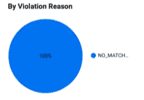

# 使用 Data Studio 监控您的 GCP 组织违反 VPC-SC 的情况

> 原文：<https://medium.com/google-cloud/create-a-data-studio-dashboard-to-monitor-vpc-sc-violations-on-your-google-cloud-organization-bf8f3bead691?source=collection_archive---------1----------------------->

TL；DR: [Google Cloud VPC 服务控制](https://cloud.google.com/vpc-service-controls)是减少您组织中数据泄露的关键功能。在现有项目中实施这种方法可能会面临挑战:您可能会使资源不可用，或者中断生产应用程序和工作负载。在这篇文章中，我想分享一些提示，以尽量减少激活它时的问题，使用 Data Studio(*)监控 VPC-SC 违规。

(*)注意:一旦您启用了 VPC-SC，Data Studio 将无法工作，如果 BigQuery 数据集是由 VPC-SC 执行的，您将需要使用不同的工具。


为了减少数据泄露，您的组织可能已经将 [VPC 服务控制](https://cloud.google.com/vpc-service-controls)确定为在您的 GCP 组织中启用的关键功能。该功能将帮助您在项目周围创建安全[周界](https://cloud.google.com/vpc-service-controls/docs/service-perimeters)。在这些范围内，您将能够决定哪些服务可以访问，哪些是允许的源(基于[用户身份](https://cloud.google.com/access-context-manager/docs/overview#user_identity)、 [IP](https://cloud.google.com/access-context-manager/docs/overview#ip_address) 或[设备类型](https://cloud.google.com/access-context-manager/docs/overview#device_type))。

如果您打算在有实时生产 GCP 工作负载的组织上启用该特性，这可能会很有挑战性。如果您错误地配置了 VPC-SC，您可能最终会阻止需要通信的资源之间的通信。

为了缓解这些问题，我建议采取三步走的方法:

1.  熟悉该功能
2.  设计您的外围架构
3.  设置模拟运行模式，监控并修复违规情况

在这篇文章中，我将深入讨论修复 VPC-SC 违规的重要性，并分享我写的一个仪表板来帮助监控和分组它们。

# 熟悉该功能

你可以找到很多关于这个的[文档。我不想在这篇文章中讨论 VPC-SC 的特性，但是根据我的经验，VPC-SC 是一个容易被误解的特性，我真的建议您熟悉它，并在您的组织上做一些测试。](https://cloud.google.com/vpc-service-controls)

我建议测试简单的场景，例如:

*   VPC-南卡罗来纳州边界内项目中的 GCS 存储桶或 Bigquery 数据集:如果我从边界内访问资源，会发生什么情况？从外围看呢？
*   访问级别支持什么？
*   VPC-SC 和共享 VPC 是如何干涉的？

# 设计您的外围架构

一旦您熟悉了 VPC-SC 的功能，您就可以开始设计您的外围架构。列出您的业务需求，并确定 VPC-SC 的特性来满足每一项需求。下面你可以找到我在几个组织中看到的一些模式:

*   为组织中配置的每个共享 VPC 创建一个边界。
*   为每个环境(生产、集成、开发等)创建一个边界，但不如您的共享 VPC 配置精细。
*   为您公司的 Internet 代理创建访问级别。该访问级别将允许您的员工在连接到公司网络时访问 GCP 控制台上的资源。
*   为 landing 项目创建一个边界，并在 landing 项目和 prod / no prod 项目之间桥接边界，以让 onprem 资源访问受 VPC 服务控制保护的 GCP 资源。

下面是一个架构示例:


# 设置模拟运行模式，监控并修复违规情况

一旦你确定了你的 VPC-SC 架构，就在试运行模式下实现它，并监控你的日志来检查你是否能够捕获你的所有用例，以及你的架构是否满足你的所有需求。

跨项目检查日志可能具有挑战性。我的建议是在文件夹或组织级别创建一个[日志导出同步](https://cloud.google.com/logging/docs/export)到 [Bigquery](https://cloud.google.com/logging/docs/export/bigquery) 。您可以使用以下 gcloud 命令创建一个:

```
gcloud beta logging sinks create SINK_NAME\
bigquery.googleapis.com/projects/PROJECT_ID/datasets/DATASET_NAME \
 - folder=FOLDER_ID \
 - include-children \
 - log-filter='protoPayload.metadata.[@type](http://twitter.com/type):"type.googleapis.com/google.cloud.audit.VpcServiceControlAuditMetadata"' \
 - use-partitioned-tables
```

从现在开始，GCP 会将您的日志复制到指定的 Bigquery 数据集:


要轻松导航和分组日志，您可以创建一个简单的 Data Studio 仪表板:


您可以使用以下查询创建 Data Studio 数据集:

```
SELECT
   *,
    CASE
      WHEN REGEXP_CONTAINS(protopayload_auditlog.status.message,'(Dry Run Mode)*') THEN 'Dry Run'
      ELSE 'Enforced'
    END enforced_type,
    CASE
      WHEN REGEXP_CONTAINS(protopayload_auditlog.requestMetadata.callerIp, r"(^127\.)|(^10\.)|(^172\.1[6-9]\.)|(^172\.2[0-9]\.)|(^172\.3[0-1]\.)|(^192\.168\.)") OR protopayload_auditlog.requestMetadata.callerIp = 'private' THEN 1
      ELSE 0
    END internal_ip,
    REGEXP_EXTRACT(protopayload_auditlog.metadataJson, r'servicePerimeterName":"[a-zA-Z]+\/[\d]+\/[a-zA-Z]+\/([a-zA-Z]+)') as perimeter,
    REGEXP_EXTRACT(protopayload_auditlog.metadataJson, r'violationReason":"([a-zA-Z_]+)') as violation_reason,    
FROM 
  `PROJECT_ID.DATASET_NAME.cloudaudit_googleapis_com_policy`
```

并根据上面的查询复制[示例仪表板](https://datastudio.google.com/s/lHElSSxQq_k)。

在仪表板中，您可以在几个维度上对违规进行分组:

*   按项目


*   按周长


*   按违规原因



您可以创建最有助于加快修复意外违规的操作的分组标准。

# 后续步骤

一旦您修复了 VPC SC 日志中的所有意外违规，请强制执行您的配置，并在您的 GCP 资源上更安全地保存您的所有数据。现在，您可以通过限制可以访问您的数据的设备类型或 IP 来减少 GCP 资源上的数据泄漏！！！