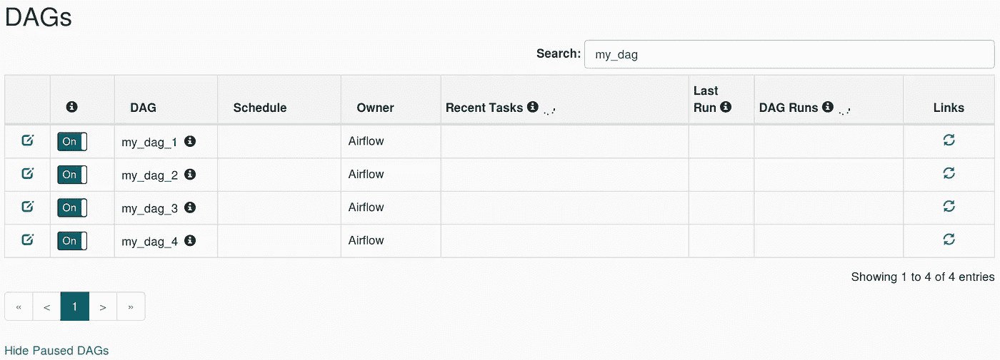

# 在 Google Cloud Composer 中创建动态创建的 DAG 和 TroubleshootAirflow 的 web 服务器

> 原文：<https://medium.com/google-cloud/create-a-dynamically-created-dag-and-troubleshoot-airflows-webserver-in-google-cloud-composer-290af1e3eb1b?source=collection_archive---------0----------------------->

有一种情况，我需要从 Google Cloud SQL 获取我的配置，并创建一个动态创建的 DAG。我做的第一步是尝试在我的 Composer 集群中创建一个`clousql proxy`。这是可以做到的，因为一般来说你所有的气流元数据也存储在云 SQL 里面，所以你可以基于你的 Composer 集群中可用的`cloudsql proxy` Dockerimage 创建你自己的`cloudsql proxy`。取决于你的气流版本，你可以得到以下的`Pod`和`Service`为代理。

```
kubectl get svc airflow-sqlproxy-service -o yamlkubectl get deploy airflow-sqlproxy -o yaml > airflow-sql-proxy-2.yaml # change the -instance in the deployment, don't forget to add your composer service account to IAM of the project where your Cloud SQL instance belongs to
```

对于临时存储，您还可以在 Composer 集群中看到默认的 Redis 服务。

```
airflow-redis-service.<NAMESPACE> # Depends on your Composer version
```

创建动态生成的 DAG 文件:

```
import json
import re
from datetime import datetime, timedelta
import loggingfrom airflow import DAG
from airflow.models import Variable
from airflow.hooks.postgres_hook import PostgresHook
from airflow.operators.python_operator import PythonOperator
from airflow.hooks.base_hook import BaseHook
from airflow.contrib.operators.slack_webhook_operator import SlackWebhookOperator
from psycopg2.extras import RealDictCursor
import redislogger = logging.getLogger(__name__)class Variables(object):
    DATABASE_CONNECTION_ID = Variable.get('DB_CONNECTION_ID')
    ENVIRONMENT = Variable.get('ENVIRONMENT')
    SLACK_CONN_ID = Variable.get("SLACK_WEBHOOK_ID")
    MYAIRFLOW_DASHBOARD_URL = Variable.get("EXPAIRFLOW_DASHBOARD_URL")
    AIRFLOW_DASHBOARD_URL = Variable.get("AIRFLOW_DASHBOARD_URL")def standardize_naming(input):
    return '{}_{}'.format(input, Variables.ENVIRONMENT)class Constants(object):
    REDIS_KEY = standardize_naming("my-redis")
    REDIS_CONNECION_SERVICE = #your redis service
    ALPHANUM_UNDERSCORE_ONLY_REGEX = '[^0-9a-zA-Z_]+'
    STRPTIME_FORMAT = '%Y-%m-%d %X'
    MAX_ETL_DURATION_DAYS = 35
    PG_QUERY = # your config querydef remove_unsafe_character(input):
    return re.sub(Constants.ALPHANUM_UNDERSCORE_ONLY_REGEX, '_', input)def failed_task_slack_alert(context):
    slack_webhook_token = BaseHook.get_connection(Variables.SLACK_CONN_ID).passwordbase_log_url = context.get('task_instance').log_url
    updated_log_url = base_log_url.replace(Variables.AIRFLOW_DASHBOARD_URL,
                                           Variables.MYAIRFLOW_DASHBOARD_URL)
    slack_msg = """
            :red_circle: Task Failed. 
            *Task*: {task}  
            *Dag*: {dag} 
            *Execution Time*: {exec_date}  
            *Log Url*: {log_url} 
            """.format(
            task=context.get('task_instance').task_id,
            dag=context.get('task_instance').dag_id,
            ti=context.get('task_instance'),
            exec_date=context.get('execution_date'),
            log_url=updated_log_url,
    )
    failed_alert = SlackWebhookOperator(
            task_id='slack_test',
            http_conn_id=Variables.SLACK_CONN_ID,
            webhook_token=slack_webhook_token,
            message=slack_msg,
            username='airflow')
    return failed_alert.execute(context=context)default_args = {
    "owner": "someone",
    "depends_on_past": False,
    "start_date": datetime(2019, 1, 1),
    "email": [],
    "email_on_failure": True,
    "email_on_retry": False,
    "retries": 1,
    "retry_delay": timedelta(minutes=5),
    "on_failure_callback": failed_task_slack_alert,
    # 'queue': 'bash_queue',
    # 'pool': 'backfill',
    # 'priority_weight': 10,
    # 'end_date': datetime(2016, 1, 1),
}def deduplicate_email(emails):
    tmp = set(emails)
    return list(tmp)def convertCamelToSnake(camel):
    s1 = re.sub('(.)([A-Z][a-z]+)', r'\1_\2', camel)
    s2 = re.sub('([a-z0-9])([A-Z])', r'\1_\2', s1).lower()
    s3 = s2.replace("-", "_").replace(".", "_")
    while "__" in s3:
        s3 = s3.replace("__", "_")
    return s3"""
[https://stackoverflow.com/questions/47705060/running-bigquery-query-uncached-using-python-api](https://stackoverflow.com/questions/47705060/running-bigquery-query-uncached-using-python-api)
[https://github.com/tylertreat/BigQuery-Python/blob/master/bigquery/client.py](https://github.com/tylertreat/BigQuery-Python/blob/master/bigquery/client.py)
[https://stackoverflow.com/questions/47172150/google-cloud-bigquery-python-how-to-get-the-bytes-processed-by-query](https://stackoverflow.com/questions/47172150/google-cloud-bigquery-python-how-to-get-the-bytes-processed-by-query)
"""def create_dag(dag_id, config, default_args):
    def dummy(task_id):
        print(task_id)start_date = datetime.strptime(config['startdatestr'], '%Y-%m-%d')
    if config['enddatestr'] is not None:
        end_date = datetime.strptime(config['enddatestr'], '%Y-%m-%d')
    else:
        end_date = start_date + timedelta(days=Constants.MAX_ETL_DURATION_DAYS)if len(config['notificationemails']) > 0:
        default_args['email'].extend([str(email) for email in config['notificationemails']])default_args['email'] = deduplicate_email(default_args['email'])execution_period = 24dag = DAG(dag_id,
              default_args=default_args,
              schedule_interval=timedelta(hours=execution_period),
              start_date=start_date,
              end_date=end_date,
              catchup=False)logger.info("Exp Processing: Create DAG with ID {}".format(dag_id))with dag:
        """
        common var
        """start_date_safe = remove_unsafe_character(config['startdatestr'])
        cur_date = '{{ ds }}'
        cur_time = '{{ ts }}'
        cur_date_safe = '{{ execution_date.strftime("%Y_%m_%d") }}'
        version = str(config['version'])task_id = '{prefix}_{name}_{version}'.format(
                prefix=standardize_naming('my-dag'),
                version=version)task = PyhtonOperator(
                task_id=task_id,
                provide_context=True,
                python_callable=dummy,
                op_kwargs={'task_id': task_id}
            )return dag"""
handle datetime format when fetching from pg
so that the fetch result can be stored as json instead of plain string
"""def converter(o):
    if isinstance(o, datetime):
        return o.__str__()"""
Bahavior:
Create an exact DAG which in turn will create it's own file
[https://www.astronomer.io/guides/dynamically-generating-dags/](https://www.astronomer.io/guides/dynamically-generating-dags/)
"""redis_conn = redis.StrictRedis(host=Constants.REDIS_CONNECTION_SERVICE, port=6379,
                               db=0)
serialized_configs = redis_conn.get(Constants.REDIS_KEY)configs = []
if serialized_configs == None:
    pg_hook = PostgresHook(postgres_conn_id=Variables.DATABASE_CONNECTION_ID)
    pg_conn = pg_hook.get_conn()cursor = pg_conn.cursor(cursor_factory=RealDictCursor)
    cursor.execute(Constannts.PG_QUERY)res = cursor.fetchall()logger.info(
            "{res} fetched on {time}".format(res=json.dumps(res, default=converter),
                                             time=datetime.now()))
    # Set expiration to 1 minutes, to prevent to much query on the DB.
    redis_conn.setex(Constants.REDIS_KEY, timedelta(minutes=1),
                     json.dumps(res, default=converter))configs = res
else:
    configs = json.loads(serialized_configs)for config in configs:
    if config['hasetlstarted'] == True:
        id = re.sub(Constants.ALPHANUM_UNDERSCORE_ONLY_REGEX, '_',
                            config['id'])
        version = str(config['version'])
        dag_id = "{prefix}_{id}_{version}".format(
                prefix=standardize_naming('my_dag'),
                id=id,
                version=version)
        logger.info("Dag with ID : {} is created.".format(dag_id))
        globals()[dag_id] = create_dag(dag_id, config, default_args)
```

您还可以创建一个 Cloudbuild 文件来实现 Github 和 Composer Airflow 目录之间的同步:

```
steps:- name: 'google/cloud-sdk'
  entrypoint: 'bash'
  args:
    - '-c'
    - |
      gsutil rsync -R dags ${_BUCKET}
  id: 'deploy'substitutions:
  _BUCKET: gs://<your-composer-dags-gcs-id>/dags
```

我发现了一个问题，我的 DAG 在 [Composer Webserver](https://stackoverflow.com/questions/51218314/dags-not-clickable-on-google-cloud-composer-webserver-but-working-fine-on-a-loc) 中无法点击。DAG 不可点击,“最近的任务”和“DAG 运行”列将永远加载。每个 DAG 名称旁边的“info”标记表示:

```
This DAG isn't available in the webserver DagBag object. It shows up in this list because the scheduler marked it as active in the metadata database.
```



无法在 Composer Webserver 中单击动态创建的 DAG。

这是因为 Webserver 使用 App Engine，而元数据本身存储在 Cloud SQL 和 GCS 中，不直接与 Composer 集群内部的本地 Redis 通信。事实上，自动生成的 DAG 是由一个文件生成的，其中关于 DAG 的所有信息仅存在于 Composer 集群内的 Redis 中，这可能会导致此类问题。您可以通过部署您的自我管理气流网络服务器来处理此问题，该服务器可在[中找到](https://cloud.google.com/composer/docs/how-to/managing/deploy-webserver)。然而，如果你想使用公共 API 访问你的网络服务器，你需要创建一个入口。

```
apiVersion: v1
items:
- apiVersion: extensions/v1beta1
  kind: Ingress
  metadata:
    annotations:
      kubernetes.io/ingress.global-static-ip-name: <YOUR-STATIC-IP-THAT_ALREADY-BIND-WITH-AN-IP>
    name: airflow-webserver
    namespace: <YOUR-NAMESPACE>
  spec:
    backend:
      serviceName: airflow-webserver-service
      servicePort: 80
    tls:
    - secretName: <YOUr-SSL-SECRET>
```

使用你想要的任何东西来保护它，对我来说，我使用的是谷歌 IAP。

这是我能想到的一切。再见！👋