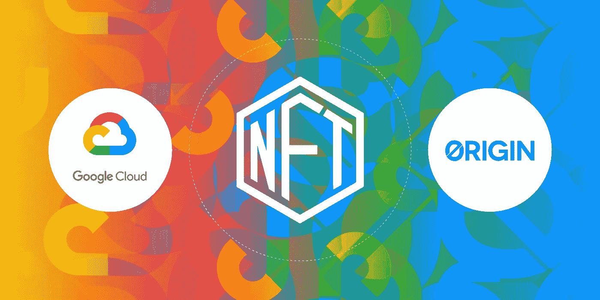
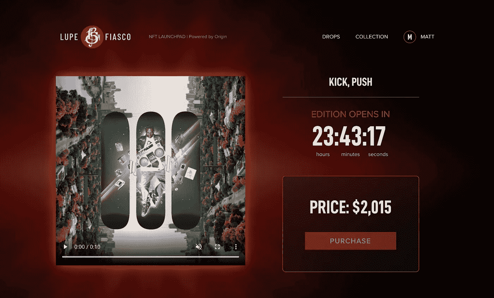

# 通过 Google Cloud market place Partner Origin 创建和销售 NFT

> 原文：<https://medium.com/google-cloud/create-and-sell-nfts-on-dshop-powered-by-origin-and-google-cloud-6bd59b66d82?source=collection_archive---------0----------------------->

不可替代代币(NFT)正在抓住公众的想象力，不像以前来自加密货币技术的任何东西。NFT 通常被简单地描述为数字收藏品，例如棒球卡的加密货币版本，但 NFT 还有许多其他有趣的用例。

***在本帖中，我将向您介绍 NFTs 的世界，并教您如何使用 Dshop 电子商务平台通过 Origin 协议创建和销售自己的 NFTs。作为谷歌云市场的合作伙伴，Origin 很高兴向使用谷歌云基础设施的开发者和创作者介绍这项新的区块链技术。***

# **NFTs 简介**

不可替代令牌(NFT)是唯一或稀缺的加密货币令牌。当某种东西是可替代的时，它可以很容易地被一种等价物所替代。例如，一张 5 美元的钞票可以替代另一张 5 美元的钞票或 5 张 1 美元的钞票。

相比之下，NFT 可以是唯一的对象，或者是 n 个对象中的 1 个，这意味着只存在该对象的 *n* 。NFT 已被 NBA 和其他体育联盟采用，以代表附有视频集锦的数字交易卡。

NFT 还用于表示物理对象的所有权，尤其是稀缺对象，如限量版运动鞋或美术作品。另一个用例是 NFT 作为数字内容或现实生活体验的访问令牌。NFT 持有者可以解锁网上的独家或私人内容，或将他们的代币兑换成音乐会门票。NFTs 的一个重要方面是，令牌创建者在二级市场上销售 NFT 的未来收入或版税可以编入 NFT 本身。

# **案例分析**

原产地协议促成了两起高调的 NFT 销售，也就是所谓的“滴滴”。2020 年初，我们帮助广受欢迎的 Brave 浏览器的制造商 Brave Software[将其商品商店从 Shopify 转换到 Origin 的 Dshop 平台](https://www.originprotocol.com/en/brave-customer-story)。Brave 现在将他们的商店托管在一个接受本地加密货币的分散平台上。Brave 在 2021 年初与他们的社区举行了一场模因创作比赛，并根据三个最受欢迎的参赛作品，以三个 10/10 的形式创作或“铸造”了 30 个非功能性思维。这种迷因 NFT 的集合然后被列在他们的 Dshop 上出售。所有 30 个 NFT 几乎立即销售一空，表明他们的社区对 NFT 有着极其强烈的需求，并展示了软件公司与其用户之间一种全新的互动形式。

2021 年 3 月，Origin 打破了当时 NFT 票房最高的记录，当时一张令牌化的音乐专辑被拍卖。这笔交易带来了近 1200 万美元的收入，并成为行业和主流出版物的头条新闻，包括[福布斯](https://www.forbes.com/sites/abrambrown/2021/03/03/3lau-nft-nonfungible-tokens-justin-blau/?sh=3a8a8a774643)、[广告牌](https://www.billboard.com/articles/business/tech/9542307/nft-sales-millions-market-music-wont-last-3lau/)和[商业内幕](https://www.businessinsider.com/nft-ultraviolet-3lau-first-ever-crypto-albums-sales-11-million-2021-3)。在这次拍卖中，出售了几个不同的具有独特用例的 NFT 集合。所有这些 NFT 都可以自由交易和转让。

最近，起源宣布 NFT 销售与格莱美获奖嘻哈艺术家 Lupe 惨败，互联网轰动和职业拳击手杰克保罗。我们计划未来在我们的商务平台上推动更多的 NFT 销售。

NFT 是视听数字艺术作品，在区块链被证明是稀有和真实的

# **在谷歌云市场上使用 Dshop 的指南**

要开始，我们必须在谷歌云平台上设置一个 Dshop。这个过程相当简单，但需要几个步骤。我们提供了[书面指南](https://github.com/OriginProtocol/dshop/raw/master/backend/scripts/gcp/marketplace/GCP_Deployment_Guide.pdf)和视频指南来说明如何做到这一点:

你可以在这里阅读更多关于 Dshop 如何与谷歌云平台[协同工作的信息。](/google-cloud/origin-launches-decentralized-commerce-on-google-cloud-marketplace-b74fb46be7d9)

# 创建一个 NFT 并将其添加到 Dshop

设置好自己的 Dshop 后，是时候创建或“铸造”自己的 NFT 了。你需要一个像 [MetaMask](http://metamask.io) 这样的支持 Web3 的钱包，它是你的浏览器的扩展。你的钱包里还需要一些以太网来支付以太网燃气费。在 OpenSea 上铸造 NFTs 是免费的，这是一个流行的 NFT 平台。关于如何在 OpenSea 上免费制作 NFT 的[完整指南](https://opensea.io/blog/announcements/introducing-the-collection-manager/)在这里可以找到，值得注意的是，OpenSea 主要支持 ERC-1155 标准。如果你想要一辆 ERC-721 NFT，你可以使用这个[指南](https://docs.mintable.app/ethereum-version/basics/how-to-create-an-item)在另一个 NFT 平台 Mintable 上免费铸造一辆。ERC-721 是较老的、最成熟的 NFTs 标准，但是 ERC-1155 支持更多的令牌类型和批量传输。您铸造的 NFT 保存在您的 MetaMask 钱包中，您可以随意转移它们。它们不会附加到您的 OpenSea 或 Mintable 集合或商店。

创建了 NFT 后，您可以在 Dshop 上为它们创建列表。要了解如何做到这一点，您可以参考视频指南，从视频开始 3 分钟开始:

 [## 开始使用 Dshop -在几分钟内启动您的商店

### 推出您的免费分散式电子商务商店。我们一步一步地教你如何在…建立网上商店

www.youtube.com](https://www.youtube.com/watch?v=UtajmQQ1Q-A?start=180) 

我们建议在你的 Dshop NFT 列表的描述中添加一个 NFT 的链接(通常是以太扫描链接的形式),这样潜在的买家可以验证它的存在和稀缺性。或者，你可以从 OpenSea 或 Mintable 或其他平台发布 NFT 的链接。买家将能够从你的 Dshop 列表中购买你的 NFT，并在 Dshop 上用 ETH 或 ERC-20 代币完成付款。买家将输入他们的以太坊钱包地址作为结账流程的一部分。然后，您需要通过 OpenSea 或 Mintable 将 NFT 转让给他们，以完成销售。你只需选择 NFT，然后点击“转账”，输入买家的目的地钱包地址，就可以完成这项操作。这种转移将需要向以太坊网络支付一笔燃气费，并且是与买方付款分开的交易。恭喜你，你现在是一个成功的 NFT 创造者和销售者！

**结论**

我们希望您喜欢这篇关于如何开始使用 NFTs 的指南。和任何新技术一样，需要一点学习过程。幸运的是，早期采用像 NFTs 这样的分散技术既有趣又有益，我们鼓励您尝试一下。

***了解更多关于起源的信息***

*   *从谷歌云市场部署 Dshop:*[*【console.cloud.google.com】*](https://console.cloud.google.com/marketplace/details/originprotocol-public/origin-protocol-dshop?preview=originprotocol-public%2Forigin-protocol-dshop&project=origin-214503)
*   *启动你的分散商店:*[*originprotocol.com/dshop*](https://originprotocol.com/dshop)
*   *在我们公司网站上了解更多:*[*originprotocol.com*](http://originprotocol.com/?source=post_page---------------------------)