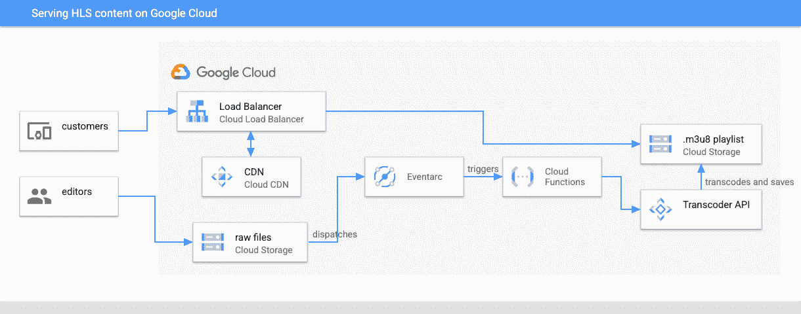
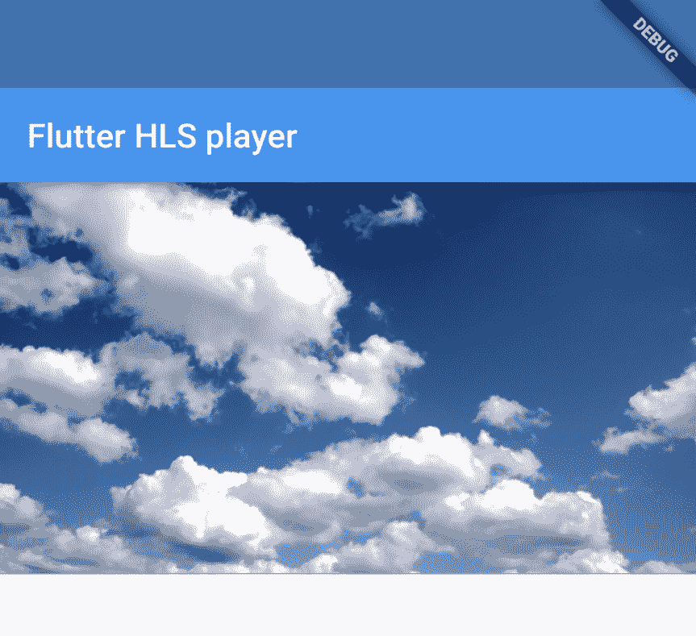

# 使用 Google Cloud CDN 创建 HLS 视频内容并提供给你的应用

> 原文：<https://medium.com/google-cloud/create-and-serve-hls-video-content-to-your-app-with-google-cloud-cdn-b7a6e65bb7c1?source=collection_archive---------4----------------------->

在本教程中，我们将从原始媒体文件创建 HLS 视频流，并将它们传输到 Flutter 移动应用程序。

如今，视频内容无处不在，用户开始期望低延迟和快速加载时间。有多种协议可以让你进行自适应流式传输，但毫无疑问，最受欢迎的协议之一是 [**HTTP** **实时流式传输**](https://en.wikipedia.org/wiki/HTTP_Live_Streaminghttps://en.wikipedia.org/wiki/HTTP_Live_Streaming) (HLS)。

我们将利用不同的谷歌云产品，如**云存储**、**云 CDN** 和**代码转换器 API** 来完全自动化这一过程。

本指南中的所有步骤都可以在 GitHub repo 之后的[中作为 **Terraform 脚本**获得，可以快速部署到您的 Google Cloud 帐户中。](https://github.com/dariobanfi/hls-streaming-gcp)

这是我们将要构建的内容的高级概述:



解决方案架构

视频编辑将原始文件上传到云存储桶，这将通过云功能自动触发代码转换器 API。由此产生的 **.m3u8 播放列表**将可通过移动应用进行流式传输。

我们这里准备用云 CDN，因为我们打算流式传输短视频文件。如果你打算做大规模的 VOD 流媒体，你应该去看看 [Media CDN](https://cloud.google.com/media-cdn) 。这里有一个[对两个](https://cloud.google.com/media-cdn/docs/choose-cdn-product)的区别的概述。

# 设置代码转换管道

第一步是构建代码转换管道。我们希望自动化该过程，以便每次视频上传到云存储时，转码将自动开始，并负责生成. m3u8 播放列表。

为此，我们将使用谷歌的[代码转换器 API](https://cloud.google.com/transcoder/docs) ，它使你能够对视频文件进行[多种操作](https://cloud.google.com/transcoder/docs/concepts/overview)，如代码转换、裁剪、生成缩略图等等。

**启用 API**

第一步是启用我们将用于此解决方案的所有必要的 API

```
gcloud services enable \
transcoder.googleapis.com \
cloudfunctions.googleapis.com \
cloudbuild.googleapis.com \
pubsub.googleapis.com \
logging.googleapis.com \
eventarc.googleapis.com \
artifactregistry.googleapis.com \
run.googleapis.com \
compute.googleapis.com \
--quiet
```

让我们也将项目 id 设置为一个变量:

```
export PROJECT_ID=hls-streaming-gcp
```

**创建云存储桶**

接下来，我们要创建云存储空间，我们将在其中上传原始视频内容:

```
gsutil mb -b on -l europe-west1 gs://hls-streaming-gcp-raw-files-${PROJECT_ID}/
```

我们还将为已处理的视频流创建我们的存储桶:

```
gsutil mb -b on -l europe-west1 gs://hls-streaming-gcp-processed-files-${PROJECT_ID}/
```

同时，让我们也将处理过的桶公开:

```
gsutil iam ch allUsers:objectViewer gs://hls-streaming-gcp-processed-files-${PROJECT_ID}/
```

**创建和配置服务帐户**

我们现在将为云功能配置服务帐户。调用代码转换器 API 需要代码转换器管理员权限，创建输出存储桶需要存储管理员权限。

```
gcloud iam service-accounts create transcoder-service-account \
 --display-name="Transcoder service account"
```

并给它必要的权限:

```
gcloud projects add-iam-policy-binding ${PROJECT_ID} --member="serviceAccount:transcoder-service-account@${PROJECT_ID}.iam.gserviceaccount.com" --role="roles/run.invoker"
gcloud projects add-iam-policy-binding ${PROJECT_ID} --member="serviceAccount:transcoder-service-account@${PROJECT_ID}.iam.gserviceaccount.com" --role="roles/transcoder.admin"
gcloud projects add-iam-policy-binding ${PROJECT_ID} --member="serviceAccount:transcoder-service-account@${PROJECT_ID}.iam.gserviceaccount.com" --role="roles/storage.admin"
gcloud projects add-iam-policy-binding ${PROJECT_ID} --member="serviceAccount:transcoder-service-account@${PROJECT_ID}.iam.gserviceaccount.com" --role="roles/eventarc.eventReceiver"
```

接下来，我们还需要将发布/订阅发布者授予云存储服务帐户，以便它可以通知 Eventarc

```
GCS_SERVICE_ACCOUNT="$(gsutil kms serviceaccount -p ${PROJECT_ID})"
gcloud projects add-iam-policy-binding $PROJECT_ID \
 --member="serviceAccount:${GCS_SERVICE_ACCOUNT}" \
 --role="roles/pubsub.publisher"
```

**创建一个云函数，每当有视频上传时，它就启动代码转换 API**

现在，让我们创建一个启动代码转换过程的云函数。

[云函数](https://cloud.google.com/functions)非常适合粘合代码和事件驱动的用例，就像这个例子。

您可以在 [git repo](https://github.com/dariobanfi/hls-streaming-gcp/tree/main/transcoding_function) 中找到源代码。

或者你可以自己创建，因为它很短。

```
mkdir transcoding_function

echo 'import functions_framework
import os
from google.cloud.video import transcoder_v1
from google.cloud.video.transcoder_v1.services.transcoder_service import (
  TranscoderServiceClient,
)
@functions_framework.cloud_event
def handle_gcs_event(cloud_event):
  data = cloud_event.data
  bucket = data["bucket"]
  name = data["name"]
  project_id = os.environ.get("PROJECT_ID")
  region = os.environ.get("REGION")
  input_uri = f"gs://{bucket}/{name}"
  output_uri = f"gs://hls-streaming-gcp-processed-files-{project_id}/{name}/"
  preset = "preset/web-hd"
  client = TranscoderServiceClient()
  parent = f"projects/{project_id}/locations/{region}"
  job = transcoder_v1.types.Job()
  job.input_uri = input_uri
  job.output_uri = output_uri
  job.template_id = preset
  response = client.create_job(parent=parent, job=job)
  print(response)
' > transcoding_function/main.py

echo "google-cloud-video-transcoder==1.4.0" > transcoding_function/requirements.txt
```

现在我们可以开始部署了！确保使用之前创建的服务帐户:

```
gcloud functions deploy transcoding-function \
 --gen2 \
 --region=europe-west1 \
 --runtime=python310 \
 --source=./transcoding_function \
 --entry-point=handle_gcs_event \
 --set-env-vars PROJECT_ID=${PROJECT_ID},REGION=europe-west1 \
 --trigger-bucket=hls-streaming-gcp-raw-files-${PROJECT_ID} \
 --service-account=transcoder-service-account@${PROJECT_ID}.iam.gserviceaccount.com
```

# **测试设置**

太好了，现在一切就绪，我们可以测试我们的设置了。

让我们上传一个原始视频文件到桶中进行检查。你可以使用任何视频文件。刚刚上传到桶中:

```
gsutil cp sample.mov gs://hls-streaming-gcp-raw-files-${PROJECT_ID}
```

过了一会儿，我们应该能够在**HLS-streaming-GCP-processed-files**桶中看到我们处理过的文件。

您可以随时通过以下方式监控作业进度:

```
gcloud transcoder jobs list - location europe-west1
```

和

```
gcloud transcoder jobs describe job_id
```

# 配置负载平衡器和 CDN

现在我们已经生成了 m3u8 播放列表并保存在云存储中，我们希望向用户公开它。为此，我们将设置一个负载平衡器地址，并使用 Google CDN 来缓存内容，并尽可能靠近我们的用户提供服务。

让我们首先为我们的负载平衡器保留一个外部地址

```
gcloud compute addresses create load-balancer-ip \
 --ip-version=IPV4 \
 --global
```

让我们写下我们刚刚创建的地址:

```
export LB_IP_ADDRESS=$(gcloud compute addresses describe load-balancer-ip --format="get(address)" --global)
```

接下来，我们想要创建一个负载平衡器存储桶，它将成为我们的负载平衡器的目标:

```
gcloud compute backend-buckets create hls-streaming-bucket \
 --gcs-bucket-name=hls-streaming-gcp-processed-files-${PROJECT_ID} \
 --enable-cdn \
 --cache-mode=CACHE_ALL_STATIC \
 --default-ttl=2419200 \
 --max-ttl=2419200
```

我们使用 *CACHE_ALL_STATIC* 来缓存所有[静态内容](https://cloud.google.com/cdn/docs/caching#static)

我们将默认 TTL 更改为，将最大 TTL 更改为 2.419.200 秒(28 天),因为我们不希望内容发生变化，并且我们希望最大化缓存命中率，以降低出口成本。

现在让我们配置 URL 映射和目标代理:

```
gcloud compute url-maps create hls-streaming-load-balancer \
 --default-backend-bucket=hls-streaming-bucket
gcloud compute target-http-proxies create hls-streaming-load-balancer-proxy \
 --url-map=hls-streaming-load-balancer
```

使用以下内容配置转发规则:

```
gcloud compute forwarding-rules create hls-streaming-load-balancer-forwarding-rule \
 --load-balancing-scheme=EXTERNAL_MANAGED \
 --network-tier=PREMIUM \
 --address=load-balancer-ip \
 --global \
 --target-http-proxy=hls-streaming-load-balancer-proxy \
 --ports=80
```

让我们给负载平衡器大约 5 分钟的时间来传播转发规则。

之后，我们将能够使用以下工具对其进行测试:

```
curl http://${LB_IP_ADDRESS}/sample.mov/manifest.m3u8
```

## 太棒了，我们的端点已经准备好传输到我们的应用程序了！

# 流向移动应用

为什么停在这里？让我们部署一个简单的 Flutter 应用程序并进行测试。

你可以在 [GitHub](https://github.com/dariobanfi/hls-streaming-gcp/tree/main/flutter_app) 上找到一个示例视频播放器应用程序。

对于这一部分，我们假设你已经有一个 flutter 开发环境设置，如果没有，你可以遵循[这个指南](https://docs.flutter.dev/get-started/install)。

让我们克隆存储库并运行我们的应用程序。

```
git clone https://github.com/dariobanfi/hls-streaming-gcp/tree/main/flutter_app
cd hls-streaming-gcp-demo/flutter_app
flutter run
```

现在打开 flutter_app/lib/main.dart 文件，在 videoSource 变量中添加 m3u8 播放列表的端点。

而这就是结果，一个带 HLS 直播的视频播放器！🎉

