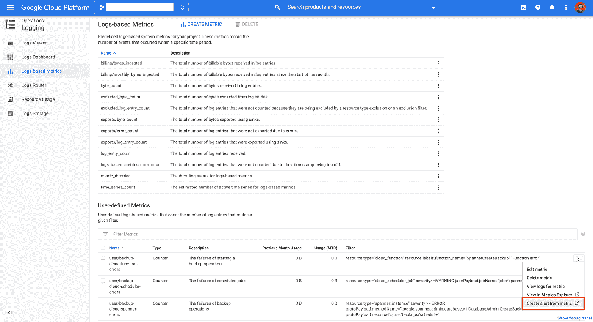

# 创建云扳手计划备份

> 原文：<https://medium.com/google-cloud/create-cloud-spanner-scheduled-backups-c6f30551a6fd?source=collection_archive---------0----------------------->

本教程展示了如何使用[计划备份](https://github.com/cloudspannerecosystem/scheduled-backups)工具来配置云调度程序，以便定期创建云扳手备份，例如每天或每周。

我们将使用以下 GCP 服务:

*   云调度器:使用基于 cron 的调度来触发任务。
*   云发布/订阅:从云调度器到云功能的消息队列。
*   云功能:开始创建云扳手备份的操作。
*   云日志记录:创建基于日志的指标。
*   云监控:根据基于日志的指标的条件创建警报。

该架构如下所示:


我们需要执行以下步骤:

*   创建发布/订阅主题
*   将功能部署到云功能
*   使用云调度程序部署计划的作业
*   设置失败的电子邮件通知

# 先决条件

在继续本教程之前，我们需要确保

*   Cloud Spanner 中存在一个数据库(可以尝试这个 [sampledb](https://github.com/cloudspannerecosystem/sampledb) 创建一个样本数据库)，并且
*   [谷歌 SDK](https://cloud.google.com/sdk/install) 安装完毕。

# 创建发布/订阅主题

我们创建了一个发布/订阅主题**云扳手计划备份**:

```
$ gcloud pubsub topics create cloud-spanner-scheduled-backups
```

然后，进入发布/订阅界面，您可以看到新创建的主题:


# 将功能部署到云功能

我们在[备份中有一个函数 **SpannerCreateBackup** 。每当有发布/订阅消息传入时，就会调用 **SpannerCreateBackup** 函数。发布/订阅消息包含数据库名称、备份 ID 和到期持续时间(至少 6 小时)。解析消息后，它在 Cloud Spanner 中启动 CreateBackup 操作。](https://github.com/cloudspannerecosystem/scheduled-backups/blob/master/backups.go)

我们可以通过运行以下命令来部署该功能:

```
$ gcloud functions deploy SpannerCreateBackup — trigger-topic cloud-spanner-scheduled-backups — runtime go113
```

转到云函数 UI 查找函数。该函数订阅发布/订阅主题**云扳手计划备份**。


现在，您可以通过 **gcloud** 测试它:

```
$ DATA=$(printf ‘{“database”:”projects/[PROJECT_ID]/instances/[INSTANCE_ID]/databases/[DATABASE_ID]”, “expire”: “6h”}’|base64|tr -d ‘\n’) && gcloud functions call SpannerCreateBackup — data ‘{“data”:”’$DATA’”}’
```

这将直接触发导致创建备份的功能的执行。

# 使用云调度程序部署计划的作业

注意:要使用云调度程序，我们必须[创建一个 App Engine app](https://cloud.google.com/scheduler/docs#supported_regions) 。

在[定时备份](https://github.com/cloudspannerecosystem/scheduled-backups)下有一个定时模板文件 **schedule-template.yaml** 。我们需要制作一个副本，并将其重命名为 **schedule.config.yaml** 。然后，我们可以用我们的配置替换项目标识、实例标识和数据库标识:

```
name: **PROJECT_ID**
  instances:
  — name: **INSTANCE_ID**
    databases:
      — name: **DATABASE_ID**
        schedule: **0 * * * *** # run hourly
        expire: 6h # the backup will expire after 6 hours
        time_zone: Australia/Sydney # optional. “utc” is the default value.
```

此外，该配置文件可用于调整时间表。在任何时候都可以更新字段，如 schedule、expire 和 time zone，然后将作业重新部署到 Cloud Scheduler。crontab guru 是一个方便的网站，可以生成 Cron 日程表。

更新配置后，我们可以将其部署到云调度程序:

```
$ go run cmd/scheduler/main.go -config schedule.config.yaml
```

然后，我们可以在云调度器 UI 中找到该作业:


# 设置失败的电子邮件通知

要获得电子邮件通知，我们需要执行三个步骤:

*   设置电子邮件通知渠道
*   添加基于日志的指标
*   创建警报策略

首先，我们可以按照这个[指南](https://cloud.google.com/monitoring/support/notification-options#email)来添加我们的电子邮件地址，作为云监控中的通知渠道。这需要在我们可以在警报策略中使用它们之前完成。


接下来，我们可以通过使用[部署管理器](https://cloud.google.com/deployment-manager/docs)在云日志中添加基于日志的指标。这些自定义指标基于云函数、云调度程序和云扳手生成的过滤日志。我们可以在 [metrics.yaml](https://github.com/cloudspannerecosystem/scheduled-backups/blob/master/metrics.yaml) 中找到自定义指标的定义。

我们可以运行以下命令来创建自定义指标:

```
$ gcloud deployment-manager deployments create schedule-backup-metrics-deployment — config metrics.yaml
```

最后，我们需要创建定义何时触发警报的警报策略。最简单的方法是转到云日志下的**基于日志的指标**，对于每个用户定义的指标，都有一个选项“**根据指标**创建警报”。



在这里，我们可以选择 **sum** 作为目标度量的**聚合器**，并选择条件中的选项**最近值**，当任何时间序列违反该值大于 0 时，将触发警报。


定义条件后，我们将被带到一个站点来定义警报策略。我们需要为这个警报策略命名，并设置通知通道。每当条件中断并创建警报时，我们都会收到电子邮件通知。


# 摘要

[定时备份](https://github.com/cloudspannerecosystem/scheduled-backups)向您展示如何使用云调度程序和云功能来配置创建云扳手备份的时间表。此外，它还演示了如何创建基于日志的指标和警报策略。它们用于在预定义的条件被打破时发送警报，以便我们可以获得及时的通知。整个项目提供了一个解决方案，用于按照定义的时间表创建云扳手备份。