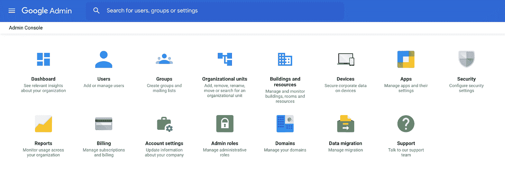

# 通过 Terraform 创建谷歌群组

> 原文：<https://medium.com/google-cloud/create-google-groups-via-terraform-de99524f92e0?source=collection_archive---------0----------------------->


" Becris 从 www.flaticon.com 制作的图标"

如果你想通过 Terraform 创建谷歌群，请继续阅读！

# **什么是谷歌集团？**

Google Group 是 Google 用户帐户和服务帐户的命名集合。每个谷歌群组都有一个与该群组相关联的唯一电子邮件地址。Google Groups 基本上是一组 Google 帐户，出于管理目的，需要将它们组合在一起。

# 为什么使用谷歌群组？

作为最佳实践，建议使用 Google Groups 来组织您的 GCP 组织中的用户和服务帐户，这种方式可以将访问权限授予一组用户和服务帐户，而不是单独授予每个用户/服务帐户，从而降低访问管理的复杂性，并遵循最低权限原则**。**

# **创建 Google 群组的两种方法**

## ****1。基于团队结构的分组****

**基于团队结构创建小组。团队结构是相对静态的，同一团队的成员通常有相同的数据访问需求。向组中添加新的团队成员将立即为该成员提供所需的所有必要的数据访问。当团队成员离开团队时，很容易将此人从团队中移除，这将取消此人对所有相关数据的访问权。**

## **2.基于项目倡议的分组**

**基于临时项目计划创建小组。这是一种更加动态的分组策略，对于一组人需要在有限的时间内访问一些数据的情况，这种策略尤其有用。在项目开始时，为参与计划的人创建一个小组。项目完成后，解散该组以撤销所有成员的访问权限，从而避免任何潜在的泄漏访问问题。**

# **如何通过 Terraform 创建谷歌群？**

## ****第一步:创建一个有权限的服务账户****

**服务帐户应具有以下 Google Cloud IAM 角色:**

*   **服务使用消费者:`roles/serviceusage.serviceUsageConsumer`在计费项目上**
*   **组织查看器:`roles/resourcemanager.organizationViewer`如果使用域名而不是`customer_id`**

## ****步骤 2:将组管理员角色分配给服务帐户****

**Google Groups 是一种组织级别的资源，服务帐户需要成为 **Google Groups Admin** 才能创建 Google Groups 并管理用户/服务帐户在该组中的添加和删除。**

**要使服务帐户成为组管理员，您必须拥有您的域的 Google Workspace(以前称为 G Suite)超级管理员访问权限。如果您不是 Google Workspace 管理员，您将需要一个 Google Workspace 管理员来为步骤 1 中创建的服务帐户分配 [**Google Groups 管理员角色**](https://support.google.com/a/answer/2405986?hl=en) 。**

**使用以下步骤将服务帐户转换为 Google Groups 管理员角色:**

**在浏览器中，访问 https://admin.google.com/[并使用您的凭证登录。你应该看到下面的屏幕，点击“管理员角色”。](https://admin.google.com/)**

****

****谷歌管理控制台****

**你将看到下面的屏幕，点击“组管理”。**

****

****管理角色****

**然后，您将看到组管理页面。在“管理员”选项卡下，您可以看到“分配用户”和“分配服务帐户”。单击“分配服务帐户”。**

****

****群组管理页面****

**您将看到下面的屏幕，在这里您需要添加服务帐户。输入在步骤 1 中创建的服务帐户电子邮件地址。**

****

****将服务帐户添加为组管理员****

**点击“添加”。**

**最后，点击“分配角色”。**

**您应该能够在组管理页面中看到服务帐户。**

****

****群组管理页面****

## ****步骤 3:使用服务帐户进行身份验证****

**您将需要 [gcloud SDK](https://cloud.google.com/sdk/docs/downloads-interactive) 来运行下面提到的 gcloud 命令。此外，请记住这是出于测试/开发目的，您应该按照组织中的设置来执行身份验证步骤。**

****步骤 3.1** [为服务账户创建 JSON 密钥:](https://cloud.google.com/sdk/gcloud/reference/iam/service-accounts/keys/create)**

**以下命令将为您的服务帐户创建一个 JSON 密钥，该密钥需要用于身份验证，**

```
gcloud iam service-accounts keys create key.json --iam-account=my-iam-account@my-project.iam.gserviceaccount.com
```

****步骤 3.2** [使用创建的 JSON 密钥认证服务帐户:](https://cloud.google.com/sdk/gcloud/reference/auth/activate-service-account)**

**使用上面创建的 JSON 密钥通过以下方式进行身份验证，**

```
gcloud auth activate-service-account my-iam-account@my-project.iam.gserviceaccount.com --key-file=key.json
```

## ****第四步:为 Google Groups 编写 Terraform 配置****

**以下 Terraform 配置基于此处维护的[terra form Google Group 模块。](https://github.com/terraform-google-modules/terraform-google-group)**

**下面是一个 main.tf 示例:**

```
main.tf -->provider "google-beta" {
  billing_project       = var.project_id
  user_project_override = true
}module "group" {
  source  = "terraform-google-modules/group/google"
  version = "~> 0.1"

  id           = var.group_id
  display_name = var.name
  description  = "Test Google Group via Terraform"
  domain       = "domain.com"
  owners       = var.owners
  managers     = var.managers
  members      = var.members
}
```

**以下是用于提供输入的示例 variables.tf:**

```
variables.tf -->variable "project_id" {
  type        = string
  default     = "my-project"
  description = "Project ID for billing"
}variable "group_id" {
  type        = string
  default     = "group-id.groups@domain.com"
  description = "Group ID of the Group"
}variable "name" {
  type        = string
  default     = "google-group-name"
  description = "Name of the Group"
}variable "owners" {
  type        = list(string)
  default     = ["admin@domain.com"]
  description = "Owner of the Group"
}variable "managers" {
  type        = list(string)
  default     = ["manager@domain.com"]
  description = "Manager of the Group"
}variable "members" {
  type        = list(string)
  default     = ["member-one@domain.com", "member-two@domain.com"]
  description = "Members of the Group"
}
```

**您需要根据您的要求定制 Terraform 配置。对 Terraform 配置满意后，运行以下命令，通过 Terraform 创建您的第一个 Google Group:**

```
terraform init
terraform plan
terraform apply
```

**一旦`terraform apply`成功完成，您的 Google 群组就创建好了！**

**可以在 https://groups.google.com 查看和管理谷歌群组。如果需要，组管理员、经理和成员可以管理和验证通过 UI 创建的组。**

****

**Google 群组视图**

**希望这篇文章能帮助你通过 Terraform 为你的组织自动创建谷歌群！**