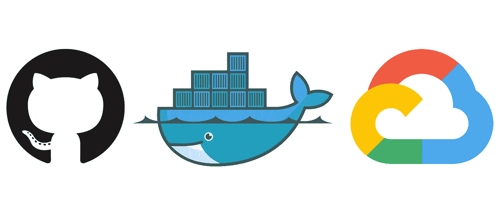
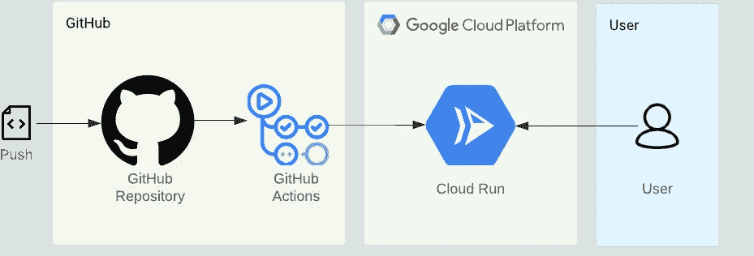
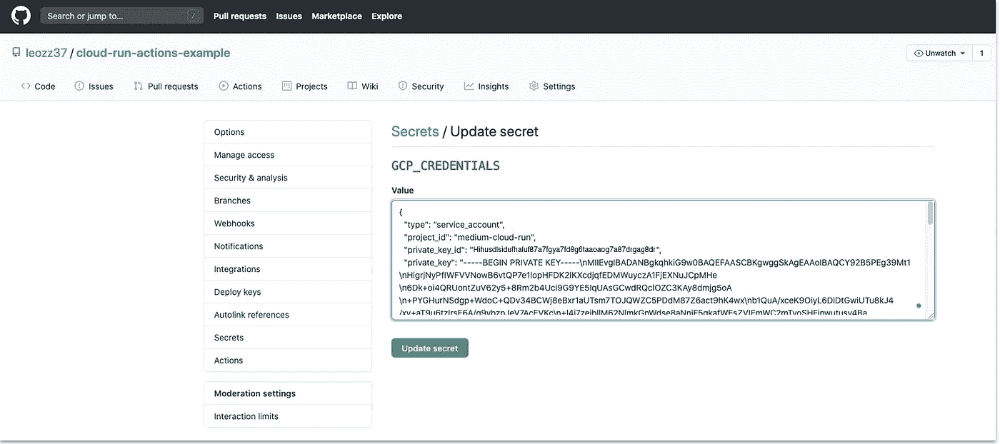
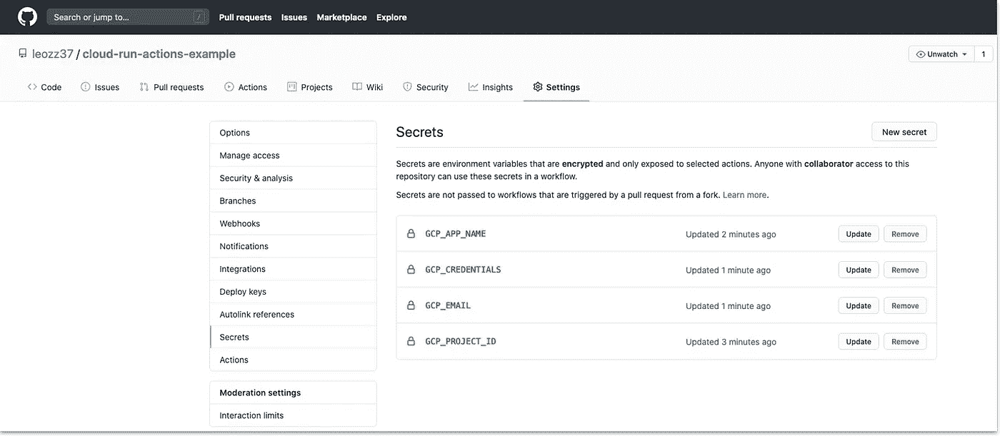
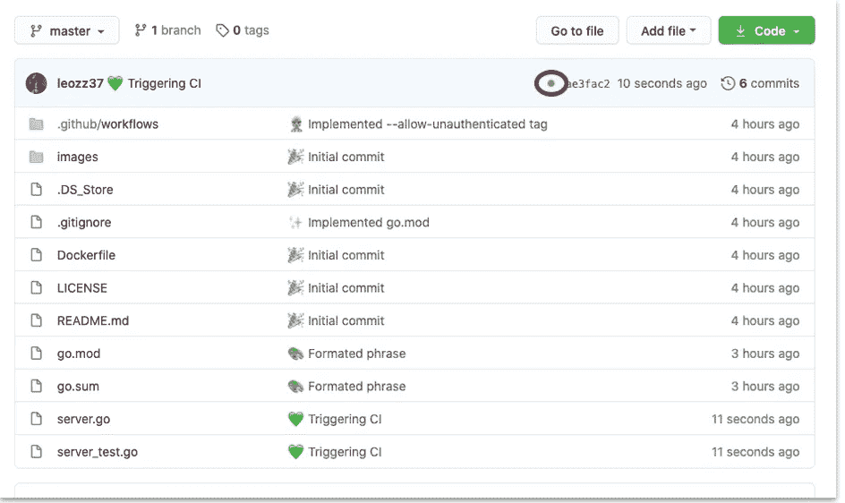
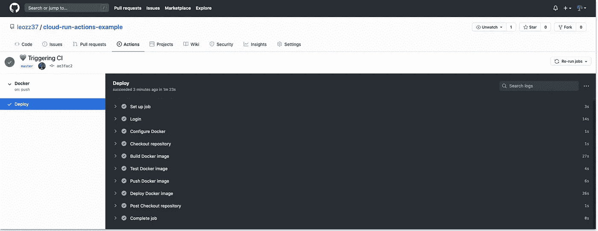
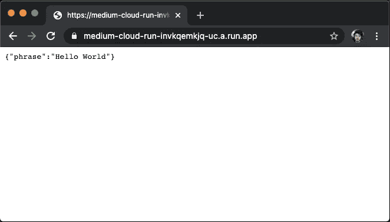

# 在 Google Cloud 上为无服务器容器创建 CI/CD 环境

> 原文：<https://medium.com/google-cloud/creating-a-ci-cd-environment-for-serverless-containers-on-google-cloud-run-with-github-actions-7492ca3993a0?source=collection_archive---------0----------------------->

## 使用 GitHub 动作在 Google Cloud Run 上测试和部署 Docker 容器



在本文中，我们将使用 Docker 和 Google Cloud Run 逐步建立一个自动化构建、测试和部署的环境。

我将假设你已经对 CI/CD 有了一些了解，并且你正在寻找在你的项目中实现它的想法。我们将创建一个简单的 REST API，将其放在一个容器中，并编写一个 GitHub Actions 脚本来部署在 Google Cloud Run 上。

既然我们在谈论 Docker，你使用的语言并不重要，但在本教程中，我将使用 Golang。此外，我不会深入解释示例代码及其 docker 文件，因为这对于任何技术都是相同的。

这是我们基础设施的样子:



每次我们推送到我们的 GitHub 库，它都会触发一个 GitHub Actions 工作流，这将构建和测试我们的代码。如果构建成功并且每个测试都通过，我们的容器将被部署到 Cloud Run，让每个人都可以访问它。

我用这里使用的所有代码创建了一个资源库，请务必查看(并在 GitHub 上关注我！).

[](https://github.com/leozz37/cloud-run-actions-example) [## leozz 37/云-运行-操作-示例

### 这个存储库是对我的中型文章的补充。如果你想一步一步来，检查我的写作。这是如何…

github.com](https://github.com/leozz37/cloud-run-actions-example) 

这是我们的工作树的样子:

```
|_.github/
  |_workflows/
    |_GCP-Deploy.yml
|_Dockerfile
|_go.mod
|_server_test.go
|_server.go
```

让我们把手弄脏吧！

## 戈朗

让我们编写一个简单的 Golang 代码并测试它。因为我们的应用程序做什么并不重要(对于本教程来说)，所以让我们用一个简单的例子来返回一个带有“Hello World”的 JSON。

Google Cloud Run，建议我们从环境变量$PORT 中获取端口。

以及对 Hello World 函数的单元测试，验证该函数是否返回“Hello World”字符串。

Golang 需要一个模块文件，告诉所有的代码依赖关系。创建一个 GitHub 存储库(但不要推送您的代码)，复制它的 URL 并运行以下命令:

```
$ go mod init $"YOUR_GITHUB_URL"
```

> 应该是这样的:
> 
> `$ go mod init github.com/leozz37/cicd-actions-cloud-run`

## 码头工人

让我们为我们的代码写一个 docker 文件。

我使用了多级 docker 来缩小我们的图像。

Cloud Run 为端口设置了一个环境变量，他们建议你从环境中获取那个端口。但是如果需要的话可以设置自定义端口。

## 谷歌云运行

Google Cloud Run 是一个完全托管的计算平台，用于快速部署和扩展容器化的应用程序。

要使用谷歌云平台，你需要一张有效的信用卡。你有三个月的免费试用期，任何服务都需要 30 万美元，但要使用它，你需要一个付费账户。

我们可以用多种方式设置 GCP，但在本教程中，我将使用 CLI。请随意使用 web 控制台。您可以在此下载 CLI:

[](https://cloud.google.com/sdk/docs/install) [## 安装 Google Cloud SDK | Cloud SDK 文档

### 发送反馈此页面包含选择和维护云 SDK 安装的说明。如果你落后了…

cloud.google.com](https://cloud.google.com/sdk/docs/install) 

为了使您的生活更容易，导出这些环境变量，以便您可以复制和粘贴这里使用的命令。选择您想要的任何名称，但是$PROJECT_ID 必须是唯一的名称。

```
export PROJECT_ID=
export ACCOUNT_NAME=
```

> 应该是这样的:
> 
> `*$ export PROJECT_ID=project-example*`
> 
> `*$ export ACCOUNT_NAME=account-example*`

现在使用您的 Google 帐户登录，创建一个项目，并选择该项目:

```
$ gcloud auth login$ gcloud projects create $PROJECT_ID$ gcloud config set project $PROJECT_ID
```

为您的项目启用计费(如果您没有计费配置文件，请创建一个)，并启用我们将使用的服务:

```
$ open "https://console.cloud.google.com/billing/linkedaccount?project=$PROJECT_ID"$ gcloud services enable cloudbuild.googleapis.com run.googleapis.com containerregistry.googleapis.com
```

我们需要创建一个服务帐户，并为其提供云运行管理员、存储管理员和服务帐户用户角色(我们无法一次提供所有角色，因此您必须单独运行该命令三次)。

```
$ gcloud iam service-accounts create $ACCOUNT_NAME \
    --description="Cloud Run deploy account" \
    --display-name="Cloud-Run-Deploy"$ gcloud projects add-iam-policy-binding $PROJECT_ID \
--member=serviceAccount:$ACCOUNT_NAME@$PROJECT_ID.iam.gserviceaccount.com \
    --role=roles/run.admin$ gcloud projects add-iam-policy-binding $PROJECT_ID \
--member=serviceAccount:$ACCOUNT_NAME@$PROJECT_ID.iam.gserviceaccount.com \
    --role=roles/*storage*.*admin*$gcloud projects add-iam-policy-binding $PROJECT_ID --member=serviceAccount:$ACCOUNT_NAME@$PROJECT_ID.iam.gserviceaccount.com \
    --role=roles/iam.serviceAccountUser
```

我们还需要用我们的凭证生成一个 JSON 文件，这样我们的 GitHub 工作流就可以认证进入 GCP。

```
$ gcloud iam service-accounts keys create key.json \
    --iam-account $ACCOUNT_NAME[@](mailto:example-account@example-cicd.iam.gserviceaccount.com)$PROJECT_ID[.iam.gserviceaccount.com](mailto:example-account@example-cicd.iam.gserviceaccount.com)
```

它将使用您的凭据创建一个 key.json 文件，稍后我们将使用它的内容对 GCP 进行 GitHub 身份验证。

## 开源代码库

在 GitHub 上，我们需要在我们的存储库中设置一些秘密环境。它们是:

*   GCP 项目标识=这是你的$项目标识
*   GCP 应用名称=为你的应用选择一个名称
*   GCP 电子邮件=这是来自我们创建的服务帐户的电子邮件，如下所示:＄ACCOUNT _ NAME @＄PROJECT _ id . iam . gserviceaccount . com
*   GPC_CREDENTIALS =这是我们刚刚创建的 JSON(key . JSON)的内容

> 应该是这样的:
> 
> `GCP_PROJECT_ID = *project-example*`
> 
> `*GCP_APP_NAME = app-name*`
> 
> `*GCP_EMAIL = account-name@project-example.iam.gserviceaccount.com*`

将 key.json 内容复制并粘贴到 GCP _ 凭据秘密上。



你的秘密应该是这样的:



现在我们只需要创建一个 yml 文件，告诉我们的工作流应该运行哪些命令。在您的项目目录中，创建一个名为。github”并在其中创建另一个名为“workflows”的应用程序。

创建一个“GCP-部署. yml”文件，并将以下内容复制到其中:

你的工作树应该是这样的:

```
|_.github/
  |_workflows/
    |_GCP-Deploy.yml
```

如果您的应用程序需要特定的端口，请在“部署 Docker 映像”步骤中传递`--port`参数。

现在提交你所有的修改并推送到 GitHub，然后进入你的库主页。当您的构建运行时，您应该会在文件列表上看到一个黄色的球:



(您的存储库可能不是这样的)

如果你进入你的行动(点击黄色球)，你可以实时看到你正在执行的步骤:



您可以列出您的服务并获取其链接，然后在浏览器上访问它:

```
$ gcloud run services list
```



就是这样！现在你对你的项目所做的每一个改变，并把它推送到主分支，GitHub 会自动构建、测试和部署它。