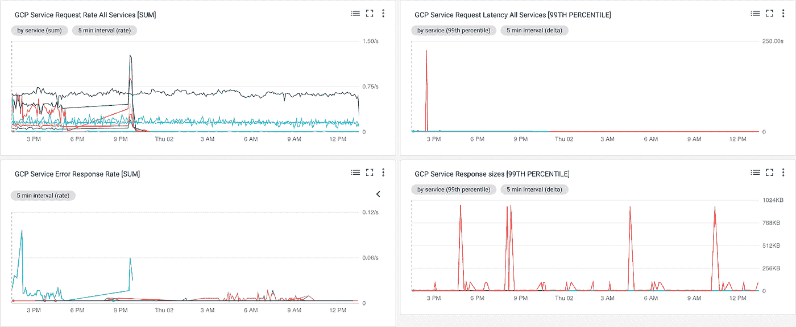

# 创建具有堆栈驱动程序 SLI 监控指标的控制面板

> 原文：<https://medium.com/google-cloud/creating-a-dashboard-with-stackdriver-sli-monitoring-metrics-eaf6d19386de?source=collection_archive---------1----------------------->

如果您真的想知道您的服务有多可靠，您必须能够测量成功和不成功请求的比率。一个[服务级别指标](https://cloudplatform.googleblog.com/2018/07/sre-fundamentals-slis-slas-and-slos.html) (SLI)是一个服务行为的直接度量，可以在设置服务级别目标时使用(SLO)。

当你在像谷歌云平台这样的云基础设施上构建你的应用时，你希望构建的应用能让运营(DevOps 或 SRE)团队能够有效地监控你的应用。[stack driver Transparent SLIs](https://cloud.google.com/transparent-sli/)提供超过 130 个谷歌云服务的详细指标，并报告您的个人项目体验到的这些指标。这些 SLI 指标可用于 Stackdriver 监控仪表板，以及您的应用程序的其他相关指标，以帮助加快您的运营团队及其根本原因分析。

使用 Stackdriver 透明 SLI 度量，可以评估每个服务的以下度量:

*   服务名称
*   方法
*   API 版本
*   凭据 ID
*   位置
*   协议(HTTP / gRPC)
*   HTTP 响应代码(例如 402)
*   HTTP 响应代码类别(例如 4xx)
*   gRPC 状态代码

这些是为您的特定项目报告的细粒度指标，让您详细了解您的应用程序对 Google 云服务的使用情况。

那么，这对你的可观察性有什么帮助呢？简单地说，Stackdriver 透明 SLIs 让你能够查看你的软件和 Google 云服务之间的交互。您可以更容易地确定您的应用程序代码是否是问题的根本原因，或者 Google 云服务是否是根本原因的一部分。

我最近为一个应用程序构建了一个仪表板，其中包括使用 Stackdriver SLIs 的指标。该应用程序包括云功能逻辑、通过发布/订阅的通信、对云视觉和视频智能 API 的调用以及 BigQuery 数据集。我研究了 Stackdriver SLI 指标，然后使用它们创建了一个使用 Stackdriver Monitoring 的监控仪表板。以下是我用来评估要使用哪些指标，然后为我的应用程序创建仪表板的步骤。

# 第一步。部署应用程序。

我部署了这个[应用](https://cloud.google.com/solutions/processing-user-generated-content-using-video-intelligence)，它包括一系列 4 个云函数，分别为图像和视频调用视觉和视频智能 API。

该应用程序是一个后端处理图像和视频文件，将它们分类为显式或非显式。使用云存储通知和云发布/订阅来协调这些功能。视觉和视频智能 API 的结果存储在 BigQuery 中以供分析。

# 第二步。选择仪表板的指标。

网站可靠性工程(SRE)这本书(你可以在网上免费阅读)深入讨论了 SRE 的实践。本书第 6 节介绍了[监控分布式系统](https://landing.google.com/sre/book/chapters/monitoring-distributed-systems.html)，并对 4 个黄金监控信号描述如下:

1.  潜伏
2.  交通
3.  错误
4.  浸透

Stackdriver SLI 度量提供了 GCP 服务调用的请求延迟、请求计数、请求大小和响应大小。这些 SLI 指标涵盖了 SRE 书中描述的延迟、流量、错误和饱和度指标。这为我的应用程序使用的谷歌云服务提供了很好的覆盖。

除了 Stackdriver SLI 指标之外，我还想监控应用程序组件的特定于服务的指标，如发布/订阅、云存储、BigQuery 和云功能。结合 Stackdriver SLI 指标，这些指标提供了对应用行为的深刻见解。

# 第三步。探索应用服务的衡量标准。

我使用了 [Stackdriver Monitoring UI](https://app.google.stackdriver.com/metrics-explorer) 中的 Stackdriver Metrics Explorer 服务来检查每个 Stackdriver SLI 指标的可用指标细节。

首先，我通过输入资源类型“Consumed_api”并选择指标“请求延迟”来查看请求延迟指标。我按服务对指标进行了分组，以显示各个延迟，然后选择了“第 99 个百分点”的集合。

我还按方法对服务进行了分组，以查看各个服务调用方法及其延迟。这是一个有用的衡量标准，可以用来考察诸如*cloudfunctions.googleapis.com*这样的整体服务是否有高延迟。通过按方法分类，我可以看到每个特定方法的延迟，比如*Google . cloud . functions . v1 . cloudfunctionservice . update function*。

接下来，我研究了请求计数指标。我选择了资源类型“Consumed_api ”,并选择了指标“请求计数”。我按“服务”对指标进行分组，以显示单个计数，然后选择“总和”的聚合。这提供了各种服务收到的请求的比率，并且与我想要监控的应用程序的流量指标非常一致。

为了获得错误度量，我使用了相同的资源类型“Consumed_api”和度量“Request count ”,但是这次我添加了一个过滤器“response_code！= 200”来查看返回错误状态代码的流量。

为了查看 GRPC 错误，我使用了相同的图表，但是替换为“grpc_status_code！=0”，然后按“grpc_status_code”分组。这两者对于检查从 GCP 服务调用返回的错误都很有用。

这次探索让我对 SLI 指标有了更深入的了解，我会将这些信息包含在我的仪表板中。我还对我的项目中包含的资源类型进行了类似的探索，包括以下资源:

*   云 _ 函数
*   发布订阅 _ 主题
*   gcs_bucket
*   大查询 _ 数据集

# 第四步。构建仪表板。

既然我已经研究了这些指标，我对将包含在仪表板图表中的指标有了很好的认识。然后，我通过选择“Dashboard => Create dashboard”在 Stackdriver Monitoring UI 中启动了一个新的仪表板。我点击“添加图表”按钮来添加每个图表。

**请求速率**

我添加的第一个图表是 SLI 监控请求计数。这个图表的目的是显示谷歌云服务的请求率。此图表可能有助于了解哪些服务产生了较高的通话费率。

*   资源类型:Consumed_api
*   度量:请求计数
*   分组依据:服务
*   汇总:总和

**请求等待时间**

这个图表的目的是显示谷歌云服务的延迟。当与您的应用程序的整体延迟相关联时，此图表可能会很有用，有助于确定 Google 云服务中的延迟是导致还是促成了您的整体应用程序延迟。

*   资源类型:Consumed_api
*   度量:请求延迟
*   分组依据:服务
*   汇总:第 99 百分位

**错误率**

我添加的下一个图表包含了使用 SLI 监视度量请求计数的错误响应率，但是过滤了错误请求。对于这个图表，我添加了两个不同的指标来涵盖 HTTP 响应代码和 GRPC 响应代码。这个图表的目的是显示谷歌云服务的错误率。这个图表可能有助于了解您的应用程序是否会因为调用 Google 云服务失败而产生错误。

HTTP 错误响应:

*   资源类型:Consumed_api
*   度量:请求计数
*   过滤器:response_code_class！=2XX
*   分组依据:服务，回应代码
*   汇总:总和

GRPC 错误响应:

*   资源类型:Consumed_api
*   度量:请求计数
*   过滤器:grpc_status_code！=0
*   分组依据:服务，grpc_status_code
*   汇总:总和

**响应大小**

我包含的最后一个 SLI 监控指标是响应大小。这个图表的目的是显示 Google 云服务的响应规模。此指标可能有助于调试应用服务中的高延迟，并确定应用的哪些部分可以优化以处理更大的结果。

*   资源类型:Consumed_api
*   度量:响应大小
*   分组依据:服务
*   汇总:第 99 百分位

这就是仪表盘上的 Stackdriver SLI 指标。我还为 Pub/Sub、云存储、云函数和 BigQuery 添加了 Stackdriver 监控指标。您可以在 [github](https://github.com/charlesbaer/sd-sli-monitoring-dashboard) 上查看这些指标的详细信息。这里是完整的仪表板供参考。

参考资料:

*   [堆栈驱动监控](https://cloud.google.com/monitoring/)
*   [堆栈驱动监控指标](https://cloud.google.com/monitoring/api/metrics)
*   [Stackdriver 透明 SLIs 博文](https://cloudplatform.googleblog.com/2018/07/transparent-slis-see-google-cloud-the-way-your-application-experiences-it.html)
*   [Stackdriver 透明 SLIs 产品页面](https://cloud.google.com/transparent-sli/)
*   [现场可靠性工程书](https://landing.google.com/sre/book/index.html)
*   [使用视频智能和云视觉 API 处理用户生成的内容](https://cloud.google.com/solutions/processing-marketing-submissions-using-video-intelligence)和[教程](https://cloud.google.com/solutions/processing-user-generated-content-using-video-intelligence)