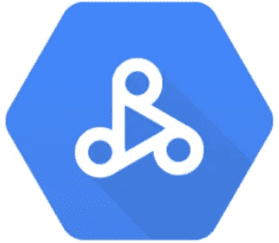
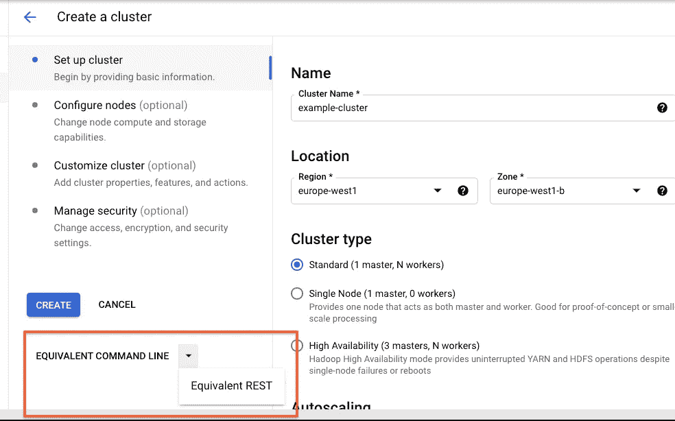
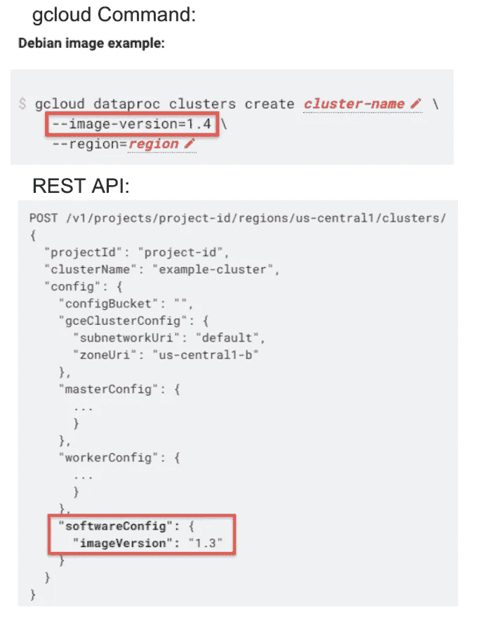

# 创建 Dataproc 集群:注意事项、陷阱和资源

> 原文：<https://medium.com/google-cloud/creating-a-dataproc-cluster-considerations-gotchas-resources-930294ddb7f3?source=collection_archive---------0----------------------->

[Google Cloud Dataproc](https://cloud.google.com/dataproc) 是一个完全托管和高度可扩展的服务，用于运行 Apache Spark、Apache Flink、Presto 和 30 多个开源工具和框架。这个强大而灵活的服务附带了[创建集群的各种方式](https://cloud.google.com/dataproc/docs/concepts/overview#getting-started-with-dataproc)。本文讨论了用户在成功创建可靠、可重复和一致的集群时应该考虑的重点领域。

在考虑之前，我想先提供一些提示。请记住，Cloud Dataproc 服务具有极大的灵活性，因此可能会遇到很多复杂性。利用迭代测试周期、丰富的文档、[快速入门](https://cloud.google.com/dataproc/docs/quickstarts)和 [GCP 免费试用](https://cloud.google.com/free/docs/gcp-free-tier/#free-trial)。我推荐尝试的几个很棒的特性是[API Explorer](https://cloud.google.com/dataproc/docs/quickstarts/quickstart-explorer-create)和 UI 功能。例如，在 GCP 控制台->data proc->CREATE CLUSTER 中，您可以配置您的集群，并且为了方便起见，能够自动生成等效的命令行或等效的 REST(无需构建集群):

这可以帮助您自动化测试周期。现在让我们来看一下我们的重点领域。

# 考虑因素:

*   建立工作关系网
*   身份和访问管理(IAM)
*   版本控制
*   成分
*   记录和监控
*   配置(安全性、群集属性、初始化操作、自动分区放置)
*   Dataproc 配额
*   Dataproc Hadoop 数据存储

[**联网**](https://cloud.google.com/dataproc/docs/concepts/configuring-clusters/network) **-**

由主虚拟机和工作虚拟机组成的 Dataproc 集群中的[计算引擎虚拟机实例](https://cloud.google.com/compute/docs/instances)，**必须能够使用 ICMP、TCP(所有端口)和 UDP(所有端口)相互通信。**用户通常会实施限制性网络策略，以符合组织要求。请务必对照此处列出的[实施要求来交叉引用您的网络实施。](https://cloud.google.com/dataproc/docs/concepts/configuring-clusters/network)

*抓到你了* -

*   [缺少防火墙规则](https://cloud.google.com/dataproc/docs/concepts/configuring-clusters/network#creating_a_vpc_network)
*   [缺少 IAM 权限或角色](https://cloud.google.com/dataproc/docs/concepts/configuring-clusters/network#creating_a_cluster_that_uses_a_vpc_network_in_another_project)
*   [缺少互联网路由](https://stackoverflow.com/questions/68509537/dataproc-provisioning-timeout-due-to-network-unreachable-to-googleapis-com)(非默认 VPC 网络)

资源

*   [网络情报中心](https://cloud.google.com/network-intelligence-center/docs) : [连通性测试](https://cloud.google.com/network-intelligence-center/docs/connectivity-tests/concepts/overview)

[**【身份与访问管理(IAM)**](https://cloud.google.com/dataproc/docs/concepts/iam/iam) **-**

Dataproc 权限允许用户，包括[服务帐户](https://cloud.google.com/compute/docs/access/service-accounts)，在 Dataproc 集群、作业、操作和工作流模板上执行特定的操作。这个重点领域引起了很多关注，因为用户有时会删除角色和权限，以努力遵守最小特权策略。必须根据记录的需求交叉引用 IAM 实施策略。

*抓到你了* -

*   缺少 IAM 权限或角色，例如。[网络用户](https://cloud.google.com/compute/docs/access/iam#compute.networkUser)角色为[共享 VPC](https://cloud.google.com/vpc/docs/provisioning-shared-vpc) 网络。
*   已删除的服务帐户(sa)，例如。已删除[服务代理](https://cloud.google.com/dataproc/docs/concepts/configuring-clusters/service-accounts#dataproc_service_accounts_2)账户。
*   误解[用户、控制平面和数据平面身份](https://cloud.google.com/dataproc/docs/concepts/iam/dataproc-principals)。

*资源*—

*   [政策疑难解答](https://cloud.google.com/iam/docs/troubleshooting-access)

[**版本化**](https://cloud.google.com/dataproc/docs/concepts/versioning/overview)—

Dataproc 使用图像将有用的 Google 云平台连接器和 Apache Spark & Apache Hadoop 组件捆绑到一个包中，该包可以部署在 Dataproc 集群上。尽管建议为生产环境指定主要.次要映像版本，或者当与特定组件版本的兼容性很重要时，用户有时会忘记这一指导。如何[选择](https://cloud.google.com/dataproc/docs/concepts/versioning/overview#selecting_versions)版本的示例:

*抓到你了* -

*   未明确设置版本，导致与[初始化](https://cloud.google.com/dataproc/docs/concepts/configuring-clusters/init-actions)动作冲突或缺少依赖关系。
*   从基础架构到代码(IAC)的不同映像版本导致作业执行缓慢。
*   确保支持日期。

*资源* -

*   [Dataproc 图像版本列表](https://cloud.google.com/dataproc/docs/concepts/versioning/dataproc-versions)

[**组件**](https://cloud.google.com/dataproc/docs/concepts/components/overview) **-**

创建集群时，标准的 Apache Hadoop 生态系统组件会自动安装在集群上(参见 [Dataproc 版本列表](https://cloud.google.com/dataproc/docs/concepts/versioning/dataproc-versions))。创建集群时，您可以在集群上安装[附加组件](https://cloud.google.com/dataproc/docs/concepts/components/overview#available_optional_components)，称为“可选组件”。该列表意义重大，因为它包括了许多常用组件，如 JUPYTER。

*抓到你了* -

*   启用[集群 web 接口](https://cloud.google.com/dataproc/docs/concepts/accessing/cluster-web-interfaces)时避免安全漏洞。

*资源*—

*   [Dataproc 组件网关](https://cloud.google.com/dataproc/docs/concepts/accessing/dataproc-gateways)

[**记录**](https://cloud.google.com/dataproc/docs/guides/logging) **和** [**监控**](https://cloud.google.com/dataproc/docs/guides/monitoring) **-**

可以在[云日志](https://cloud.google.com/logging/docs)中查看、搜索、过滤和归档 Dataproc 作业和集群日志。[云监控](https://cloud.google.com/monitoring/docs)提供云计算应用的性能、正常运行时间和整体健康状况的可见性。健壮的日志记录通常是对各种错误和性能相关问题进行故障排除的核心。

*抓到你了* -

*   创建集群时，必须**启用日志记录中的作业驱动程序日志。**
*   您必须了解与为 Dataproc 服务启用[日志](https://cloud.google.com/dataproc/docs/guides/logging#job_logs_in)相关的[成本](https://cloud.google.com/stackdriver/pricing)。
*   删除 Dataproc 集群时，作业历史可能会丢失。
*   默认情况下，不启用虚拟机内存使用和磁盘使用指标。[启用](https://stackoverflow.com/questions/68403172/dataproc-vm-memory-and-local-disk-usage-metrics)。

*资源*

*   [Dataproc 持久历史服务器](https://cloud.google.com/dataproc/docs/concepts/jobs/history-server)

**配置(** [**安全**](https://cloud.google.com/dataproc/docs/concepts/configuring-clusters/security) **，** [**集群属性**](https://cloud.google.com/dataproc/docs/concepts/configuring-clusters/cluster-properties) **，** [**初始化动作**](https://cloud.google.com/dataproc/docs/concepts/configuring-clusters/init-actions) **，** [**自动区放置**](https://cloud.google.com/dataproc/docs/concepts/configuring-clusters/auto-zone) **)-**

请记住，我强调了需要注意的阻碍集群成功创建的重点领域。这些子类中的每一个都值得仔细考虑和测试。

*抓到你了* -

*   [安全性:跨领域信任](https://cloud.google.com/dataproc/docs/concepts/configuring-clusters/security#cross-realm_trust)用于与保存用户主体的外部 KDC 或活动目录服务器建立跨领域信任。
*   [安全性:高可用性模式](https://cloud.google.com/dataproc/docs/concepts/configuring-clusters/security#high-availability_mode)如果主 KDC 关闭，Kerberos 本身不支持实时复制或自动故障转移。
*   [安全性:网络配置](https://cloud.google.com/dataproc/docs/concepts/configuring-clusters/security#network_configuration) Kerberos 要求正确设置反向 DNS。此外，对于基于主机的服务主体规范化，请确保为群集网络正确设置了反向 DNS。
*   [集群属性:集群与作业属性](https://cloud.google.com/dataproc/docs/concepts/configuring-clusters/cluster-properties#cluster_vs_job_properties)创建集群时，Apache Hadoop YARN、HDFS、Spark 和其他文件前缀属性将应用于集群级别。这些属性中的许多也可以应用于特定的工作。**将属性应用到作业时，不使用文件前缀**。
*   [集群属性:Dataproc 服务属性](https://cloud.google.com/dataproc/docs/concepts/configuring-clusters/cluster-properties#service_properties)这些属性可用于进一步配置您的 Dataproc 集群的功能。**这些集群属性是在集群创建时指定的。集群创建后，不能指定或更新它们。**
*   [初始化动作](https://cloud.google.com/dataproc/docs/concepts/configuring-clusters/init-actions)经常设置作业依赖关系，比如安装 Python 包，这样作业就可以提交到集群，而不必在作业运行时安装依赖关系。初始化操作以 root 用户身份运行。你应该在初始化动作中使用**绝对路径**。您可以使用 [Dataproc 自定义图像](https://cloud.google.com/dataproc/docs/guides/dataproc-images)代替初始化动作来设置作业依赖关系。
*   我们鼓励使用[自动区域放置](https://cloud.google.com/dataproc/docs/concepts/configuring-clusters/auto-zone)来平衡资源以及避免资源争用。

*资源*—

*   [MIT Kerberos 文档](https://web.mit.edu/kerberos/krb5-devel/doc/admin/install_kdc.html)
*   [文件前缀属性表](https://cloud.google.com/dataproc/docs/concepts/configuring-clusters/cluster-properties#file-prefixed_properties_table)
*   [Dataproc 服务属性表](https://cloud.google.com/dataproc/docs/concepts/configuring-clusters/cluster-properties#dataproc_service_properties_table)
*   示例初始化动作脚本: [GitHub 仓库](https://github.com/GoogleCloudDataproc/initialization-actions)，或者[云存储](https://cloud.google.com/storage) —在区域 GS://goog-data proc-initial ization-actions-<区域>桶中

[**Dataproc 配额**](https://cloud.google.com/dataproc/quotas)—

Dataproc 有 API 配额限制，这些限制在项目和区域级别强制执行。配额每六十秒(一分钟)重置一次。

*抓到你了* -

*   如果超过了 Dataproc 配额限制，就会生成 RESOURCE_EXHAUSTED (HTTP 代码 429 ),相应的 Dataproc API 请求将会失败。但是，由于您的项目的 Dataproc 配额每六十秒刷新一次，您可以在失败后一分钟后重试您的请求。

*资源* -

*   增加资源配额限制:打开 Google Cloud[IAM&admin→Quotas](https://console.cloud.google.com/iam-admin/quotas?_ga=2.197612071.967286393.1627180498-927508651.1613573723&_gac=1.188733914.1627229857.Cj0KCQjwl_SHBhCQARIsAFIFRVV1kVkHnvGbdeelE4ZEXT9mCXMUEuDDD5rUkgGBow0UIlNQHSmCD6waAtpAEALw_wcB)页面，选择想要修改的资源。然后单击页面顶部的编辑配额以启动配额增加流程。如果您尝试增加的资源没有显示在页面上，并且当前筛选是“使用配额”，请通过切换“配额类型”下拉列表将筛选更改为“所有配额”。

[**Dataproc Hadoop 数据存储**](https://cloud.google.com/dataproc/docs/concepts/dataproc-hdfs) -

Dataproc 集成了 Apache Hadoop 和 Hadoop 分布式文件系统(HDFS)。Dataproc 自动安装 HDFS 兼容的云存储连接器，这使得云存储可以与 HDFS 并行使用。通过上传/下载到 HDFS 或云存储，可以将数据移入和移出集群。

*抓到你了* -

*   **无论是使用 HDFS 还是云存储进行数据存储，PD 大小和类型都会影响性能和虚拟机大小。**
*   **删除集群时，虚拟机启动磁盘也会被删除。**

资源

*   对于没有本地固态硬盘的 PD 标准，我们强烈建议配置 1TB 或更大容量，以确保始终如一的高 I/O 性能。
*   配置磁盘时，请务必检查性能影响。参见[https://cloud.google.com/compute/docs/disks/performance](https://cloud.google.com/compute/docs/disks/performance)了解磁盘 I/O 性能信息。
*   [配置您的持久磁盘和实例](https://cloud.google.com/compute/docs/disks/performance#size_price_performance)

我希望这个重点领域的总结有助于您理解在构建可靠的、可重复的和一致的集群时遇到的各种问题。感谢帮助添加内容和审阅本文的人们。