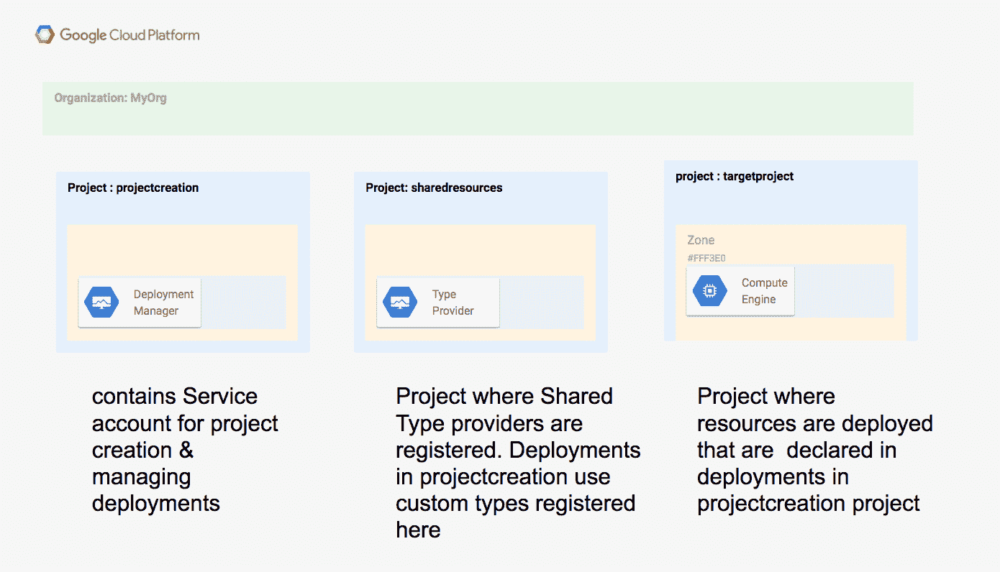
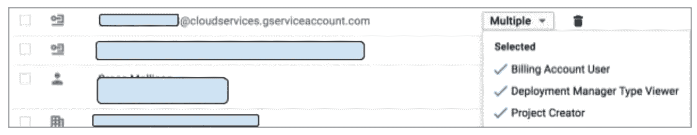
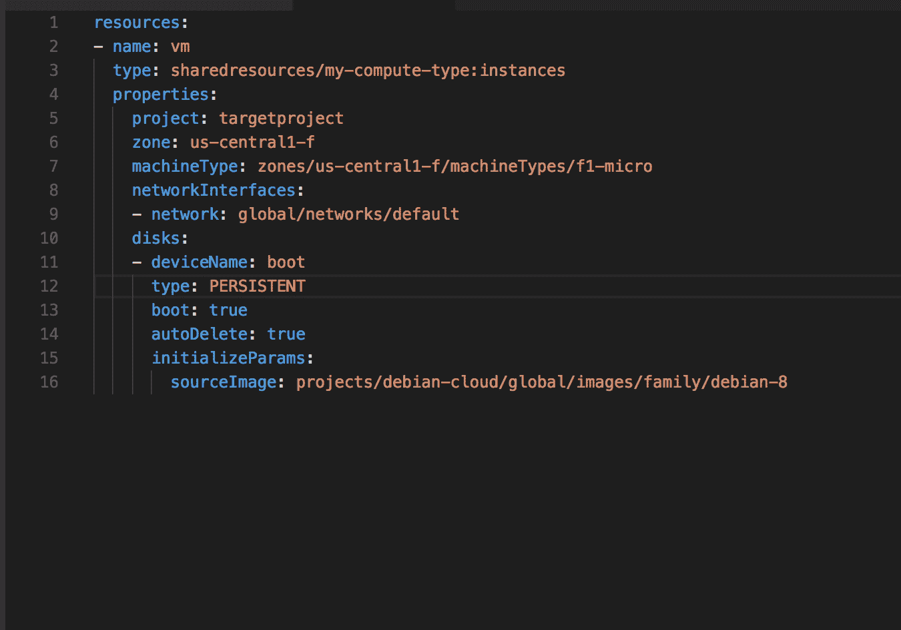
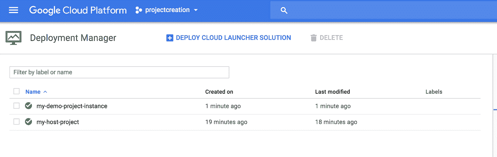

# 通过 6 个简单的步骤创建 GCP 类型的提供者

> 原文：<https://medium.com/google-cloud/creating-a-gcp-type-provider-in-6-well-7-easy-steps-19e6c59e1ae8?source=collection_archive---------0----------------------->

如果你使用 GCP 的部署管理器，你可能已经意识到或者没有意识到你可以通过创建一个类型提供者来扩展 APi。

类型提供者(引用足够简洁的文档)向部署管理器公开第三方 API 的所有资源，作为您可以在配置中使用的基本类型。

注册和使用类型提供者的步骤相当简单，因为我自己有理由这样做，所以我想我应该在这里记下这些步骤。

1.  首先声明你的类型。

*   类型是支持 CRUD 方法的 API。
*   你的 API 必须有一个描述你的 API 的文档。部署管理器支持 [OpenAPI 规范](https://github.com/OAI/OpenAPI-Specification) v 1.2 和 2.0 或 [Google Discovery](https://developers.google.com/discovery/v1/reference/apis) 文档。

2.让您的 API 可以通过公共端点访问。允许你在 GCP 建立你的 API 的 GCP 服务是[云端点](https://cloud.google.com/endpoints/docs/)和 [Apigee](https://cloud.google.com/apigee-api-management/)

3.如果您的 API 需要认证，请阅读部署管理器文档的这一节

4.测试时使用[g cloud CLI](https://cloud.google.com/sdk)——所以要确保设置好了

5.为您的提供商选择一个[名称](https://cloud.google.com/deployment-manager/docs/configuration/type-providers/creating-type-provider#name)

6.现在，您有了名称、描述符文档和任何身份验证细节，创建了您的类型提供者

在我的例子中，我将在我的一个项目中使用一个现有的 Google API 来创建一个类型提供者。为什么？他们已经建立了 API，这篇文章是关于类型提供者的！总有一天我会回来，另一次我会谈论我在云端点上的冒险经历，我不想让这篇文章脱轨！

因此，在计算引擎上选择发现文档的位置可以在这里找到[和](https://content.googleapis.com/discovery/v1/apis/)

我将使用的发现文档的 URl 是:

[https://www . Google APIs . com/discovery/v1/APIs/compute/beta/rest](https://www.googleapis.com/discovery/v1/apis/compute/beta/rest)

实际上，在最初尝试时，我遇到了一些语法相关的问题，在调试时，我发现了[https://developers . Google . com/discovery/v1/reference/APIs/getRest](https://developers.google.com/discovery/v1/reference/apis/getRest)，这是一个很好的页面，可以让您检索特定版本的 Google API。我喜欢它，所以我把它留在这里让你开心。

为什么不看看这个在你做的时候还在这里😀

我将使用 gcloud CLI，因为我已经通过了身份验证，所以不需要担心身份验证部分。(我喜欢 gcloud 命令，它让事情变得如此简单)

我将调用我的类型提供者 ***我的计算类型***

我将在我的项目 ***sharedresources*** 中注册它，因此我使用 gcloud 命令将我的工作项目设置为:

```
$ gcloud config set project sharedresources
```

注册我的类型提供程序:

```
$ gcloud alpha deployment-manager type-providers create my-compute-type --api-options-file=config.yaml descriptor-url=’https://www.googleapis.com/discovery/v1/apis/compute/beta/rest'
```

(我使用的 api-options-file 将一些输入映射映射到路径参数)

现在我已经创建了一个类型提供者，我该如何使用它呢？

就像对待任何其他类型一样，但有一点要注意！

您很可能希望与其他项目共享您的新类型，因此要做到这一点，您需要确保希望使用该类型的项目的[Google API 服务帐户](https://cloud.google.com/deployment-manager/docs/access-control#access_control_for_deployment_manager)被授予该类型已注册的项目的***deployment manager . type viewer***role

*这是第七步*

*为此，您需要登录到控制台，确保您位于注册了该类型的项目中。所以在我的例子中，这个项目共享资源。导航到 IAM 菜单，为将调用该类型的项目添加[Google API 服务帐户](https://cloud.google.com/deployment-manager/docs/access-control#access_control_for_deployment_manager)，并授予它***deployment manager . type viewer***角色(这可以在 other 下找到)*

*然而，这有点麻烦，不太容易扩展，所以在我的 [GCP 组织](https://cloud.google.com/resource-manager/docs/cloud-platform-resource-hierarchy#organizations)中，我实际上有以下项目配置*

**

*属于 projectcreation 项目的[Google API 服务帐户](https://cloud.google.com/deployment-manager/docs/access-control#access_control_for_deployment_manager)已经被授予组织级别的部署管理器类型查看者角色。这就是为什么我不需要在每个项目上明确地授予它这个权限，它需要通过一个部署管理配置来部署资源，因为这个权限是继承的。*

**

*创建一个调用新注册类型的配置。因此，在我的示例中，我的 YAML 配置如下所示:*

**

*(ps。你真的应该使用 python，但 YAML 更清楚地看到配置的突出部分)*

*为了部署我的配置，我使用以下命令*

```
*gcloud deployment-manager deployments create my-demo-project-instance --config=my-instance-config.yaml*
```

*这将在我的 ***项目中创建部署创建*** 项目。部署中声明的资源在本例中是在 ***targetproject*** 项目中创建的实例(确保服务帐户有创建实例的权限)*

**

*现在你知道了。*

*在我结束之前:*

*假设您已经对部署管理器有了基本的了解，那么您真的需要阅读 5 页文档:*

*[添加 API 作为类型提供者](https://cloud.google.com/deployment-manager/docs/configuration/type-providers/creating-type-provider)*

*[在配置中调用类型提供者](https://cloud.google.com/deployment-manager/docs/configuration/type-providers/calling-type-provider)*

*[跨项目共享类型](https://cloud.google.com/deployment-manager/docs/configuration/sharing-types-across-projects)*

*[一个用于添加 API 的分页器](https://cloud.google.com/deployment-manager/docs/configuration/type-providers/process-adding-api)*

*和[添加类型提供者的最佳实践](https://cloud.google.com/deployment-manager/docs/configuration/type-providers/best-practices-api)*

*我还想对部署管理团队中的 Adam & Kyle 说几句话😀谢谢你的帮助，让这个工作如我所愿。*