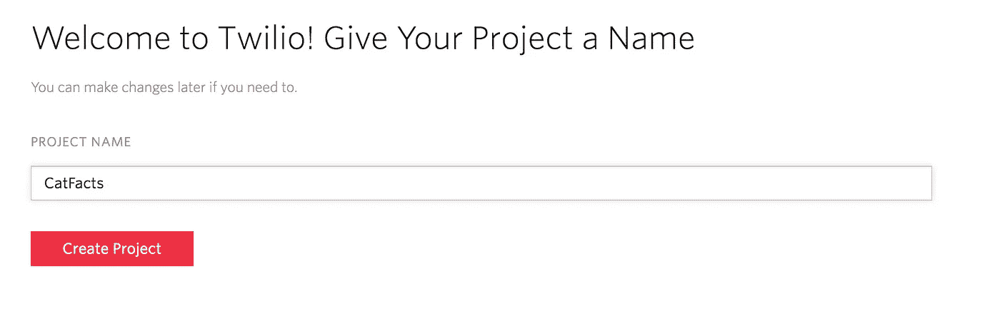
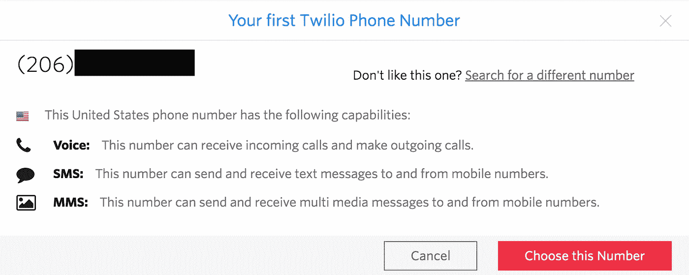
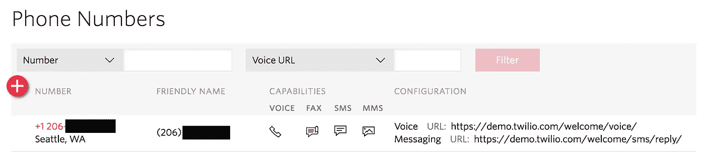
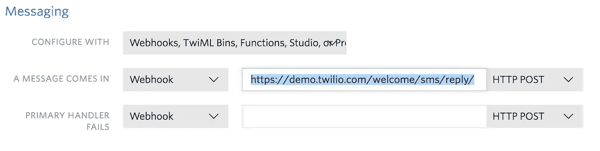
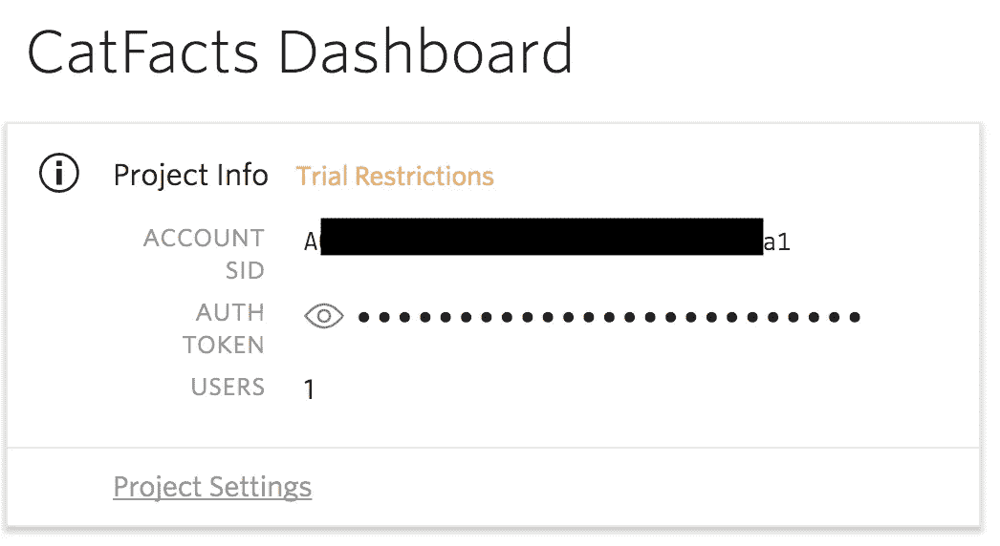
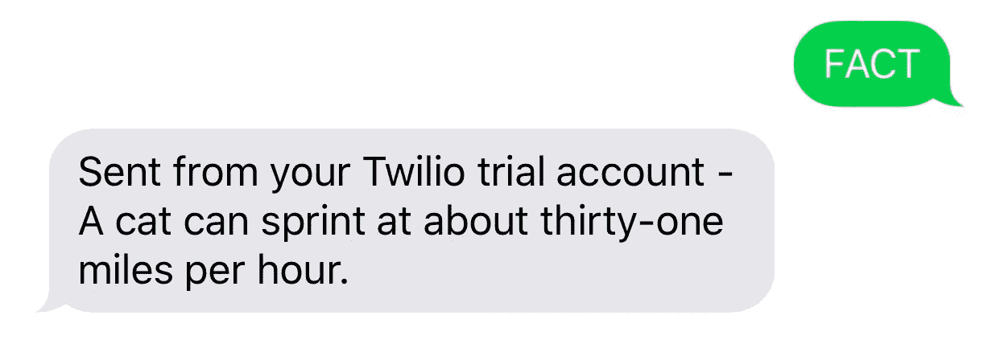

# 使用谷歌云平台创建文本订阅服务

> 原文：<https://medium.com/google-cloud/creating-a-text-subscription-service-using-gcp-97f578c048e1?source=collection_archive---------0----------------------->


谷歌云平台

只需要一点点经验！

了解如何使用 GCP 和 Twilio 构建卡特彼勒事实文本服务。

如果你以前没有使用过 GCP，你可能想按照我以前的教程[为初学者在谷歌云平台上托管你的网站](/google-cloud/hosting-your-personal-website-on-google-cloud-platform-for-beginners-278543eaaa67)

# 在开始之前

## 设置 Twilio

首先，在 Twilio 上注册一个**免费试用版**。如果你在这里注册，你可以获得 GCP 的免费学分:[http://ahoy.twilio.com/googlecloudplatform](http://ahoy.twilio.com/googlecloudplatform)

填写您的信息并用短信验证您的帐户。接下来您应该会看到这个，您可以在这里命名您的项目:



在下一页点击*开始*，然后*获得一个数字*



最后点击*选择这个数字*和*完成。*

## 建立 GCP

最后，您还需要确保在 GCP 项目设置中启用了开单功能。

# 入门指南

现在我们已经设置好了一切，让我们开始编码。打开[云壳编辑器](https://console.cloud.google.com/cloudshell/editor)并从 Github 克隆样本库:

```
git clone [https://github.com/GoogleCloudPlatform/nodejs-docs-samples](https://github.com/GoogleCloudPlatform/nodejs-docs-samples)
cd nodejs-docs-samples/appengine/twilio
```

现在，回到 Twilio，我们可以为您的应用程序配置 URL 端点。在 Twilio 仪表盘上点击*管理号码*



然后单击红色数字编辑其配置。

向下滚动到消息部分，将下面突出显示的 Webhook URL 替换为[https://<your-app-id>. appspot . com/SMS/receive](https://[your-app-id].appspot.com/sms/receive)



点击页面底部的*保存*。

现在，回到主 Twilio 仪表板，注意项目信息:



我们需要将这些设置放在 *app.yaml* 文件中，如下所示:

```
env_variables:
  TWILIO_ACCOUNT_SID: <your-account-sid>
  TWILIO_AUTH_TOKEN: <your-auth-token>
  TWILIO_NUMBER: <your-twilio-number>
```

> PS:输入`*edit app.js*`可以快速打开文件

最后，我们需要安装几个库来帮助我们:

```
npm install --save twilio requests express body-parser
```

# 迷人的🐈事实

我们将从编写获取 cat 事实并将其发送给用户的代码开始。我们将使用节点。JS [请求](https://github.com/request/request)库，所以打开`app.js`文件，把这一行放在靠近顶部的地方(我在第 24 行做的):

```
const request = require('request');
```

现在寻找`/sms/send`端点，其开头如下:

```
// [START send_sms]
app.get('/sms/send', (req, res, next) => {
```

我们将改变这个端点的主要逻辑，以获得我们的 c at 事实。寻找这一部分:

```
twilio.sendMessage({
    to: to,
    from: TWILIO_NUMBER,
    body: 'Hello from Google App Engine'
  }, (err) => {
    if (err) {
      next(err);
      return;
    }
    res.status(200).send('Message sent.');
  });
```

并替换为:

```
var theFact = '';
request.get('[https://catfact.ninja/fact?max_length=160'](https://catfact.ninja/fact?max_length=160'),     
   function(error, response, body) {
      var info = JSON.parse(body);
      console.log(info.fact);
      theFact = info.fact;
      twilio.sendMessage({
        to: to,
        from: TWILIO_NUMBER,
        body: theFact
      }, (err) => {
        if (err) {
          console.log(err);
          next(err);
          return;
        }
        res.status(200).send('Message sent.');
   });
}); 
```

这里所做的是从`catfact.ninja`获取一个 Cat 事实，并将其用作发送给用户的文本消息的主体。

# 接收用户消息

现在，向下滚动到`sms/receive`端点。我们将对此进行更改，以便用户可以询问事实。

找到具有以下特征的零件:

```
const resp = new TwimlResponse();
resp.message(format('Hello, %s, you said: %s', sender, body));   res.status(200)
    .contentType('text/xml')
    .send(resp.toString());
```

并替换为:

```
if (body === 'FACT') {
   request.get("[https://<your-app-id>.appspot.com/sms/send?to=](https://quickstartapp-d4f2e.appspot.com/sms/send?to=)" + sender);
    res.status(200).contentType('text/xml').send("Fact sent.");
} else {
   const resp = new TwimlResponse();
   resp.message(format('Sorry, I didn\'t get that, please say FACT to get a cat fact.'));
   res.status(200).contentType('text/xml').send(resp.toString());
}
```

> 提示:别忘了用你的 App ID 替换<your-app-id>。</your-app-id>

这使得你的应用程序将发送一个事实，如果它收到单词“事实”。

# 部署，我们就完成了！



最后，使用`gcloud app deploy`部署你的应用程序，并将“事实”发送到你的 Twilio 号码。

# 在将来

如果你想让你的猫事实机器人对公众开放，回到 [Twilio](https://www.twilio.com/console/billing/upgrade) 并升级你的账户。

如有疑问，在下方评论！