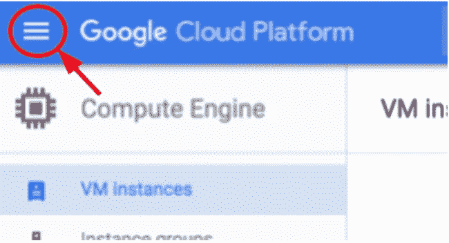

# 在谷歌云平台中创建虚拟机

> 原文：<https://medium.com/google-cloud/creating-a-virtual-machine-in-google-cloud-platform-ec2d74dbbab0?source=collection_archive---------0----------------------->

在这篇文章中，我将向你展示如何在谷歌云平台中创建一个基本的虚拟机。我们将从谷歌云平台的基本概述开始，然后我将向您展示如何使用谷歌云平台创建各种机器类型的虚拟机实例。我们开始吧

**谷歌云平台概述**

谷歌云平台是谷歌云数据中心中包含的一大组物理资产，如计算机、硬盘、处理器和虚拟资产，如虚拟机和服务。每个数据中心都位于一个全局区域中，每个区域都是分区的集合。每个区域在同一区域内相互隔离。
这种分布为我们提供了许多便利，如在区域故障情况下的数据冗余，通过将资源放置在更靠近客户端的位置来减少延迟，还提供了对资源以及如何使用资源来改善服务和降低成本的更多控制。

由于这是一个云平台，您不必担心购买硬件、购买数据中心和安装它们。你可以使用谷歌提供的所有硬件/软件作为服务。在 GCP，这些服务为您提供对底层硬件的访问。当你开始开发时，你会注意到你的产品只是谷歌提供的服务和你的代码的混合。

**先决条件**

启用计费的 Google 帐户(如果您是第一次使用任何启用国际交易的信用卡/借记卡创建一个计费帐户，您将从 Google 获得免费点数)

**我们开始吧**

第一步是登录到你的谷歌云控制台，用你想要的名字创建一个新项目。现在，您可能会想，项目在这里的作用是什么？我只想创建一个虚拟机，对吗？。所以，把项目想象成一个组织实体。您分配和使用的任何云平台资源都必须属于一个项目。创建项目后，您将能够在仪表板上看到项目信息。该项目信息包含将帮助您识别项目的项目名称、将帮助 google cloud platform 识别您的项目的项目 ID(这对于每个项目都是唯一的)、将由支持团队使用的项目编号(如果您的项目需要任何帮助)。

创建虚拟机有三种方式

1.  使用谷歌云控制台创建。
2.  使用“gcloud”命令行工具创建。
3.  使用计算引擎 REST API 创建

在本文中，我将使用谷歌云控制台和 gcloud 向您展示它

**使用谷歌云控制台创建虚拟机**

单击屏幕左上角的菜单图标



然后导航至计算引擎和虚拟机实例。当你第一次点击虚拟机实例时，可能需要一些时间，但是一旦它被初始化，你将会看到类似这样的东西(记住你需要为你的项目启用计费来看到它)。


点击创建，然后你会看到这个页面


正如您在这里看到的，您可以指定想要创建的实例的名称。指定要在其中创建此实例的区域。您可以选择要用于实例的机器类型。有大量的机器可供选择，你可以根据你的要求。您甚至可以定制和创建自己的机器类型。

您还可以选择要用来启动该虚拟机的启动磁盘。


您可以选择此实例将使用的服务帐户。现在不要担心服务帐户，只要把它看作是谷歌云平台识别和授权你的虚拟机的一种方式，如果它想与 GCP 的其他服务通信的话。

现在，为了允许传入和传出流量，我们有防火墙规则，这些规则使用标记应用于虚拟机。

有与管理、磁盘、SSH 等相关的定制。我们将在今后研究这些问题。现在只需点击创建。

这个创建过程是异步的，但是一旦创建了实例，您将看到一个带有实例名称的绿色复选标记。


祝贺您，您已经成功创建了一个虚拟机。嗯（表示踌躇等）..你可能会认为这很无聊，因为你还没有使用你创造的东西。所以，我会给你一个小预告片，告诉你从这里你能做什么。

单击您在那里看到的 SSH 链接。您将能够看到您的虚拟实例的控制台，最酷的是您无需做任何事情就可以获得它的 root 访问权限。因此，不用浪费任何时间，只需以 root 用户身份登录，运行

```
sudo su -
```

这将使您以 root 用户身份登录，您将看到如下内容


其中“实例-1”是您的实例的名称。现在，第一件也是最重要的事情是通过运行

```
apt-get update
```

这将使用所有安全补丁和许多其他东西更新您的实例，并最终安装 nginx 服务器

```
apt-get install nginx -y
```

安装完成后，使用以下命令检查 nginx 是否正在运行

```
ps auwx | grep nginx
```

厉害！现在转到您的控制台，点击外部 IP。您应该会看到默认页面


那么，谁认为拥有自己的服务器会那么容易呢？。

你也可以用“gcloud”做所有这些事情。通常“gcloud”会在你想用脚本创建实例的情况下使用。但是现在让我们看看如何用所有的默认值创建一个简单的实例。

**使用 gcloud 创建虚拟机**

gcloud 是 google 提供的命令行工具，我们可以将它安装在我们的系统中，也可以使用 Google command shell，它预装了许多软件包，提供大约 5GB 的内存。出于我们的目的，我们将使用谷歌命令外壳。你可以点击屏幕右上角的图标打开云壳。


打开后，您可以使用命令创建一个虚拟机实例

```
gcloud compute instances create instance-1 --zone us-central1-c
```

虚拟机是一个区域资源，因此我们必须指定要在其中创建实例的区域，并且我们不能在同一项目下的同一区域中有同名的实例。您还可以在“计算使用”下探索更多选项

```
gcloud compute instances create — help
```

它会要求您为虚拟机实例创建密码。如果您想创建一个空密码，只需点击 enter。

在未来，我们将探索更多选项来定制我们的虚拟机，以及如何修改防火墙规则，提高虚拟机实例的安全性，对它们进行分组等。我们还将探索“gcloud”命令行工具。