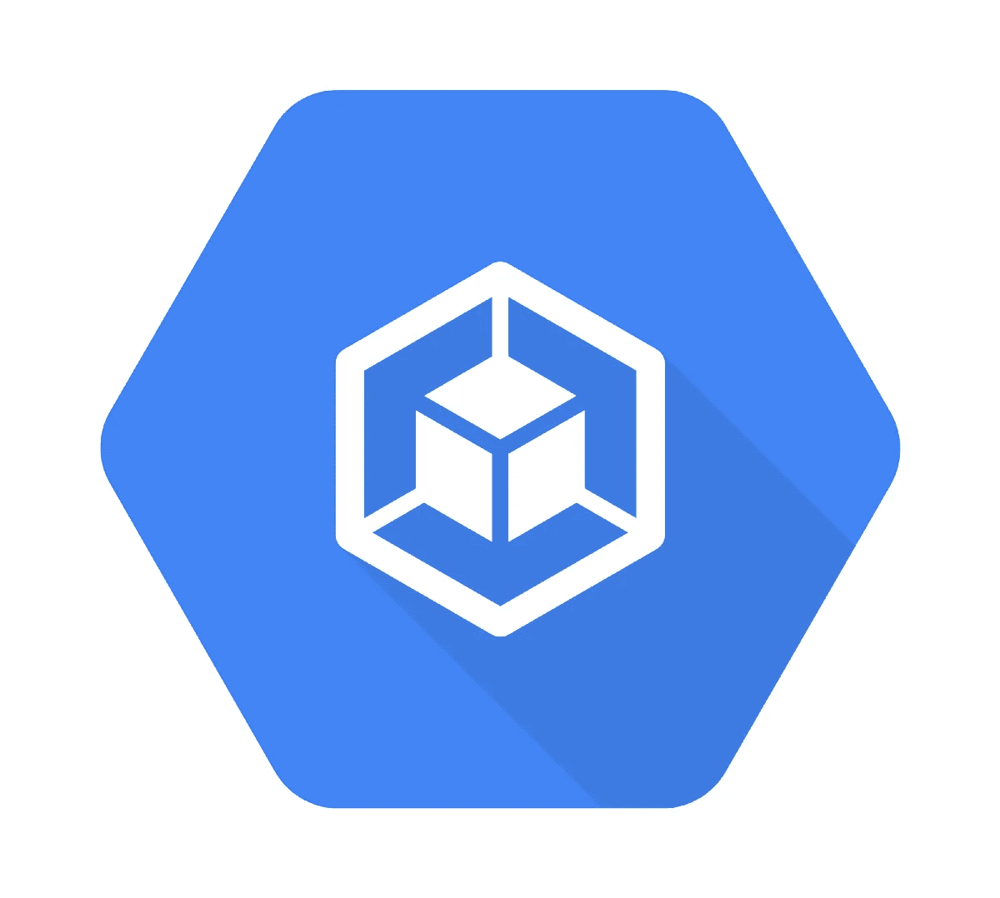

# 在 Google 云容器引擎中创建构建触发器

> 原文：<https://medium.com/google-cloud/creating-build-triggers-in-google-cloud-container-engine-20028aa04ed6?source=collection_archive---------2----------------------->

我们在平台中使用 Google 云平台，将 ML 模型作为容器部署到云中，并使用 Kubernetes 引擎为它们提供服务。对于开发人员来说，将代码更改推送到 GitHub / BitBucket，然后必须运行`docker build`和`gcloud`流程来部署代码的过程远非理想。幸运的是，有了构建触发器，在第一次部署后，当更改被推送到 GitHub 或 BitBucket 时，您可以自动执行在云中重建映像的过程。



这个过程相当简单。进入谷歌云控制台和容器引擎。然后选择构建触发器和添加触发器。选择您想要同步的远程存储库中心，例如，我们在这里选择 BitBucket。你需要通过一些授权步骤来获得账户链接。选择您想要链接的存储库，Google Cloud 将开始镜像它。一旦这个过程完成，您将看到一些额外的配置。给它起一个容易记忆的名字，在图像名称部分，我们选择使用:

```
gcr.io/alixir-199021/myimage:new
```

`new`标签让我们很容易辨别哪个图像是最新的版本。最后，只需完成提示并创建触发器。

现在，对您的本地代码进行更改，并像往常一样将其推送到您的远程 repo，如果幸运的话，在 Container Registry 的“Build History”部分，您将看到由于远程代码的更改，您的容器映像正在被动地重新构建。厉害！

一旦构建完成，您就可以对您的 Kubernetes 部署执行滚动更新并将其实时发送。当然，还有很多其他的方法可以利用构建触发器，比如推送到一个临时服务器，但是对于我们的工作流来说，这使它变得简单和易于管理。