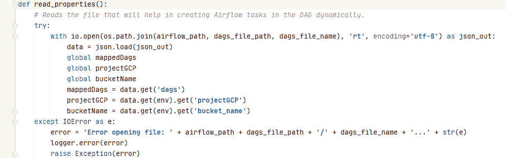
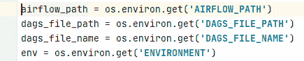
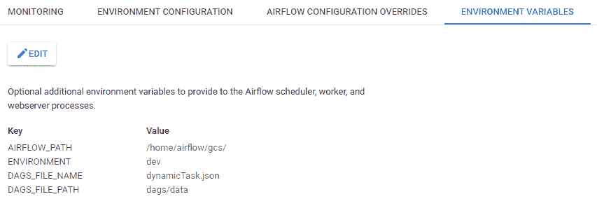
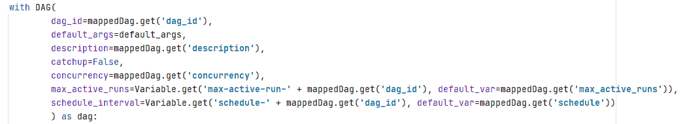
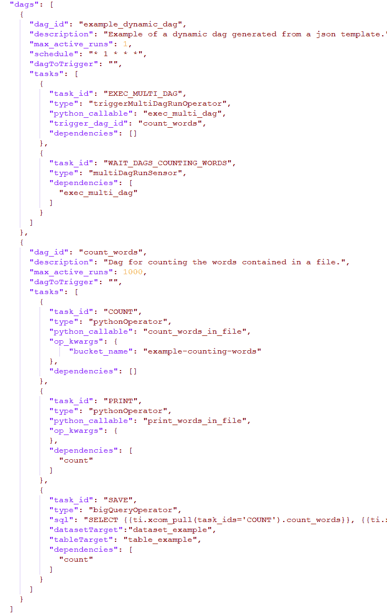
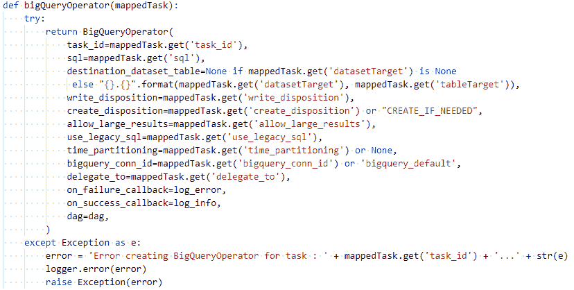
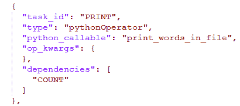
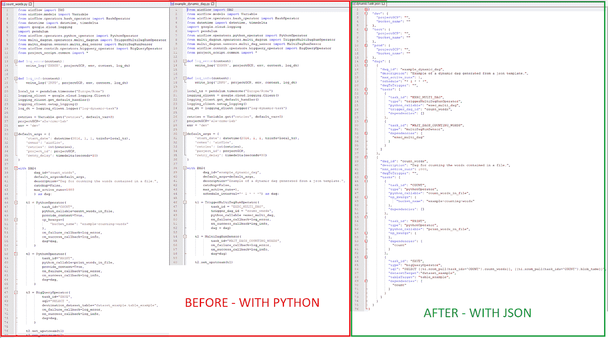

# 从 JSON 模板创建 Dynamic Composer Airflow DAGs

> 原文：<https://medium.com/google-cloud/creating-dynamic-composer-airflow-dags-from-json-template-90714af3b180?source=collection_archive---------0----------------------->

如何从 JSON 模板管理 Google Cloud Composer 中的动态 Dag 创建:声明方式。

作者:米歇尔·米康科 & [奥尔多·洛里亚](https://medium.com/u/b4f66ff14d72?source=post_page-----90714af3b180--------------------------------)—2021 年 1 月

# 放弃

这是一个基于气流的 Google Cloud Composer 高级教程。如果您尚未使用 Airflow 和 Google Cloud Composer，我们强烈建议您先学习基础知识:

*   [气流文件](https://airflow.apache.org/docs/stable/tutorial.html)
*   [Google Cloud Composer 文档](https://cloud.google.com/composer/docs)

欢迎分享您的反馈。

# 使用的技术

*   谷歌云编辑器 1 . 13 . 0-气流-1.10.12
*   气流 1.10.12 操作员
*   Python 3
*   JSON

# 描述问题

我们希望构建一个灵活的工具来管理 cloud composer 实例的 dag 创建，并且我们确定了一些所需的功能:

*   向非 pythonic 用户提供创建和编辑复杂 Dag 方法
*   减少在 Composer 中实现 python dags 所需的冗余代码
*   管理不同的环境(开发-测试-生产)
*   轻松管理任务的相关性

# 描述解决方案

我们将 Dag 和任务的定义从 python 脚本中分离出来，该脚本管理 Dag 和环境变量的创建，这些变量允许您定制一些任务的行为。

这样，我们就有了用 JSON 编写的解决方案的声明部分，更容易阅读和编辑由 python 脚本管理的非 composer 技术组件。事实上，JSON 由两个主要部分组成:

1.  一个环境定义，名称为项目 gcp，相对桶名
2.  我们的 dag 的定义以及组成它的相关任务。

在我们动态定义 Dag 的解决方案中，我们首先从 JSON 文件中读取信息。“read_properties”函数从 JSON 文件中读取所有 Dag 和任务定义以及 Dag 计算中使用的环境和项目变量。

*airflow_path* 、 *dags_file_path* 、 *dags_file_name* 和 *env* 是从 composer 中的*“环境变量”*中读取的变量

变量" *env* "允许在我们需要的每个环境中部署源代码，而不需要在 dags 源代码中修改它。

然后为 JSON 中的每个 DAG 创建一个 airflow.models.DAG:

这里我们指定了 *dag_id* 、 *default_args* 、一个 dag *描述*、 *maximum_active_run* 和 dag 调度，我们还可以在 Composer 中触发 dagbag 中部署的另一个 dag。

每个值都是从 JSON dag 部分提取的，所以如果需要修改一个参数，只需编辑 JSON 文件。

在本例中，我们还提供了在 JSON 或 airflow 变量中指定一些属性(如“schedule_interval”或“max-active-runs”)的机会，只需使用“schedule-”前缀和 dag id 作为变量的关键字。这样，您只需编辑" *env"* 变量，新值将在下次运行时使用，无需上传任何内容。

JSON dag 定义的示例

对于每个 dag，我们将创建 JSON 中“*任务*属性中列出的所有任务:

基于任务对象中的*类型*属性，我们为每个气流操作符使用一个函数来将任务从 JSON 文件映射到我们的 python 脚本，您将需要在 python 脚本中映射您想要使用的每个操作符；可以在这里查阅 airflow 文档[https://air flow . readthe docs . io/en/1 . 10 . 12/integration . html # GCP-Google-cloud-platform](https://airflow.readthedocs.io/en/1.10.12/integration.html#gcp-google-cloud-platform):

BigQueryOperator 的函数定义示例

对于每个任务，可以定义与 dag 中其他任务的依赖关系。这可以用 JSON 属性“ *dependencies* ”(任务 id 列表)来定义:

# 结论

所描述的解决方案允许通过文件 JSON 的定义对 Dag 进行简单且可管理的配置。它允许 dag 触发功能，可以使用分支运算符定义任务和条件任务之间的依赖关系，还可以运行多个并行 dag。

使用这种声明性方法的最大好处是更灵活的可维护性，为了向现有 dag 添加任务或在 composer 实例中创建新 Dag，您不必编辑 python 脚本，所有内容都是从 JSON 文件中读取和处理的，这大大减少了 python 脚本中代码的膨胀。

这也意味着没有 python 技能的用户可以添加新的查询任务，或者只需编辑相关的 JSON 对象就可以更改任务链。

使用自定义开发在 python 中声明 Dag 的示例(之前)—使用 JSON 声明实现的相同 Dag。