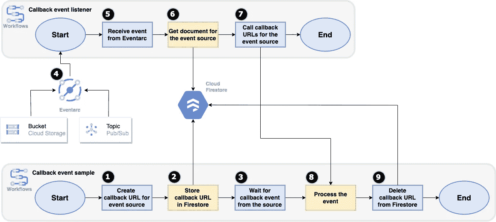

# 创建暂停和等待事件的工作流

> 原文：<https://medium.com/google-cloud/creating-workflows-that-pause-and-wait-for-events-4da201741f2a?source=collection_archive---------2----------------------->

在[工作流](https://cloud.google.com/workflows)中，很容易将各种服务链接到一个自动化的工作流中。对于某些用例，您可能需要暂停工作流执行并等待一些输入。这个输入可以是人工批准，也可以是外部服务回调完成工作流所需的数据。

通过工作流[回调](https://cloud.google.com/workflows/docs/creating-callback-endpoints)，工作流可以创建一个 HTTP 端点并暂停执行，直到它接收到对该端点的 HTTP 回调。这对于创建中间型工作流非常有用。在之前的[博客文章](https://cloud.google.com/blog/topics/developers-practitioners/introducing-workflows-callbacks)，[中，Guillaume Laforge](https://twitter.com/glaforge) 展示了如何使用回调建立一个带有人工验证的自动化翻译工作流程。

回调是很好的，但是必须有人(或某些服务)知道回调端点并对该端点进行 HTTP 调用。而且，许多服务发送或生成事件，而不是调用 HTTP 端点。如果您能在收到特定事件时暂停工作流的执行并恢复，那不是很好吗？例如，您可以使用此功能创建工作流，暂停并等待来自发布/订阅主题的新消息或云存储桶中创建的新文件。

# 事件回调

虽然工作流不提供现成的事件回调，但可以通过使用回调、Firestore 和 Eventarc 让工作流执行等待事件。

其思想是使用 Firestore 来存储来自原始工作流的回调细节，使用 Eventarc 来侦听来自各种事件源的事件，并使用第二个事件触发的工作流来接收来自 Eventarc 的事件并回调原始工作流中的回调端点。

# 体系结构

以下是更详细的设置:



1.  一个`callback-event-sample`工作流( [yaml](https://github.com/GoogleCloudPlatform/workflows-demos/blob/master/callback-event/callback-event-sample.yaml) )为一个事件源创建一个回调，它对来自该事件源的等待事件感兴趣。
2.  它将事件源的回调信息存储在 Firestore 的一个文档中。
3.  它继续它的工作流，并在某个时候，开始等待一个事件。
4.  同时，`callback-event-listener` ( [yaml](https://github.com/GoogleCloudPlatform/workflows-demos/blob/master/callback-event/callback-event-listener.yaml) )准备好被来自一个发布/订阅主题和一个带有 Eventarc 的云存储桶的事件触发。
5.  在某些时候，Eventarc 接收到一个事件并触发事件监听器。
6.  事件监听器在 Firestore 中查找事件源的文档。
7.  事件监听器回调注册到该事件源的所有回调 URL。`callback-event-sample`工作流通过其回调端点接收事件并停止等待。
8.  它从 Firestore 中删除回调 URL 并继续执行。

详细的设置说明以及 YAML 工作流定义在 [GitHub](https://github.com/GoogleCloudPlatform/workflows-demos/tree/master/callback-event) 上。

# 试验

要测试事件回调，首先执行示例工作流:

```
gcloud workflows run callback-event-sample
```

一旦启动，工作流将暂停并等待，您可以通过 Google Cloud Console 上的运行状态来确认这一点:


要测试发布/订阅回调，请发送发布/订阅消息:

```
TOPIC =topic-callback
gcloud pubsub topics publish $TOPIC --message= "Hello World"
```

在工作流日志中，您应该看到工作流开始和停止等待事件:

```
Started waiting for an event from source topic-callback
Stopped waiting for an event from source topic-callback
```

要测试云存储事件，请向云存储上传一个新文件:

```
BUCKET = $PROJECT_ID-bucket-callback
echo "Hello World" > random.txt gsutil cp random.txt
gs://$BUCKET/random.txt
```

您应该看到工作流开始并停止等待事件:

```
Started waiting for an event from source $PROJECT_ID-bucket-callback Stopped waiting for an event from source $PROJECT_ID-bucket-callback
```

此时，工作流应该停止执行，您还应该在输出中看到接收到的发布/订阅和云存储事件:


这篇博文讲述了如何使用回调、Firestore 和 Eventarc 创建等待发布/订阅和云存储事件的工作流。您可以扩展示例来监听 Eventarc 支持的任何[事件](https://cloud.google.com/eventarc/docs/reference/supported-events)。如有任何问题或反馈，请随时在 Twitter [@meteatamel](https://twitter.com/meteatamel) 上联系我。

*原发布于*[*https://atamel . dev*](https://atamel.dev/posts/2022/08-05_workflows_that_pause_for_events/)*。*