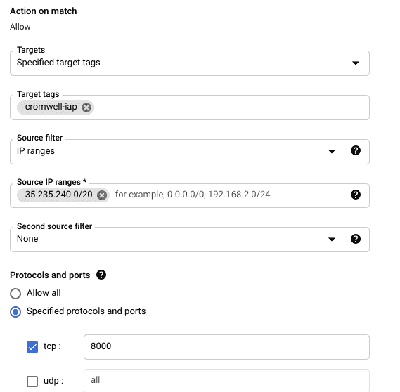

# 克伦威尔《你好，GCP》

> 原文：<https://medium.com/google-cloud/cromwell-hello-gcp-833c18df3caf?source=collection_archive---------0----------------------->

# 背景

克伦威尔是生物信息学领域最受欢迎的工作流引擎之一。本教程试图帮助研究人员和 IT 团队按照最佳实践进行基本部署，并为生产做好准备。它还讨论了选择运行工作流的位置和使用生命科学 API 的位置的一些最佳实践。

本教程还将包括一些有用的技巧，如如何使用 IAP 以更安全的方式访问 Cromwell API 服务器，而不使用公共 IP 地址，以及启用私有 Google 访问和创建 NAT 网关以支持工作虚拟机使用私有 IP 地址。

# 体系结构

本指南遵循[https://cloud . Google . com/architecture/genomic-data-processing-reference-architecture](https://cloud.google.com/architecture/genomic-data-processing-reference-architecture)中概述的相同架构


# 关键变量和决策

在开始部署之前，您需要决定一些事情，比如 Cromwell 服务器在哪里，以及您将使用的 SQL 实例的类型。这是我们将在部署和配置文件中使用的变量和值的列表。您需要仔细考虑在哪里创建这些资源，因为这可能会影响性能。

1.  项目 id
2.  [生命科学 API 位置](https://cloud.google.com/life-sciences/docs/concepts/locations) <位置>
3.  创建数据库、克伦威尔服务器等
4.  工作虚拟机的区域
5.  克伦威尔服务器使用的虚拟机
6.  MySQL 实例
7.  MySQL 用户名<db-username>和密码<db-password></db-password></db-username>
8.  GCS 存储桶

# 供应 MySQL

用 MySQL 运行克伦威尔有很多优点，比如能够以服务器模式运行并提交多个作业、共享输出、能够查看时序图、恢复失败的管道等。

实例类型和磁盘大小取决于预期运行的并行管道的数量。在本教程中，我从 n1-standard-1 实例类型和 20GB SSD 磁盘开始，我发现这对于运行几个并行管道来说绰绰有余。您可以随时更改，但需要重新启动。

1.  浏览到云 SQL 并创建实例

2.选择 MySQL，你可能需要启用 API

3.除非需要高可用性，否则更改为单区域可用性

4.更新地区/区域以匹配克伦威尔服务器的位置

5.点击显示配置选项

6.更新机器类型

7.如果需要，更新存储并调整大小

8.展开连接，取消选中公共 IP 并选择专用 IP

9.选择运行服务器的网络，通常是默认网络

10.您可能需要设置专用服务访问连接，如果您以前没有为此 VPC 设置过，请单击“启用 API”并选择“使用自动分配的 IP 范围”。单击继续，然后创建连接


11.单击创建实例

12.创建数据库后，单击实例，然后单击数据库，并创建一个新的数据库“cromwell”

13.注意私有 ip 地址<db-ipaddress>,因为稍后将在配置文件中使用它</db-ipaddress>

# 创建 NAT 和配置私有 Google 访问和防火墙

# 私人谷歌访问

1.  在 VPC 网络中，选择<region>的子网，克伦威尔服务器和工作节点将在该子网中进行配置</region>


2.点击“编辑”

3.将“私人谷歌访问”更改为“开启”

4.单击保存

# 添加防火墙规则以允许来自 IAP IP 范围的访问

稍后将使用此防火墙来允许流量流向身份识别代理服务，以实现安全访问。

1.  点击防火墙
2.  单击“创建防火墙规则”
3.  添加适当的名称，例如 allow-cromwell-iap-access
4.  确保选择了正确的网络
5.  在目标标签中添加“克伦威尔-iap”
6.  在源过滤器中添加苹果酒范围“35.235.240.0/20”
7.  选择 TCP 并添加 8000
8.  单击创建



# 创建云 NAT

1.  点击网络服务→云 NAT
2.  单击“创建 NAT 网关”
3.  添加名称，如克伦威尔-纳特
4.  选择网络(通常默认)和地区
5.  点击云路由器，然后创建新的路由器


6.添加路由器名称，例如 Cromwell-NAT-路由器

7.单击创建，然后单击创建

# 创建服务帐户

1.  单击 IAM & Admin→服务帐户
2.  单击“创建服务帐户”
3.  输入服务帐户名称，例如“cromwell-sa”
4.  添加适当的描述
5.  单击“创建并继续”
6.  添加以下角色
7.  云 SQL 管理
8.  云生命科学工作流运行器
9.  服务使用消费者
10.  存储对象管理
11.  单击完成
12.  单击服务帐户，然后选择“密钥”选项卡
13.  单击添加密钥→创建新密钥
14.  单击 Create，将密钥下载到一个安全的位置，并重命名为 credentials.json

# 创建存储桶

创建一个区域标准云存储桶，它应该和 worker 节点放在同一个区域。如果员工将在多个区域工作，您也可以考虑使用双区域或多区域。

# 启用生命科学 API

在顶部搜索生命科学 API 的搜索框中，选择 API，然后单击启用按钮


# 设置克伦威尔服务器

我通常从 e2-standard-4 实例开始，然后根据控制台上的建议调整大小。较小的实例仍然可以工作。

1.  创建新的虚拟机克伦威尔服务器
2.  将区域设置为
3.  根据预期的工作流数量选择合适的规模，您可以从 e2-standard-4 开始
4.  更新访问范围以允许对所有云 API 的完全访问
5.  展开网络并添加网络标签“cromwell-iap”
6.  展开网络接口，并将外部 IP 地址更改为“无”
7.  单击创建

# 部署和配置克伦威尔

# 下载克伦威尔，jdk 和其他工具

1.  从控制台或使用 gcloud 通过 SSH 连接到克伦威尔服务器
2.  运行以下命令

```
sudo apt updatesudo apt install -y git wget openjdk-11-jdk
```

3.检查最新的[克伦威尔版本](https://github.com/broadinstitute/cromwell/releases)并下载 jar 文件

```
wget [https://github.com/broadinstitute/cromwell/releases/download/69/womtool-69.jar](https://github.com/broadinstitute/cromwell/releases/download/69/womtool-69.jar)wget [https://github.com/broadinstitute/cromwell/releases/download/69/cromwell-69.jar](https://github.com/broadinstitute/cromwell/releases/download/69/cromwell-69.jar)
```

4.重命名下载的文件

```
mv cromwell-69.jar cromwell.jar
```

# 正在创建配置文件

我创建了一个示例 conf 文件，它解决了许多可能没有很好记录的问题。

1.  下载[样本会议文件](https://raw.githubusercontent.com/hnawar/cromwell-hello/main/PAPIv2.conf)
2.  编辑以下值
3.  项目 id
4.  服务帐户电子邮件
5.  存储桶
6.  位置和端点 url(如果不使用 us-central1)
7.  区域
8.  数据库 IP 和密码
9.  将之前创建的 conf 文件和 credentials.json 上传到 VM，关于将文件传输到 VM 的更多信息，请查看这个[指南](https://cloud.google.com/compute/docs/instances/transfer-files)。


# 测试配置并运行 hello.wdl

这将在独立模式下运行克伦威尔。这有助于检测配置中的任何问题，并在以服务器模式运行之前进行调试。

1.  用以下内容创建一个 hello.wdl 文件

```
workflow myWorkflow {
  call myTask
}
task myTask {
  command {
    echo “hello GCP”
  }
  runtime {
    docker: “ubuntu:latest”
  }
  output {
    String out = read_string(stdout())
  }
}
```

2.运行工作流，您还可以检查控制台，观察创建工作虚拟机来运行任务的过程。您应该在输出中看到“你好，GCP”。

```
java -Dconfig.file=PAPIv2.conf -jar cromwell.jar run hello.wdl
```

# 创建和启动克伦威尔服务

1.  使用您最喜欢的文本编辑器作为 root 创建一个文件/etc/systemd/system/Cromwell . service，例如

```
sudo vi /etc/systemd/system/cromwell.service
```

2.复制并粘贴下面的示例，根据虚拟机的形状调整堆内存的大小(Xmx**G)

```
[Unit]
Description=Cromwell Server
After=network.target[Service]
User=root
Group=root
Restart=always
TimeoutStopSec=10
RestartSec=5
WorkingDirectory=/home/<linux_user>
ExecStart=/usr/bin/java -Xmx10G -Dconfig.file=PAPIv2.conf -jar cromwell.jar server[Install]
WantedBy=multi-user.target
```

3.退出并保存

4.重新加载 linux 守护进程并启动服务

```
sudo systemctl daemon-reloadsudo systemctl start cromwell.service
```

5.使其在服务器重启时自动启动

```
sudo systemctl enable cromwell.service
```

6.您可以通过运行以下命令来检查服务状态

```
sudo systemctl status cromwell.service
```

键入“q”退出

# 提交您的 hello.wdl

现在我们有了一个正在运行的服务器，我们将再次运行 hello.wdl，但是这次使用 submit 而不是 run。这将把 wdl 提交给已经作为服务运行的服务器，而不是启动一个新的 cromwell 实例

```
java -Dconfig.file=PAPIv2.conf -jar cromwell.jar submit hello.wdl
```

# 使用 IAP 连接到克伦威尔服务器

以下要求您的设备上安装了 Google Cloud SDK。如果你使用的是 Chromebook，你可以在 Linux Shell (Crostini)上这样做，注意 ChromeOS 会自动将端口 8080 转发给 Linux VM

从配置了 gcloud 的终端到正确的项目运行

```
gcloud compute start-iap-tunnel <cromwell-vm> 8000 --local-host-port=localhost:8080 --zone=<zone>
```

现在，打开您的 web 浏览器并浏览到 localhost:8080，这应该会打开您的克伦威尔服务器的 swagger 页面，现在让我们也尝试从 CLI 访问它，尝试运行

```
curl -X GET “http://localhost:8080/api/workflows/v1/query" -H “accept: application/json”
```

这将返回已经运行的工作流列表，包括我们之前运行的 hello.wdl。您可以检查其他可用的 API，例如工作流计时，这在调试或优化工作流时非常有用


# 其他最佳实践

# 在欧洲跑步

*   确保您的资源和端点都在欧盟或所需区域，包括克伦威尔虚拟机、云 SQL、存储桶、位置等，这有助于提高性能和减少延迟。
*   许多参考文件托管在美国，这可能会增加本地化时间的开销，并可能会增加由请求者付费托管的文件的成本，因为您将支付从美国到欧盟的费用
*   确保端点 url 配置正确，与位置匹配

# 使用容器注册表

*   使用 Docker HUB 或其他公共注册中心可能会增加开销，特别是当对同一个容器发出多个 pull 请求时，其中一些服务会应用节流。因此，将容器推送到[容器注册中心](https://cloud.google.com/container-registry/docs/pushing-and-pulling)，将容器推送到最近的区域注册中心可以提高工作流的性能
*   另外请注意，如果从外部注册中心拉容器或者如果没有配置私有 Google 访问，通过云 NAT 拉容器会产生 NAT 入侵费用
*   与参考文件类似，从偏远地区拉集装箱可能会产生额外的成本

# 正在清理执行目录

执行目录会很快变大，请确保将输出复制到单独的位置，并在不再需要时清理中间文件。

您还可以将配置文件中的 delete _ intermediate _ output _ files 标志设置为 true，这将删除工作流最终输出中未提及的任何文件。查看克伦威尔[文档](https://cromwell.readthedocs.io/en/stable/wf_options/Google/)，了解更多关于这个和其他谷歌特定选项的信息