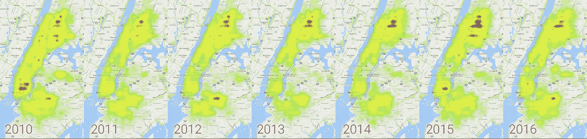

# 使用 BigQuery 为纽约的老鼠之都加冕

> 原文：<https://medium.com/google-cloud/crowning-the-rat-capital-of-new-york-a35dc82bf6cf?source=collection_archive---------2----------------------->

## 使用 Google BigQuery 导入数据进行分析

> 最初发表在[谷歌云大数据和机器学习](https://cloud.google.com/blog/big-data/2017/02/crowning-the-rat-capital-of-new-york-importing-data-for-analysis-with-google-bigquery)博客上

BigQuery 中的 NYC 311 数据集表明，从 2013 年开始，关于老鼠的投诉急剧增加。

为了更深入地挖掘，我将纽约市害虫控制数据库中的[啮齿动物检查表](https://data.cityofnewyork.us/Health/Rodent-Inspection/p937-wjvj)上传到 BigQuery 观看视频，了解我是如何做到这一点的，并了解如何将 NYC 311 数据与您自己的数据集进行比较。

## **曼哈顿人最有可能报假老鼠警报**

纽约市卫生局派出检查员调查所有关于啮齿动物的投诉——75%的情况下，他们什么也没发现。

左侧的热图突出显示了错误警报(未发现活动老鼠迹象的检查)明显多于发现活动老鼠迹象的位置。曼哈顿市中心和哈莱姆区的 blooms 显示了最多的错误警报。

右图突出显示了检查员经常发现活跃老鼠迹象的区域。

在这里，威廉斯堡和布什维克是发现老鼠迹象的检查最集中的地区，而不是假警报。

## 311 老鼠投诉的增加意味着更多的老鼠，还是更多的投诉？

2016 年是*都是*。但主要是更多的老鼠。下图显示，自 2014 年以来，清洁检查(通过的初始检查)有所增加，但发现活跃老鼠迹象的检查增加更多，特别是在 2016 年有显著增加。

相比之下，请注意 2012 年投诉的激增实际上与当年检测到活跃老鼠迹象的检查数量减少相对应。

## **2011 年，布朗克斯区取代了曼哈顿区，成为“老鼠中心”,但这一领先地位正受到威胁**

下图显示了每个行政区发现活跃老鼠迹象的检查变化。在左边，我们显示了与去年同期相比的百分比变化，在右边显示了总体数字。

请注意，截至 2015 年(含 2015 年)，任何一年之间的变化通常都小于+/- 30%，但 2016 年除了布朗克斯以外，其他地方都出现了大幅增长。

如果目前的增长速度在整个纽约持续下去，到 2019 年，布鲁克林将成为老鼠之都，而布朗克斯将跌至第四位。

查看下面从 2010 年到 2016 年的热图，暗红色区域表示发现活跃老鼠迹象的检查集中。

您可以看到最大鼠迹集中的区域逐渐从曼哈顿(西部)向布朗克斯(东北部)迁移，最近，在威廉斯堡(东南部)周围的布鲁克林形成了一个热点。

如果目前的趋势继续下去，我预计 2017 年以后的热图将在曼哈顿和布鲁克林市区出现明显的热点，布朗克斯区将变得不那么突出。

为了了解老鼠数量增加的原因，我们需要更多的数据

例如，当我们探索[天气对纽约市 311 投诉的影响](https://cloud.google.com/blog/big-data/2017/02/four-seasons-in-one-post-using-google-bigquery-to-explore-weather-effects-on-nyc)时，我们发现温度和老鼠投诉之间的相关性很弱；2015 年和 2016 年明显比 2013 年和 2014 年热——所以这可能是一个因素。

还有哪些因素可能影响老鼠数量的增长？查看纽约市开放数据集合，并将您自己的数据导入 BigQuery，看看您是否能弄明白。

如果你是 BigQuery 的新手，请遵循这些[入门指南](/til-with-bigquery/how-to-run-a-terabyte-of-bigquery-queries-each-month-without-a-credit-card-948773df8c0c#.9jex791fc)，记住每个人每个月都可以免费获得 1TB [来运行查询](https://cloud.google.com/bigquery/pricing)。完成后，记得使用 [#TILwBQ](http://www.twitter.com/hashtag/tilwbq) 与我们分享结果。