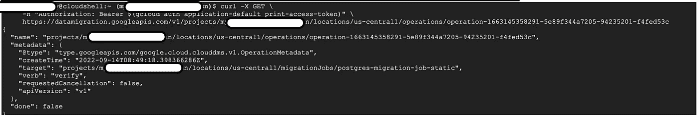

# 如何浏览 Google Cloud 上的数据库迁移服务 REST API 方式！

> 原文：<https://medium.com/google-cloud/cruising-through-database-migration-service-on-google-cloud-the-rest-api-way-8164660a757b?source=collection_archive---------3----------------------->

云计算的出现及其引发的数字化转型所造成的破坏，迫使当今的企业加快其云计算之旅。为了在市场中生存，对快速应用程序现代化的需求无疑让每个组织都保持警觉。数据库迁移是任何应用程序现代化不可或缺的一部分，因为将应用程序迁移到云中需要迁移附带的数据。


谷歌云数据库迁移服务

G oogle 云数据库迁移服务(或 DMS)简化了数据库工作负载向云 SQL(可靠、安全&经济高效的云数据库)的迁移，无需为原生迁移支付额外的基本费用*。此外，它是完全托管的，不需要任何运营或管理开销。

**有关成本考虑的更多详情，请参考下表 1。*


表 1

在本文中，我们将使用 DMS REST API 命令探索 PostgreSQL 实例及其数据库的端到端迁移。

> 注意:这是一个很长的阅读…想知道为什么我没有缩短这个…


出于本文的目的，源 PostgreSQL 实例设置在 GCE VM 上。探险者参考[链接](https://cloud.google.com/architecture/postgresql-migration-with-database-migration-service#creating_a_source_postgresql_instance)。


L 让我们从**先决条件**开始吧！

在通过 DMS 迁移之前，必须对源实例和底层数据库应用以下几项配置:

1.  在源实例上安装 **pglogical** 包并修改必要的配置。
2.  具有复制角色的**用户(在本文中称为“迁移用户”)的可用性。**
3.  在源实例上的每个数据库上安装 **pglogical** 扩展，并授予迁移用户对这些数据库的适当权限。

有关源配置的详细步骤，请参考[链接](https://cloud.google.com/database-migration/docs/postgres/configure-source-database)。

接下来，在 Google 云平台上的目标项目中启用“**数据库迁移服务 API**”&”**云 SQL Admin API** ”(这是我们巡游出航的必备)。可选地，如果我们需要目标云 SQL 和源数据库位于 Google Cloud 上的 VPC 之间的 VPC 对等，可能还需要启用“**服务网络 API** ”。启用此 API 有助于将云 SQL 实例配置为使用私有 IP。稍后，我们将回到“ [**连接方法**](#5608) ”，包括 VPC 对等和其他选项..所以我们现在不必为此烦恼！

用于执行数据库迁移服务 API 命令的 ime。呜-呼！！


**关键** **注意事项**就本文而言:

*   我们将使用 **cURL** 从云 Shell 执行 API 命令。
*   对于认证，我们使用 [**应用默认凭证**](https://cloud.google.com/docs/authentication/rest) 而不保存它们(**g cloud auth Application-Default print-access-token**)。随意使用 [**API 键**](https://cloud.google.com/docs/authentication/api-keys) 或 [**认证的其他首选方法来调用 REST API**。](#171c)
*   对于 PUT/POST 请求，我们必须创建一个 JSON 文件，其中包含 API 执行所需的数据(数据文件是提供敏感数据的一种安全方式)。
*   数据文件的路径(如适用)将通过命令行提供，前面有`@`字符，作为`--data`参数。
*   由于 API 是异步的，任何对象创建 API 命令都将立即返回，即使操作没有完成。这也适用于其他**长时间运行的操作(LRO)** ，如迁移作业的验证。在这种情况下，使用 [**DMS API 来管理操作**](https://cloud.google.com/database-migration/docs/reference/rest/v1/projects.locations.operations) 并在进入下一个相关步骤之前验证操作的完成。

我会准备好…我们开始吧！


## 涉及的主要步骤的快速总结:

1.  [为 PostgreSQL 创建源连接概要文件](#dc67)
2.  [【可选:适用于所有 LRO】运行状态验证](#607d)
3.  [为云 SQL (Postgres)创建目标连接配置文件](#6b3b)
4.  [【可选:仅在需要 VPC 对等时适用】源实例& VPC 对等配置](#b018)
5.  [创建迁移作业](#d26c)
6.  [【可选:推荐】迁移作业的验证](#3435)
7.  [开始迁移作业](#3a8b)
8.  [[手动/自动]验证用于迁移的目标云 SQL 读取副本](#c75b)
9.  [推进迁移工作](#68f8)

## 1.为 PostgreSQL 创建源连接概要文件

按顺序执行以下步骤，创建源连接配置文件。

**A .用创建一个数据文件。json 扩展并将其上传到云 shell:** 为了创建源连接配置文件，以下是作为数据文件提供的最低要求信息—不含 SSL(但不建议用于生产) :

```
{
  "name": "<n**ame_for_the_sourceprofile>**",
  "displayName": "**<display_name_for_the_profile>**",
  "postgresql": {
    "host": "**<host_machine_IP>**",
    "port": 5432,
    "username": "**<migration_username>**",
    "password": "**<password_of_migration_user>**"
  }
}
```

* *适当替换粗体突出显示的文本。另外，请注意 PostgreSQL 使用的默认端口:5432。以下 json 示例:*

```
{
  "name": "postgres-profile", 
  "displayName": "postgres profile",
  "postgresql": {
    "host": "0.1.2.3",
    "port": 5432,
    "username": "dbmig",
    "password": "dbmigpwd"
  }
}
```

**B .从云 shell 执行 curl 命令:**一旦在步骤#A 中创建的 json 被上传到云 shell，执行下面的命令以在期望的 GCP 项目和区域中创建源连接概要文件:

```
curl --header "Authorization: Bearer $(gcloud auth application-default print-access-token)" \
     --header 'Content-Type: application/json' \
     --data @**<path-to-fileuploaded_in_stepA>/<filename>** \
     -X POST \
     https://datamigration.googleapis.com/v1/projects/**<target_gcp_project>**/locations/**<target_gcp_region>**/connectionProfiles?connectionProfileId=**<source_connection_profile_name_from_stepA>**
```

* *适当替换粗体突出显示的文本。下面的命令示例:*

```
curl --header "Authorization: Bearer $(gcloud auth application-default print-access-token)" \
     --header 'Content-Type: application/json' \
     --data @./create_profile_postgres.json \
     -X POST \
     https://datamigration.googleapis.com/v1/projects/mydmsproject-sn/locations/us-central1/connectionProfiles?connectionProfileId=postgres-profile
```

**C .检查来自云外壳的命令的响应:**响应将返回一个 operationId(因为这是一个长时间运行的异步操作)，它可用于在创建目标连接配置文件之前验证上面的创建操作的状态。


来自云壳的响应

**D .从 GCP 控制台验证概要文件的创建:**如果操作成功完成，也可以从 GCP 控制台验证源概要文件的创建(另一种通过管理操作进行验证的方法在步骤#2 中讨论，它适用于任何返回 operationID 的 REST API)。


源连接配置文件

## 2.[可选:适用于所有 LRO]运行状态验证

按顺序执行以下步骤，使用 GET 方法获取有关 operationId 的信息。

*注意:还有其他列出/取消/删除操作的方法，不在我们讨论的范围内。*

**A .从云外壳执行 curl 命令:**执行以下命令来验证给定 operationId 的状态:

```
curl -X GET \-H "Authorization: Bearer $(gcloud auth application-default print-access-token)" \
     https://datamigration.googleapis.com/v1/projects/**<same_as_target_gcp_project>**/locations/**<same_as_target_gcp_region>**/operations/**<operationId_for_any_LRO>**
```

* *适当替换粗体突出显示的文本。下面的命令示例:*

```
curl -X GET \-H "Authorization: Bearer $(gcloud auth application-default print-access-token)" \https://datamigration.googleapis.com/v1/projects/mydmsproject-sn/locations/us-central1/operations/operation-1663145358291-5e89f344a7205-94235201-f4fed53c
```

**B .在操作进行中查看云壳命令的响应:**如果操作进行中，响应将返回详细信息，字段为**“完成”:false** 。在响应元数据部分需要注意的关键字段是"**动词**(操作的名称—验证、创建、升级等。)和“**目标**”(资源标识符)。



来自云壳的响应

**C .检查来自云壳的命令对操作完成的响应:**响应将返回已完成操作的细节，具有字段**“done】:true**和任意一个适当的结果字段:**“error”**(在执行失败的情况下)或**“response”**(在成功执行的情况下)。在响应元数据部分要注意的关键字段是“**动词**”(操作的名称—验证、创建、升级等。)和“**目标**”(资源标识符)。


云外壳对失败操作的响应(迁移作业验证)


来自云外壳的成功操作响应(connectionProfile 创建)

## 3.为云 SQL (Postgres)创建目标连接配置文件

目标配置文件创建外部主连接配置文件(用后缀“_master”标识)以及读取副本(创建期间提供的数据库版本)。实际数据迁移发生在读取复制副本上，然后提升为主复制副本。External master 只是一个链接到源数据库的占位符，可能有不同的数据库版本——这应该完全没问题！

按顺序执行以下步骤，创建目标连接配置文件。

**A .用创建一个数据文件。json 扩展并将其上传到云 shell:** 要创建目的地连接配置文件，请使用以下信息创建一个数据文件:

```
{ "name":"**<name_for_the_targetprofile>**",
  "displayName": "**<display_name_for_the_profile>**",
  "cloudsql": {
    "settings": {
      "databaseVersion": "**<target_database_version>**",
      "tier": "**<machine_type>**",
      "activationPolicy": "**<ALWAYS_or_NEVER>**",
      "autoStorageIncrease": **<true_or_false>**,
      "zone": "**<target_gcp_zone_in_project_region>**",
      "sourceId": "**<source_connection_profile_identifier_fromStep1>**",
      "rootPassword":"**<setup_root_password_here>**"
    }
  }
}
```

* *适当替换粗体突出显示的文本。下面是一个始终活动的连接的 json 示例(设置* "activationPolicy": "NEVER "，如果该实例需要关闭而不考虑传入的连接请求 *) :*

```
{ "name":"new2-target-postgres-profile",
  "displayName": "new2 target postgres profile",
  "cloudsql": {
    "settings": {
      "databaseVersion": "POSTGRES_12",
      "tier": "db-custom-1-3840",
      "activationPolicy": "ALWAYS",
      "autoStorageIncrease": false,
      "zone": "us-central1-b",
      "sourceId": "projects/mydmsproject-sn/locations/us-central1/connectionProfiles/postgres-profile",
      "rootPassword":"mytargetpwd"
    }
  }
}
```

**B .从云 shell 执行 curl 命令:**一旦在步骤#A 中创建的 json 被上传到云 shell，执行下面的命令以在期望的 GCP 项目和区域中创建目的地连接概要文件(与步骤 **1 相同的命令)。B** ):

```
curl --header "Authorization: Bearer $(gcloud auth application-default print-access-token)" \
     --header 'Content-Type: application/json' \
     --data @**<path-to-fileuploaded_in_StepA>/<filename>** \
     -X POST \
     https://datamigration.googleapis.com/v1/projects/**<target_gcp_project>**/locations/**<target_gcp_region>**/connectionProfiles?connectionProfileId=**<destination_connection_profile_name_from_stepA>**
```

* *适当替换粗体突出显示的文本。下面的命令示例:*

```
curl --header "Authorization: Bearer $(gcloud auth application-default print-access-token)" \
--header 'Content-Type: application/json' \
--data @./create_profile_target_postgres.json \
-X POST \
https://datamigration.googleapis.com/v1/projects/mydmsproject-sn/locations/us-central1/connectionProfiles?connectionProfileId=new2-target-postgres-profile
```

**C .查看云壳对命令的响应:** Response 将返回 operationId(类似于**步骤 1。C)** ，可以在进入下一步之前确认完成。

**D .从 GCP 控制台验证概要文件创建:**成功完成后，还可以从 GCP 控制台验证目标云 SQL(主服务器和读取副本)的创建。但是，与源配置文件不同，目标配置文件不会显示在 GCP 控制台上。connectionProfiles 的 GET/LIST 方法可用于检索有关它们的信息。


目标云 SQL 实例

我们已经完成了三分之一的流程…


继续前进！

## 4.[可选:仅在需要 VPC 对等时适用]对等的源实例和 VPC 配置

为了确保源数据库实例和目标数据库实例之间的成功连接，在创建迁移作业之前，必须应用以下配置更改:

1.  **配置私有服务访问:**假设“服务网络 API”已经启用，导航到 VPC 网络页面上的源 VPC，并将其编辑为 a)。[分配 IP 范围](https://cloud.google.com/vpc/docs/configure-private-services-access#procedure)和 b)。[创建到分配范围](https://cloud.google.com/vpc/docs/configure-private-services-access#creating-connection)的私有连接。如果省略此步骤，将不会创建迁移作业。
2.  **在源 VPC 上配置防火墙规则，以允许来自目标 CloudSQL 的连接:**向源 VPC 添加防火墙规则，以允许目标 CloudSQL 在端口 5432(在步骤 1 中创建源配置文件时配置的端口)上的传出 IP 地址。
3.  **编辑源实例配置文件(pg_hba.conf)** : SSH 到安装源 PostgreSQL 的 GCE 虚拟机，编辑 pg_hba.conf 文件以允许目标 CloudSQL 的传出 IP 地址。

*注意:如果不执行上面的步骤# 2 和#3，迁移作业仍将被创建，但是，它将在验证/启动阶段失败，并显示错误:“连接到源数据库失败。请确保连接配置文件上的连接信息正确，并且源数据库可以访问。解决问题，然后开始迁移作业。*

## 5.迁移作业的创建

让我们快速探究一下在源和目标数据库实例之间建立连接的可能方法。

> **连接方法**
> 
> 创建迁移作业时，支持以下 3 种连接方法来建立源数据库和目标数据库之间的连接:
> 
> 1.VpcPeeringConnectivity:该选项需要 Google Cloud 中源数据库所在的 VPC 的详细信息。这用于在云 SQL 和提供的 VPC 之间建立 VPC 对等连接。
> 
> 2.ReverseSshConnectivity*:该选项用于在源数据库和目标数据库之间创建反向 SSH 隧道。这种方法依赖于一个 Bastion 服务器来建立反向 SSH 隧道，最终还会在云 SQL 私有网络和 VPC 之间建立 VPC 对等。
> 
> 3.StaticIpConnectivity * *:当源数据库需要允许来自目标数据库的公共 IP 的传入连接时，使用此选项。
> 
> *关于使用此选项创建迁移作业的更多详细信息，本文不做介绍。
> 
> * *这是默认设置，不需要额外配置。

现在我们已经了解了连接方法，让我们按顺序执行以下步骤，用 VpcPeeringConnectivity 创建一个迁移作业。

**A .用创建一个数据文件。json 扩展并将其上传到云 shell:** 对于创建迁移作业，下面是作为数据文件提供的最低要求信息—对于 VpcPeeringConnectivity(对于 StaticIpConnectivity，只需省略字段:“vpcPeeringConnectivity”):

*注意:* ***【类型】:PostgreSQL 不支持 ONE_TIME*** *，在撰写本文时。*

```
{
   "name":"**<name_for_the_migrationjob>**",
   "displayName":"**<display_name_for_the_job>**",
   "type":"CONTINUOUS",
   "source":"**<source_connection_profile_identifier_fromstep1>**",
   "destination":"**<destination_connection_profile_identifier_fromstep3**>",
   "sourceDatabase":{
      "provider":"DATABASE_PROVIDER_UNSPECIFIED",
      "engine":"POSTGRESQL"
   },
   "destinationDatabase":{
      "provider":"CLOUDSQL",
      "engine":"POSTGRESQL"
   },
   "vpcPeeringConnectivity":{
      "vpc":"**<name_of_vpc_containing_source_database_instance>**"
   }
  }
```

* *适当替换粗体突出显示的文本。以下 json 示例:*

```
{
   "name":"postgres-migration-job",
   "displayName":"postgres migration job",
   "type":"CONTINUOUS",
   "source":"projects/mydmsproject-sn/locations/us-central1/connectionProfiles/postgres-profile",
   "destination":"projects/mydmsproject-sn/locations/us-central1/connectionProfiles/new2-target-postgres-profile",
   "sourceDatabase":{
      "provider":"DATABASE_PROVIDER_UNSPECIFIED",
      "engine":"POSTGRESQL"
   },
   "destinationDatabase":{
      "provider":"CLOUDSQL",
      "engine":"POSTGRESQL"
   },
   "vpcPeeringConnectivity":{
      "vpc":"mydmsproject-sn-vpc-source"
   }
  }
```

**B .从云 shell 执行 curl 命令:**一旦在步骤#A 中创建的 json 被上传到云 shell，执行下面的命令以在期望的 GCP 项目和区域中创建迁移作业:

```
curl --header "Authorization: Bearer $(gcloud auth application-default print-access-token)" \
--header 'Content-Type: application/json' \
--data @./**<path-to-fileuploaded_in_StepA>/<filename>** \
-X POST \
https://datamigration.googleapis.com/v1/projects/<**same_as_target_gcp_project>**/locations/**<same_as_target_gcp_region>**/migrationJobs?migrationJobId=**<id_of_the_migration_job>**&requestId=**<unique_id_for_request>**
```

* *适当替换粗体突出显示的文本。下面的命令示例:*

```
curl --header "Authorization: Bearer $(gcloud auth application-default print-access-token)" \
--header 'Content-Type: application/json' \
--data @./create_migjob_postgres.json \
-X POST \
https://datamigration.googleapis.com/v1/projects/mydmsproject-sn/locations/us-central1/migrationJobs?migrationJobId=postgres-migjob&requestId=mypostgresjob1
```

**C .查看云壳的命令响应:**返回 operationId(类似于**步骤 1。C)** ，只是目标字段将是迁移作业的路径。

**D .从 GCP 控制台验证作业创建:**也可以从 GCP 控制台验证迁移作业的创建。

*注意:如果在此阶段没有启用“* ***”服务网络 API****”(VPC 对等所必需的)，作业创建将失败，并显示错误消息:“无法创建子网。消费者<项目 Id >应在生成默认身份之前启用服务:服务联网”。如果启用了 API，但未配置* [***私有服务访问***](#dfd0) *，作业可能会失败，并显示错误信息:“无法创建子网。请从消费者<项目 Id >网络<源 _ vpc _ 网络>再次创建与服务‘Service Networking . Google APIs . com’的服务网络连接。*


快速查看迁移作业

## 6.[可选:推荐]迁移作业的验证

按顺序执行以下步骤，以验证迁移作业。此步骤执行所有预验证，以确保迁移作业设置正确，并且将成功启动和运行。在开始迁移作业之前，验证迁移作业是一种很好的做法。

**A .从云外壳执行 curl 命令:**迁移作业创建成功后，执行以下命令验证该迁移作业:

```
curl --header "Authorization: Bearer $(gcloud auth application-default print-access-token)" \
     -X POST
https://datamigration.googleapis.com/v1/projects/<**same_as_target_gcp_project>**/locations/**<same_as_target_gcp_region>**/migrationJobs/**<id_of_the_migration_job_created_in_step5>:verify**
```

* *适当替换粗体突出显示的文本。下面的命令示例:*

```
curl --header "Authorization: Bearer $(gcloud auth application-default print-access-token)" \
     -X POST https://datamigration.googleapis.com/v1/projects/mydmsproject-sn/locations/us-central1/migrationJobs/postgres-migjob:verify
```

**B .查看来自云外壳的命令响应:**响应将类似于**步骤 2。b 或者第二步。C** ，取决于操作是正在进行还是已经完成。不应该执行第 7 步到第 9 步，除非响应返回一个 json，带有字段**“done】:true，**，以及名为**“response”**的结果字段，表明执行成功。

**C .从 GCP 控制台验证作业验证状态:**一旦长时间运行的操作成功完成，也可以从 GCP 控制台验证迁移作业的状态，如果作业出错，它将显示在控制台上。


迁移作业验证失败的示例视图


迁移作业成功验证的示例视图


## 7.开始迁移作业

在迁移作业开始时，会拍摄源数据库的初始快照，并将转储文件加载到目标中。在初始加载后，CDC 会持续处理，直到决定将正在进行的流量切换到目标，并将读取副本提升为主副本，我们将在第 8 步中介绍这一点。

现在，我们已经验证了我们的迁移作业没有任何错误，让我们继续执行以下步骤来启动迁移作业。

*注意:如果迁移作业设置不正确(可能是由于源中缺少扩展、未启用适当的 API 等原因。)，启动迁移作业可能会导致错误。因此，最好在开始之前验证迁移作业。*

**A .从云外壳执行 curl 命令:**一旦成功验证了迁移作业，就执行下面的命令来启动迁移作业(语法类似于步骤#6 中的验证命令):

```
curl --header "Authorization: Bearer $(gcloud auth application-default print-access-token)" \
     -X POST https://datamigration.googleapis.com/v1/projects/mydmsproject-sn/locations/us-central1/migrationJobs/postgres-migjob:start
```

**B .查看来自云外壳的命令响应:**响应将类似于**步骤 2。b 或者第二步。C** ，取决于操作是正在进行还是已经完成。

**C .从 GCP 控制台验证作业执行状态:**如果作业启动时没有任何错误，也可以从 GCP 控制台验证迁移作业的状态。


正在开始的**连续**迁移作业的示例视图


成功运行的**连续**迁移作业的示例视图


失败的**连续**迁移作业的示例视图(这是验证步骤派上用场的地方)

## 8.[手动/自动]验证用于迁移的目标云 SQL 读取副本

建议在将目标云 SQL 读取复制副本提升为主副本之前，验证所有迁移的数据库以确保迁移成功。

以下是作为本文的一部分执行的步骤，用于验证目标 SQL 读取复制副本的升级准备情况。

**A .验证通过 1 创建的目标数据库。GCP 控制台或 2。云壳使用 cURL 命令:**

1.导航到 GCP 控制台上的 SQL 实例页面，并选择打开目标读取副本


A.云 SQL 目标数据库

2.从云外壳通过curl 执行**云 SQL API** 命令，并验证响应

```
curl -X GET \
     -H "Authorization: Bearer $(gcloud auth application-default print-access-token)" \
     https://sqladmin.googleapis.com/v1/projects/**<same_as_target_gcp_project>**/instances/**<name_for_the_targetprofile_created_in_step3>**/databases
```

* *适当替换粗体突出显示的文本。下面的命令示例:*

```
curl -X GET \
     -H "Authorization: Bearer $(gcloud auth application-default print-access-token)" \
     https://sqladmin.googleapis.com/v1/projects/mydmsproject-sn/instances/new2-target-postgres-profile/databases
```


来自云壳的响应

**B .登录到目标数据库并验证数据:**验证跨所有目标数据库迁移了正确的信息。跨表的数据应该与源表中的数据相匹配。下面的屏幕截图显示了准确迁移的一个表(没有主键)的数据，以及在 information_schema 上运行的查询，以确认目标表是在源中按原样创建的(即没有主键)。


云 SQL 上目标数据库中的数据

## 9.促进迁移工作

升级迁移作业会断开目标云 SQL 实例与源的连接，并将读取复制副本实例转换为主实例(读/写模式)。现在，我们已经验证了迁移目标没有任何错误，让我们继续执行以下步骤，将云 SQL 读取复制副本提升为主实例。

**A .从云外壳执行 curl 命令:**一旦目的地验证成功迁移(和/或决定将流量切换到目的地云 SQL 实例)，执行以下示例命令将读取副本提升为主副本(语法类似于步骤#6 中的验证命令):

```
curl --header "Authorization: Bearer $(gcloud auth application-default print-access-token)" \
     -X POST https://datamigration.googleapis.com/v1/projects/mydmsproject-sn/locations/us-central1/migrationJobs/postgres-migjob:promote
```

**B .查看来自云 shell 的命令响应:**响应将类似于**步骤 2。b 或者第二步。C** ，取决于操作是正在进行还是已经完成。

**C .从 GCP 控制台验证作业执行状态:**当升级正在进行时(停机时间)，作业的状态将为“升级正在进行中”。一旦迁移作业无任何错误地完成未完成更改的处理，迁移作业的状态将更改为“已完成”,并且可以从 GCP 控制台进行验证。


**D .从 GCP 控制台验证云 SQL 实例的状态:**在 GCP 控制台上，验证外部主服务器和主云 SQL 实例(以前的读取副本)之间的链接不再存在。


B onus 部分有一些需要了解的命令和参考链接，可以随时派上用场！

## 快速命令

1.  **删除连接配置文件:**

```
curl -X DELETE \
     -H "Authorization: Bearer $(gcloud auth application-default print-access-token)" \
     https://datamigration.googleapis.com/v1/projects/<**gcp_project_that_contains_theprofile>**/locations/**<gcp_region_of_theprofile>**/connectionProfiles/**<name_of_the_profile_to_delete>**
```

**2。删除迁移作业:**

*注意:目标 CloudSQL 连接概要文件也会随着迁移作业而被删除。*

```
curl -X DELETE \
     -H "Authorization: Bearer $(gcloud auth application-default print-access-token)" \
     https://datamigration.googleapis.com/v1/projects/<**gcp_project_that_contains_thejob>**/locations/**<gcp_region_of_thejob>**/migrationJobs/**<name_of_the_job_to_delete>**
```

**3。列出项目位置中的所有连接配置文件:**

```
curl -X GET \
     -H "Authorization: Bearer $(gcloud auth application-default print-access-token)" \https://datamigration.googleapis.com/v1/projects/<**gcp_project_to_listprofiles>**/locations/**<gcp_region_to_listprofiles>**/connectionProfiles
```

**4。列出项目中的所有迁移作业-位置:**

```
curl -X GET \
     -H "Authorization: Bearer $(gcloud auth application-default print-access-token)" \https://datamigration.googleapis.com/v1/projects/<**gcp_project_to_listjobs>**/locations/**<gcp_region_to_listjobs>**/migrationJobs
```

**5。获取特定连接配置文件的详细信息:**

```
curl -X GET \
     -H "Authorization: Bearer $(gcloud auth application-default print-access-token)" \https://datamigration.googleapis.com/v1/projects/<**gcp_project_of_theprofile>**/locations/**<gcp_region_of_theprofile>**/connectionProfiles/**<name_of_the_connection_profile>**
```

**6。获取特定迁移作业的详细信息:**

```
curl -X GET \
     -H "Authorization: Bearer $(gcloud auth application-default print-access-token)" \https://datamigration.googleapis.com/v1/projects/<**gcp_project_of_thejob>**/locations/**<gcp_region_of_thejob>**/migrationJobs/**<name_of_the_migration_job>**
```

## 参考链接

1.  [使用 DMS 迁移 PostgreSQL】](https://cloud.google.com/architecture/postgresql-migration-with-database-migration-service)
2.  [postgres 数据库迁移快速入门](https://cloud.google.com/database-migration/docs/postgres/quickstart)
3.  [数据库迁移服务 REST API](https://cloud.google.com/database-migration/docs/reference/rest)
4.  [调试迁移作业的问题](https://cloud.google.com/database-migration/docs/postgres/diagnose-issues)
5.  [SSL/TLS 证书设置](https://cloud.google.com/sql/docs/postgres/configure-ssl-instance#rest-v1_1)(不作为本文的一部分)
6.  [为调用 REST APIs 设置认证](https://cloud.google.com/docs/authentication/)


快乐学习！