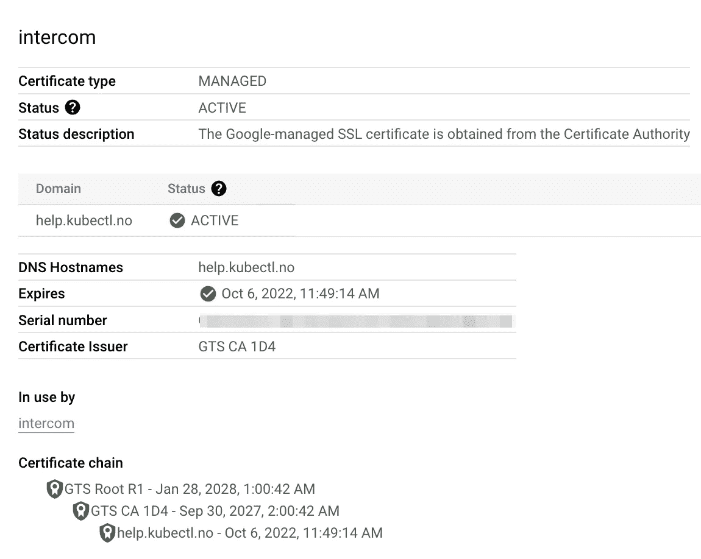

# 使用 GCP 的自定义内部通信域

> 原文：<https://medium.com/google-cloud/custom-intercom-domain-using-gcp-fceabab3ab69?source=collection_archive---------1----------------------->

这篇短文描述了如何在 Google 管理的 SSL 证书后面添加一个自定义域到 Intercom。目前可用的指南仅支持通过 CloudFare CDN 的基于 AWS 的解决方案，我们可以轻松地将其复制到 GCP。由于不是 Intercom 官方提供的，所以我决定为 Google provider 做一个 Terraform 模块。

本指南不包括 CDN 功能，因为我认为没有必要。文档和地形模块本身可以在[这里](https://registry.terraform.io/modules/adriantr/intercom/google/latest)找到。

该解决方案由三个主要部分组成:

*   解析为 LB 的 IP 地址的 DNS 条目

*   通过 HTTPS 向内部通信转发请求的互联网网络端点组

*   具有 SSL 证书的 HTTPS 代理接收请求并将其转发给后端服务

一旦部署了该模块，您会注意到负载平衡菜单中有以下负载平衡器:

您可以轻松地导航到证书以检查其状态，也可以导航到后端服务以查看其指向的内容。提供证书后，您应该会看到关于证书本身的以下信息:

当输入主机名时，在本例中是`help.kubectl.no`，您应该被转到有效 SSL 证书后面的内部通信的帮助页面。