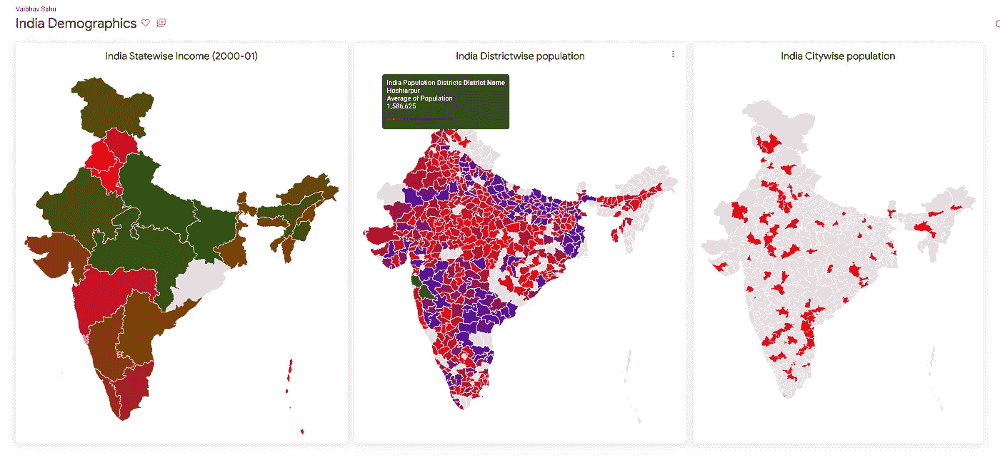

# Looker 中的自定义地图层

> 原文：<https://medium.com/google-cloud/custom-maps-in-looker-1c2e103496df?source=collection_archive---------0----------------------->

Looker 地图可视化(来源:[https://cloud . Google . com/static/looker/docs/images/explore-Map-styles-514 . png](https://cloud.google.com/static/looker/docs/images/explore-map-styles-514.png))

**Looker** 是一个商业智能和数据分析平台，帮助用户轻松探索、分析和分享商业见解。

旁观者清

*“通过向更多用户提供更多见解，提高* [*生产力、决策能力、*](https://cloud.google.com/resources/looker-forrester-tei) *和创新能力。”*

# 长相特征

Looker 架构图

Looker 是一个基于浏览器的 BI 平台。Looker Jars 可以安装在内部，也可以安装在任何云上。Looker 还提供了一个 Looker 托管的云实例，以避免基础设施的设置和维护。Looker 可以连接到各种数据库，从 Redshift、BigQuery 等云数据库到 MySQL、PostgreSQL 和 Hadoop SQL 等 RDBMS，如 Hive、Impala 和 Spark 等。Looker 的一个主要优点是，它使用数据库连接运行数据库上的所有查询；looker 没有任何内部分析引擎。它基于用户设计的语义层(LookML)生成 SQL，并将其发送到数据库运行，这样它就可以利用数据库服务器的性能。从数据库中获取数据后，looker 在仪表盘可视化的表格和图表中显示数据。

LookML 是 Looker 开发过程中不可或缺的一部分。LookML 是一种帮助开发人员创建语义建模层的建模语言。LookML 是一种用于描述 SQL 数据库中的维度、聚合、计算和数据关系的语言。

在 Looker 的许多有用特性中，使用 Git 进行版本控制是值得注意的。它使多个用户的协作变得无缝和可控。Looker 也有广泛的 API 支持，这有助于在 web 平台中嵌入 looker 外观和仪表板，与第三方工具集成，并执行许多自动化操作。

# **Looker 地图**

像其他 BI 工具一样，Looker 也提供了地图可视化。Looker 有一个内置的地图层，包括

1.  **国家:**接受完整的国家名称，[ISO 3166–1 alpha-3](http://en.wikipedia.org/wiki/ISO_3166-1_alpha-3)三个字母的国家代码
2.  **英国邮政编码** —接受[英国邮政编码区](https://en.wikipedia.org/wiki/Postcodes_in_the_United_Kingdom#Postcode_area)
3.  **美国各州** —接受完整的州名和两个字母的州名缩写。
4.  **美国县 FIPS** —处理由五个字符组成的美国县 FIPS 县代码的字符串字段。该图层仅适用于交互式地图。
5.  **美国邮政编码** —处理由五个字符组成的美国邮政编码的字符串字段。`[type: zipcode](https://cloud.google.com/looker/docs/reference/param-dimension-filter-parameter-types#zipcode)`的尺寸自动使用`us_zipcode_tabulation_areas`图层。

对于其他区域，自定义点或面区域查看器提供了自定义地图图层的功能。要在 looker 项目中定义自定义地图层，我们需要

*   获取包含所需区域的地理空间数据(弧)的 TopoJSON 文件
*   将 TopoJSON 文件上载到 LookML 项目
*   更新定义使用上述 TopoJSON 文件创建的地图图层的 LookML 模型
*   使用地图图层更新视图文件中的相应尺寸

在下面的示例中，我们将为印度各州和城市创建一个自定义地图层，并在**印度**的地图上创建一个显示收入和人口分布的仪表板。

# 例子

印度各地区的人口分布(2011 年印度人口普查数据)

## 得到一个拓扑

Looker 接受 TopoJSON 文件格式来显示地理数据。TopoJSON 是 GeoJSON 对拓扑编码的扩展。TopoJSON 是比 GeoJSON 更紧凑的格式。对于许多地图区域，可以直接从互联网上下载 TopoJSONs。我在下面列出了一些**印度地图**区域的链接

*   [Data Meets](http://projects.datameet.org/maps/) 拥有社区创建的印度地图。它拥有印度州界、区界、议会选区、城市和村庄边界的地图。
*   这个 [GitHub 链接](https://gist.githubusercontent.com/anilnairxyz/1ca20f47982712cf6d4128064e3a6feb/raw/3e0c829745ebf567cb8e15399168ba2777ba1864/ne_10m_admin_1_India_Official.json)有一张印度邦级行政地图
*   这个 [Git Repo](https://github.com/geohacker/india) 有印度各州、地区和 Taluk-wise GeoJSON 文件。
*   [IGISMAP](https://map.igismap.com/gis-data) 提供了一个地图界面，有很多图层可以选择。然后，它允许用户下载具有首选格式(KML、CSV、SHP 和 GeoJSON)的图层的地图。它还允许绘制自定义多边形。它附带了很多地图功能，非常有用。它要求用户创建一个帐户，免费计划允许有限的下载。
*   geojson.io 是另一个很好的在线地图工具，可以在地图区域绘制自定义多边形。这些自定义多边形可以在以后作为地理空间文件格式下载。TopoJSON 就是其中之一。
*   Mapshaper.org 是一个很棒的在线工具，可以将一种格式的地理空间数据文件转换成另一种格式。
*   [这个 Kaggle 数据集](https://www.kaggle.com/datasets/codebreaker619/indian-states-map?select=india_state.geojson) —印度各邦地图和位置坐标有详细的 geoJSON 文件。但是，它的尺寸更大。
*   这个 GitHub Repo 有印度主要城市的 TopoJSON。
*   我已经上传了一些地图文件到我的 [GitHub 库](https://github.com/sahuvaibhav/Looker-Custom-Maps-Tutorial)中，这可能会有用。所有的地图都与印度有关。

**** *注意:*** *文件越大，在 looker 中加载自定义地图的延迟越大。建议使用较小的 TopoJSON 文件(< 1 MB)，以便在 Looker 中更快地加载地图。*

## 将 TopoJSON 上传到 Looker 项目

在 Looker 中创建自定义地图最重要的部分是获得正确的地形。在得到想要的区域的 TopoJSON 后，我们需要将 TopoJSON 文件上传到 Looker 项目。

对于这个例子，我已经将一些公开的印度人口统计数据上传到一个 BigQuery 数据集中。

1.  在 Looker 中创建一个连接，以连接到数据可用的 BigQuery 数据集。
2.  使用上述连接创建新的 LookML 项目。这将创建一个包含模型和视图的项目文件夹。

创建新的 LookML 项目。

3.将地图文件上传到 LookML 项目文件夹中。

上传了地图文件的 LookML 项目

我已经上传了 4 个地图文件到项目的“模型”文件夹中。或者，可以创建一个名为“地图”的新文件夹，并上传地图文件。

## 更新模型文件

将 TopoJSON 文件上传到 LookML 项目后，我们必须更新模型文件以指定如何使用地图层。

使用地图图层更新 LookML 模型

我已经用 3 个地图图层更新了模型文件，参考了上一步上传的 TopoJSON 文件。

**map_layer* 也有一个参数 *property_key* ，它是要绘制的 TopoJSON 数据中的*属性。TopoJSON 支持每个区域的任意元数据。默认情况下，使用第一个匹配的属性。*

## 更新视图文件

现在我们需要将视图文件中的维度与新创建的地图层连接起来。为此，我们将使用`[map_layer_name](https://cloud.google.com/looker/docs/reference/param-field-map-layer-name)`参数更新视图文件中的相应尺寸。

维度状态下的地图图层

维度城市中的地图图层

我们可以看到，上述两个维度与模型文件中定义的相应地图层相关联，如上所述。

现在，我们可以在 Explore 部分创建 Looks 并更新仪表板。

Looker 自定义地图可视化

注意，在创建可视化时，我使用了**静态地图(区域)**来聚焦感兴趣区域的地图区域。

这是最后的仪表板，显示了印度各州、地区和城市的地图以及人口统计数据。

Looker 仪表板:印度人口统计

# 参考:

1.  标题图片:[https://cloud.google.com/looker/docs/map-options](https://cloud.google.com/looker/docs/map-options)
2.  Looker 创建自定义地图区域:[https://cloud . Google . com/looker/docs/best-practices/how-to-create-custom-map-regions](https://cloud.google.com/looker/docs/best-practices/how-to-create-custom-map-regions)
3.  Looker 地图图层:[https://cloud . Google . com/looker/docs/reference/param-model-Map-Layer](https://cloud.google.com/looker/docs/reference/param-model-map-layer)
4.  印度城市数据库:[https://simplemaps.com/data/in-cities](https://simplemaps.com/data/in-cities)
5.  印度各邦数据:[https://www . ka ggle . com/datasets/gokullajkmv/Indian-state-wise-data-from-RBI？select = RBI+DATA+States _ wise _ population _ income . CSV](https://www.kaggle.com/datasets/gokulrajkmv/indian-statewise-data-from-rbi?select=RBI+DATA+states_wise_population_Income.csv)
6.  2011 年印度地区人口普查:[https://www.kaggle.com/datasets/danofer/india-census?select =印度-地区-人口普查-2011.csv](https://www.kaggle.com/datasets/danofer/india-census?select=india-districts-census-2011.csv)
7.  本博客中使用的数据文件和 topojson 文件可在我的 [GitHub repo](https://github.com/sahuvaibhav/Looker-Custom-Maps-Tutorial) 获得