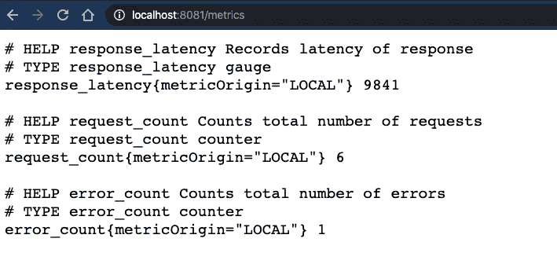
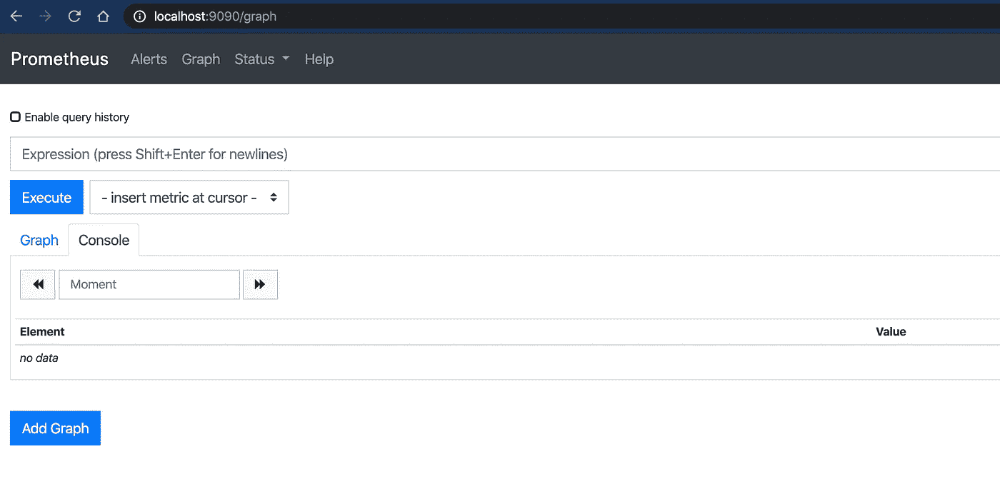
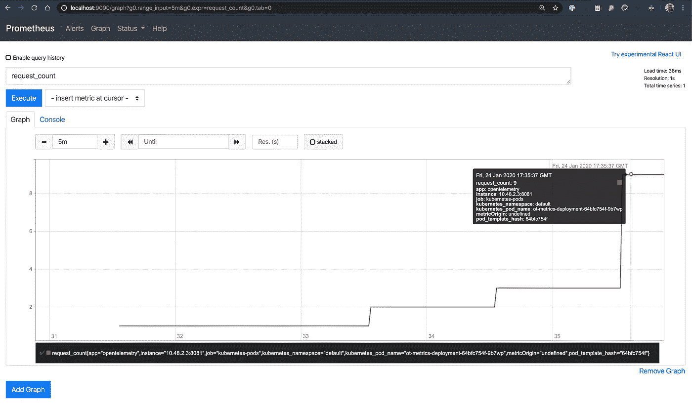

# 使用 OpenTelemetry(和 Prometheus)在 Node.js 中自定义指标

> 原文：<https://medium.com/google-cloud/custom-metrics-in-node-js-with-opentelemetry-and-prometheus-c10c8c0204d3?source=collection_archive---------0----------------------->

在我的上一篇[帖子](https://dev.to/yurigrinshteyn/distributed-tracing-with-opentelemetry-in-go-473h)中，我用 [OpenTelemetry](https://opentelemetry.io) 解决了我的第一个项目，并构建了一个基本的演示来展示如何使用分布式跟踪和 Stackdriver 导出器。我选择 Go 来做这个练习，因为当时它是唯一一种有 Stackdriver 导出器来跟踪的语言。这一次，我想尝试将 OpenTelemetry 用于度量工具，并注意到 opentelemetry-go 还没有准备好度量的 Stackdriver 导出器。我尝试使用 Prometheus exporter 来代替，但是不知道如何让它与 Mux 路由器配合良好，于是改用 Node.js。

所以——下面是我如何构建一个基本的 Hello World Node.js 应用程序，并用 OpenTelemetry 对其进行测试，以向 Prometheus 展示基本的“黄金信号”指标(请求计数、错误计数和延迟)。

和往常一样，我在 Github [repo](https://github.com/yuriatgoogle/stack-doctor/opentelemetry-metrics/demo) 中提供了我的代码。让我们回顾一下有趣的部分。

# 导入和设置

我只使用了三个外部包——Express 用于处理请求，两个 OpenTelemetry 包——一个用于编写指标，另一个用于将指标导出到 Prometheus。对`:8081/metrics`的请求将由普罗米修斯公司处理。

> *注意，我已经覆盖了 Prometheus exporter* [*代码*](https://github.com/open-telemetry/opentelemetry-js/blob/master/packages/opentelemetry-exporter-prometheus/src/prometheus.ts#L32-L38) *中设置的默认端口。*

# 度量定义

在下一部分中，我定义了我想要跟踪的三个指标。请求计数和错误计数都是单调计数器，这意味着它们只能增加。响应延迟是一个非单调的指标，因为我想跟踪每个请求的延迟。我还使用了一个标签，因为我不知道如何在没有标签的情况下让指标正常工作。

# 请求处理

此时，应用程序准备好接受传入的请求。对`:8081/metrics`的请求将由 Prometheus 处理，我使用 Express 来处理对`:8080/`的请求。对于每一个请求，应用程序都会创建一个计时器(`measuredLatency`)，并让它一直运行，直到它准备好响应。它生成一个 0 到 100 之间的随机数，并使用它返回一半的错误，在这种情况下，不会报告延迟。如果没有要返回的错误，应用程序`sleeps`在 1 到 10 秒之间，拍摄另一个时间快照，计算经过的时间，并返回该值作为延迟。

# 指标端点

当我在本地运行应用程序时，我可以点击`/metrics`端点，查看我在那里注册的指标:



在这一点上，我已经准备好运行应用程序，并产生实际的流量。这需要:

*   创建 GKE 集群
*   在上面安装普罗米修斯
*   部署 app，配置要抓取的`/metrics`端点

让我们开始吧！

# 创建集群

我采用了一种非常简单的方法，并使用云控制台创建了一个使用 n1 标准节点的单节点集群(结果证明这是一个错误的选择)。然后，我使用`gcloud container clusters get-credentials <cluster> --zone=<zone>`获取凭证，以便能够从我的本地工作站访问它。

```
$ kubectl get nodesNAME                                     STATUS   ROLES    AGE     VERSIONgke-small-cluster-pool-1-b40da891-fc1p   Ready    <none>   7h27m   v1.15.7-gke.23
```

我选择了这个简单的选项:

```
$ brew install helm *# install helm, the package manager for Kubernetes*$ helm repo add stable https://kubernetes-charts.storage.googleapis.com/$ helm repo update$ helm install prometheus stable/prometheus
```

这足以让 Prometheus 启动并运行，但我必须增加集群的大小，以获得足够的 CPU 来运行一切。

```
> kubectl get podsNAME                                            READY   STATUS    RESTARTS   AGEprometheus-alertmanager-77995478d8-lh4c5        2/2     Running   0          6m34sprometheus-kube-state-metrics-f96cbbf97-vc56g   1/1     Running   0          6m34sprometheus-node-exporter-8xlwp                  1/1     Running   0          114sprometheus-node-exporter-s2pnt                  1/1     Running   0          6m34sprometheus-node-exporter-xbtrs                  1/1     Running   0          112sprometheus-pushgateway-747dc5fb57-rw72p         1/1     Running   0          6m34sprometheus-server-6f7467bfdd-5vfgx              2/2     Running   0          6m34s
```

我通过使用`port-forward`验证了普罗米修斯正在工作:



# 部署应用程序

我创建了一个简单的 Dockerfile 文件:

我使用`gcloud builds submit`构建了映像，并创建了一个部署文件:

接下来，我使用`kubectl apply -f`创建应用程序，并使用`kubectl expose deployment --type=LoadBalancer`使其对外可用。一旦外部 IP 地址可用，我就配置一个 Stackdriver 正常运行时间检查来生成稳定的流量。

至此，所有的设置都已完成。我再次访问 Prometheus，以确认我使用 OpenTelemetry 创建的指标可用:



# 我学到了什么？

在我的 OpenCensus [练习](https://github.com/yuriatgoogle/stack-doctor/blob/master/opencensus-metrics/node/app.js)中，我学会了使用视图、测量和度量等原语。我还学习了如何创建直方图和控制聚合。我在 OpenTelemetry 方面非常有限的经验表明，这个模型似乎更简单一些。在本练习中，我简单地定义了指标，并在必要时设置了它们的值。出口商负责剩下的部分。虽然我可能错过了很多细节，但这种最初的体验使事情看起来更容易开始，这对刚刚开始使用这种仪器的人来说非常好。

我也意识到这个项目仍然处于相对早期的阶段。例如，在我写这篇文章时，没有可用的 Stackdriver 度量导出器。已经为(至少)Go 和 Node.js 编写了跟踪导出器，但是还没有度量标准。因此，在 GCP 上使用它将要求我使用这些[指令](https://cloud.google.com/monitoring/kubernetes-engine/prometheus#configuration)来设置普罗米修斯/Stackdriver 集成

我非常喜欢学习如何使用 OpenTelemetry 来创建定制的度量遥测技术——使用它来检测我的应用程序以暴露“黄金信号”非常简单，这在很大程度上要归功于 OpenTelemetry Github repo 中提供的优秀示例。感谢您的阅读——下次当我尝试使用 OpenTelemetry 将跟踪和日志集成到 Stackdriver 中时再来！

【http://github.com】最初发表于[](https://gist.github.com/20e9affa4aaf2ba8adf413ca72ab5b76)**。**