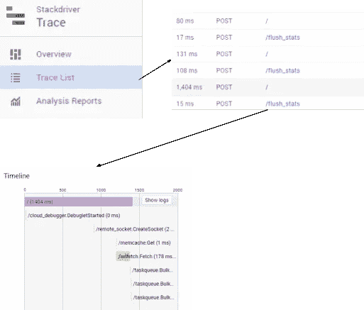
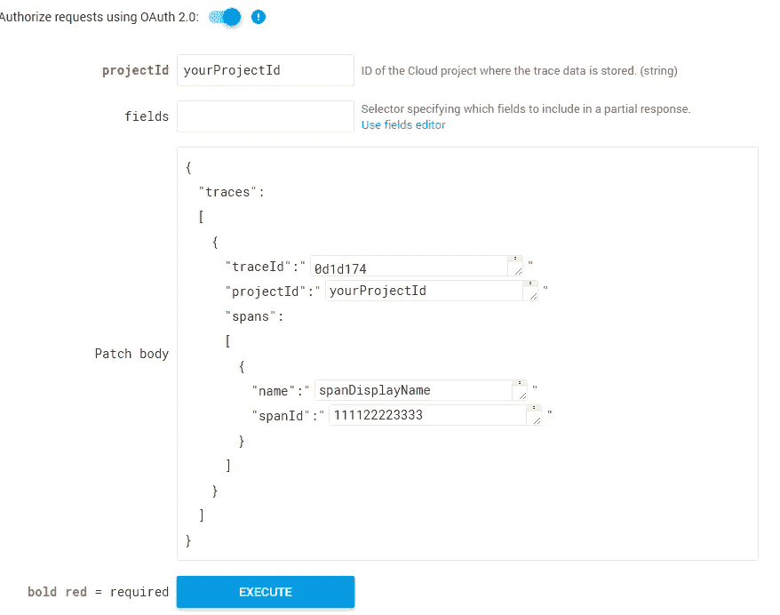
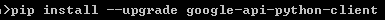
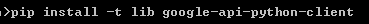
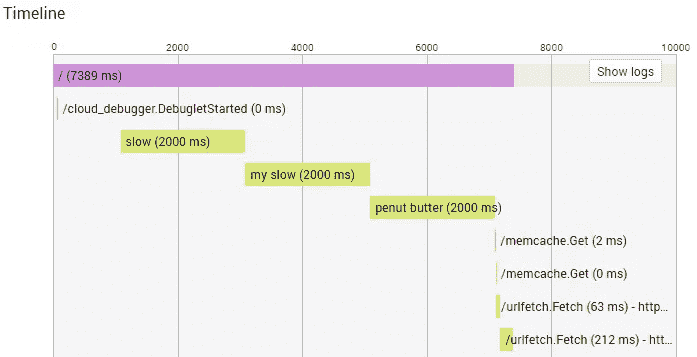
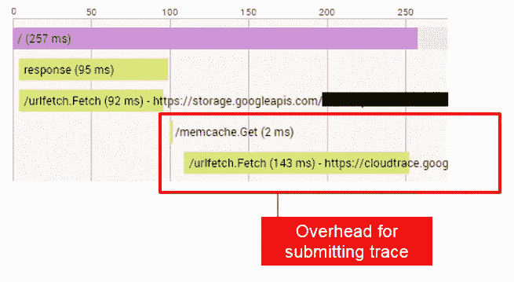

# 使用 Stackdriver API 分析 GAE 时的自定义跟踪

> 原文：<https://medium.com/google-cloud/custom-tracing-in-profiling-gae-using-the-stackdriver-api-b270288622c6?source=collection_archive---------0----------------------->

如果你还记得几周前的一次，我帮助了一组开发人员，为 Google App Engine 的 StackDriver 添加了一些自定义跟踪信息。从那以后，我收到了许多请求，询问我是如何做到的更多信息，所以，让我们来看看。

# 了解跟踪

跟踪(也称为[“在线分析”](http://www.gamasutra.com/view/news/176420/Indepth_Using_Chrometracing_to_view_your_inline_profiling_data.php))是任何性能测试中的重要工具。该工具允许您获得代码中开始/结束 API 调用之间的精确计时，并且在处理复杂的依赖关系时，非常有助于跟踪您的时间去了哪里。跟踪的一个缺点是，它要求您修改现有的源代码来跟踪给定段所花费的时间。这通常包括用基于作用域的宏来处理代码，这些宏处理定时、缓冲以及将特定数据记录到某些输出中。

这也是 Stackdriver 集成 App Engine 标准如此牛逼的原因；它将代表您处理所有 RPC 命令的跟踪，不需要修改代码。

云控制台中列出了所有跟踪，您可以查看、浏览所有捕获的跟踪。最后，选择一个将显示 RPC 调用位置和请求时间的图形表示:

# Stackdriver 跟踪 API

虽然 RPC 跟踪很重要，但有时也需要对本地代码进行分析。因为代表你跟踪所有的函数调用会是一个巨大的性能问题，所以 Stackdriver 提供了一个 [*补丁* API](https://cloud.google.com/trace/docs/reference/v1/rest/v1/projects/patchTraces) ，允许你用定制数据来增加你的跟踪。这样，您就可以准确地指定想要包含在跟踪中的数据，而不会有任何干扰。

您可以[查看文档](https://cloud.google.com/trace/docs/reference/v1/rest/v1/projects/patchTraces)，但是要点是您点击了一个 REST 端点，并向它提供了一个 JSON 字符串，其中包括您的计时数据和您想要修补的跟踪 ID。与 api 交互的唯一复杂部分在于 A) Auth，以及 JSON 字符串的格式。

谢天谢地，对于 B 来说，[文档](https://cloud.google.com/trace/docs/reference/v1/rest/v1/projects/patchTraces)包含了一个小部件，您可以使用它来弄清楚到底需要什么。如果您使用下面的值，您将获得一个正确执行小部件的单一跨度。

# 设置本地环境

一旦您准备好开始测试代码，您将需要首先设置您的本地环境。我正在使用 python，因此需要安装 Google API python 客户端库。

首先，导航到您的项目文件夹，并升级库:

接下来，您需要在本地将库安装到项目中；调用下面的命令在一个。/lib "文件夹。当您部署项目时，该文件夹也将被复制。

FWIW 在 API 客户端的“[入门页面](https://developers.google.com/api-client-library/python/start/get_started)上有更多的细节(如果你需要深入了解)。

# 创建探查器类

如果你像我一样已经存在了很长时间，那么你很可能已经多次编写了一个定时器类。这个概念非常简单:给定一个定时器对象，调用 start/stop 应该跟踪它们之间经过的时间。我们的内联分析器实际上没有什么不同，只是我们为 timer 类添加了一个惟一的 ID(为了保持一致，我称之为“span ”),还添加了一些限定了作用域的回调函数，使它更易于使用。

为了为我们的请求收集跟踪，我们需要某种管理对象，它具有足够长的持久性来存储我们的跨度并在被请求时返回它们的数据。这可以采取许多形状和形式，我的简单版本是故意裸露的骨骼，目的是在每次您想要开始一个范围概要文件时调用 *span* 函数。

用法非常简单:

# 向 API 提交结果

有了上面的类，我们就有能力对代码块进行计时，所以下一个大问题是如何正确地将它们提交给 StackDriver API。为此，我们首先需要能够获取项目的 ID，以及请求对象的 ID(这样我们就可以修补它的跟踪)。

可以通过 appengine API 轻松获取项目 ID(注意，这需要为身份库添加第三方库。查看[Google . app engine . ext . vendor](https://cloud.google.com/appengine/docs/standard/python/tools/using-libraries-python-27#vendoring)了解更多)。

[https://gist . github . com/main roach/5d 75d 882 e 81 e 1 ba 8 ad 0 CD 7 cbb 93 AFB 0 b](https://gist.github.com/mainroach/5d75d882e81e1ba8ad0cd7cbb93afb0b)

请求 ID 也很容易获得，因为它是由 Google 前端生成的，并且通常在请求头中注释为“X-Cloud-Trace-Context”。我们可以很容易地获取这些信息(如果存在的话):

因为我们的 span & trace 对象允许生成 JSON，所以我们可以通过一些简单的数据构建来创建栈驱动 API 所期望的 JSON blob:

现在我们已经准备好了所有数据，我们终于可以连接到 stackdriver API 了。这首先要求我们按顺序进行一些身份验证，然后最终提交我们感兴趣的主体数据。为了获得关于如何做到这一点的信息，我不得不深入研究 API 库，但这里是所需的最短版本:

# 所有人现在在一起！

我修改了 TraceContext 对象以接受来自头文件包的云跟踪信息，并将其打包在一起:

打开请求的跟踪，向我们展示了我们想要的东西:

# 警告

我必须强调的是，这段代码现在作为快照工作。我预计其中一些东西的格式可能会改变，或者一些 API 会随着时间的推移成熟为官方 API。

此外，请注意，您将会看到响应时间增加，因为提交跟踪结果会增加一些将数据推送到跟踪 API 的开销:

因此，请确保非常小心地部署和使用这些跟踪数据。您必须始终注意，您的跟踪信息不会对性能造成太大的影响！