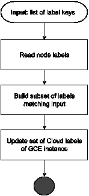

# 自定义 GKE 节点标签

> 原文：<https://medium.com/google-cloud/customizing-gke-nodes-labeling-d921a35cb9b4?source=collection_archive---------1----------------------->

术语*标签*通常描述附加到某个对象的键/值对。在 Kubernetes 中，标签是附加到显示的资源(如 pod)上的键/值对。Kubernetes 标签可用于组织和选择对象子集。谷歌云标签(在本文中称为云标签)主要用于[对计费报告中的资源](https://cloud.google.com/billing/docs/concepts#labels)进行分类，以简化支出成本的分析。当术语*标签*用于 GKE 服务时，有时会产生歧义和混乱。将它们称为“集群标签”的 GKE 文档可能会造成混淆。本质上，集群标签是在[集群级别](https://cloud.google.com/kubernetes-engine/docs/how-to/creating-managing-labels)上定义的云标签。如果需要更深入的使用分析，GKE 提供了一个[集群资源使用](https://cloud.google.com/kubernetes-engine/docs/how-to/cluster-usage-metering)机制，该机制根据名称空间或 Kubernetes 标签跟踪 Kubernetes 对象的资源使用情况。这种机制没有与计费报告集成，并且需要额外的成本计算。

有时不需要在 Kubernetes 对象级别上进行成本分析。在单个 Kubernetes 节点的级别上跟踪支出成本就足够了。一个简单的解决方案是将集群节点的 Kubernetes 标签“导出”到运行节点的 GCE 实例的云标签中。

# 一种算法

在 Kubernetes 中，集群节点被标记为存储关于底层主机的元数据，如 CPU 或操作系统家族，并支持亲和或反亲和部署场景。节点也有注释和污点，可以用于相同的目标。为了简单起见，这个解决方案将只使用节点的标签。

该算法的一个输入是标签键的列表。该算法将读取节点的所有标签，并将它们与列表进行比较。对于每个匹配的键，它将创建一个具有相同键/值对的云标签，并将其设置为运行该节点的 GCE 实例。



该算法的实现是使用 Python 3.8 完成的，但可以很容易地移植到其他语言。

# 读取 Kubernetes 节点标签

使用 [Kubernetes API](https://kubernetes.io/docs/reference/kubernetes-api/cluster-resources/node-v1/#get-read-the-specified-node) 读取节点标签。虽然可以使用 Kubernetes 客户端库，但是一个简单的 HTTP 请求就可以了:

遵循[准则](https://kubernetes.io/docs/tasks/administer-cluster/access-cluster-api/#directly-accessing-the-rest-api-1)，代码使用`kubernetes.default.svc`主机名来调用 API 服务器。可以从自动安装的令牌文件中读取与 pod 相关联的服务帐户的授权凭证。该帐户必须拥有对群集资源“节点”的读取权限。节点名可以通过 pod 的环境变量公开。响应包含带有所有节点属性的 JSON。JSON 与命令返回的 JSON 相同:`kubectl get node {NODE_NAME} -o=json`。

# 更新 GCE 实例的云标签

为 GCE 实例设置云标签也可以使用 HTTP 请求来实现。但是最简单的方法是使用用于 Python 的 Google 客户端库。实现使用`googleapiclient.discovery`和`google.auth`包。初始化使用连接到 GKE 节点虚拟机的云服务帐户的凭据。

必须使用 [setLabels](https://cloud.google.com/compute/docs/reference/rest/v1/instances/setLabels) API 为 GCE 实例设置云标签。除了一组标签之外，调用参数还包括项目 id、区域名、实例名和当前标签指纹。GKE 对集群节点和托管节点的 GCE 实例使用相同的名称。使用`failure-domain.beta.kubernetes.io/zone`键将区域名称存储为 Kubernetes 标签。它可以从节点标签中检索。要获取当前云标签指纹，需要一个额外的 [API 调用](https://cloud.google.com/compute/docs/reference/rest/v1/instances/get)。

# 部署解决方案

解决方案实现由两个文件组成:main.py 和 requirements.txt。或者，可以将文件加载到配置映射中，并将映射作为目录安装到 pod 的容器中。替代方法避免了构建/管理容器映像的需要。可以使用以下命令直接从文件中创建配置映射:

```
kubectl create configmap node-labeling-files --from-file=main.py \
  --from-file=requirements.txt
```

部署必须使用一个服务帐户，该帐户允许它通过 Kubernetes API 读取“节点”资源。建议创建一个。

一个 [daemonset](https://kubernetes.io/docs/concepts/workloads/controllers/daemonset/) 最适合运行该解决方案，因为它在集群的每个节点上运行一个 pod 实例。daemonset 中的 pod 从 configMap 挂载文件，并定义预配置的 Kubernetes 服务帐户。命令参数将解决方案配置为使用关键字“workload”来“导出”Kubernetes 标签:

# 关于最佳实践的建议

所展示的解决方案仅用于演示。使用指定的云服务帐户运行 Kubernetes 工作负载是一个很好的安全实践，该帐户使用[工作负载标识](https://cloud.google.com/kubernetes-engine/docs/how-to/workload-identity)链接到工作负载的 Kubernetes 服务帐户。使用附加到集群 GCE 实例的服务帐户被认为是不太安全的。

> 请注意，如果您在启用了工作负载身份的 GKE 集群上尝试这个解决方案，您将无法使用附加到 GCE 实例的云服务帐户。

daemonset 和其他对象应该部署到专用的命名空间，而不是像演示中那样部署到“默认”命名空间。

# 那里没有什么？

*   该解决方案没有描述云服务帐户的配置和工作负载身份的使用。
*   该解决方案不包括标记装载到 GCE 实例的持久磁盘。
*   该解决方案不支持实时更改群集节点标签。

# 包裹

*   从 pod 调用 Kubernetes API 非常简单。它需要一个具有适当权限的服务帐户的小设置，并且可以在没有额外的库或框架的情况下完成。
*   调用谷歌 API 也是一样，尽管使用[谷歌客户端库](https://developers.google.com/api-client-library)使得代码更加紧凑和易于实现。
*   该解决方案不需要管理授权凭证。
*   解决方案演示的完整代码可以在 [github](https://github.com/minherz/gke_node_labeling) 中找到。