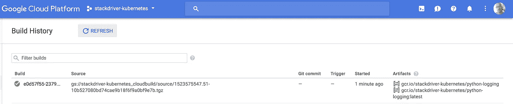
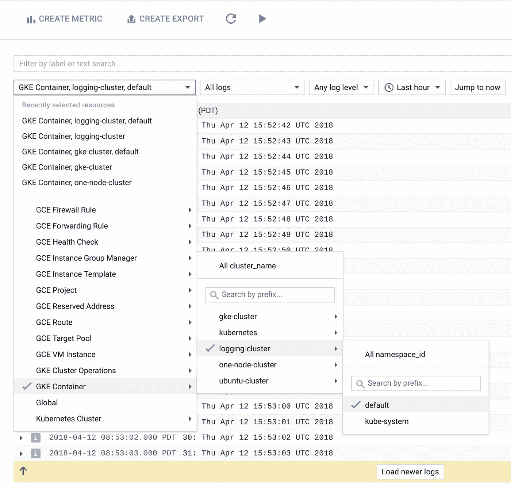
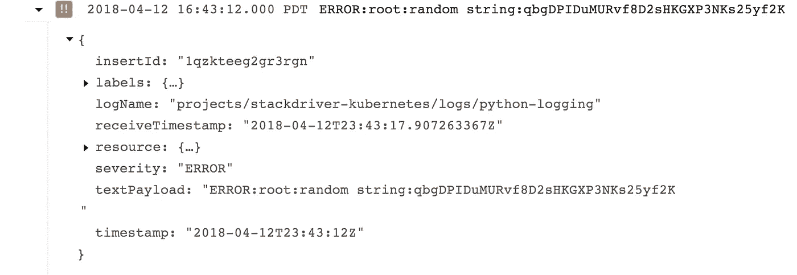
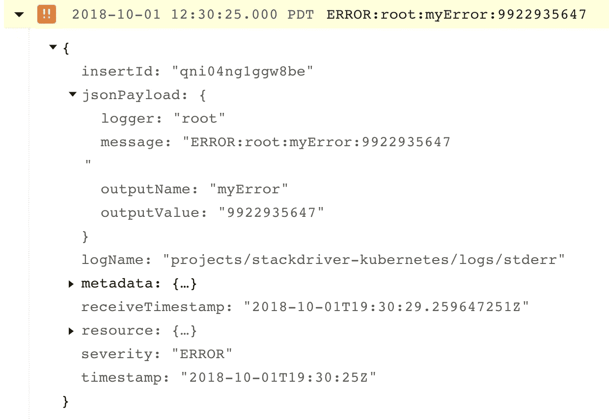
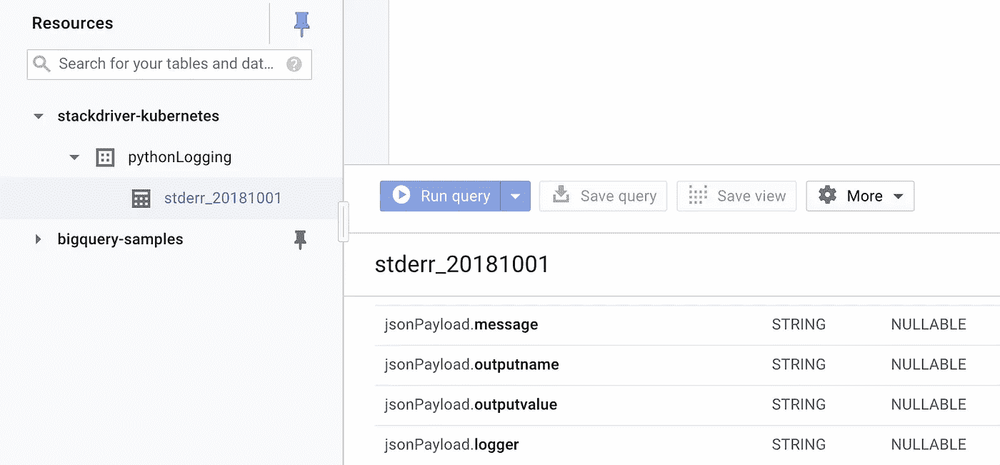
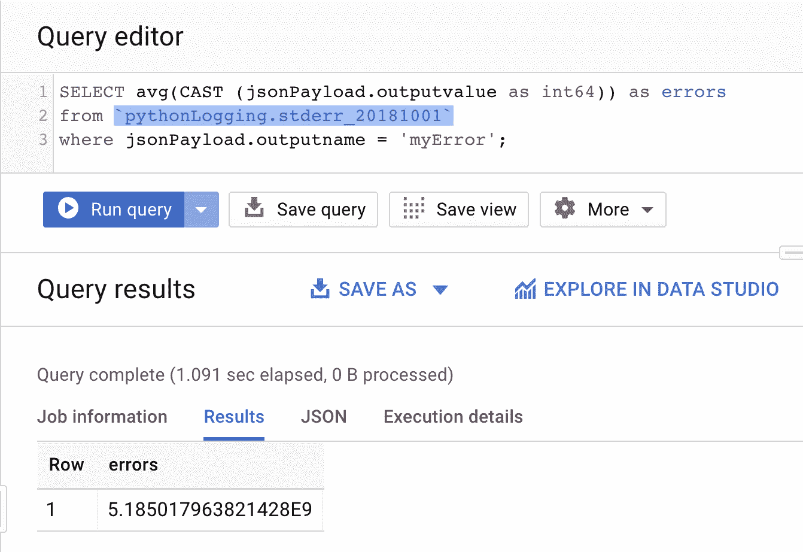

# 定制 Kubernetes 日志记录(第 1 部分)

> 原文：<https://medium.com/google-cloud/customizing-kubernetes-logging-part-1-a1e5791dcda8?source=collection_archive---------0----------------------->

在生产中调试应用程序时，您可以使用的最强大的工具之一就是日志。它们非常容易创建，给你自由输出你想要的任何东西，并且相对容易使用。然而，每个开发人员都喜欢自己的输出格式，这使得那些负责跨服务、应用程序甚至 Kubernetes 集群进行故障排除或分析的人员很难以结构化或一致的方式使用日志。让我们举一个非常简单的例子——输出一个值。

我决定利用这个机会扩展我微薄的 Python 技能，并创建了一个简单的应用程序，除了随机生成日志消息之外，它几乎没做什么。具体来说，它输出一个简单的冒号分隔的消息，如下所示(如默认的 Stackdriver 日志记录查看器所示，没有任何修改):

```
logging.error(“myError:” + randomString)
```

或者

```
logging.warn("myWarning:" + randomString)
```

我真正关心的消息有两部分——冒号前后的部分。具体来说，我想知道错误和警告的值是否有区别！理想情况下，我只想将所有日志发送到 BigQuery，并在那里进行分析——但是整个有效负载都在一个名为 *textPayload* 的字段中，并且我不具备 SQL 中的字符串解析技能。那现在怎么办？

好吧，谢天谢地，Stackdriver 最近开始支持结构化日志，你可以在这里[阅读全部内容](https://cloud.google.com/logging/docs/structured-logging)。另一个博客[帖子](https://cloud.google.com/blog/products/gcp/getting-more-value-from-your-stackdriver-logs-with-structured-data)也很好地描述了结构化日志的整体价值。对于我们这里的目的，我们希望使用结构化日志记录，通过正则表达式将一行分解成多个字段。坏消息是，现有的指令仅适用于虚拟机上运行的日志代理。让我们看看我们是否能在 Kubernetes 上做这个工作？

**0 —设置集群并部署(“新”)日志记录**

在 GKE 集群上部署 Stackdriver 日志记录非常简单，这里有很好的记录。我不会在这里重复说明，但是我准确地遵循了它们，我建议您也这样做。我将假设您已经创建了您的集群，并从现在开始设置了您的 kubectl 上下文和凭证。

**1 —部署应用程序**

现在我们有了一个集群，我们需要在其上运行一些东西来生成我在这里讨论的那种日志。我已经在 [GitHub](https://github.com/yuriatgoogle/python-logging) 上发布了我的代码(请不要对我评头论足)。让我们将它部署到我们的集群中。

首先，我们将克隆回购:

```
$ git clone [https://github.com/yuriatgoogle/python-logging](https://github.com/yuriatgoogle/python-logging)
$ cd python-logging
```

接下来，我们将使用云构建来构建容器映像(在设置了`project_id`变量之后):

`$ gcloud container builds submit --tag gcr.io/${project_id}/python-logging:latest`

并通过检查云构建->构建历史中的构建历史来验证它是否工作:



成功了！

现在，我们准备部署。我已经提供了(非常简单的)。我在回购中使用的 yaml 文件。

```
$ kubectl create -f ./[p](https://k8s.io/docs/tasks/debug-application-cluster/counter-pod.yaml)ython-logging.yaml
deployment "python-logging" created
```

现在，让我们通过在部署前创建一个负载平衡器并测试它来确保我们可以访问部署:

```
$ kubectl expose deployment python-logging --type=LoadBalancer
service "python-logging" exposed$ kubectl get services
NAME             TYPE           CLUSTER-IP      EXTERNAL-IP   PORT(S)          AGE
kubernetes       ClusterIP      10.47.240.1     <none>        443/TCP          47m
python-logging   LoadBalancer   10.47.240.242   <your IP>     5000:32361/TCP   32s$ curl http://<your IP>:5000
myDebug:4903403857
```

此时，我们可以查看日志来确认我们要解决的问题。



选择日志



所有内容都在 textPayload 中

**2 —部署自己的定制日志**

现在有趣的部分来了。我们将修改 Stackdriver 日志记录部署的 configMap，以包含一个新的过滤模式，将我们的日志条目分成单独的字段。

首先，让我们看看我们的日志代理部署已经创建了什么:

```
$ kubectl get ns
NAME                 STATUS    AGE
default              Active    11d
kube-public          Active    11d
kube-system          Active    11d
stackdriver-agents   Active    3d$ kubectl get cm -n stackdriver-agents
NAME                   DATA      AGE
cluster-config         2         3d
google-cloud-config    1         3d
logging-agent-config   4         3d$ kubectl get ds -n stackdriver-agents
NAME                         DESIRED   CURRENT   READY     UP-TO-DATE   AVAILABLE   NODE SELECTOR   AGE
stackdriver-logging-agent    3         3         3         3            3           <none>          3d
stackdriver-metadata-agent   3         3         3         3            3           <none>          3d
```

现在我们需要。yaml 文件，它将允许我们修改这个配置。它可以在公共 Stackdriver GitHub 库[这里](https://github.com/Stackdriver/kubernetes-configs)获得。按照那里的说明，在对 *logging-agent.yaml* 文件进行更改之后，您需要重新编译 *agents.yaml* 文件。

另一种选择是通过如下方式从部署中直接提取配置文件:

```
$ kubectl get cm logging-agent-config -n stackdriver-agents -o yaml >> cm.yaml
```

和 deploymentSet:

```
$ kubectl get ds stackdriver-logging-agent -n stackdriver-agents -o yaml >> ds.yaml
```

如果配置不能很好地“往返”,这可能会导致问题，所以我建议使用存储库中的文件。

我们根本不需要修改 deploymentSet，但是我们将更改 configMap 以包含一个新的过滤器来处理我们的日志条目。修改 cm.yaml 文件，在“containers.input.conf: |-”下添加 Python 输出的过滤器(添加粗体的 3 行)。

```
<filter reform.**>
  @type parser
  format multi_format
 **<pattern>
    format /^(?<severity>.*):(?<logger>.*):(?<outputName>.*):(<outputValue>.*)/
  </pattern>**
  <pattern>
  format /^(?<severity>\w)(?<time>\d{4} [^\s]*)\s+(?<pid>\d+)\s+(<source>[^ \]]+)\] (?<log>.*)/
  </pattern>
  <pattern>
    format none
  </pattern>
  reserve_data true *# note that this doubles the size of the log, as both parsed and unparsed data would be kept. Set to “false” if you only care about the unparsed data.*
  suppress_parse_error_log true
  key_name log
</filter>
```

创建新的配置映射并重新部署代理:

```
$ kubectl replace -f ./cm.yaml --force && kubectl delete pods -n stackdriver-agents -l app=stackdriver-logging-agent
```

那需要大约一分钟。完成后，您可以尝试刷新您的应用程序 URL 并再次检查 Stackdriver 日志记录。您的日志现在应该看起来像这样——注意，我们现在有一个 *jsonPayload* 字段，其中我们关心的值被分离出来。



那就好多了！

**3 —现在怎么办？**

所以，我们的日志现在是结构化的！这实际上让我做什么？好吧，让我们将这些导出到 BigQuery，看看会得到什么。



这里有两点需要注意:

a.已经创建了数据集和表——在我的例子中，表是为日志创建的，并以今天的日期命名。

b.jsonPayload 中的每个字段都是表中单独的一列！

现在，我们可以做各种有趣的事情！我将展示一个基本的 BigQuery 查询，当消息只是一个警告时，它将对所有值进行平均:



您当然可以从这里开始，但是我想展示如何在 GKE 集群上定制日志配置，并使用 Stackdriver 日志生成结构化日志！

在第 2 部分中，我的计划是重新审视这个基本方法，并研究如何

1.  使用舵图部署
2.  跨更大规模的集群和部署管理过滤器

祝我好运！

**资源**

K8s 文档:[https://kubernetes . io/docs/tasks/debug-application-cluster/logging-stack driver/# deploying](https://kubernetes.io/docs/tasks/debug-application-cluster/logging-stackdriver/#deploying)

解决方案:[https://cloud . Google . com/solutions/customizing-stack driver-logs-fluentd](https://cloud.google.com/solutions/customizing-stackdriver-logs-fluentd)

Fluentd 配置:[https://github . com/Google cloud platform/container-engine-customize-fluentd/tree/master/kubernetes](https://github.com/GoogleCloudPlatform/container-engine-customize-fluentd/tree/master/kubernetes)

Stackdriver 结构化测井:[https://cloud.google.com/logging/docs/structured-logging](https://cloud.google.com/logging/docs/structured-logging)

定制 Kubernetes 监控:[https://cloud . Google . com/monitoring/Kubernetes-engine/定制](https://cloud.google.com/monitoring/kubernetes-engine/customizing)