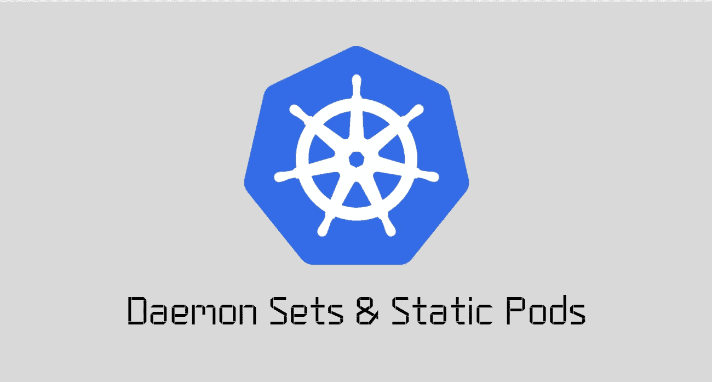
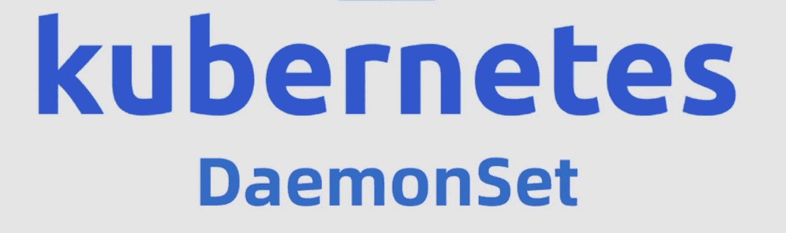
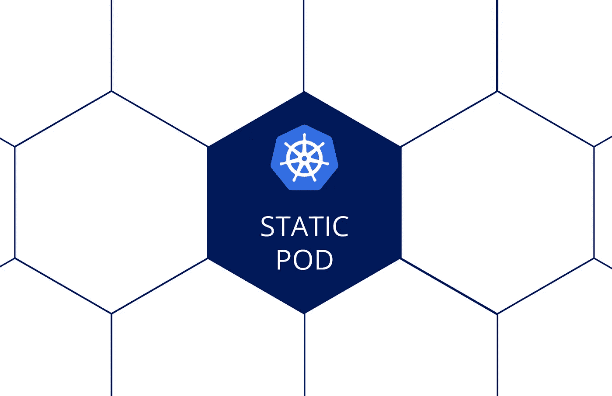
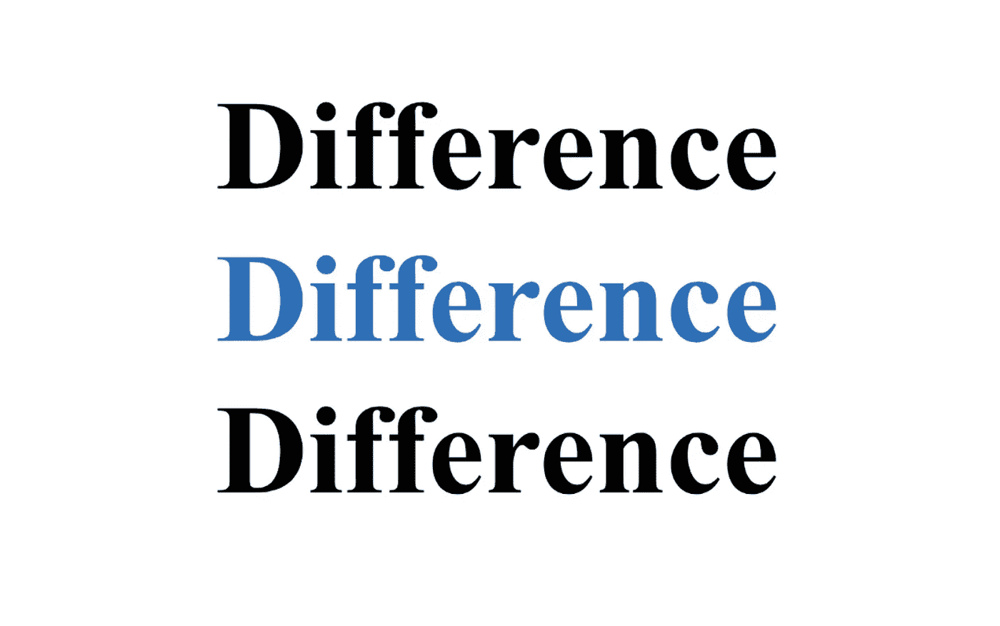
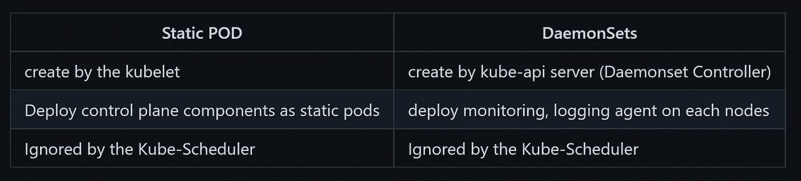

# 守护进程集和静态豆荚☸☸

> 原文：<https://medium.com/google-cloud/daemon-sets-static-pods-bf43b10efe97?source=collection_archive---------0----------------------->

Kubernetes 中关于守护进程集和静态 Pods 的一切

## 介绍🚩🚩



各位读者好👋我已经写了一段时间关于 Kubernetes 及其对象的基础知识。我觉得基础知识已经讲得很好了，现在是时候转向更高级的 Kubernetes 主题了。
其中一个话题是关于 Kubernetes 中的守护进程集和静态 pod。

***所以在本文中，我们将试着了解一下*** :

*   什么是守护进程集，我们为什么要使用它？？
*   我们如何创建一个守护进程集？？
*   什么是静态 Pod，我们为什么要使用它？？
*   我们如何创建一个静态 Pod？？
*   守护进程集和静态 Pod 之间的区别。

> **所以没有任何进一步的延迟，让我们开始吧:)**

## 什么是守护进程集，我们为什么要使用它？？🤔 🤔



一个 ***DaemonSet*** 确保所有节点必须在其上运行一个 Pod 的副本。
随着节点被添加到集群中，pod 也被添加到其中。随着节点从集群中移除，这些 pod 将被垃圾收集。删除 DaemonSet 将清除它创建的所有 pod。

> 简单地说， **DaemonSet** 是一个 Kubernetes 对象，它确保集群中的每个节点都应该有一个特定的节点在其上运行。

**让我们试着理解当达蒙塞特出现在画面中时会发生什么:**

*   每当有新节点添加到群集时，**daemon set**将复制 Pod 并在新添加的节点上调度该 Pod。
*   每当从集群中删除一个节点时，**daemon set**将从该节点中删除 Pod 的副本。
*   **删除一个 DaemonSet** 可能会杀死集群中不同节点上由它调度的所有 pod。

> DaemonSets 有点像 ReplicaSets ，因为它有助于部署 pod 的多个实例。但是 DaemonSets 会确保在集群的每个节点上运行 pod 的一个副本。

**使用 DaemonSets 的用例:**

1.  它可以用于在每个节点上 ***运行集群存储舱***
2.  它可以用于在每个节点上 ***运行日志收集 pod***
3.  它可以用于 ***在每个节点上运行一个节点监控 pod***

> 我想现在可能很清楚什么是 DaemonSet，为什么我们要使用它？**让我们看看如何在下一节创建一个**:))

## 我们如何创建**daemonset**？🤓🤓


Photo by [愚木混株 cdd20](https://unsplash.com/@cdd20?utm_source=medium&utm_medium=referral) on [Unsplash](https://unsplash.com?utm_source=medium&utm_medium=referral)

我们可以使用 YAML 文件创建 DaemonSets。要用 YAML 创建一个 Kubernetes DaemonSet，首先要创建一个空文件，为它分配必要的访问权限，然后定义必要的键-值对。

下面是一个 DaemonSet 定义文件 *(* `daemon-set-definition.yaml` *)* 的例子

```
**apiVersion**: apps/v1
**kind**: DaemonSet
**metadata**:
  **name**: monitoring-daemon
  **labels**:
    **app**: nginx
**spec**:
  **selector**:
    **matchLabels**:
      **app**: monitoring-agent
  **template**:
    **metadata**:
     **labels**:
       **app**: monitoring-agent
    **spec**:
      **containers**:
      - **name**: monitoring-agent
        **image**: monitoring-agent
```

这个文件中有很多方面和组件。让我们逐一分析😀

*   让我们从`apiVersion`(键值对)开始。这用于说明在创建 DaemonSet 时，您将在后台运行什么 API 服务器和版本。
*   接下来是`kind`,表示这是一种定义文件。在我们的例子中，它是一个“恶魔集”。
*   接下来是`metadata`，这是一个包含项目名称和标签的字典。元数据存储分配给正在创建的 DaemonSet 的值。
*   最后是`spec`，它实际上是一个数组/列表。以下是其中存在的值及其含义。

    `template`:基本包含 POD 规格的部分。当 DaemonSet 需要在不同的场景中旋转新的吊舱时，这个部分就派上了用场。

我们已经完成了 DaemonSet 定义文件。现在我们可以保存并退出文件。

使用此命令基于上述 YAML 文件创建 DaemonSet:

```
kubectl create -f daemon-set-definition.yaml
```

使用此命令列出守护集

```
kubectl get daemonsets
```

使用此命令获取守护集的更多详细信息

```
kubectl describe daemonsets monitoring-daemon
```

## 什么是静态 Pod，我们为什么要使用它？？🤔 🤔



***静态 Pods*** 由特定节点上的 kubelet 守护进程直接管理，无需 API 服务器观察它们。与控制台管理的吊舱不同，kubelet 监视每个静态吊舱。
**静态 Pods** 总是绑定到特定节点上的一个 Kubelet。

> **简单来说，** **静态吊舱**只是简单的吊舱，但它们不受主节点控制。更确切地说，节点上的 kubelet 使它们旋转起来，并在它们的整个生命周期中观察它们。甚至在它们失败时重新启动它们。

kubelet 自动尝试在 Kubernetes API 服务器上为每个静态 Pod 创建一个镜像 Pod。这意味着在一个节点上运行的 pod 在 API 服务器上是可见的，但是不能从那里进行控制。

**使用静态 pod 的用例:** 静态 pod 通常被不同的软件用来自举 Kubernetes 本身。例如，`kubeadm`使用静态 pod 来 ***调出 Kubernetes 控制平面组件*** ，如 api-server、controller-manager 作为主节点上的静态 pod。
然后这些组件将由主节点上的 Kubelet 查看。

> 我想现在可能很清楚什么是静态 Pod，为什么我们要使用它？**让我们看看如何在下一节创建一个**:))

## 我们怎样才能创造出静态的豆荚？？🤓🤓


Simone Secci 在 [Unsplash](https://unsplash.com?utm_source=medium&utm_medium=referral) 上拍摄的照片

可以通过使用标准 pod 配置文件(yaml 文件)来创建静态 Pod，然后将这些文件放在要创建 POD 的节点上的特定目录中。

使用`kubelet --pod-manifest-path=<the directory>`启动 kubelet 守护进程，它会定期扫描目录，并在 yaml/json 文件出现/消失时创建/删除静态 pod。

**例如，这是如何启动一个简单的 web 服务器作为静态 pod :**

1.  选择一个我们想要运行静态 pod 的节点。在这个例子中，是`my-node1`
    `ssh my-node1`
2.  选择一个目录，比如`/etc/kubelet.d`，并在那里放置一个 web 服务器 pod 定义文件，例如`/etc/kubelet.d/static-web.yaml`
3.  在节点上配置 kubelet 守护进程，通过使用`--pod-manifest-path=/etc/kubelet.d/`参数运行它来使用这个目录。
4.  重启 kubelet `$ systemctl restart kubelet`

## 守护程序集和静态 Pod 之间的区别



## 接下来呢？👀 👀


> 非常感谢你来到这里！这是本文的结尾。
> 但我们只是触及了 K8s 生态系统的表面:)】
> 还有很多，这将是一次有趣的旅程，我们将一起学习许多很酷的东西。
> 
> 鼓掌，跟我来🙈如果你喜欢我的作品，并希望在未来更多地阅读我的作品:)

如果你对这篇文章有任何疑问，或者想聊聊天，请随时联系我的社交媒体账号

*推特—*[*https://twitter.com/ChindaVibhor*](https://twitter.com/ChindaVibhor)

*LinkedIn—*[*https://www.linkedin.com/in/vibhor-chinda-465927169/*](https://www.linkedin.com/in/vibhor-chinda-465927169/)

## 相关文章

[](/google-cloud/scheduling-in-kubernetes-9bc96c9008d8) [## kubernetes 的日程安排

### Kubernetes 中的调度流程是如何工作的？？

medium.com](/google-cloud/scheduling-in-kubernetes-9bc96c9008d8) [](/google-cloud/deploying-a-local-kubernetes-cluster-using-minikube-abe94a2c7583) [## 使用 Minikube 部署本地 Kubernetes 集群🚢 🚢

### 如何使用 Minikube 设置本地 Kubernetes 集群？？

medium.com](/google-cloud/deploying-a-local-kubernetes-cluster-using-minikube-abe94a2c7583) 

我仍然会继续发表新的文章，涵盖我正在探索的一系列主题。

那都是乡亲们！！涂鸦:))