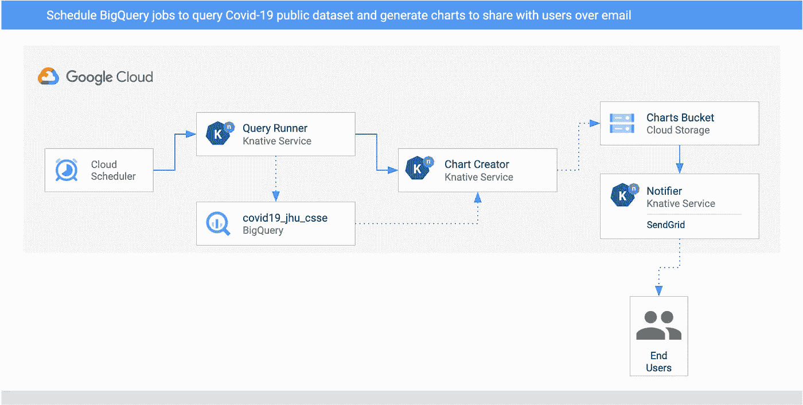
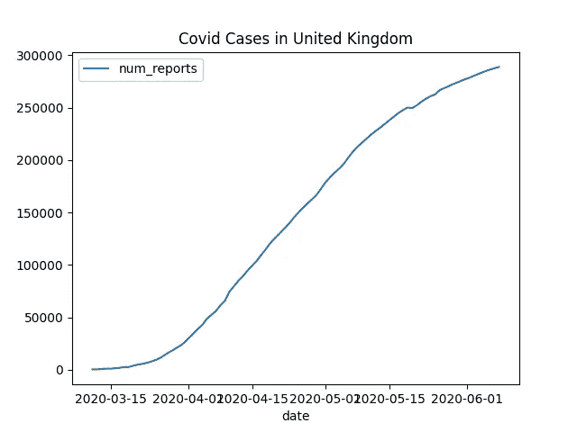

# 每日新冠肺炎病例通知管道，包含 Knative Eventing、BigQuery、Matplotlib 和 SendGrid

> 原文：<https://medium.com/google-cloud/daily-covid-19-cases-notification-pipeline-with-knative-eventing-bigquery-matplotlib-and-sendgrid-eb2b7bb9bed8?source=collection_archive---------1----------------------->

# 动机

当我三月中旬开始在家工作时，我完全被新冠肺炎新闻迷住了。我经常查看来自英国(我目前居住的地方)和塞浦路斯(我的出生地)的病例和新闻。我花了几个星期才意识到这是多么的徒劳。我开始限制自己每天查看一次新闻。这无疑帮助我恢复了理智和生产力，但这是手动的。

然后，在 3 月下旬，我在 BigQuery 上读到了[新冠肺炎公共数据集项目](https://cloud.google.com/blog/products/data-analytics/free-public-datasets-for-covid19)和 [Lak Lakshmanan](https://twitter.com/lak_gcp) 的[用 BigQuery](/google-cloud/analyzing-covid-19-with-bigquery-13701a3a785) 分析新冠肺炎的帖子，他在帖子中展示了如何使用这个公共数据集查询和绘制数据。

这两个帖子立即给了我一个想法:*我写一个时间表驱动的管道来查询我所关心的国家的新冠肺炎病例，生成一些图表并每天给我发一次带有这些图表的电子邮件，怎么样？*

# 初始设计

从一开始就很清楚，我需要 3 个服务:一个查询数据，一个从数据中生成一些图表，另一个发送电子邮件通知。

我决定使用 Knative Eventing 作为事件驱动架构的主干。我在之前的[帖子](https://atamel.dev/posts/2020/06-05_event-driven-image-processing-pipeline-knative)中解释了 Knative `Eventing Sources`、`Broker`和`Trigger`模型和定制`CloudEvents`对于事件驱动架构来说是多么伟大。

BigQuery 支持[计划查询](https://cloud.google.com/bigquery/docs/scheduling-queries)的概念，但是在使用了一点之后，它并没有像我预期的那样工作。也许我做错了什么，但是我发现调度查询很难处理和测试。

相反，我决定自己使用谷歌云的`CloudScheduler`来安排查询。好消息是 Knative Eventing 拥有 [CloudSchedulerSource](https://github.com/google/knative-gcp/blob/master/docs/examples/cloudschedulersource/README.md) ，这使得创建调度作业和触发器变得更加容易。

对于图表，我只是想绘制每个国家每天的案例。Matplotlib 非常适合简单的图表制作，所以我决定使用它。

对于电子邮件通知，我决定使用 [SendGrid](https://sendgrid.com/) 。它的免费层足以满足我的需求。

# 体系结构

这是管道的架构。它使用了 [Knative Eventing](https://knative.dev/docs/eventing/) 并被部署到 Google Cloud 上的 Google Kubernetes 引擎(GKE ):



1.  两个`CloudSchedulerSources`被设置为两个国家(英国和塞浦路斯)每天调用一次`QueryRunner`服务。
2.  `QueryRunner`用 C#写的服务。它接收两个国家的调度程序事件，使用 BigQuery 的公共新冠肺炎数据集查询该国家的新冠肺炎案例，并将结果保存在单独的 BigQuery 表中。一旦完成，`QueryRunner`返回一个`dev.knative.samples.querycompleted`类型的自定义`CloudEvent`。
3.  `ChartCreator`用 Python 写的服务。它接收`querycompleted`事件，使用`Matplotlib`从 BigQuery 数据创建一个图表，并将其保存到一个云存储桶中。
4.  `Notifier`是另一个 Python 服务，它通过`CloudStorageSource`从 bucket 接收`com.google.cloud.storage.object.finalize`事件，并使用 SendGrid 向用户发送电子邮件通知。

# 建造管道

我的[技能教程](https://github.com/meteatamel/knative-tutorial/)中有[关于如何构建管道的说明](https://github.com/meteatamel/knative-tutorial/blob/master/docs/bigquery-processing-pipeline.md)以及[代码和配置](https://github.com/meteatamel/knative-tutorial/tree/master/eventing/processing-pipelines/bigquery)。让我在这里强调一下主要部分。

# 设置计划程序

为了设置英国和塞浦路斯的每日日程，我创建了 2 个`CloudSchedulerSources`。让我们来看看[schedulers source-uk . YAML](https://github.com/meteatamel/knative-tutorial/blob/master/eventing/processing-pipelines/bigquery/schedulersource-uk.yaml)中的其中一个:

```
apiVersion: events.cloud.google.com/v1alpha1
kind: CloudSchedulerSource
metadata:
  name: schedulersource-uk
spec:
  location: "europe-west1"
  data: "United Kingdom"
  schedule: "0 16 * * *"
  sink:
    ref:
      apiVersion: eventing.knative.dev/v1beta1
      kind: Broker
      name: default
```

这将设置一个 CloudScheduler 作业，在每天下午 4 点发送一个事件。`CloudEvent`的数据有`United Kingdom`，它在`default`名称空间中通过`Broker`发布。塞浦路斯也有类似的来源。

# 查询运行器

这是一个由 CloudScheduler 执行事件触发的 C#服务:

```
apiVersion: eventing.knative.dev/v1beta1
kind: Trigger
metadata:
  name: trigger-query-runner
spec:
  filter:
    attributes:
      type: com.google.cloud.scheduler.job.execute
  subscriber:
    ref:
      apiVersion: serving.knative.dev/v1
      kind: Service
      name: query-runner
```

它针对传入的国家/地区的公共数据集之一在 BigQuery 上执行查询，并将结果保存到中间表中:

```
var sql = $@"SELECT date, SUM(confirmed) num_reports
      FROM `bigquery-public-data.covid19_jhu_csse.summary`
      WHERE country_region = '{country}'
      GROUP BY date
      ORDER BY date ASC";var table = await GetOrCreateTable(client);
return await client.ExecuteQueryAsync(sql, null, new QueryOptions {
                 DestinationTable = table.Reference
             });
```

# 图表创建者

这是一个响应由`QueryService`发出的`dev.knative.samples.querycompleted`的 Python 服务。

它读取保存在临时表中的数据:

```
query = f"""
   SELECT
   date, num_reports
   FROM `covid19_jhu_csse.{tableId}`
   ORDER BY date ASC"""query_job = client.query(query)results = query_job.result()
```

将数据转换成 Python 的`DataFrame`:

```
df = (
   results
   .to_dataframe()
)
```

最后，用`Matplotlib`绘制`DataFrame`，保存到文件并将文件上传到云存储:

```
ax = df.plot(kind='line', x='date', y='num_reports')
ax.set_title(f'Covid Cases in {country}')file_name = f'chart-{tableId}.png'
app.logger.info(f'Saving file locally: {file_name}')plt.savefig(file_name)upload_blob(file_name)
```

# 通知人

`Notifier`响应存储桶中保存的新图表。这意味着我们需要设置一个`CloudStorageSource`来首先将这些存储事件读取到我们的名称空间，然后设置 [trigger.yaml](https://github.com/meteatamel/knative-tutorial/blob/master/eventing/processing-pipelines/bigquery/notifier/trigger.yaml) 来将它们定向到`Notifier`:

```
apiVersion: events.cloud.google.com/v1alpha1
kind: CloudStorageSource
metadata:
  name: storagesource-charts
spec:
  bucket: knative-atamel-charts
  sink:
    ref:
      apiVersion: eventing.knative.dev/v1beta1
      kind: Broker
      name: default
```

Knative 服务定义， [kservice.yaml](https://github.com/meteatamel/knative-tutorial/blob/master/eventing/processing-pipelines/bigquery/notifier/kservice.yaml) ，具有发送通知的电子邮件地址和 SendGrid API 键:

```
apiVersion: serving.knative.dev/v1
kind: Service
metadata:
  name: notifier
spec:
  template:
    spec:
      containers:
        - image: docker.io/meteatamel/notifier:v1
          env:
            - name: TO_EMAILS
              value: "[youremail@gmail.com](mailto:youremail@gmail.com)"
            - name: SENDGRID_API_KEY
              value: "yoursendgrid_api_key"
```

使用 SendGrid 发送电子邮件只是一个 API 调用:

```
message = Mail(
   [from_email='noreply@bigquery-pipeline.com](mailto:from_email='noreply@bigquery-pipeline.com)',
   to_emails=to_emails,
   subject='A new chart from BigQuery Pipeline',
   html_content=f'A new chart is available for you to view: {image_url} <br>')
try:
   app.logger.info(f"Email content {message}")
   sg = SendGridAPIClient(os.environ.get('SENDGRID_API_KEY'))
   response = sg.send(message)
   app.logger.info(f"Email status code {response.status_code}")
except Exception as e:
   print(e)
```

# 测试管道

在测试管道之前，让我们确保所有的触发器都准备好了:

```
kubectl get triggerNAME                    READY   REASON   BROKER    SUBSCRIBER_URI
trigger-chart-creator   True             default   [http://chart-creator.default.svc.cluster.local](http://chart-creator.default.svc.cluster.local)
trigger-notifier        True             default   [http://notifier.default.svc.cluster.local](http://notifier.default.svc.cluster.local)
trigger-query-runner    True             default   [http://query-runner.default.svc.cluster.local](http://query-runner.default.svc.cluster.local)
```

您可以等待云调度程序触发服务，也可以手动触发作业。

查找作业 id:

```
gcloud scheduler jobs listID    LOCATION      SCHEDULE (TZ)          TARGET_TYPE  STATE
cre-scheduler-2bcb33d8-3165-4eca-9428-feb99bc320e2  europe-west1  0 16 * * * (UTC)       Pub/Sub      ENABLED
cre-scheduler-714c0b82-c441-42f4-8f99-0e2eac9a5869  europe-west1  0 17 * * * (UTC)       Pub/Sub      ENABLED
```

几分钟后，您应该会收到一封电子邮件，其中包含一个类似如下的图表:



我的博文到此结束。希望这篇博文能让你了解如何使用 Knative Eventing 将不相关的服务连接成事件驱动的管道。

如果你有问题/评论，欢迎在 Twitter 上联系我( [@meteatamel](https://twitter.com/meteatamel) )。

*原载于*[*https://atamel . dev*](https://atamel.dev/posts/2020/06-15_daily-covid19-cases-notification-pipeline/)*。*