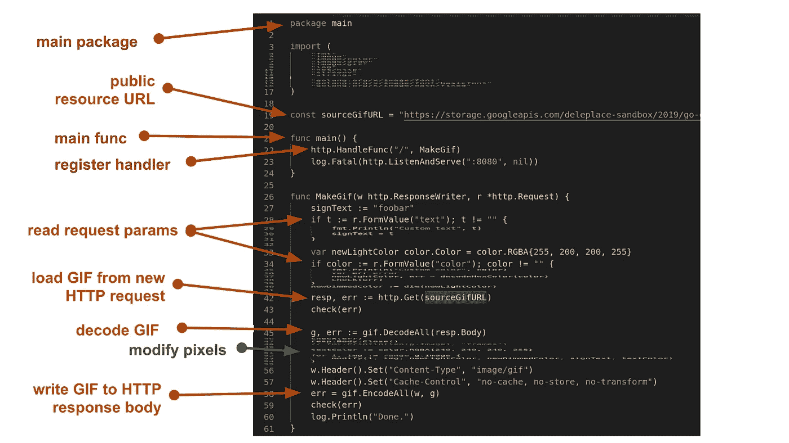

# 用云函数跳舞的地鼠

> 原文：<https://medium.com/google-cloud/dancing-gopher-with-cloud-functions-ad5b5ce8676a?source=collection_archive---------2----------------------->

谷歌云功能[对 Go 1.11 的测试版支持已于上周](https://cloud.google.com/blog/products/application-development/cloud-functions-go-1-11-is-now-a-supported-language)公布。这里有一些关于我在[推特](https://twitter.com/val_deleplace/status/1086325306854653952)上提到的[跳舞地鼠工厂](https://storage.googleapis.com/deleplace-sandbox/2019/go-gcf/index.html)功能的细节。

首先，在把代码扔给 GCF 之前，让一些代码已经在我的本地机器上工作更容易。对于像这样的小样本，一个源文件就足够了。

我的程序主要做 4 件事:

*   阅读 GIF 文件
*   更改毛发颜色
*   在每个框架内添加标题
*   写入更新的 GIF 文件

我可以从命令行 Go 程序开始([要点](https://gist.github.com/Deleplace/419e7f4b54a8cae184452b7945945aac)):

本地程序(节略)

成功了，耶。

[GIF 编解码器](https://golang.org/pkg/image/gif/)在标准库中。我通过修改索引调色板来实现毛发颜色的变化(2 个颜色值),而不是访问像素:

调色板可以用作有色透镜…

在图像中写入一些文本不是 stdlib 的一部分。不过 golang/x 中有一个 [basicfont](https://godoc.org/golang.org/x/image/font/basicfont) 包，我们就用它吧。

虽然程序**看起来不像无服务器魔术**。它在本地文件系统上读/写。参数 Text 和 Color 的值是硬编码的，讨厌！

让我们把它变成一个惯用的 Go 服务器([要点](https://gist.github.com/Deleplace/240675c1a70e7df4cd5b04aa204aeeba)):

网络服务器(节略)

服务器*可以*从它的文件系统中读取，但是如果我将原始 GIF 复制到云存储中，将其公开，并让我的处理程序从[的公共 URL](https://storage.googleapis.com/deleplace-sandbox/2019/go-gcf/gopher-dance-long-3x-sign.gif) 中读取它，接下来的步骤对我来说会更简单。

我的本地服务器现在非常接近谷歌云功能的格式，除了两件事:

*   包不能是“主要的”
*   不能有任何“主”函数

将代码变成“仅仅是一个函数”

我现在可以通过复制粘贴我的文件在 [GCP 网络控制台](https://console.cloud.google.com)中创建一个新功能:

我指定了我的处理程序的名字“MakeGif ”,然后点击[SAVE],一分钟后，我的服务器就可以生成跳舞的地鼠了。这是单个 URL 上的单个功能，而不是完整的 webapp 后端！

如您所见，将一小段代码部署到云功能非常简单。我的例子同样可以通过稍微不同的工作流程部署到 App Engine。

请注意，当重新部署一个功能时，旧版本仍将服务一分钟左右，只有到那时新版本才会接管。

*原创跳舞的地鼠动画* [*埃贡易北河*](https://medium.com/u/c01f387bc9f4?source=post_page-----ad5b5ce8676a--------------------------------)