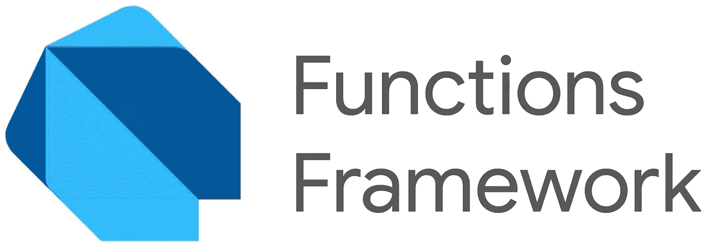
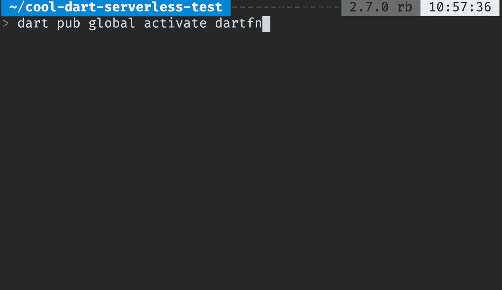

# Dart 功能框架

> 原文：<https://medium.com/google-cloud/dart-functions-framework-25a13251a5d?source=collection_archive---------0----------------------->



Dart 函数框架允许您在 Dart 中编写轻量级的无服务器函数，这些函数可以部署到 Google Cloud。

在这篇博客文章中，我们将介绍如何开始使用这个框架，并为云运行部署一个功能💨👟。

## 安装 Dart SDK

您可以在[dart.dev/get-dart](https://dart.dev/get-dart)为您的机器安装 Dart。

对于 macOS，运行以下命令:

```
brew tap dart-lang/dart
brew install dart
```

## 安装 Dart 函数框架 dartfn

`dartfn`命令行工具有助于搭建功能，如`helloworld`、`cloudevent`和`json`。

安装 Dart 功能框架 CLI ( `dartfn`)和:

```
dart pub global activate dartfn
```



使用生成器创建一个“Hello，World”函数:

```
mkdir helloworld
cd helloworld
dartfn generate helloworld
```

这将输出:

```
project: helloworld
Creating helloworld application `helloworld`:
  helloworld/.gitignore
  helloworld/Dockerfile
  helloworld/README.md
  helloworld/analysis_options.yaml
  helloworld/bin/server.dart
  helloworld/lib/functions.dart
  helloworld/pubspec.yaml
  helloworld/test/function_test.dart
8 files written.--> to provision required packages, run 'pub get'
```

最后，运行`pub get`来安装依赖项。

## 运行您的函数

在引导您的函数后，您可以使用以下命令在本地运行该函数:

```
dart run bin/server.dart
```

然后您可以使用`curl`在`[http://localhost:8080](http://localhost:8080)`测试功能:

```
# curl [http://localhost:8080](http://localhost:8080)
Hello, World!
```

不错！🙌

## 部署到云运行

现在，让我们部署到云运行:

```
gcloud beta run deploy my-dart-function \
  --source=. \
  --region=us-central1 \
  --platform managed \
  --allow-unauthenticated
```

这个命令将按照预先生成的 docker 文件中的步骤来构建您的函数。

> 注意:使用`—-source`标志需要`gcloud beta`。

大约一分钟后，您就已经部署了一个云运行服务，在本例中使用了一个公共 URL:

> [https://my-dart-function-q 7 vieseilq-UC . a . run . app](https://my-dart-function-q7vieseilq-uc.a.run.app)

太好了！我们刚刚在 Dart 中部署了一个自动缩放功能。🎉

# 了解更多信息

如果你喜欢这篇博文，请查看源代码中的**文档**:

[https://github . com/Google cloud platform/functions-framework-dart](https://github.com/GoogleCloudPlatform/functions-framework-dart)

或者观看**视频**构建二维码生成器:

带 Dart 教程的云函数