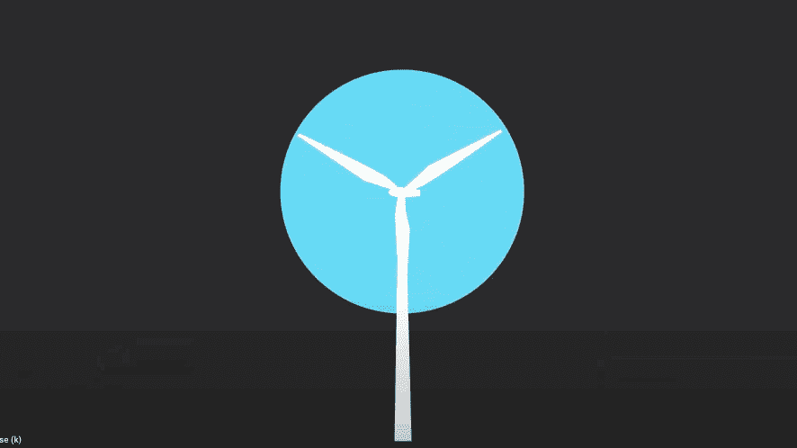

# 风力风筝的数据分析

> 原文：<https://medium.com/google-cloud/data-analysis-to-power-wind-kites-8b4e97e90b58?source=collection_archive---------2----------------------->

## 可持续能源数据科学项目

## 谷歌云和马卡尼对抗气候变化的幕后故事。

你如何应对创新可再生能源的巨大挑战？

在 2020 年结束的 [13 年项目中，](/@fortfelker/a-long-and-windy-road-3d83b9b78328)[马卡尼](https://x.company/projects/makani/)团队利用受风筝冲浪启发的技术接受了这一挑战。我很感兴趣，想了解更多关于这个项目的信息，以及谷歌云是如何在寻找一种新型风力能源的过程中发挥作用的。

这是我所了解到的幕后视频

# 马卡尼的风能风筝实际上是如何工作的？

马卡尼的能量风筝是系在地面站上的空气动力翼。为了开始飞行，风筝使用旋翼在空中垂直盘旋。一旦系绳达到最大长度，风筝就转变成侧风飞行，成圈飞行。当风筝飞行时，转子被风旋转，产生的电力通过绳索输送到电网。风筝的路径由飞行计算机管理，即使在狂风中也能引导风筝，并将其安全返回地面站。

# Makani 风筝与传统的涡轮机有什么不同？

为了理解 Makani 能量风筝是如何工作的，看看传统风力涡轮机如何转化为侧风风筝是有帮助的。风力涡轮机上的叶片改变风的方向，产生一个推动塔架的力和一个推动叶片向前的力。叶片向前推动带动发电机发电。侧风风筝就像从塔上释放一片叶片。被释放的叶片(现在作为一个翅膀)能够获得更多的风，因此比卡在塔上时产生更多的能量。对于同样大小的机翼，侧风风筝比风力涡轮机产生更多的能量，但是使用更少的材料。

风能风筝是如何工作的

# 迭代过程

像这样的项目，放风筝是很昂贵的。因此，Makani 的团队开发了模拟风筝飞行及其所有组件的软件。这些模拟结合了适用于真实风筝的物理定律。该团队进行了一系列模拟，分析了结果，然后放飞了一只真正的风筝，从试飞中收集数据。他们对这些数据进行了进一步的分析，并再次重复整个过程，直到他们对结果满意为止。

> 模拟→分析→放飞真实的风筝→分析→重复

# 运行模拟

Makani 团队开发的模拟软件可以模拟风筝在不同高度和各种风力条件下的飞行。他们生成了数百种不同的配置来模拟飞行，然后将这些配置输入计算引擎实例来运行风筝模拟。这些实例是为了运行模拟而动态创建的。生成的日志文件和报告保存在 Google 云存储中。然后，计算引擎实例会自行关闭，从而节省成本。

模拟完成后，软件工程师从谷歌云存储中提取日志并进行分析，寻找问题、危险信号或潜在的改进领域。基于这些发现，他们将对风筝模型进行修改，并重新开始整个过程，重复这个过程，直到团队确信真实的风筝不会在这些模拟配置下坠毁。

# 测试真正的风筝

一旦对模拟风筝的性能感到满意，研究小组就会去夏威夷或挪威的试验场放飞一只真正的风筝。随着风筝的飞行，地面指挥中心收集数据。当测试飞行完成后，日志被发送到谷歌云存储，供工程师分析。他们重复了相同的过程——探索数据，分析数据，进行修改，并重新进行模拟，以验证这些变化会使风筝飞得更好(而不是坠毁),然后进行另一轮真实世界的测试。

# 分析数据

有时，工程师们手动分析数据，将日志文件下载到他们的计算机上，然后加载到 MATLAB 或运行 Python 脚本来完成分析。

但是对于像这样的大规模项目，手动分析实在是太耗时了。该团队需要定义明确、一致且自动化的分析，能够对所有飞行数据反复运行。因此，他们在 App Engine 上构建了一个数据分析前端。使用这个前端，一名工程师提交了一个请求，请求对特定时间范围内的所有日志进行分析。App Engine 将请求存储到云 SQL 中，并将其发送到发布/订阅消息服务。Jenkins master 然后提取分析请求，并将任务分配给几个计算引擎工作实例。每个工人向云存储发送请求，获取所需的日志文件，对其进行处理，将分析结果存储在云 SQL 中，并发布到 App Engine。一旦到了那里，工程师可以从任何地方检查结果！

# **总结**

总而言之，Makani 团队运行了一系列模拟，收集了大量数据，并从中学习。然后，他们放飞一只真正的风筝，研究试飞数据，并为下一次成功飞行重复这一过程。谷歌云在这一过程中发挥了关键作用，为他们提供了可扩展的模拟和数据分析基础设施，使他们能够专注于利用风能的实际问题。

虽然 Makani 团队的旅程已经接近尾声，但他们建立了一个[开源资源](https://github.com/google/makani)的组合，您可以探索一下！如果你有兴趣了解更多关于马卡尼之旅的信息，请查看这部[的长篇纪录片](https://www.youtube.com/watch?v=qd_hEja6bzE)。

未来的文章这个谷歌云幕后系列将继续探索谷歌云如何推动像 Makani 这样的不可思议的项目。我期待着与你们一起踏上这段旅程！请在推特上关注我，地址是 [@pvergadia](https://twitter.com/pvergadia) ，了解下一集的最新消息。