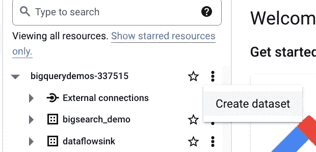

# 基于 BigQuery 和 Google 知识图的数据扩充

> 原文：<https://medium.com/google-cloud/data-augmentation-with-bigquery-and-google-knowledge-graph-f30aa74e8a00?source=collection_archive---------0----------------------->

似乎最近每个人都在谈论大型语言模型，大多数人都对他们使用语言的能力印象深刻。然而，不需要太多的努力就可以看出生成的内容非常松散地符合事实。根据使用的环境，有些人会简单地称之为读起来很愉快的小说，其他人会把它们归类为幻觉。你有没有这样的感觉，后者的数量比提供事实的来源的数量增长得更快，我们可以在这些事实的基础上建立我们的知识和决策？这种情况类似于招聘人员分享的老笑话:

值得一提的一个可信的事实来源是 Google 知识图。它包含数十亿个条目，描述真实世界的实体，如人、地点和事物。这些实体和它们之间的关系形成了一个巨大的知识图的节点和边。

来源:[谷歌知识图搜索 API 的外行视觉指南](https://searchengineland.com/laymans-visual-guide-googles-knowledge-graph-search-api-241935)

Google Knowledge Graph 包含在协调和合并来自多个来源的数据后创建的实体的主版本。每个这样的主实体都有一个全局唯一的标识符，称为机器 ID 或 MID:

来源:[https://cloud . Google . com/enterprise-knowledge-graph/docs/mid](https://cloud.google.com/enterprise-knowledge-graph/docs/mid)

为了搜索或查找这个图表，你可以使用谷歌云上的[谷歌知识图表搜索 API](https://cloud.google.com/enterprise-knowledge-graph/docs/search-api) 。

你可以在两个版本中选择一个:*基础*和*高级*。基本版为简单起见进行了优化。它非常适合非高流量使用情形的社区应用程序，而高级版针对企业和生产使用情形进行了优化(例如增加了 QPS 配额)。

在本文中，我们将展示如何使用 Google 知识图搜索 API 来扩充(丰富)BigQuery 中的数据。

# 背景:

让我们假设我们是一个全球数字市场，出售全天候即时交付的游戏钥匙——类似于我们来自 Kinguin.net 的朋友所做的事情。

我们想取悦我们的用户，并提供最准确的游戏描述。

让我们假设我们想要用从[https://www.igdb.com/](https://www.igdb.com/)(IGDB)收集的细节来扩充我们的内部数据库，这是由 [https://www.twitch.tv.](https://www.twitch.tv.) 运营的公开可用的数据库

挑战之一是在游戏标题方面没有标准化，不同来源使用略有不同的标题来表示同一款游戏。因此，连接这样的数据集并不简单。事实上，这个问题不仅适用于游戏，也适用于所有行业。

那么我们如何解决这个问题呢？一种选择是从我们的内部和 IGDB 数据库中查找谷歌的企业知识图，并将游戏标题映射到全球唯一的 MID(知识图机器 ID)。然后，可以使用这个 MID 来连接这两个数据集。我们还可以使用这个解决方案来获取仅在知识图中可用的附加属性。换句话说，我们将使用谷歌的知识图作为主数据来标准化和扩充我们的数据集。

# 高级计划:

让我们确定现有资源的基线:

*   作为 BigQuery 表的游戏内部数据库
*   IGDB 游戏数据库加载到大查询表

第一步是用对应于 Google Knowledge Graph 中 MID 的附加列来扩展这两个集合:

**为了与谷歌知识图交流，我们将使用知识图搜索 API** 。假设我们的数据已经在 BigQuery 中，我们可以使用 BigQuery [远程函数](https://cloud.google.com/bigquery/docs/reference/standard-sql/remote-functions)调用这个 API。远程函数可以像任何其他用户定义的函数一样在 SQL 查询中使用，唯一的区别是它将在后台调用云函数，我们在云函数中编写与知识图搜索 API 通信所需的所有逻辑，查找图并将结果(至少 MID)返回给 BigQuery:

> 您可能需要联系 GCP 技术支持，以增加对**知识图搜索 API 的查询次数限制(默认情况下:每分钟 60 次查询)。**

我们可以将这种机制应用于两者:表示我们内部数据库的表和表示 IGDB 的表。当查找知识图时，搜索 API 将利用模糊文本、公共关系、实体类型的任意组合来计算语义相似度，结果是相同的游戏但标题略有不同**将被映射到相同的 MID。**

值得一提的是，我们还可以考虑 Google Cloud 上的另一个功能来查找记录之间的语义相似性，即 [**实体协调 API**](https://cloud.google.com/enterprise-knowledge-graph/docs/entity-reconciliation-console) :。

通过实体协调，我们能够定义直接从 BigQuery 表中读取数据的**实体协调作业**，并给出一些配置，将输入表列映射到一个受支持的实体类型的属性。这些作业可以处理以下内容:

*   知识提取将输入的关系数据转换成知识图表示( [RDF 三元组](https://en.wikipedia.org/wiki/Semantic_triple))。
*   然后，Google 实体协调引擎构建一个图，将实体聚类成组(同一组中具有相同聚类 ID 的实体被视为匹配)。
*   最后一步是以新的惟一标识符列(MID)的形式将链接结果(匹配和不匹配)输出到 BigQuery 表中。

来源:[https://cloud . Google . com/enterprise-knowledge-graph/docs/overview # how _ it _ work](https://cloud.google.com/enterprise-knowledge-graph/docs/overview#how_does_it_work)

实体协调通常是我们的首选，但目前它仅支持以下实体类型:个人、组织和本地业务，而我们需要视频游戏。幸运的是，其他实体类型很快就会出现。

当谈到谷歌知识图 API 支持的实体时，这个列表要长得多，并且已经包括了视频游戏。以下是你也会发现的其他类型:

*   [书](http://schema.org/Book)
*   [书籍系列](http://schema.org/BookSeries)
*   [教育组织](http://schema.org/EducationalOrganization)
*   [事件](http://schema.org/Event)
*   [政府机构](http://schema.org/GovernmentOrganization)
*   [本地商业](http://schema.org/LocalBusiness)
*   [电影](http://schema.org/Movie)
*   [电影系列](http://schema.org/MovieSeries)
*   [音乐剧](http://schema.org/MusicAlbum)
*   [音乐组](http://schema.org/MusicGroup)
*   [音乐录制](http://schema.org/MusicRecording)
*   [组织](http://schema.org/Organization)
*   [期刊](http://schema.org/Periodical)
*   [人](http://schema.org/Person)
*   [地点](http://schema.org/Place)
*   [体育团队](http://schema.org/SportsTeam)
*   [电视插曲](http://schema.org/TVEpisode)
*   [电视剧](http://schema.org/TVSeries)
*   [**电子游戏**](http://schema.org/VideoGame)
*   [视频游戏系列](http://schema.org/VideoGameSeries)
*   [网站](http://schema.org/WebSite)

让我们动手使用谷歌知识图搜索 API 吧！

# 安装大纲:

1.  **首先启用适当的 API:**

*   企业知识图 API
*   云函数 API
*   云构建 API
*   记录和监控 API
*   BigQuery API
*   BigQuery 连接 API(允许用户使用 BigQuery 连接到外部数据源和 API)

2.**为云功能创建服务账户**

我们需要编写和部署一个云函数，当我们运行使用我们的远程函数的 SQL 时，它将从 BigQuery 作业中触发，然后它将调用知识图搜索 API。

我们的云功能会用服务账号来表示，服务账号必须有调用知识图搜索 API 的权限。

要创建这样的服务帐户，请导航到 IAM & Admin >服务帐户页面，单击“+ **创建服务帐户**”按钮，并提供名称和 ID。

当创建服务帐户时，我们可以为它分配名为**企业知识图查看器**的预定义角色。

该角色集合了使用知识图搜索 API 所需的所有权限，具体包括:

**企业知识图.云知识图实体.搜索**

**3。创建云功能**

转到谷歌云控制台中的云功能仪表板，然后单击创建按钮。为您的函数取一个符合命名约定的名称，并将其余设置保留为默认值:

*   要求身份验证，
*   内存和超时值
*   所有的连接和安全参数。

为了提高性能，请将云函数部署到与 BigQuery 数据集所在区域相同的区域。

唯一重要的变化是通过用我们在上一步中创建的帐户替换默认帐户来修改运行时服务帐户。

单击“下一步”以完成此步骤，并开始与 Google 知识图搜索 API 进行编码通信。

首先，将运行时环境切换到 **Python 3.7，**，Google 将为能够处理 HTTP 请求的入口点生成框架:

让我们做一些改变。首先将入口点从 **hello_world** 重命名为 **ckg_lookup。**然后打开 requirements.txt 文件，添加这两个条目 **:**

最后，修改 **main.py** 并使用以下代码来验证分配给我们的云功能的服务帐户，并使用其凭证来获取访问令牌，该令牌将用于授权对 Google 知识图搜索 API 的请求:

此时，我们有了基本的云功能，它期待 HTTP 请求。

当我们运行 SQL 查询引用远程函数时，我们的云函数将被 BigQuery 触发。因此，现在是跳转到 BigQuery 控制台的好时机。

## 4.将游戏标题导入 BigQuery 表

在这篇文章中，我们希望用来自 Google 知识图的至少 MID 属性来增加或丰富我们的游戏数据。这意味着我们需要 BigQuery 表作为我们的游戏字典。

对于本文，让我们创建一个只有一个名为 **title 的列的 BigQuery 表。**BigQuery 中的表总是属于某个数据集，因此如果您的项目中没有 big query 数据集，请创建一个。我们的叫做:**游戏 _ 信息**

首先，我们应该导航到 BigQuery 接口并导入我们的数据。

下载以下 [csv 文件](https://pastebin.com/raw/ceD7abaY)来实例化您的游戏字典:

然后从 CSV 文件创建新 BigQuery 表:

现在，当您在这个表上运行 simple SELECT 时，您应该会看到…只是一个导入标题的列表:

## 5.创建 BigQuery 远程函数

BigQuery 远程函数将使您能够从 SQL 命令中调用云函数。每个 BigQuery 远程函数都需要三个元素:

*   **BigQuery 远程连接对象** —你可以把它看作是连接 BigQuery 与云函数或云运行等远程资源的桥梁
*   **当调用/调用云函数时，具有代表我们的远程函数**所需权限的服务帐户
*   函数定义，提供函数输入和输出的规范，并将远程连接对象与云函数或云运行端点/url 链接起来。

## 5.1 创建 BigQuery 远程连接对象

为了创建 BigQuery 远程连接对象，我们需要切换到云外壳。云 shell 配备了运行以下命令所需的所有 GCP 实用程序，包括 **bq** :

现在，当我们返回到 BigQuery 工作区并展开**外部连接**树时，我们应该看到我们新创建的远程连接对象: **games_ekg_lookup** 。双击它以列出其属性:

在我们看来，最重要的属性是**服务帐户 Id** 。

这意味着当我们要求 BigQuery 创建新的远程连接对象时，它也为这个连接创建了一个新的服务帐户。现在我们需要确保它有必要的权限来调用我们的云函数。

## 5.2 设置调用云功能的权限

为 BigQuery 远程连接对象创建的服务帐户需要**cloud functions . functions . invoke**权限。我们可以通过分配**云函数调用者的角色来满足这个需求:**

## 5.3 创建 BigQuery 远程函数

要创建一个远程函数，执行下面的`[CREATE FUNCTION](https://cloud.google.com/bigquery/docs/reference/standard-sql/data-definition-language#create_function_statement)`语句。不是每个人都能创建远程功能。您需要在创建远程函数的数据集上拥有权限`bigquery.routines.create`，以及`bigquery.connections.delegate`权限。(可从 **BigQuery 连接管理**角色获得)远程函数所使用的连接。

远程功能定义指定:

*   输入和输出属性——请注意，我们的函数返回 JSON，这意味着我们将利用 BigQuery 对这种数据类型的本地支持
*   用于调用云函数的远程连接对象
*   云功能端点/url
*   所谓的用户定义的上下文，这是一种提供键:值对列表的方式，可以在编码云函数逻辑时使用。我们将使用这个属性让 Google Knowledge Search API 知道我们只想关注类型为 **VideoGame** 的实体

要获取您的云功能 URL，请转到 Google Cloud Console 中的云功能仪表板，单击您的功能名称，然后转到触发器选项卡。TRIGGER_URL 属性的值是您希望在 BigQuery 远程函数定义中使用的值。

## 6.更新云函数逻辑

如果一切按预期运行，用我们的远程函数 **games_ekg_lookup** 运行 SQL 查询应该会调用云函数。

让我们检查这个。转到 BigQuery workspace 并运行如下内容:

现在转到谷歌云控制台中的云功能仪表板，单击您的功能名称，然后转到日志选项卡。您应该会看到新条目:

好的，这证明了所有的部分都是完整的。在第 3 步中，我们创建了云函数，但还没有编码与谷歌知识图搜索 API 的集成。相应的逻辑将包括三个步骤:

*   BigQuery 远程函数发送的读取请求
*   与谷歌知识图搜索 API 交流，使用游戏标题查找视频游戏实体
*   将结果返回给 BigQuery

为了正确编码这些步骤，我们需要更好地理解我们从 BigQuery 接收到什么，Google 知识图搜索 API 期望的请求体是什么，以及 BigQuery 期望的消息体是什么。

让我们从深入探究从 BigQuery 接收到的内容开始。问题是我们在哪里能抓到它。一种选择是使用与我们用于检查集成的流程相同的流程——即使用远程功能发送 SQL 查询，并查看云日志中记录了什么。

如果这样做，您将看到以下请求:

名为**“calls”**的数组元素是我们的远程函数(游戏标题)的输入，对应于 BigQuery 表的**标题列**中的行。输入是成批发送的:单个请求通常包括多行——或者在**调用**数组中的多个元素。

**userDefinedContext** 属性被设置为 **VideoGame** 这并不奇怪，因为这是我们在 BigQuery 中定义远程函数时设置的值(步骤 5.3)。

当谈到 BigQuery 期望什么样的消息格式时，这里有一个例子:

它期望一个名为**的数组回复由 JSON 对象组成的**。

现在，我们知道了什么是输入，什么应该返回给 BigQuery，我们需要用代码修改我们的云函数，以使用来自 BigQuery 的输入请求(第 3 行)，准备对 Google Knowledge Graph Search API 的请求(第 6–16 行)，遍历来自输入请求的值集合，并在对 Google Knowledge Graph Search API 的请求中使用它们作为查找关键字(第 17–22 行)。

第 28–29 行使用从知识图中获取的对象集合构建 JSON 响应。目前——这个集合是空的，因为我们想对知识图搜索 API 返回的内容添加一些文字。

当调用 EKG API 时，我们收到大量的信息反馈。从多个标识号到简短和详细的描述或相关图像。这里解释了完整的模式[。](https://schema.org/VideoGame)

在我们的示例中，我们只想提取一些可用属性的子集，即:游戏描述、徽标、googleKg MID(机器 ID)以供将来参考，以及用于验证目的的原始名称:

整个 main.py 文件应该如下所示。

我们的云功能准备好了！按下部署按钮，让谷歌为我们处理剩下的。

# 7.从 BigQuery 查询 EKG

我们现在准备返回到 BigQuery workspace，使用我们的 BigQuery remote 函数来查找 Google 知识图，并使用知识图 MID、相应的游戏描述及其图像的 url 来增加游戏标题。运行以下查询:

结果来了！

> ***本文由***[***Lukasz Olejniczak***](https://www.linkedin.com/in/lukasz-olejniczak-1a75a613/)***和***[***Jakub Podmokly***](https://www.linkedin.com/in/jakub-podmokly-19331ab0/)***合著。表达的观点是作者的观点，不一定反映谷歌的观点。***

如果你喜欢这篇文章，请为它鼓掌。更多 google 云端数据科学、数据工程、AI/ML 关注我[***LinkedIn***](https://www.linkedin.com/in/lukasz-olejniczak-1a75a613/)***。***