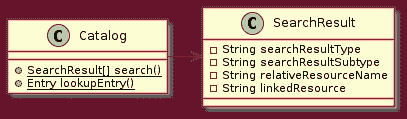
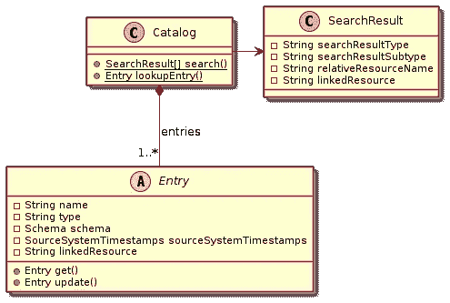
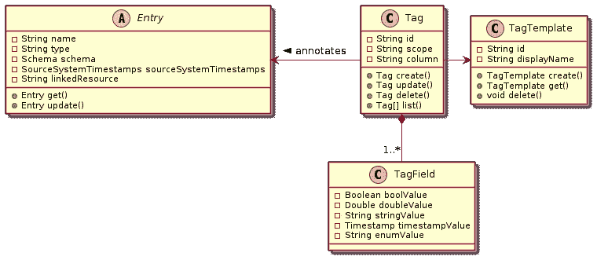

# 谷歌云数据目录实践指南:心智模型

> 原文：<https://medium.com/google-cloud/data-catalog-hands-on-guide-a-mental-model-dae7f6dd49e?source=collection_archive---------0----------------------->

这份快速入门指南是一个系列的一部分，它为**数据目录**带来了一种实践方法，这是[最近宣布的**谷歌云的数据分析**服务家族的](https://cloud.google.com/blog/products/data-analytics/google-cloud-data-catalog-now-available-in-public-beta)成员。

> [Data Catalog 是一种全面管理和可扩展的元数据管理服务，使组织能够快速发现、了解和管理他们在 Google Cloud 中的数据。](https://cloud.google.com/data-catalog/)


# 心理模型

为了提供一些关于数据目录的背景信息，并帮助*数据公民*在开始使用该服务时提高速度，让我围绕其核心特性描述一下我的心理模型。该模型总结了我开始使用 Data Catalog 以来的学习历程，也是我将在本系列中撰写的下一篇文章的基础。

> 声明:这是我个人的想法，作为一个数据目录的早期采用者——仅仅&简单地说就是这样。该模型不是基于任何官方/支持的参考。

## 基本概念

数据目录是一种集中的服务，完全由谷歌云管理，为属于 GCP 项目的数据资产保留一个优化的搜索索引。我所说的数据资产是指:数据集、表格、视图、文本/CSV 文件、电子表格和数据流。为了构建索引，数据目录依赖于资产的元数据，即名称、描述和列定义。

它还存储由其他 GCP 服务管理的资产的元数据，以便用户可以仅使用 Data Catalog 的 UI 或 API 来获取有关它们的详细信息。当资产第一次被编入索引、在其源系统中被更改或者使用数据目录的*标记*时，元数据被存储/更新。

隐私和信息安全是数据目录的一等公民。在为给定用户或服务帐户提供任何信息之前，会考虑资产的 IAM 角色和 ACL。

## 搜索目录

第一次接触 Data Catalog 通常是通过其**搜索**功能:功能强大且易于使用。请看看下面的图片:



***图像 1。*** *搜索目录*相关实体

当有人搜索`Catalog`时，会返回一个结果集。请记住，搜索结果只是 Data Catalog 所知道的关于索引资产的“摘要”，每个`SearchResult`都有一小组字段，最显著的是:`searchResultType`、`searchResultSubtype`、`relativeResourceName`和`linkedResource`。下面列出了这些字段的可能值:

*   搜索结果类型:

```
 ENTRY, TAG_TEMPLATE
```

*   搜索结果子类型:

```
entry.dataset, entry.table, entry.data_stream.topic, tag_template
```

*   相对资源名称:

```
projects/**<project-id>**/locations/US/entryGroups/**@bigquery**/entries/**<entry-id>** (ENTRY / entry.dataset or entry.table),

projects/**<project-id>**/locations/US/entryGroups/**@pubsub**/entries/**<entry-id> (**ENTRY / entry.data_stream.topic**)**,
projects/**<project-id>**/locations/us-central1/tagTemplates/**<tag-template-id> (**TAG_TEMPLATE**)**
```

*   链接的资源:

```
//bigquery.googleapis.com/projects/**<*project-id>***/datasets/**<*dataset-id>*** (ENTRY / entry.dataset),//bigquery.googleapis.com/projects/**<*project-id>***/datasets/**<*dataset-id>***/tables/**<*table-id>*** (ENTRY / entry.table),//pubsub.googleapis.com/projects/**<*project-id>***/topics/**<*topic-id>*** (ENTRY / entry.data_stream.topic),//datacatalog.googleapis.com/projects/**<*project-id>***/locations/us-central1/tagTemplates/**<*tag-template-id>*** (TAG_TEMPLATE)
```

您可能会从上面的例子中注意到，搜索结果分为两大组:`ENTRY`和`TAG_TEMPLATE`。*条目*指由其他谷歌云服务管理的数据资产。**数据目录自动索引由 BigQuery 和 Pub/Sub 管理的资产。请寻找其他集成。** *标签模板*指的是数据目录的本地实体，我们将在本文中了解更多。

当搜索结果类型为`ENTRY`时，注意`relativeResourceName`和`linkedResource`字段。在这种情况下，`relativeResourceName`是在将底层数据资产添加到索引中时为数据目录的内部元数据记录创建的标识符，而`linkedResource`只是指向其源系统中的数据资产——类似于外部引用。

> 条目 : `relativeResourceName`的快速提示**以一个系统生成的 id 结尾，人工阅读时看起来毫无意义，而`linkedResource`几乎是人工可读的，在分析搜索结果时可能很有用。**

## 获取条目

为了检索关于给定数据资产的更多信息，您可以执行一个 *Get Entry* 操作。它接收一个由`relativeResourceName`字段在`SearchResult`中表示的`name`参数。对于从*搜索目录*操作返回的每个结果，应该有且只有一个目录`Entry`。



***图像二。*** *目录、搜索结果和 E* 条目关系

`Entry`，一个本地数据目录实体，代表一个资产的技术元数据，包含一个可变的字段集，它将根据它的`type`而变化。这意味着与 *BigQuery 的日期分片表相关的*条目的字段将不会与表示 *PubSub 主题*的字段相同，尽管有些字段对于所有类型都是通用的。另一个例子:如果一个条目引用一个表，那么`schema`字段存储一个表列模式，但是它在引用数据集的条目中不可用。

## 查找条目

如果您需要找到与您已经知道名称的数据资产相关联的目录`Entry`，您**不需要**执行先前的目录搜索。*查找条目*操作允许您在一个步骤中从资产名称进入其目录条目。

记住 GCP 数据资产的通用模式*资源名称*:

```
//bigquery.googleapis.com/projects/**<*project-id>***/datasets/**<*dataset-id>***/tables/**<*table-id>***
```

请注意，它们遵循一个约定，使得资产可以唯一地识别，即使是在项目之间。*资源名称*存储在条目`linkedResource`字段中，足以检索一个目录条目。

到目前为止，我们看到的是 Data Catalog 的搜索和数据发现功能的最基本部分。即使对于在 Google Cloud 的项目中保留大量数据的组织来说，Data Catalog 也提供了一种简单快捷的方法来找出数据的类型，以及数据的存储方式和位置。

## 模板和标签

一旦人们能够发现属于他们组织的数据，他们也应该被允许更好地管理它。从这个意义上来说，Data Catalog 附带了另一个特性，即*标记*，该特性可用于改善数据治理等。

`Tag`是一个数据目录的原生实体，它允许人员和自动化流程将附加元数据附加到由目录索引的任何数据资产，也使得将来使用 [*搜索限定谓词*](https://cloud.google.com/data-catalog/docs/how-to/search-reference#qualified_predicates) 更容易找到这样的数据资产。例如，数据治理团队可能使用搜索功能来查找存储敏感数据(电子邮件、社会安全号码等)的表格，然后*标记*它们，以便使定期安全审计更加简单。

一个`Tag`连接到一个`Entry`，如下图所示:



***形象三。*** 模板和标记相关实体

*标记*是一个灵活的特性:标记可以由完成数据分类工作所需的任意多的字段组成(实际上，有一个限制，但是相当高)，不同的类型:**布尔**、**双精度**、**字符串**、**时间戳**和自定义**枚举**值。为了使创建标签更加容易和安全(从 IAM 的角度来看)，Data Catalog 提供了一个*模板*机制。每个`Tag`必须根据用户定义的`TagTemplate`创建。

# 接下来该读什么？

好了，对数据目录的简要介绍到此结束。请查看下面列出的本系列的其他文章和官方文档(参见**参考文献**部分)以进一步了解。

*   **数据目录动手指南:用 Python 搜索、获取&查找**:[https://medium . com/Google-cloud/Data-Catalog-hands-on-guide-search-get-lookup-with-Python-82d 99 bfb 4056](/google-cloud/data-catalog-hands-on-guide-search-get-lookup-with-python-82d99bfb4056)
*   **数据目录动手指南:带 Python 的模板&标签**:[https://medium . com/Google-cloud/Data-Catalog-hand-on-guide-templates-tags-with-Python-c 45 EB 93372 ef](/google-cloud/data-catalog-hands-on-guide-templates-tags-with-python-c45eb93372ef)

希望有帮助！

> 用于生成上述类图的 plantuml 文件可以在 GitHub 上找到:[https://github.com/ricardolsmendes/gcp-datacatalog-diagrams](https://github.com/ricardolsmendes/gcp-datacatalog-diagrams)。

# 参考

*   **数据目录官网**:[https://cloud.google.com/data-catalog](https://cloud.google.com/data-catalog/)
*   **数据目录概述**:[https://cloud . Google . com/Data-Catalog/docs/concepts/introduction-Data-Catalog](https://cloud.google.com/data-catalog/docs/concepts/introduction-data-catalog)
*   **数据目录入门**:[https://cloud . Google . com/Data-Catalog/docs/quick starts/quick start-search-tag](https://cloud.google.com/data-catalog/docs/quickstarts/quickstart-search-tag)