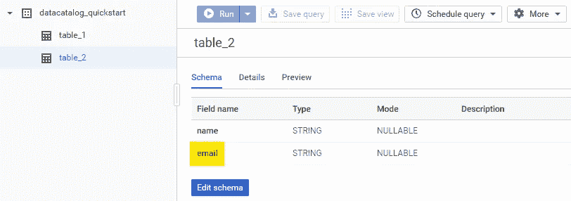
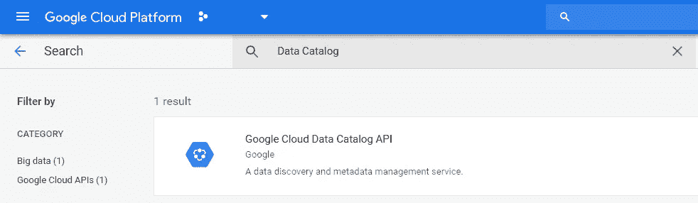

# 谷歌云数据目录实践指南:用 Python 搜索、获取和查找

> 原文：<https://medium.com/google-cloud/data-catalog-hands-on-guide-search-get-lookup-with-python-82d99bfb4056?source=collection_archive---------0----------------------->

这份快速入门指南是一个系列的一部分，它为**数据目录**带来了一种实践方法，这是[最近宣布的**谷歌云的数据分析**服务家族的](https://cloud.google.com/blog/products/data-analytics/google-cloud-data-catalog-now-available-in-public-beta)成员。

> [Data Catalog 是一种全面管理和可扩展的元数据管理服务，使组织能够快速发现、了解和管理他们在 Google Cloud 中的数据](https://cloud.google.com/data-catalog/)。


以下内容显示了如何在 Python GRPC 客户端库中使用数据目录的*搜索*、*获取*和*查找条目*功能。如果你在实践之前需要一些背景知识，请看看我写的文章，这篇文章描述了我对这些特性的心理模型。

# 环境设置

## 创建样本数据资产

如果您没有可能在实际练习中使用的数据资产，请创建**一个包含两个表**的 BigQuery 数据集，如下图所示。



图一。BigQuery 资产:数据集、表和列

第一个表可能只有一个字段，根据您的喜好为其命名。在第二个表中创建两个字段，将它们的名称设置为`name`和`email`。不需要插入数据。

> 我将在下一节中引用这个虚构的数据结构，但是您会注意到，很容易将示例改编为实际数据。

## 启用数据目录的 API

打开你的 GCP 项目的 API 库:`https://console.cloud.google.com/apis/library/project=**<project-id>**`。在搜索框中键入`Data Catalog`，您将看到类似下图的内容:



图二。启用数据目录的 API

点击*谷歌云数据目录 API* 。在下一页中，点击*启用*按钮。

## 安装客户端库

要安装 GRPC/惯用客户端库，请使用`pip install --upgrade google-cloud-datacatalog`或将`google-cloud-datacatalog`添加到`requirements.txt`，然后运行`pip install --upgrade -r requirements.txt`。

## 导入依赖项

在 Python 代码中，导入数据目录的包:

```
from google.cloud import datacatalog
```

## 初始化 API 客户端

API 客户端需要使用服务帐户进行身份验证才能发出请求。一种选择是通过使用`[GOOGLE_APPLICATION_CREDENTIALS](https://cloud.google.com/docs/authentication/production#providing_credentials_to_your_application)`环境变量来提供身份验证凭证。在这种情况下，初始化客户端对象非常简单:

```
datacatalog_client = datacatalog.DataCatalogClient()
```

另一个选项包括将服务帐户文件名显式传递给构造函数:

```
datacatalog_client = datacatalog.DataCatalogClient.from_service_account_file(filename)
```

# 使用 Python 搜索、获取条目和查找

## 搜索目录

让我们首先在您的组织内查找服务帐户至少拥有读取权限的所有 BigQuery 数据集。

```
**(1)**scope = datacatalog.SearchCatalogRequest.Scope()
**(2)**scope.include_org_ids.append(**<organization-id>**)**(3)**results = datacatalog_client.search_catalog(scope=scope, query='system=bigquery type=dataset')
```

第一行创建一个搜索`Scope`对象。第二个使用它来通知我们想要在组织级别搜索的数据目录。更具限制性的是，可以使用`scope.include_project_ids`来代替`scope.include_org_ids`——在这种情况下，搜索范围将仅限于所提供的项目。请注意这两个字段都是列表，并且在任何搜索请求中必须至少提供其中一个。第三行发出 API 请求，并将响应存储在`results`变量中。

这里有一个技巧:`search_catalog()`返回一个 GRPC 迭代器，它对搜索结果有一种“远程引用集合”。实际数据仅在迭代时获取，如下所示:

```
**(4.1)**
fetched_results = [result for result in results]**OR****(4.2)**
fetched_results = []
**for** page **in** results.pages:
    fetched_results.extend(page)
    *# Extra processing might be added here.***(5)**print(fetched_results)
```

4.1 是获取所有结果的直接方式，因为`Iterator`透明地为您处理分页；4.2 更冗长，一次迭代一页。第二种方法允许您向处理中添加额外的逻辑，比如检查在迭代大型结果集时是否需要获取更多的数据，或者在新页面请求之间添加超时以避免 API 使用超过配额。

如果您按照**环境设置|创建样本数据资产**部分的建议创建了数据集，您应该会在搜索结果中看到以下内容:

```
search_result_type: ENTRY
search_result_subtype: "entry.dataset"
relative_resource_name: "projects/**<project-id>**/locations/US/entryGroups/@bigquery/entries/**<entry-id>**"
linked_resource: "//bigquery.googleapis.com/projects/**<project-id>**/datasets/datacatalog_quickstart"
```

> 为了获得预期的结果，服务帐户至少需要**数据目录查看器**和 **BigQuery 数据查看器** IAM 角色。由于 Data Catalog 会自动索引由 BigQuery 和 Pub/Sub 管理的资产，因此建议授予其 **Pub/Sub Viewer** 角色以获得更好的体验，尽管不要求遵循本指南的练习。

根据第一次搜索返回的结果数量，将很难对它们进行分析。此外，数据集的名称可能不会告诉我们关于其所有内容的有意义的信息。我们可以使用另一个搜索限定符来查找更具体的敏感数据。搜索元数据中包含单词“email”的列(包括名称和描述)的资产可能是一个很好的起点:

```
datacatalog_client.search_catalog(scope=scope, query='**column:email**')
```

哇！有一个包含“电子邮件”信息的表格:

```
search_result_type: ENTRY
search_result_subtype: "entry.table"
relative_resource_name: "projects/**<project-id>**/locations/US/entryGroups/@bigquery/entries/**<entry-id>**"
linked_resource: "//bigquery.googleapis.com/projects/**<project-id>**/datasets/datacatalog_quickstart/tables/table_2"
```

让我们了解更多细节…

## 获取条目

*获取条目*允许我们查看与可疑搜索结果相关的目录`Entry`。由于它引用了一个*表*，我们有机会找到有用的信息，包括它的列模式。如 [**数据目录实践指南:心智模型**](/google-cloud/data-catalog-hands-on-guide-a-mental-model-dae7f6dd49e) 文章所述，`relative_resource_name`是搜索结果与其底层目录`Entry`之间的链接。

它是如何工作的？

```
datacatalog_client.get_entry(name='projects/**<project-id>**/locations/US/entryGroups/@bigquery/entries/**<entry-id>**')
```

预期的结果是:

```
name: "projects/**<project-id>**/locations/US/entryGroups/@bigquery/entries/**<entry-id>**"
type: TABLE
schema {
  columns {
    type: "STRING"
    mode: "REQUIRED"
    column: "name"
  }
  columns {
    type: "STRING"
    mode: "REQUIRED"
    column: "email"
  }
}
source_system_timestamps {
  create_time {
    seconds: 1561338828
    nanos: 211000000
  }
  update_time {
    seconds: 1561338828
    nanos: 335000000
  }
}
linked_resource: "//bigquery.googleapis.com/projects/**<project-id>**/datasets/datacatalog_quickstart/tables/table_2"
bigquery_table_spec {
  table_source_type: BIGQUERY_TABLE
}
```

有意思！在`datacatalog_quickstart.table_2`有一个“电子邮件”栏目。

> 谢谢，数据目录！我们不会仅仅通过读取数据集和表名来猜测它。剧透:这个惊人的发现在演示如何贴标签时会很有用。

## 查找条目

在前面的例子中，我们分两步得到了目录`Entry`:识别一个可疑的搜索结果，并从`relative_resource_name`请求它的相关条目。可能会有这样的情况，在执行目录搜索之前，您将知道(或猜测…)资产的*资源名称*，但是仍然需要获得它的目录条目——例如，给*附加标签*到属于您最重要的项目之一的众所周知的数据资产。

回到我们虚构的场景，因为我们发现了一个带有“email”列的`table_2`表，让我们也检查一下同一个数据集中是否存在`table_1`。如果它存在，我们可以分析它的列元数据。

在已知的`linked_resource`值中替换表格的名称可以让我们理解*查找条目*的用法:

```
request = datacatalog.LookupEntryRequest()
request.linked_resource = '//bigquery.googleapis.com/projects/**<project-id>**/datasets/datacatalog_quickstart/tables/**table_1**'datacatalog_client.lookup_entry(request=request)
```

预期的结果是:

```
name: "projects/**<project-id>**/locations/US/entryGroups/@bigquery/entries/**<entry-id>**"
type: TABLE
source_system_timestamps {
  create_time {
    seconds: 1561346951
    nanos: 38000000
  }
  update_time {
    seconds: 1561346951
    nanos: 86000000
  }
}
linked_resource: "//bigquery.googleapis.com/projects/**<project-id>**/datasets/datacatalog_quickstart/tables/table_1"
bigquery_table_spec {
  table_source_type: BIGQUERY_TABLE
}
```

嗯，目录`Entry`向我们展示了数据集也包含一个`table_1`，但是它没有列(我在设置我的演示环境时将它创建为空)。我们将使用这一发现在 [**数据目录实践指南:使用 Python**](/google-cloud/data-catalog-hands-on-guide-templates-tags-with-python-c45eb93372ef) 文章的模板&标签中演示*标签*。

# 结论

本文解释了如何在 Python GRPC 客户端库中使用 3 个核心数据目录特性:*搜索目录*、*获取条目*和*查找条目*。尽管通过简单/虚构的示例进行了演示，但这些概念是实际场景的基础，在实际场景中，人们期望通过这些有用的数据目录功能来发现、分析和理解更多的数据。

如果您是 Data Catalog 的新手，还需要学习更多核心功能。我们还没有看到它如何帮助团队管理数据:*模板*和*标签*将在下一篇文章[](/google-cloud/data-catalog-hands-on-guide-templates-tags-with-python-c45eb93372ef)**中探讨。继续读！**

> **用于生成上述代码样本的源文件可以在 GitHub 上找到:[https://github.com/ricardolsmendes/gcp-datacatalog-python](https://github.com/ricardolsmendes/gcp-datacatalog-python)。**

# **参考**

*   ****数据目录入门指南**:[https://cloud . Google . com/Data-Catalog/docs/quick starts/quick start-search-tag](https://cloud.google.com/data-catalog/docs/quickstarts/quickstart-search-tag)**
*   ****数据目录搜索语法**:[https://cloud . Google . com/Data-Catalog/docs/how-to/search-reference](https://cloud.google.com/data-catalog/docs/how-to/search-reference)**
*   ****谷歌云数据目录 API 文档的 Python 客户端**:[https://Google APIs . github . io/Google-Cloud-Python/latest/Data Catalog/index . html](https://googleapis.github.io/google-cloud-python/latest/datacatalog/index.html)**

# **变更日志**

**2020–10–03:更新了代码片段，以强制遵守客户端库的[2 . 0 . 0 版。](https://github.com/googleapis/python-datacatalog/blob/master/UPGRADING.md#200-migration-guide)**