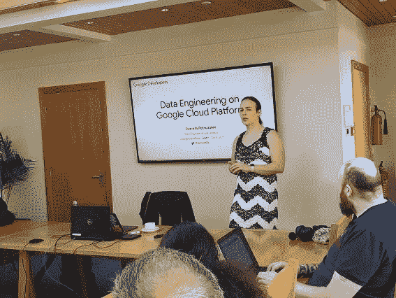
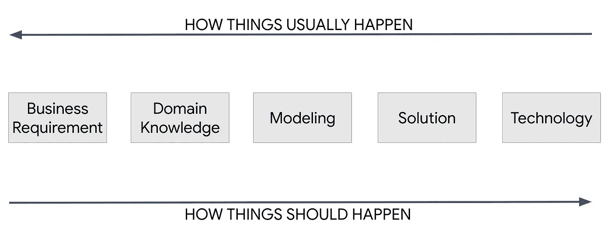
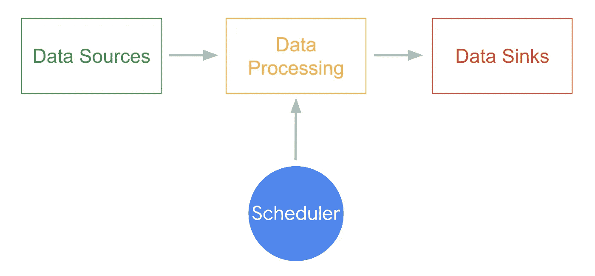

# GCP 的数据工程:第一部分

> 原文：<https://medium.com/google-cloud/data-engineering-on-gcp-part-1-c2ada6817541?source=collection_archive---------0----------------------->

作为一名谷歌开发专家，我经常有机会做一些令人惊讶的事情，考虑到我来自哪里，有些事情是不可想象的。最后一次是受邀成为牛津大学“[人工智能:云和边缘实现](https://www.conted.ox.ac.uk/courses/artificial-intelligence-cloud-and-edge-implementations)”课程的演讲嘉宾。

在世界上最好的大学之一教书的经历真的很棒，它让我重新找回了教别人的内心激情。

因此，为了庆祝这一点，今天我也想把这些内容带给你们。

这是系列文章的第一部分。它将主要集中在一些定义上，这些定义是后面的定义所需要的。

## 思考数据问题

我想做的第一件事是邀请你思考数据问题。如今，在我们生活的环境中，企业为了技术而技术，而不是使用问题驱动的方法是很常见的。例如，在我的职业生涯中，我遇到过太多次这样的情况，客户购买了大数据堆栈，因为有人说它速度快、可扩展或者是下一个大东西，而他们实际上没有大数据问题。

这就是为什么我总是喜欢提醒人们在尝试将任何类型的技术纳入解决方案规范之前，首先要考虑业务。

## 什么是数据工程？

尽管很容易找到数据工程师的工作描述，但要找到数据工程的教科书定义却出奇的难。由于缺乏教科书上的定义，我决定根据我的个人经验和对数据工程师招聘广告的一点探索，创造我自己的定义:

> 数据工程是数据产品、管道和服务的设计、研究和开发，以使业务的所有功能都具有数据驱动的能力。

这里的关键点是数据工程是组织中的一个使能功能。它不是终局，而是实现数据驱动能力的手段。

数据工程功能应负责确保业务及时拥有正确的数据，并支持其他业务功能在此基础上构建产品，如机器学习模型、BI 仪表板等。

## 什么是大数据？

术语大数据第一次出现在文献中是在 [NASA (1997)](https://www.researchgate.net/publication/3736976_Application-controlled_demand_paging_for_out-of-core_visualization) 关于可视化问题的一篇论文上:

> 可视化为计算机系统提供了一个有趣的挑战:数据集通常非常大，占用了主存、本地磁盘甚至远程磁盘的容量。我们称之为**大数据问题**。

你可能会偶然发现大数据的几种定义，从 3 到任意数量的“V”(典型的是量、速度和多样性)，但我不认为其中任何一个像 NASA 的定义一样永恒:数据集足够大，不适合主内存甚至本地磁盘。

这意味着大数据的具体定义与硬件的发展同步。现在 1 GB 的数据算大数据吗？不是，但在 90 年代绝对是。

2TB 数据的关系数据库是不是大数据的问题？答案是:看情况！人们不应该只看数量来确定问题，但你也需要看消费模式。如果您需要读取所有数据来构建模型，那么它可能是，但是如果您每次只消耗最新的行来构建您的报告，那么它肯定不是。

这时，任意数量的 Vs 的定义可能会帮助你，但不要让它限制你。只要您的工作负载不适合单台机器的能力，您就肯定需要实现一些数据工程技术来处理它。

## 什么是云计算？

我以前写过，但我会再重复一遍，因为我太喜欢这个定义了。它来自我的前老板拉里·埃里森(在邱吉尔俱乐部 ): *云计算只是一台连接在互联网上的电脑*。

从技术上来说，这差不多概括了一切，但是云计算不仅仅是技术规范。这一切都与服务级别和拥有基础架构而不是租用基础架构的模式转变有关。

根据 NIST 的说法，被认为是云产品的服务必须具备五个能力:1)自助服务，2)无处不在的互联网接入，3)资源共享，4)快速弹性，5)计量使用和计费。

我要说的是，功能 4 和 5 是这里的秘密武器，因为它们允许我们使用顶级的基础设施，而不需要支付高昂的费用。将这种情况与内部部署的情况进行比较，在内部部署的情况下，您需要考虑增长、支持、折旧和许多其他因素，每 3 年计划一次采购。在那种情况下，你最终会为大量你可能会使用也可能不会使用的基础设施预先付费。如果您的企业有分区峰值，情况会变得更糟，因为您需要针对峰值而不是平均使用量来调整规模。

云基础架构降低了购买基础架构的风险，让我们的生活更加简单。随着我们业务的增长，我们几乎可以立即扩大基础架构…如果在此过程中发生了不好的事情，我们可以自由缩减规模，摆脱未使用基础架构的财务障碍。

这种情况在数据工程领域尤为重要，尤其是因为管理大数据平台非常困难且成本高昂。只要你将基础设施成本降至最低，你也就将业务风险降至最低。

## 数据管道

数据管道是数据工程师工作的基础。我喜欢把它看作是一个单一的工作单元，由一个数据源、一个数据处理组件和一个或多个数据接收器组成。如果工作负载本质上是批处理型的，您也可以选择使用调度程序。

您可能还听说过 ETL 或 ELT 管道。ETL 来自提取、转换和加载，其中提取过程发生在源端，由数据处理管道转换并加载到数据宿。ELT 方法试图交换这两个步骤来利用数据局部性，并使用数据接收器上可用的工具就地处理数据。

当您将数据接收器包含的技术类型添加到上下文中时，这将更有意义。例如，如果您的数据接收器是 Google BigQuery，那么您可能希望在转换步骤中利用大规模并行处理能力。

要考虑的权衡是管道中的处理成本与数据接收器、性能和可能的瓶颈。如果其中任何一个不明确，您可能需要重新审视业务需求、技术限制和团队的专业知识。

就数据源而言，各种大数据 V 在这里发挥着重要作用，因为它是决定您将在这里看到哪种技术的源数据。也许你的源是一个关系数据库，也许是一个键值存储，或者甚至是一个事件源平台。可能性是无限的。

一旦你知道了你的数据，你就可以选择最佳的策略和技术来处理它。如今处理大数据最常见的框架是 Apache Spark 和 Apache Beam，但您可能会发现其他几个框架，包括 Apache Storm 和 Apache Flink。我将在后续文章中特别介绍 Spark 和 Beam。

Spark 和 Beam 之类的分布式计算框架的好处在于，它们做了大量处理分布式部分的工作，将类似于为本地进程编写代码的 API 留给了开发人员。您不能免除了解哪些东西在本地运行，哪些东西以分布式方式运行的责任，但它们肯定会让您的生活更轻松。

最后，谈到数据接收器，它们通常具有与数据源相同的技术考虑，但是您可能希望将您的数据整合到一个公共平台中，使您的企业能够探索各种数据集。

尽管可能需要一些原始形式的数据，但是结构化和非结构化数据的组合将构成您的*数据湖*。根据[维基百科的](https://en.wikipedia.org/wiki/Data_lake)定义，数据湖是:

> 数据湖通常是所有企业数据的单一存储，包括源系统数据的原始副本和用于报告、可视化、高级分析和机器学习等任务的转换数据。

像我之前提到的，调度器是数据管道的可选组件，因为它可能需要也可能不需要，这取决于管道的性质。如果它是一个批处理过程，有明确的开始、中间和结束，当你需要可重复的结果时，它将受益于调度，例如..，用于每日总结。

或者，您可能有实时或接近实时的工作负载一直在运行，根本不需要调度，尽管有时您可能会看到调度在这些情况下作为一种“保持活动”机制使用。

如今最常用的日程安排平台是 Apache Airflow，尽管最近出现了一些竞争者，比如 Spotify 的 Luigi。尽管 Airflow 本身比简单的调度器强大得多，但为了简洁起见，我们将在本系列的下一篇文章中再次讨论它。

## **总结**

在本文中，我们概述了如何从自顶向下的方法处理数据问题，并初步了解了数据项目的关键技术。在下一篇文章中，我们将看到一个实际的数据问题，以及我们如何开始使用上面的构件来解决它。

第二部分点击这里:[取景数据问题](/@danielapetruzalek/data-engineering-on-gcp-part-2-50917b436ecc)。