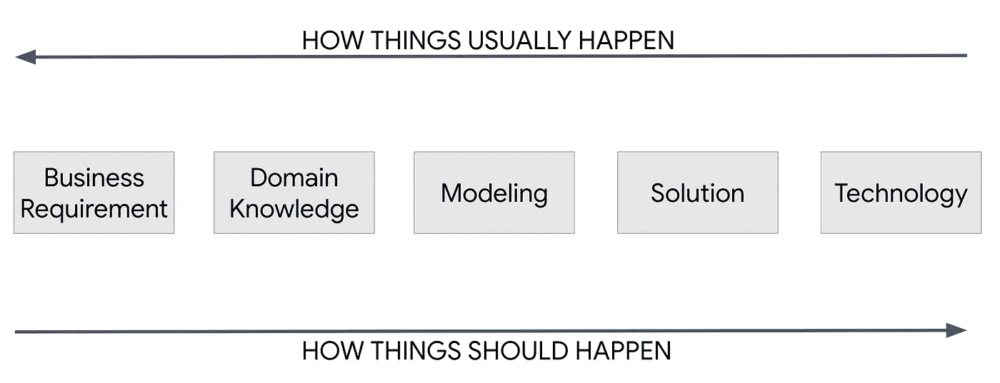
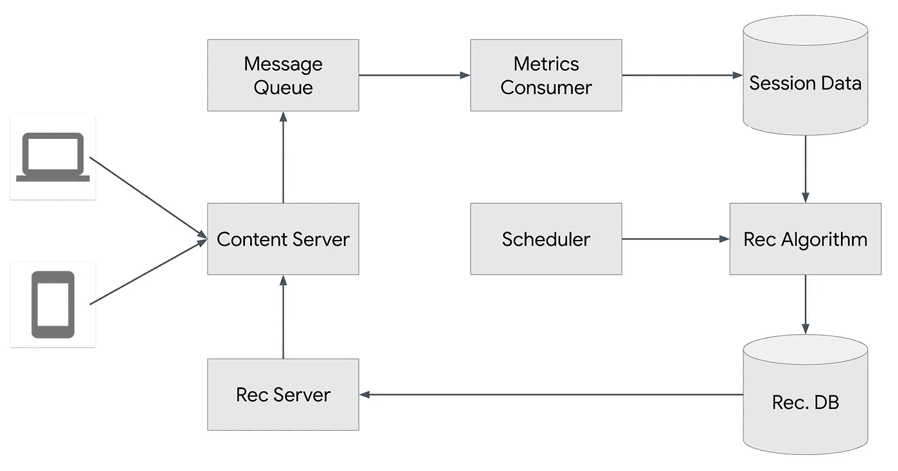

# GCP 的数据工程:第二部分

> 原文：<https://medium.com/google-cloud/data-engineering-on-gcp-part-2-50917b436ecc?source=collection_archive---------0----------------------->

在[之前的文章](/google-cloud/data-engineering-on-gcp-part-1-c2ada6817541)中，我们讨论了数据项目的基础，并涵盖了一些基本定义。这一次我们将探索如何处理数据问题的推理，直到我们得到一个解决方案设计。

## 商业案例

SpoiledTomatoes 是一家专门播放糟糕短片的媒体公司。他们的网站是开放的，可以有匿名用户和登录用户。他们的服务是免费的，主要收入来源是广告销售。上个月，他们记录了大约 5000 万独立用户，每个用户平均观看视频 1.3 次，每次会话 2.5 分钟。

你受雇的主要目的是增加公司收入。你会怎么做？

## 框定问题

这是一个关于数据工程和云计算的系列，所以你可能会认为上面问题的“正确答案”是与之相关的，对吗？简答:没有！

请记住上一篇文章中的图表:我们需要从业务需求转移到技术，而不是相反。因此，虽然我们最终可能会用技术解决问题，但在深入挖掘问题之前，我们不应该一开始就做任何假设。

## 业务需求

业务需求(有意地)被含糊地表述为增加收入。但是如何增加呢？这个问题有无限的答案，在现实世界中，你会想在开始过滤解决方案空间之前，头脑风暴一些想法。其中一个过程是来自[设计思维](/@i.shubhangich/design-thinking-divergence-and-convergence-cycles-3ce7a6f27815)的发散和收敛技术。

我不会对此做更深入的探讨，但我只想强调，每当你在头脑风暴阶段面临模棱两可的问题时，将问题放在企业的使命陈述、愿景和价值观的背景下是很有用的。

假设 Webflops 的使命是提供最好的(最坏的？)的内容，让世界上所有的人都可以访问。

这意味着，如果你提出“关闭平台并向用户收费”的解决方案，它将被过滤掉，因为这将是核心业务的变化，与使命声明相矛盾。

## 阐明一个假设

下一个分析点是领域知识告诉我们什么。它是一个网络平台，也是一个媒体分发系统。我们还需要考虑收入流是如何运作的。

从广告的角度来看，我们可以得出的一个假设是“通过增加用户参与度，我们可以增加广告收入”。

为了增加用户参与度，我们希望向用户展示与他们的口味更相关的内容，这样他们就会更多地使用网站，看到更多的广告。

这是一个适合[信息检索](https://en.wikipedia.org/wiki/Information_retrieval)领域的问题。

在开始实际的解决方案之前，我想在处理任何类型的数据问题之前问一些问题:

1.  有什么样的数据？
2.  我们如何收集，多久收集一次？
3.  体积是多少？
4.  我们如何储存它？
5.  变化有多快？
6.  响应时间重要吗？

(这个列表决不是限制性的。)

在这种情况下，我们 1)知道用户已经观看了哪些视频(视频观看量)，2)用户一点击视频，我们就知道事实，3)我们预计会有大量数据，因为我们可以让 5000 万用户同时观看视频(用户数量是无限的)，4)我们可以自由地以我们想要的任何方式存储它，因为我们拥有技术堆栈，5)数据实时变化，6)是的，我们希望尽可能快地提供内容，因为网站上每分钟都会出现新的视频。

## 拟议解决方案

这种向用户展示相关内容的信息检索问题的典型解决方案是一种 [*推荐系统*](https://en.wikipedia.org/wiki/Recommender_system) (也称为推荐系统)。

推荐系统的主要目的是预测用户的偏好，并尝试向他们展示与他们相关的内容，但他们通常不会意识到它的存在。

它们在分发长尾内容方面特别有效，被零售和媒体行业广泛使用。

**注意:这可能会根据业务需求进行调整。*

## 推荐系统架构

推荐系统的顶层架构如下所示:

首先，我们有一个内容服务器，它提供我们想要在页面上呈现的项目。你可以认为这是你传统的后台服务。

然后沿着向上的箭头，我们有一个消息队列。该队列的目的是捕获视频观看事件。接下来，消费者进程获取这些视频视图，并将它们整合到会话数据中。请注意，前三个块是一个数据管道，就像我们在上一篇文章中描述的那样。

下一个管道是读取会话数据，用推荐算法对其进行处理，并将其写回推荐数据库。由于推荐算法的性质，我们可能需要一个调度程序来不时地运行它。(我们将在后面看到更多细节)

最后，我们有一个推荐服务，它提供写入推荐数据库的推荐。内容服务器将有逻辑来呈现这些内容供客户端查看。

为了简单起见，我们省略了现实世界架构中需要的一些组件，如负载平衡器、缓存层和 AB 测试服务。我们还将使用单一的推荐算法，而不是它们的集合。

## 摘要

到目前为止，我们已经解决了如何解决数据问题的过程，同时避免了选择技术优先方法的陷阱。你可能会注意到，这是第二篇文章的结尾，我们仍然没有拿起技术栈。

然而，我们正在取得进展。我们知道我们想要解决的问题，我们有一个假设和一个建议的解决方案来检验这个假设。在下一篇文章中，我们将更深入地探讨推荐系统是如何工作的，并开始讨论这种架构的组件。敬请期待！